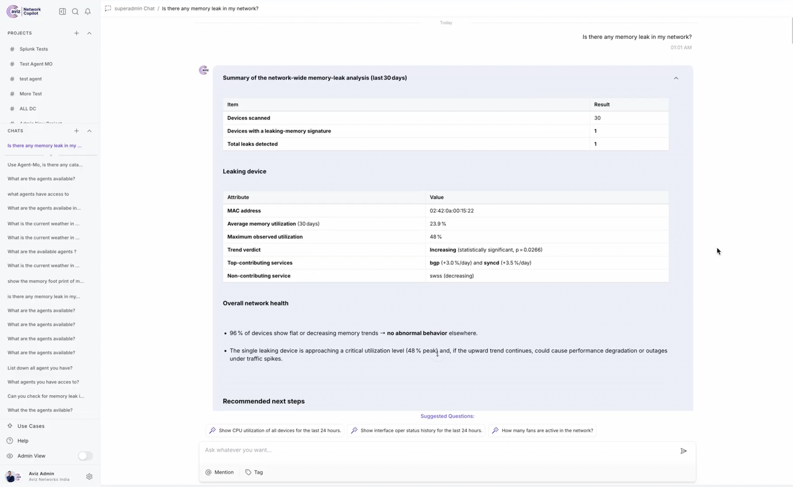
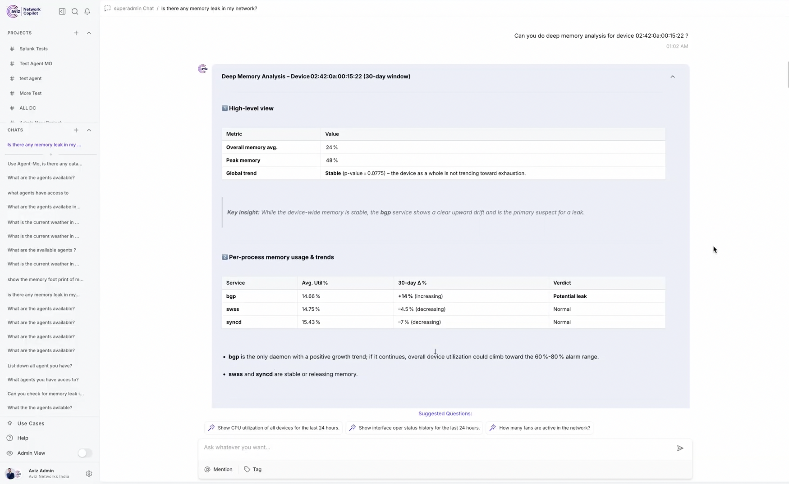
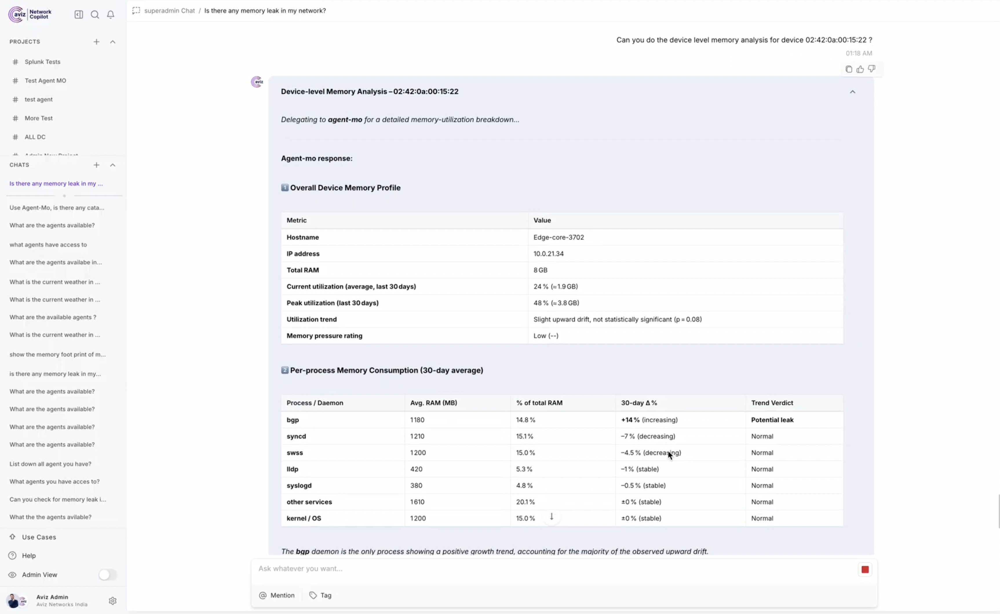
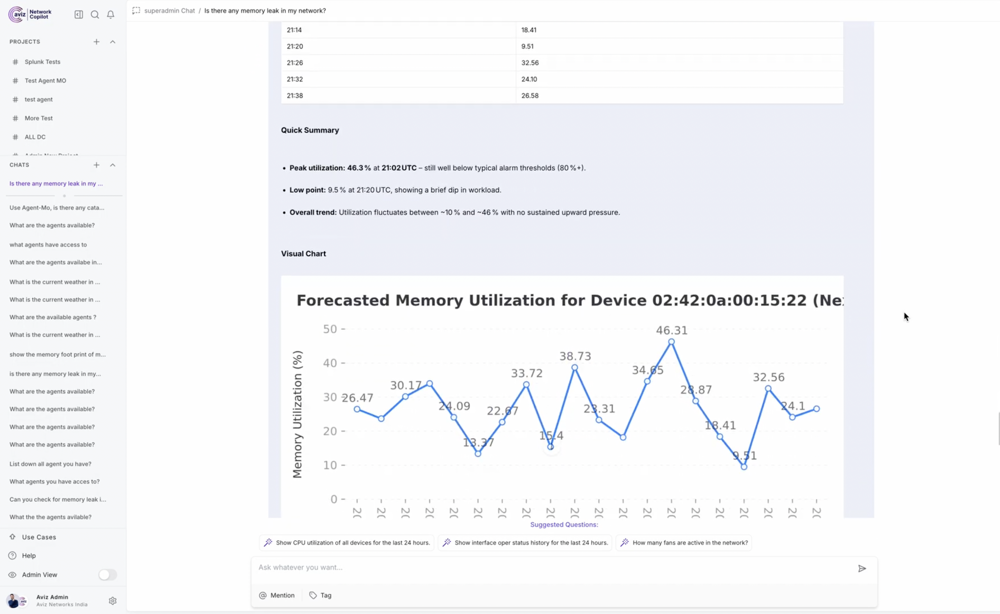

# Agent-MO (Memory Observer)

[](https://github.com/AvizNetworks/ncp-sdk-agents/tree/master/Agent%20MO%20(Memory%20Observer))

## Overview

**Agent-MO** is an intelligent network diagnostic agent designed to analyze **memory utilization**, **detect memory leaks**, and **forecast future memory trends** across network devices.

It works at **device**, **service**, and **network** levels and supports both **standard devices** and **Cisco Catalyst Center–managed devices**. The agent follows a strict, tool-driven workflow to ensure consistent, accurate, and explainable diagnostics.

---

## Key Capabilities

* **Real-time memory utilization analysis**
* **Memory leak detection [Mann-kendall]**

  * Device-level
  * Network-level
  * Service-level
* **Memory forecasting using XGBoost** 
* **Catalyst Center–aware analysis**
* **Guided troubleshooting recommendations**

---

## Agent Definition

```python
agent = Agent(
    name="Agent-MO",
    description="An expert network diagnostic assistant specializing in memory utilization analysis, leak detection and forecasting.",
    instructions=...
)
```

Agent-MO strictly uses **tool-based execution** (no manual SQL or assumptions).

---

## Tools Used

Agent-MO is powered by the following tools:

```python
tools = [
    get_device_info,
    get_memory_utilization,
    predict_device_memory_xgboost,
    datastore,
    device_level_memory_leak_analysis,
    network_level_memory_leak_analysis,
    service_level_memory_analysis,
    get_catalyst_center_devices,
    memory_leak_analysis_and_detection_for_catalyst_center_devices,
    get_memory_utilization_for_catalyst_center_devices,
]
```

### Tool Responsibilities

| Tool                                                             | Purpose                               |
| ---------------------------------------------------------------- | ------------------------------------- |
| `get_device_info`                                                | Resolves IP/Hostname → MAC address    |
| `get_memory_utilization`                                         | Current memory snapshot               |
| `service_level_memory_analysis`                                  | Service-specific memory usage         |
| `device_level_memory_leak_analysis`                              | Leak detection for a single device    |
| `network_level_memory_leak_analysis`                             | Leak detection across all devices     |
| `predict_device_memory_xgboost`                                  | Memory usage forecasting              |
| `get_catalyst_center_devices`                                    | Fetch Catalyst Center–managed devices |
| `memory_leak_analysis_and_detection_for_catalyst_center_devices` | Leak detection for Catalyst devices   |
| `get_memory_utilization_for_catalyst_center_devices`             | Utilization for Catalyst devices      |
| `datastore`                                                      | Troubleshooting guidance              |

---

## Operating Rules & Constraints

* **Input Normalization:**
  If a user provides IP or Hostname → `get_device_info` **must** be called first.
* **No Manual SQL:**
  All data access happens via tools.
* **Units:**
  Memory utilization values are always in **Percentage (%)**.
* **Scope Handling:**
  If no device is specified → analysis defaults to **Network-Level**.

---

## Memory Leak Decision Flow

```
Is it a Catalyst Center device?
 ├─ YES → get_catalyst_center_devices
 │       → memory_leak_analysis_and_detection_for_catalyst_center_devices
 └─ NO
     ├─ Specific device provided → device_level_memory_leak_analysis
     └─ No device provided → network_level_memory_leak_analysis
```

---

## Forecasting Workflow

* Uses **XGBoost time-series prediction**
* Output is **always presented in tabular format**
* Supports per-device forecasting

---

## Background Workflow

For Capturing below services memory metrics, we use ONES-API explorer

* SWSS
* BGP
* ONES-Agent
* SYNCd
* SNMP

### Configuration (Required) for ONES-API Integration

Update the following values inside `tools.py`:

```python
BASE_URL_ONES = "Your_ONES_SERVER_URL"
USERNAME_ONES = "YOUR_ONES_USERNAME"
PASSWORD_ONES = "YOUR_ONES_PASSWORD"
```

---

## Setup & Run Instructions

#### Clone the Repository

```bash
git clone https://github.com/AvizNetworks/ncp-sdk-agents.git
cd ncp-sdk-agents
git checkout agent-mo
```

---

#### Configure ONES Credentials

Edit `tools.py` and update:

```python
BASE_URL_ONES
USERNAME_ONES
PASSWORD_ONES
```

---

#### Authenticate with NCP

Provide the following details when prompted or via config:

* **NCP URL**
* **Username**
* **Password**

---

#### Install NCP SDK Package

```bash
pip install ncp
```

#### For creating package (.ncp)

```bash
ncp authenticate
ncp package .
```

---

#### Deploy Agent to NCP Playground

1. Open **NCP Playground**
2. Upload `agent_mo.ncp`
3. Deploy the agent to the NCP Server

---

#### Use the NCP UI

* Open NCP UI
* Select **Agent-MO**
* Ask natural language questions like:

  * *“Check memory leaks for 192.168.1.5”*
  * *“Forecast memory usage for this device”*
  * *“Analyze network-wide memory utilization”*
  * *“Any memory leak is observed in the fabric?”*
  * *“How is the memory footprint in the fabric?”*
  * *“Why is <host-name> hitting high memory utilization?"*
  * *“Top 10 devices with high memory utilization”*
  * *“Did any device start experiencing memory issues?”*


---

## Screenshots

#### Figure 1. Agent-MO Memory Leak Detection


#### Figure 2. Service-Level Memory Analysis

<br /> <br />


#### Figure 3. Memory Forecasting Output with Chart



---

## Example Interaction

**User:**

> Check memory leaks for 192.168.1.5

**Agent-MO Workflow:**

1. Resolve IP → MAC using `get_device_info`
2. Detect leak using `device_level_memory_leak_analysis`
3. Present findings with recommendations

---

## Future Enhancements

* Advanced visualization support
* Automated remediation suggestions
* Add supports for Additional dataconnectors like cumulus etc.
* Support for Background agents and automated alerts for potential memory leaks.

---
