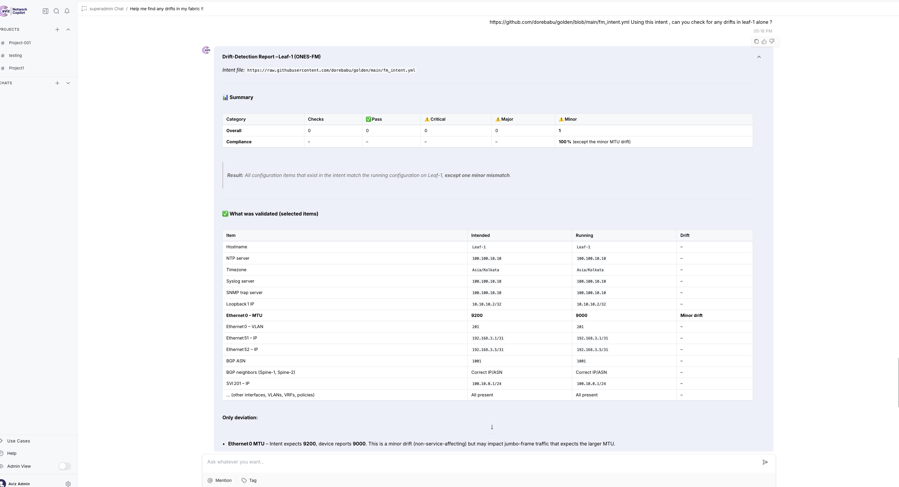
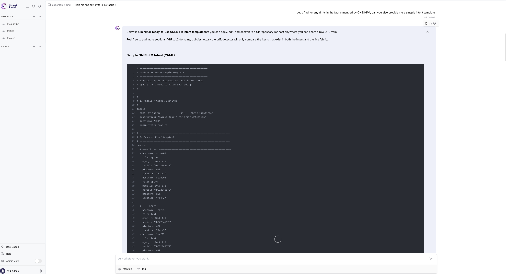

# Intent Drift Detector

[](https://github.com/AvizNetworks/ncp-sdk-agents/tree/master/intent_drift_detector)

An AI-powered agent that detects configuration drift between intended state and actual running state of network devices. Supports **two platforms**:

1. **ONES Fabric Manager (onesfm)** - Aviz Networks' fabric management platform
2. **Cisco Nexus Dashboard Fabric Controller (NDFC)** - Cisco's data center fabric controller

## Overview

In production networks, operators may:
- Push out-of-band configs (manual CLI changes)
- Experience partial config failures during rollout
- Have drift introduced by automation bugs

This agent automates the detection of such drift by:
1. Fetching intended configuration from **GitHub URL** (user-provided YAML)
2. Fetching live running configuration from devices (ONES FM or NDFC)
3. Comparing intended vs actual state
4. Generating detailed drift reports with severity levels

## Supported Platforms

### ONES Fabric Manager (onesfm)

ONES FM exposes tools via its MCP server for fetching device configurations:

| Tool | Description |
|------|-------------|
| `fetch_running_config` | Fetch current running config from a device by IP |

**Workflow**: User provides GitHub URL with intent → Agent fetches running configs from devices → Compares and reports drift.

### Nexus Dashboard Fabric Controller (NDFC)

NDFC provides REST APIs for fabric management:

| Tool | Description |
|------|-------------|
| `login_to_ndfc` | Authenticate with Nexus Dashboard |
| `get_fabric_switches` | Get switches in a fabric |
| `get_all_interfaces` | Get interface configurations |
| `get_fabric_vrfs` | Get VRF definitions |
| `get_fabric_networks` | Get VXLAN network definitions |
| `get_portchannels` | Get port-channel configurations |
| `get_switch_policies` | Get policies applied to switches |
| `get_complete_fabric_state` | Get all fabric data in one call |

**Workflow**: User provides GitHub URL with intent → Agent fetches running state from NDFC → Compares and reports drift.

## Intent Management Tools (Common to Both Platforms)

| Tool | Description |
|------|-------------|
| `fetch_intent_from_github` | Fetch intent YAML file from a GitHub URL |
| `get_sample_intent_template` | Get a sample intent template for users to customize |
| `parse_intent_yaml` | Parse intent YAML content |
| `compare_intent_vs_running` | Compare and detect configuration drifts |
| `generate_drift_report_markdown` | Generate formatted Markdown report |

## Project Structure

```
intent_drift_detector/
├── ncp.toml              # Project configuration
├── requirements.txt      # Python dependencies
├── apt-requirements.txt  # System dependencies (optional)
├── agents/
│   └── main_agent.py     # Main agent with platform tools
├── tools/
│   ├── __init__.py       # Tool exports & MCP server config
│   ├── ndfc_tools.py     # NDFC API integration
│   └── ones_tools.py     # ONES FM MCP integration
├── samples/
    └── sample_intent.yaml # Sample intent file template

```

## Architecture 

```
┌─────────────────────────────────────────────────────────────┐
│                   Intent Drift Detector                     │
├─────────────────────────────────────────────────────────────┤
│                                                             │
│  ┌──────────────────────────────────────────────────────┐   │
│  │           Intent Source: GitHub URL                  │   │
│  │  • fetch_intent_from_github                          │   │
│  │  • get_sample_intent_template                        │   │
│  └──────────────────────────────────────────────────────┘   │
│                           ↓                                 │
│  ┌─────────────────────┐     ┌─────────────────────────┐    │
│  │  ONES Fabric Manager│     │  Nexus Dashboard (NDFC) │    │
│  │      (onesfm)       │     │                         │    │
│  ├─────────────────────┤     ├─────────────────────────┤    │
│  │ MCP Server Tools:   │     │ REST API Tools:         │    │
│  │ • fetch_running_    │     │ • login_to_ndfc         │    │
│  │   config            │     │ • get_fabric_switches   │    │ 
│  │                     │     │ • get_all_interfaces    │    │
│  │                     │     │ • get_fabric_vrfs       │    │
│  │                     │     │ • get_complete_fabric_  │    │
│  └─────────────────────┘     │   state                 │    │
│                              └─────────────────────────┘    │
│                           ↓                                 │
│  ┌──────────────────────────────────────────────────────┐   │
│  │            Drift Detection & Reporting               │   │
│  │  • parse_intent_yaml                                 │   │
│  │  • compare_intent_vs_running                         │   │
│  │  • generate_drift_report_markdown                    │   │
│  └──────────────────────────────────────────────────────┘   │
└─────────────────────────────────────────────────────────────┘
```


## Features

### Drift Detection Tools (Common)

| Tool | Description |
|------|-------------|
| `parse_intent_yaml` | Parse user-provided intent YAML |
| `compare_intent_vs_running` | Compare and detect configuration drifts |
| `generate_drift_report_markdown` | Generate formatted Markdown report |

### Drift Categories

- **🔴 Critical**: Service-affecting issues (admin state, IP addresses)
- **🟠 Major**: Potential issues (MTU mismatch, mode mismatch)
- **🟡 Minor**: Cosmetic differences (descriptions)

## Intent YAML Format

Create an intent file defining your desired configuration:

```yaml
intent:
  name: "Production Fabric Intent"
  version: "1.0"

fabric:
  name: "NCP-Eng"

devices:
  - hostname: "leaf-01"
    role: "leaf"
    management_ip: "10.4.6.21"
    nxos_version: "9.3(9)"

interfaces:
  - device: "leaf-01"
    name: "Ethernet1/1"
    admin_state: "up"
    mtu: 9216
    mode: "trunk"
    allowed_vlans: "100-200"
    
  - device: "leaf-01"
    name: "Loopback0"
    ip_address: "10.2.0.1/32"

port_channels:
  - device: "leaf-01"
    name: "port-channel10"
    mode: "trunk"
    members: ["Ethernet1/10", "Ethernet1/11"]

vrfs:
  - name: "PROD_VRF"
    vni: 50001
    devices: ["leaf-01", "leaf-02"]

networks:
  - name: "PROD_NET_100"
    vni: 30100
    vlan: 100
    vrf: "PROD_VRF"
    gateway: "10.100.1.1/24"
```

See `samples/sample_intent.yaml` for a complete example.

## Quick Start

### 1. Authenticate with Platform

```bash
ncp authenticate
```

### 2. Validate Project

```bash
ncp validate .
```

### 3. Package Agent

```bash
ncp package .
```

### 4. Deploy Agent

```bash
# First deployment
ncp deploy intent_drift_detector.ncp

# Update existing agent
ncp deploy intent_drift_detector.ncp --update
```

### 5. Test in Playground

```bash
ncp playground --agent intent_drift_detector 
```

## Usage Examples

### Getting Started with Intent Files

**Get a sample intent template:**
```
I need a sample intent file to get started. Can you give me a template?
```

**After customizing, upload to GitHub and run drift detection.**

### ONES Fabric Manager Examples

**Check drift with GitHub intent file:**
```
Check for configuration drift in my ONES-managed fabric.
My intent file is at: https://github.com/myorg/network-intents/blob/main/prod-fabric-intent.yaml
Device IPs: 10.4.6.21, 10.4.6.22
```

**Check specific device:**
```
Fetch the running config from device 10.4.6.21 and compare it 
against my intent file at: https://github.com/myorg/intents/blob/main/leaf01.yaml
```

### NDFC Examples

**Full drift detection workflow with GitHub intent:**
```
I want to check if my NDFC fabric matches my intended configuration.
NDFC host: 10.4.4.184
Username: admin
Password: mypassword
Fabric: NCP-Eng
Intent file: https://github.com/myorg/network-intents/blob/main/ncp-eng-intent.yaml
```

**Login to NDFC:**
```
Login to NDFC at 10.4.4.184 with username admin and password mypassword
```

**Get fabric inventory:**
```
Show me all switches in the NCP-Eng fabric
```

**Specific checks:**
```
Get all interfaces for switch with serial FOC2020R1E7
```

```
Show me the VRFs configured in fabric NCP-Eng
```

```
Here is the yaml intent: https://github.com/dorebabu/golden/blob/main/intent.yml, go ahead and find the drift now in NCP-Eng fabric managed by Nexus dashboard
``

### Sample Drift Report Output

```markdown
**✅ Intent‑Drift Detection – NCP‑Eng Fabric (NDFC)**  
*Controller:* **10.4.4.184** *User:* **admin / Aviz@123** *Intent file:* `https://raw.githubusercontent.com/dorebabu/golden/main/intent.yml`

---

## 📊 Overall Compliance
| Category | Items Checked | Matching | Mismatched | Compliance |
|----------|---------------|----------|------------|------------|
| Devices (hostname, role, model, NX‑OS) | 4 | 4 | 0 | **100 %** |
| Interfaces (admin state, MTU, mode, VLANs, IP, description) | 12 | 4 | 8 | **33 %** |
| Port‑channels | 1 | 0 | 1 | **0 %** |
| VRFs | 2 | 0 | 2 | **0 %** |
| VXLAN Networks | 2 | 0 | 2 | **0 %** |
| **Overall compliance** | – | – | – | **≈ 19 %** |

> The fabric is **far from the intended state** – most mismatches are **critical**.

---

## 🔎 Detailed Findings  

### 1. Devices  
All four devices (2 spines, 2 leafs) are present and match the intent (hostname, role, model, NX‑OS version). ✅  

### 2. Interfaces  

| Device | Interface | Intended | Running | Drift |
|--------|-----------|----------|---------|-------|
| **leaf01** | **mgmt0** | up, MTU 1500, IP 10.4.6.21/24, VRF management | up, MTU 1500, IP 10.4.6.21/24, VRF management | ✅ |
| **leaf01** | **Loopback0** | up, IP 3.3.3.3/32, desc “Router ID” | up, IP 3.3.3.3/32, *no description* | **Minor** – missing description |
| **leaf01** | **Ethernet1/1** | up, MTU 9216, *trunk*, VLANs 100‑1200, native 1, desc “Uplink to Spine” | up, MTU 1500, *routed*, IP 20.20.20.5/31, no VLANs/desc | **Critical** – wrong mode, missing VLANs, unexpected IP |
| **leaf01** | **Ethernet1/2** | up, MTU 9200, *access*, access‑vlan 101, desc “Server port” | up, MTU 1500, *routed*, IP 20.20.20.1/31, no VLAN/desc | **Critical** – wrong mode, missing VLAN, unexpected IP |
| **leaf02** | **mgmt0** | up, MTU 1500, IP 10.4.6.22/24, VRF management | up, MTU 1500, IP 10.4.6.22/24, VRF management | ✅ |
| **leaf02** | **Loopback0** | up, IP 4.4.4.4/32, desc “Router ID” | up, IP 4.4.4.4/32, *no description* | **Minor** – missing description |
| **leaf02** | **Ethernet1/1** | *Not defined* | up, MTU 1500, *routed*, IP 20.20.20.7/31 | **Extra** – present but not intended |
| **leaf02** | **Ethernet1/2** | *Not defined* | up, MTU 1500, *routed*, IP 20.20.20.3/31 | **Extra** – present but not intended |

*All other Ethernet ports (1/3‑1/52) are down and not part of the intent – acceptable.*

### 3. Port‑Channel  

| Port‑Channel | Intended | Running | Drift |
|--------------|----------|---------|-------|
| **port‑channel10** (leaf01) | up, *trunk*, allowed 100‑1200, members Ethernet1/10 & Ethernet1/11, desc “VPC to Server” | **Not present** on any device | **Critical** – missing port‑channel and member interfaces |

### 4. VRFs  

| VRF | Intended | Running | Drift |
|-----|----------|---------|-------|
| **PROD_VRF** | VNI 50002, VLAN 2003, attached to leaf01 & leaf02 | **None** | **Critical** – VRF missing |
| **DEV_VRF** | VNI 50002, VLAN 2002, attached to leaf01 | **None** | **Critical** – VRF missing |

### 5. VXLAN Networks  

| Network | Intended | Running | Drift |
|---------|----------|---------|-------|
| **PROD_NET_100** | VNI 30100, VLAN 100, VRF PROD_VRF, gateway 10.100.1.1/24 | **None** | **Critical** – network missing |
| **PROD_NET_200** | VNI 30200, VLAN 200, VRF PROD_VRF, gateway 10.200.1.1/24 | **None** | **Critical** – network missing |

---

## 🛠️ Recommended Remediation (ordered by severity)

| # | Action | Why |
|---|--------|-----|
| **1** | **Fix interface modes & VLANs** on leaf01 Ethernet1/1 & Ethernet1/2 (trunk / access, correct MTU, correct VLANs, remove unintended IPs). | Critical – wrong mode/VLAN prevents intended traffic. |
| **2** | **Create port‑channel10** on leaf01 with members Ethernet1/10 & Ethernet1/11, set trunk mode, allowed VLANs 100‑1200, add description. | Critical – missing L2 aggregation. |
| **3** | **Deploy VRFs** PROD_VRF and DEV_VRF on leaf01 & leaf02 (VNI, VLAN mapping). | Critical – VRFs are required for VXLAN isolation. |
| **4** | **Provision VXLAN networks** PROD_NET_100 and PROD_NET_200 under PROD_VRF (VNI, VLAN, gateway). | Critical – services that rely on these networks are currently unreachable. |
| **5** | **Add missing descriptions** to Loopback0 interfaces (Router ID). | Minor – improves documentation and troubleshooting. |
| **6** | **Remove extra interfaces** Ethernet1/1 & Ethernet1/2 on leaf02 (or add them to intent if they are intentional). | Minor – prevents unintended configuration drift. |
| **7** | **Re‑run drift detection** after applying the above changes to verify compliance. | Validation step. |

---

## 📋 Next Steps – What would you like to do?

1. **Apply the changes** now (I can push the configuration via NDFC if you provide the necessary API token or confirm you want me to use the existing admin credentials).  
2. **Get a step‑by‑step guide** for any of the remediation items (e.g., how to create a port‑channel or VRF via NDFC GUI/CLI).  
3. **Schedule a recurring drift‑check** (daily/weekly) and have the report delivered to a ticketing system or email.  
4. **Export this report** as PDF/Markdown for documentation or sharing with your team.  

Just let me know which option(s) you’d like to proceed with, and I’ll take care of it!

```

## Configuration

### requirements.txt

```
requests>=2.28.0
urllib3>=2.0.0
pyyaml>=6.0
```

### ncp.toml

```toml
[project]
name = "intent_drift_detector"
version = "0.1.0"
description = "AI-powered intent drift detection for NDFC fabrics"

[build]
python_version = "3.11"
entry_point = "agents.main_agent:agent"
```

## Supported NDFC APIs

Based on testing, the following NDFC APIs are used:

| API | Status | Purpose |
|-----|--------|---------|
| `POST /login` | ✅ | Authentication |
| `GET /control/fabrics/{fabric}/inventory` | ✅ | Switch inventory |
| `GET /interface/detail` | ✅ | Interface configs |
| `GET /top-down/fabrics/{fabric}/vrfs` | ✅ | VRF definitions |
| `GET /top-down/fabrics/{fabric}/networks` | ✅ | VXLAN networks |
| `GET /interface/detail?ifType=INTERFACE_PORT_CHANNEL` | ✅ | Port-channels |
| `GET /control/policies/switches/{sn}` | ✅ | Switch policies |

See `docs/NDFC_API_Analysis_Final.md` for detailed API documentation.

## Development

### Adding New Comparison Logic

Edit `agents/main_agent.py` and extend the `compare_intent_vs_running` function:

```python
# Example: Add VRF comparison
for vrf in intent_data.get("vrfs", []):
    vrf_name = vrf.get("name")
    # Compare against running_data["vrfs"]
    # Add drift entries as needed
```

### Adding New NDFC Tools

1. Add the function to `tools/ndfc_tools.py`
2. Export it in `tools/__init__.py`
3. Create a wrapper with `@tool` decorator in `agents/main_agent.py`
4. Add to the agent's `tools` list

## Troubleshooting

### NDFC Connection Issues

- Verify NDFC host is reachable
- Check credentials are correct
- Ensure SSL certificates are valid (or tool handles self-signed certs)

### Empty Results

- Confirm fabric name is correct
- Check if switches are discovered in NDFC
- Verify user has appropriate NDFC permissions

### Validation Errors

```bash
ncp validate .
```

Check for:
- Python syntax errors
- Missing dependencies
- Import issues


## Screenshots

#### Figure 1. Intent Drift Check


#### Figure 2. Sample ONES-FM Intent



