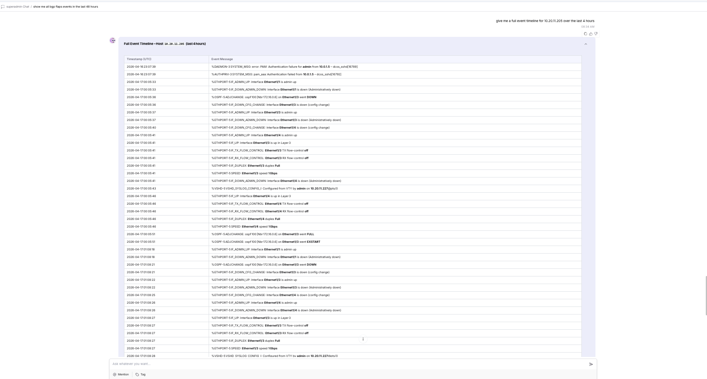
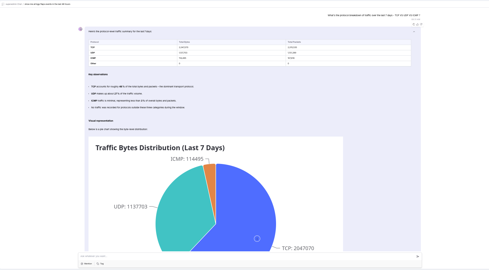
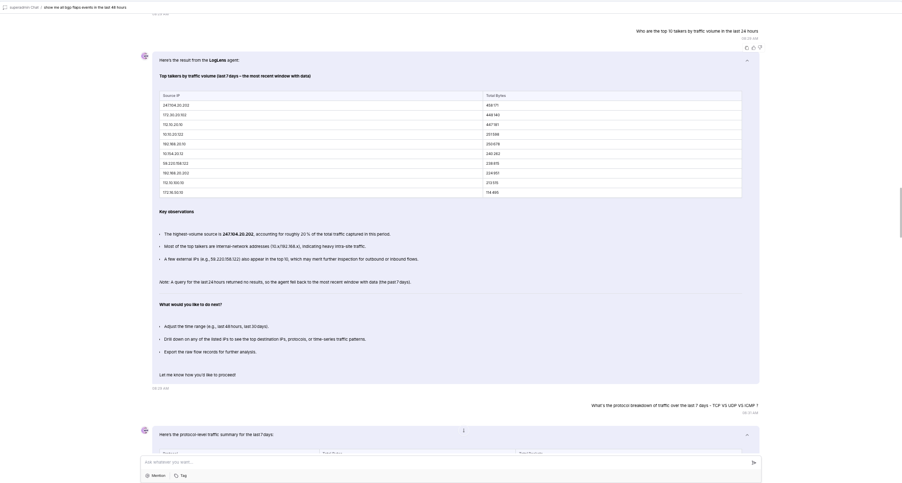

# NCP LogLens — Syslog Event Intelligence & Natural-Language Q&A

[](https://github.com/AvizNetworks/ncp-sdk-agents/tree/master/loglens-agent)

**Track:** AI Agents for Network Operations (Automation / Observability)

LogLens turns natural-language questions into Splunk SPL queries, executes them,
and interprets the results as actionable summaries — no SPL expertise required.

---

## What It Does

### Syslog / Device Events

| You ask | LogLens returns |
|-------------------------------------------------------------------------|--------------------------------------------------------|
| "Show BGP flap events in the last 24h by peer and VRF" | Table: device, peer IP, VRF, flap count, time range |
| "List authentication failures by username and device, past 6 hours" | Table: device, username, failure count, first/last hit |
| "For leaf1, summarize interface events and BGP changes in the last 2h" | Timeline + narrative for leaf1 |
| "Explain repeated 'protocol identification string lack carriage return'" | Count by device + pattern explanation |
| "Give me a timeline of PSU and FAN events for Cisco-ONES on 2025-05-12" | Chronological event list with severities |

Supported syslog categories: **BGP_FLAP · AUTH_FAILURE · IF_UP_DOWN · PSU_EVENT · FAN_EVENT · OSPF_EVENT · GENERIC_ERROR**

### Flow Telemetry (sFlow / NetFlow / IPFIX)

| You ask | LogLens returns |
|----------------------------------------------------------------|----------------------------------------------------------|
| "Show top 10 source IPs by bytes in the last 24 hours" | Table: src IP, total bytes, flow count |
| "What protocols are generating the most traffic this week?" | Protocol distribution table with bytes and flow counts |
| "Show all flows to or from 10.0.0.5 in the past hour" | Table: src, dst, protocol, bytes per flow |
| "Top source-destination pairs by flow count today" | Ranked pairs table with bytes and counts |
| "Traffic volume trend over the last 7 days" | Hourly/daily bytes and flow count over time |

Supported flow categories: **TOP_TALKERS · FLOW_PAIRS · PROTOCOL_DIST · TRAFFIC_TREND · IP_FLOWS**

---

## Architecture

```
             ┌───────────────────────┐
             │   Networking Devices  │
             │ (Cisco, Arista, SONiC)│
             └───────────┬───────────┘
                         │ Syslogs / Flow logs (sFlow, NetFlow, IPFIX)
                         ▼
                 ┌─────────────────┐
                 │  Splunk Index   │
                 │ (raw log storage│
                 │ + tokenization) │
                 │  10.20.11.23    │
                 └────────┬────────┘
                          │ REST API (port 8089)
                          ▼
             ┌────────────────────────────────────────┐
             │         SplunkQueryAgent               │
             │  (NL → SPL → Execute → Raw Results)   │
             │                                        │
             │  Tools:                                │
             │  ├─ get_splunk_connection_info          │
             │  ├─ list_indexes                        │
             │  ├─ discover_syslog_fields              │
             │  ├─ discover_flow_fields                │
             │  └─ search_splunk                       │
             └────────────┬───────────────────────────┘
                          │ Raw SPL results (JSON)
                          │ (via AgentTool — splunk_query_expert)
                          ▼
             ┌────────────────────────────────────────┐
             │         LogLens Agent (main)           │
             │  Interpretation + NL Answer            │
             │  Summarizes, tables, narratives,       │
             │  pattern detection                     │
             └────────────┬───────────────────────────┘
                          │ Human-readable Answer / Tables
                          ▼
                      User / NCP UI
```

**SplunkQueryAgent** handles all SPL mechanics: calls `list_indexes` to discover
available data, picks `discover_syslog_fields` or `discover_flow_fields` based on
the data type, then builds and executes the SPL using only discovered field names —
never hardcodes or guesses field names.

**LogLens Agent** (main entry point) accepts plain-English questions, delegates
data retrieval to SplunkQueryAgent via the `splunk_query_expert` AgentTool,
interprets raw results, and returns structured summaries with pattern detection.

No ingestion agent is needed — Splunk handles ingestion and indexing natively.

---

## Requirements

- Python 3.11+
- Splunk instance with syslog and/or flow data indexed
- Splunk management API accessible on port 8089
- NCP SDK (`pip install ncp`)

### Supported Data Inputs
- Syslog from NX-OS/IOS-XE, Arista EOS, SONiC (RFC 3164 / 5424)
- Flow telemetry: sFlow, NetFlow, IPFIX (any sourcetype indexed in Splunk)

---

## Setup & Deployment

### 1. Clone the Repository

```bash
git clone https://github.com/AvizNetworks/ncp-sdk-agents.git
cd ncp-sdk-agents/loglens-agent
```

### 2. Install NCP SDK

```bash
pip install ncp
```

### 3. Configure Splunk Credentials

Open `tools/splunk_tools.py` and update the default values to point to your
Splunk instance. These defaults are baked into the package at build time:

```python
_SPLUNK_HOST = os.getenv("SPLUNK_HOST", "<your-splunk-ip>")
_SPLUNK_PORT = int(os.getenv("SPLUNK_PORT", "8089"))
_SPLUNK_USERNAME = os.getenv("SPLUNK_USERNAME", "<username>")
_SPLUNK_PASSWORD = os.getenv("SPLUNK_PASSWORD", "<password>")
_VERIFY_SSL = os.getenv("SPLUNK_VERIFY_SSL", "false").lower() == "true"
```

> **Note:** The `.env` file is excluded from `.ncp` packages by the SDK.
> Credentials must be set as defaults in `splunk_tools.py` or injected as
> environment variables on the NCP platform server.
>
> To use token-based auth instead: generate a token in Splunk Web under
> **Settings → Tokens → New Token** and set it as `_SPLUNK_TOKEN`.

### 4. Authenticate with NCP Platform

```bash
ncp authenticate
```

When prompted, enter your NCP platform URL and API key. This writes the
`[platform]` section in `ncp.toml`.

### 5. Build the Package

```bash
ncp package .
```

This produces `loglens-agent.ncp` in the project directory.

### 6. Onboard to NCP Platform

```bash
ncp onboard loglens-agent.ncp
```

To update an already-onboarded agent:

```bash
ncp onboard loglens-agent.ncp --update
```

After onboarding, assign the agent to users via **Admin → Roles & Permissions → CustomAgents**.

---

## Configuration

| Variable | Description | Set in |
|---|---|---|
| `SPLUNK_HOST` | Splunk server hostname or IP | `splunk_tools.py` default |
| `SPLUNK_PORT` | Splunk management API port (default: `8089`) | `splunk_tools.py` default |
| `SPLUNK_TOKEN` | Bearer token (preferred over username/password) | `splunk_tools.py` default |
| `SPLUNK_USERNAME` | Username (used only when no token is set) | `splunk_tools.py` default |
| `SPLUNK_PASSWORD` | Password (used only when no token is set) | `splunk_tools.py` default |
| `SPLUNK_VERIFY_SSL` | Verify TLS certificate (`true`/`false`, default: `false`) | `splunk_tools.py` default |
| NCP platform URL | Platform endpoint | `ncp authenticate` → `ncp.toml` |
| NCP API key | Platform authentication | `ncp authenticate` → `ncp.toml` |

---

## Example Questions

### Syslog / Device Events

```
Show BGP flap events in the last 24h by peer and VRF, with counts and timestamps.

List authentication failures by username and device in the past 6 hours.

For leaf1, summarize interface up/down events and BGP adjacency changes in the last 2 hours.

Explain repeated "protocol identification string lack carriage return" errors by device.

Give me a timeline of PSU and FAN events for Cisco-ONES on 2025-05-12.

Which devices generated the most error-level syslog events today?

Show all critical and emergency events from the last hour.
```

### Flow Telemetry

```
Show the top 10 source IPs by bytes in the last 24 hours.

What protocols are generating the most traffic this week?

Show all flows to or from 10.0.0.5 in the past hour.

Give me the top source-destination pairs by flow count today.

Show hourly traffic volume for the last 7 days.
```

---

## Success Criteria

| Metric | Target |
|-----------------------|---------------------------------------------------------------------------------|
| SPL generation | ≥ 95% correct translation from NL prompts |
| Interpretation | ≥ 95% of summaries match manually derived insights |
| Syslog categories | BGP_FLAP, AUTH_FAILURE, IF_UP_DOWN, PSU_EVENT, FAN_EVENT, OSPF_EVENT |
| Flow categories | TOP_TALKERS, FLOW_PAIRS, PROTOCOL_DIST, TRAFFIC_TREND, IP_FLOWS |
| Latency | ≤ 3s question → summarized result at 500 logs/sec |

---

## Screenshots
#### Event Description QnA


#### Visualization


#### Checking top 10 traffic volume



## Project Structure

```
loglens-agent/
├── agents/
│   ├── __init__.py
│   └── main.py          # SplunkQueryAgent + LogLens (main entry point)
├── tools/
│   ├── __init__.py
│   └── splunk_tools.py  # Splunk REST API tools (set credentials here)
├── .env.example         # Reference for available environment variables
├── .gitignore
├── ncp.toml             # NCP project + platform config
├── requirements.txt
└── README.md
```
