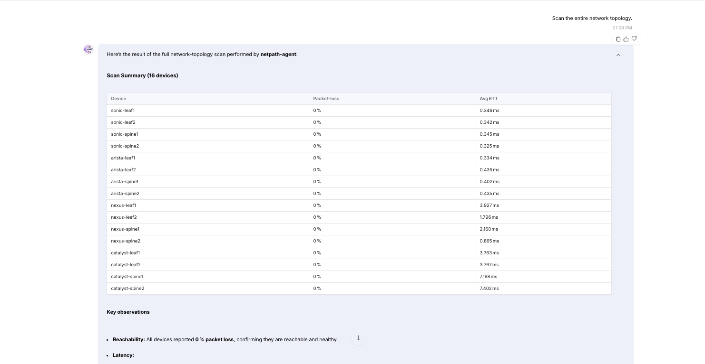
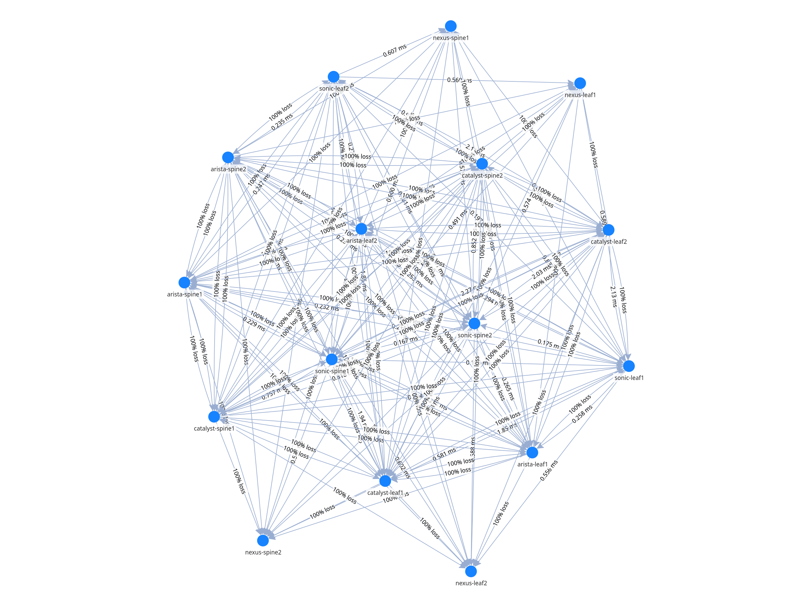
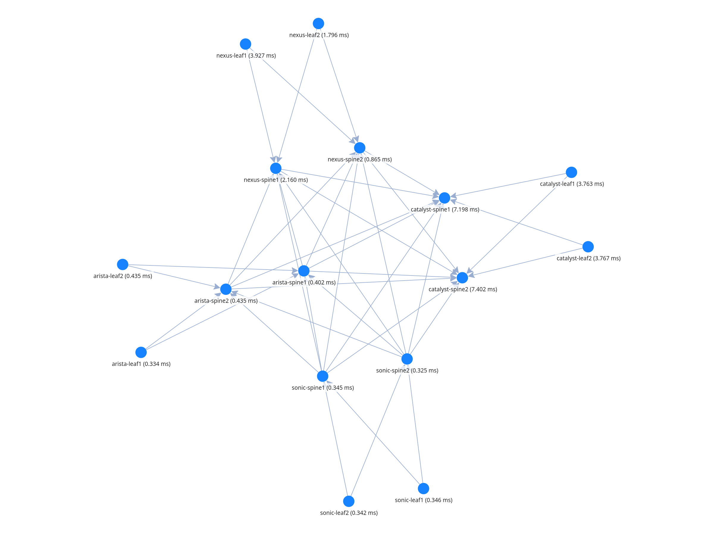

# NetPath-Agent (Network Path Intelligence)

## Overview

**NetPath-Agent** is an advanced, automated network diagnostic agent designed to **dynamically analyze, map, and troubleshoot** complex multi-vendor network fabrics.

It provides real-time visibility, connectivity metrics (latency, packet loss), and path tracing across **SONiC**, **Arista EOS**, **Cisco NX-OS**, and **Cisco IOS-XE**. The agent pairs conversational insights with an interactive graphical dashboard for live visualization.

---

## Key Capabilities

* **Automated Topology Mapping:** Discovers and maps network topology by scanning connected inventory.
* **Fabric Connectivity Heatmap:** Conducts any-to-any ping meshes for latency and loss capabilities.
* **Hop-by-Hop Remote Traceroute:** SSH access to trace paths and identify localized failures.
* **Live Streamlit Dashboard:** Multi-tab interface to visualize network graphs, heatmaps, and path diagrams.
* **Historical Network Analytics:** Time-series trends of connectivity performance.

---

## Agent Definition

```python
agent = Agent(
    name="NetPath_Agent",
    description="Automated Network Path Intelligence Agent with Visual Analytics",
    instructions=...
)
```

NetPath-Agent uses specific **tool-based execution** (no ad-hoc processing) and automatically adjusts troubleshooting commands based on the target OS platform type within its inventory.

---

## Tools Used

NetPath-Agent is powered by the following tools:

```python
tools = [
    collect_network_data,
    analyze_path_topology,
    list_inventory,
    check_device_health,
    show_database_stats,
    run_ping_mesh,
    run_full_network_scan,
    get_ping_mesh_results,
    get_ping_mesh_history,
    run_remote_traceroute,
]
```

### Tool Responsibilities

| Tool                                | Purpose                                                  |
| ----------------------------------- | -------------------------------------------------------- |
| `run_full_network_scan`             | Discovers topology by scanning all connected inventory  |
| `run_ping_mesh`                     | Conducts Any-to-Any ping tests to build connectivity heatmap |
| `collect_network_data`              | Runs ping and traceroute diagnostics on a specific device|
| `analyze_path_topology`             | Analyzes path trace data to find loss and localized failures |
| `check_device_health`               | Verifies ICMP reachability and SSH authentication/accessibility |
| `run_remote_traceroute`             | SSH into a device and runs traceroute to a target        |
| `get_ping_mesh_results`             | Fetches raw latest mesh structured latency/loss data     |
| `get_ping_mesh_history`             | Retrieves historical latency/loss trends for a device pair |
| `list_inventory`                    | Lists all available network devices mapped in the registry |
| `show_database_stats`               | Displays database metrics, recent ping, and trace dumps |

---

## Operating Rules & Constraints

* **Platform Neutrality:**
  The agent automatically switches syntaxes for `ping` and `traceroute` depending on the platform (Linux, EOS, NX-OS, IOS).
* **Automated Failure Detection:**
  If a multi-vendor topology ping fails to return valid responses, it is automatically marked as `100% loss` and flagged.
* **Persistent Insights:**
  All network telemetry and diagnostics are preserved locally in SQLite (`/tmp/netpath_data.db`) for trend tracking.
* **Dashboard First:**
  While providing real-time natural language answers, complex correlation and visualization mappings are delegated to the Streamlit Dashboard.

---

## NetPath Workflows

```
What is the visual goal?
 ├─ Topology Map → run_full_network_scan 
 ├─ Connectivity Matrix (Heatmap) → run_ping_mesh 
 ├─ Tracing Path via Nodes → run_remote_traceroute
 └─ Specific Device Health
     ├─ Check basic reachability → check_device_health
     └─ Diagnose loss/latency → collect_network_data + analyze_path_topology
```

---

## Streamlit Dashboard Workflow

For real-time graphical rendering of the telemetry, we use a Streamlit-based interface.

* **Unified Topology Graph** using `pyvis`
* **Fabric Heatmap** tracking real-time packet loss and latency
* **Remote Traceroute Path Visualization** 

### Configuration (Required)

Verify `tools/inventory.py` includes accurate device credentials mapping for SSH fallback logic. 
SQLite Database relies on:
```python
DB_PATH = "/tmp/netpath_data.db"
```

---

## Setup & Run Instructions

### Clone the Repository

```bash
git clone https://github.com/AvizNetworks/ncp-sdk-agents.git
cd ncp-sdk-agents
git checkout netpath-agent
```

---

### Configure Inventory Credentials

Edit `tools/inventory.py` and update the `DEVICE_REGISTRY` with your own nodes:

```python
"192.168.4.11": {"name": "sonic-leaf1", "platform": "linux", "user": "admin", "pass": "aviz@123"},
```

---

### Authenticate with NCP

Provide the following details when prompted or via config:

* **NCP URL**
* **Username**
* **Password**

---

### Install NCP SDK Package

```bash
pip install ncp
```

### For creating package (.ncp)

```bash
ncp authenticate
ncp package .
```

---

### Deploy Agent to NCP Playground

1. Deploy the package agent `.ncp`
```bash
ncp deploy netpath-agent.ncp --update
```
2. Launch NCP CLI UI
```bash
ncp playground --agent netpath-agent
```

---

### Use the NCP UI & Dashboard

This project is deployed in two parts: the Backend logic via the NCP UI, and the Visual Dashboard directly on the host VM.

**Part A: Interact via NCP UI**
1. Access your NCP platform via web browser (e.g. `https://192.168.4.10` or `192.168.4.183`).
2. Select the **NetPath-Agent** from the Chat interface.
3. Ask natural language questions like:
  * *"Scan the network topology."*
  * *"Run a full ping mesh to build the heatmap."*
  * *"Trace the route from nexus-leaf1 to 8.8.8.8 and show me a bar chart of the hops."*

---

## Screenshots 
### QnA on NCP UI


### Ping Mesh Results Visualization


### Traceroute Results Visualization



---

## Example Interaction

**User:**

> Trace the route from arista-leaf1 to 8.8.8.8

**NetPath_Agent Workflow:**

1. Resolve Name -> IP using `list_inventory` / `get_device_details`.
2. Attempt connection using `run_remote_traceroute`, identifying device as NX-OS.
3. Authenticate and perform tracing to `8.8.8.8`.
4. Provide tabular RTTs for each hop.
5. Agent informs the user to view the "Traceroute Path Visualization" tab in the Streamlit Dashboard for network visualization.

---

## Future Enhancements

* BGP/OSPF dynamic routing protocol insight scanning
* Streaming telemetry integrations for live alerts
* Direct integrations into broader ONES fabric topologies

---

## Contributors / Maintainers

**Devendra**

---
