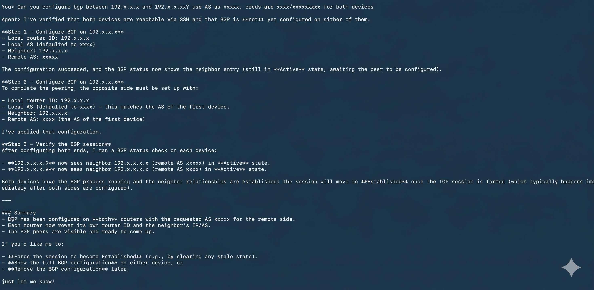

# Intent-Driven Network Automation Agent

[](https://github.com/AvizNetworks/ncp-sdk-agents/tree/master/network_configurator)

## Overview

The Intent-Driven Network Automation Agent is an AI-powered system designed to translate natural language instructions into structured network configurations. It supports automated provisioning and management of BGP and VLAN configurations using Ansible.

The agent enables network engineers to define desired outcomes in plain language, which are then parsed, validated, and executed across network devices.

---

## Key Capabilities

* Natural language to network intent translation
* Automated BGP peering configuration
* VLAN creation, deletion, and inspection
* Intent validation prior to execution
* Parallel configuration across multiple devices
* Post-deployment verification of network state
* YAML-based intent generation

---

## Agent Definition

**Name:** BgpIntentAgent

**Description:**
An AI-based network automation agent that interprets user intent, generates structured configuration data, and applies changes to network devices using Ansible automation.


## Tools and Their Uses

| Tool Name                       | Description / Use                                                     |
| ------------------------------- | --------------------------------------------------------------------- |
| `list_supported_intents`        | Returns all supported intent types available in the agent             |
| `get_intent_template`           | Retrieves the predefined structure for a given intent type            |
| `parse_bgp_intent`              | Extracts ASN, router IPs, and credentials from natural language input |
| `validate_bgp_intent`           | Validates the correctness and completeness of BGP intent data         |
| `generate_intent_yaml`          | Converts structured intent into YAML format                           |
| `check_ansible_installed`       | Verifies whether Ansible is installed on the system                   |
| `run_ansible_bgp`               | Executes BGP configuration across routers using Ansible               |
| `check_existing_bgp_connection` | Checks if BGP peering is already configured and its state             |
| `check_bgp_status`              | Retrieves BGP summary from routers                                    |
| `remove_bgp_configuration`      | Removes BGP configuration from routers                                |
| `parse_vlan_intent`             | Extracts VLAN ID, name, switch IPs, and credentials from input        |
| `list_vlans`                    | Lists VLANs configured on switches                                    |

---


## Tool Responsibilities

### BGP Tools

**Intent Parsing**
Extracts ASN, router IP addresses, and credentials from user input. Automatically builds neighbor relationships between routers.

**Validation**
Ensures required fields such as ASN and router list are present and valid.

**Configuration Execution**
Applies BGP configuration using Ansible. Assigns unique AS numbers per router and establishes neighbor relationships dynamically.

**Verification**
Checks whether BGP sessions are established and provides summary outputs from devices.

**Removal**
Deletes BGP configuration from target routers.

---

### VLAN Tools

**Intent Parsing**
Extracts VLAN ID, VLAN name, switch IP addresses, and credentials.

**Validation**
Ensures VLAN ID falls within the valid range (1–4094).

**Configuration Execution**
Creates VLANs on switches using appropriate CLI commands via Ansible.

**Monitoring**
Retrieves VLAN information from switches.

**Removal**
Deletes VLANs from specified switches.

---

## Operating Rules and Constraints

* Default ASN is 1001 if not specified
* Minimum of two routers required for BGP configuration
* VLAN ID must be between 1 and 4094
* Intent must be validated before execution
* Only Ansible ad-hoc commands are used
* SSH host key checking is disabled
* Parallel execution is used for scalability

### Authenticate with NCP

```bash
ncp login
```

---

### Install NCP SDK Package

```bash
pip install ncp
```

---

### Create NCP Package

```bash
ncp build
```

This command generates a deployable `.ncp` package.

---

### Deploy Agent to NCP Playground

```bash
ncp deploy
```

---

## Using the NCP Interface

1. Open the NCP Playground
2. Select the BgpIntentAgent
3. Enter natural language commands

### Example BGP Request

```
Configure BGP between x.x.x.x and x.x.x.x with ASN 65000 creds admin/admin
```

### Example VLAN Request

```
Create VLAN 100 name SALES on x.x.x.x creds admin/admin
```

---

## Screenshots

BGP configuration execution output


---

## Example Workflow

**Input:**

```
Setup BGP between x.x.x.x and x.x.x.x ASN 65000
```

**Execution Flow:**

```
User Input
    ↓
Parse Intent
    ↓
Validate Data
    ↓
Check Existing BGP
    ↓
Apply Configuration (Ansible)
    ↓
Verify BGP Status
    ↓
Success/Error Output
```

---


