# <b>Configuration convertor from Cumulus to SONiC</b>

This Configuration convertor is  intended for network administrators with CUMULUS background. This guide will help network administrators  to migrate their current CUMULUS deployment for various Fabric networks to SONiC . CUMULUS User guide <a>https://docs.nvidia.com/networking-ethernet-software/cumulus-linux-42/</a> can be used as a checklist to get started with the  migration plan from CUMULUS to SONiC. Following  document provides example configuration commands for comparison.

## <b>Switch Management</b>

Operator has to login to CUMULUS and SONiC switch as super user using `sudo su`

<style>
  table {
    border-collapse: collapse;
    table-layout: fixed;
    width: 100%;
  }

  th, td {
    border: 1px solid black;
    padding: 8px;
    text-align: left;
    vertical-align: top;
    word-wrap: break-word;
    width: 50%; 
  }
  th {
    color: white;
    background-color:  #3393F3;
  }
</style>

<table>
  <tr>
    <th>CUMULUS</th>
    <th>SONiC</th>
  </tr>
  <tr>
  <th colspan='2'>Management IP</th>
  </tr>
 <tr>
   <td>
        
<b># OOB Management IP</b><br />
<b># Syntax</b><br />
nv set interface eth0 ip address <IP_ADDRESS>/<SUBNET><br />
nv set interface eth0 ip gateway <GATEWAY_IP><br /><br />

<b># Configure edit /etc/network/interfaces file</b><br />
<b># Example</b><br />
sudo nano /etc/network/interfaces <br /><br />

<b># Management interface </b><br />
auto eth0<br />
iface eth0 <br />
    address 192.0.2.42/24 <br />
        gateway 192.0.2.1<br /><br />

<b># OOB  Management IP with VRF</b><br />
<b># Syntax</b><br />
<b>#Management VRF is enabled by default in Cumulus Linux so logins to the switch are set into the management VRF context.</b>
To disable management VRF, following are the options-<br />
Run NCLU command - net del vrf mgmt command<br />
Remove  the auto mgmt and auto eth0 stanzas from the /etc/network/interfaces file and reboot the switch<br /><br />

<b>#Example command brings down the management VRF, then brings it back up with the ifup --with-depends mgmt command:</b><br />
sudo ifdown mgmt<br />
sudo ifup --with-depends mgmt<br /><br />
        

   </td>

<td>
<b># OOB Management IP</b><br />
<b># Syntax</b><br />
config interface ip add &lt;mgmt-if&gt; &lt;Ipv4_address&gt; / &lt;Ipv4_subnet&gt; &lt;gateway_ipv4_address&gt;<br /><br />

<b># Example</b><br />
config interface ip add eth0 192.168.1.1/24 192.168.1.254<br /><br />

<b># OOB Management IP with VRF</b><br />
<b># Syntax</b><br />
config VRF add mgmt<br />
config interface ip add mgmt &lt;VRF-NAME&gt; &lt;Ipv4_address&gt;/&lt;Ipv4_subnet&gt; &lt;gateway_IPV4_address&gt;<br /><br />

<b># Example</b><br />
config VRF add mgmt<br />
config interface ip add mgmt VRF-1 192.168.1.1/24 192.168.1.254<br /><br />

<b># Command to verify management IP address configured</b><br />
show management_interface address<br />
Management IP address = 192.168.1.1/24<br />
Management Network Default Gateway = 192.168.1.254<br />
</td>
</tr>


<tr>
<th colspan="2">Switch Reboot</th>
</tr>


<tr>
<td>
<b># Linux Command in CUMULUS to reboot the system but it will cause traffic disruption</b><br />
<p>sudo reboot</p>

<b># Linux Cold restart - cold restarts the system and resets all the hardware devices on the switch</b><br />
    <p>sudo csmgrctl -c</p>

<b># Linux Fast restart - fast restarts the system more efficiently with minimal impact to traffic by reloading the kernel and software stack without a hard reset of the hardware</b><br />
<p>sudo csmgrctl -f</p>

<b># Linux Warm restart system with no interruption to traffic for existing route entries</b><br />
<p>sudo csmgrctl -w</p>
</td>

<td>
<b># Command to perform a system reboot which may cause some disruption of data traffic</b><br />
<p>reboot</p>

<b># Command to define the cause of reboot of a Sonic device</b><br />
<p>show reboot-cause</p>
<p>show reboot-cause history</p>

<b># Command to enable a switch to reboot quickly with minimum disruption to the data plane</b><br />
<p>fast-reboot</p>

<b># Warm reboot commands perform in-service NOS upgrade without impacting the data plane traffic</b><br />
<p>warm-reboot -v</p>
<p>config warm_restart enable/disable</p>
<p>config warm_restart enable</p>

<b># Command to show the configuration of warm restart settings and whether the service is enabled or disabled</b><br />
<p>show warm_restart config</p>
<p>show warm_restart state</p>

<b># Command to view syslogs</b><br />
<p>tail -f /var/log/syslog</p>
</td>
</tr>

<tr>
   <th colspan="2">Upgrade NOS</th>
</tr>

<tr>
<td>
<b># Command to check the version in CUMULUS</b><br />
<p>nv show platform software installed</p>

<b># ONIE install Cumulus image via FTP</b><br />
<p>ONIE#onie-nos-install ftp://local-ftp-server/cumulus-install-[PLATFORM].bin</p>

<b># ONIE install Cumulus image via TFTP</b><br />
<p>ONIE#onie-nos-install tftp://local-tftp-server/cumulus-install-[PLATFORM].bin</p>

<b># Syntax to Upgrade Cumulus Switch</b><br />
<p>sudo onie-install -a -i http://10.x.x.x/cumulus-linux-4.1.0-mlx-amd64.bin</p>
<p>sudo reboot</p>

<b># Cumulus Install command using the installer</b><br />
<p>sudo -E apt-get update</p>

<b># Command to see the additional package dependencies that will be installed or upgraded</b><br />
<p>sudo -E apt-get upgrade --dry-run</p>

<b># Upgrade all the packages to the latest distribution</b><br />
<p>sudo -E apt-get upgrade</p>

<b># Reboot the switch</b><br />
<p>sudo reboot</p>
</td>


<td>
<b># Command to check the version in SONiC</b><br />
<p>Show version</p>

<b># Command to upgrade the version in SONiC</b><br />
<p>sonic-installer</p>
<p>sonic-installer install</p>
<p>sonic-installer install [OPTIONS] &lt;image_file_path&gt;</p>
<p>sonic-installer list</p>

<b># Command to set which image will be used for default boot image after any system reboot</b><br />
<p>sonic-installer set-default</p>
<p>sonic-installer set-default &lt;image_name&gt;</p>
<p>sonic-installer set-next-boot &lt;image_name&gt;</p>

<b># Operator can use the following command to remove a saved SONiC image in device flash/disk</b><br />
<p>sonic-installer remove</p>
<p>sonic-installer remove [y|-yes] &lt;image_name&gt;</p>
</td>
</tr>

<tr>
   <th colspan="2">Configuration Save</th>
</tr>


<tr>
<td>
<b># Command to save the configuration on Cumulus</b><br />
<p>sudo config-backup</p>
<p>sudo config-backup -d -D &lt;CONFIG_FILE&gt;</p>
<p>sudo config-backup -q -X .*~$</p>
<p>sudo config-backup -pv</p>

<b># Command to restore configuration</b><br />
<p>sudo config-restore -b config_backup-2019-04-23-21.30.47_leaf01</p>
<p>sudo config-restore -n 10</p>
<p>sudo config-restore -N</p>
<p>sudo config-restore -L -N</p>

<b># CLI to delete and re-add a new saved config</b><br />
<p>net add &lt;config_file&gt;</p>
<p>net del &lt;config_file&gt;</p>

<b># Use the net pending command to review staged changes</b><br />
<p>net pending &lt;config_file&gt;</p>

<b># Command to commit the changes in config</b><br />
<p>net commit</p>

<b># Command to revert the last config change</b><br />
<p>net abort</p>
</td>
<td>
<b># Command to save the configuration on SONiC</b><br />
<p>config save -y</p>

<b># Command to delete and re-add a new saved config</b><br />
<p>config reload &lt;config_db.json/SONiCYang&gt;</p>

<b># Command to load the configuration from a JSON file</b><br />
<p>config load &lt;config_json_file&gt;</p>

<b># Replace a new configuration on top of the existing running configuration</b><br />
<p>config replace &lt;config_db.json/SONiCYang&gt;</p>
</td>
</tr>

<tr>
   <th colspan="2">Platform Information</th>
</tr> 

<tr>
<td>
<b># Show system platform information</b><br />
<p>sudo decode-syseeprom</p>

<b># Command to show the platform type</b><br />
<p>sudo decode-syseeprom</p>
</td>

<td>
<b># Command to verify platform details in SONiC</b><br />
<b># Syntax</b><br />
<p>show system status</p>
<p>show clock</p>
<p>show boot</p>
<p>show environment</p>
<p>show system status</p>
<p>show reboot-cause</p>
<p>show uptime</p>
<p>show logging</p>
<p>show users</p>
<p>show platform fan</p>
<p>show platform firmware status</p>
<p>show platform firmware version</p>
<p>show platform pcieinfo</p>
<p>show platform psustatus</p>
<p>show platform ssdhealth</p>
<p>show platform summary</p>
<p>show platform syseeprom</p>
<p>show platform temperature</p>
<p>show interfaces transceiver</p>
</td>
</tr>
</table>

## <b>Management Services</b>

<table>
<tr>
    <th><b>CUMULUS</b></th>
    <th><b>SONiC</b></th>
</tr>

<tr>
   <th colspan='2'><b>SYSLOG</b></th>
</tr>

<tr>
<td>
<b># Configure syslog server</b><br />
<b># Syntax</b><br />
<p>net add syslog host ipv4 &lt;IP_ADDRESS&gt; port udp &lt;PORT_NUMBER&gt;</p>
<p>net pending</p>
<p>net commit</p>

<b># Example</b><br />
<p>net add syslog host ipv4 192.168.0.254 port udp 514</p>
<p>net pending</p>
<p>net commit</p>

<b># Command to delete syslog server</b><br />
<p>net del syslog host ipv4 &lt;IP_ADDRESS&gt; port udp &lt;PORT_NUMBER&gt;</p>
</td>

<td>
<b># Syslog commands in SONiC</b><br />

<b># Syntax</b><br />
<p>config syslog add</p>
<p>config syslog delete</p>

<b># Command to add or delete a specific syslog server IP</b><br />
<p>config syslog add &lt;ipv4-address&gt; --source &lt;source_ipv4_address&gt;</p>
<p>config syslog del &lt;ipv4-address&gt;</p>

<b># View syslog for a particular protocol in SONiC</b><br />
<p>show logging</p>
<p>show logging &lt;any_protocol&gt;</p>

<b># Command to show syslog server IP and port configuration</b><br />
<p>show syslog</p>

<b># Location of syslog configuration file</b><br />
Configuration file for syslog available at: /etc/rsyslog.conf<br /><br />

<b># Example Configuration</b><br />
<p>config syslog add 1.1.1.1 --source 192.168.8.231</p>
<p>config syslog del 1.1.1.1</p>

<b># Command to view syslog file location</b><br />
Path: /var/log/syslog*<br />
</td>
</tr>

<tr><th colspan='2'><b>ZTP</b></th></tr>


<tr>
<td>
<b># Configuration to enable Zero Touch Provisioning</b><br />
<b># Syntax</b><br />

<b># ZTP Over DHCP command</b><br />
<b># Example</b><br />
<p>Edit /etc/dhcp/dhcpd.conf file for an ISC DHCP server</p>
<p>option cumulus-provision-url code 239 = text;</p>
<p>subnet 192.0.2.0 netmask 255.255.255.0 {</p>
<p>range 192.0.2.100 192.168.0.200;</p>
<p>option cumulus-provision-url "http://192.0.2.1/demo.";</p>

<b># Command to specify the hostname of the switch in <br />ZTP script</b><br />
<b># Example</b><br />
<p>subnet 192.168.0.0 netmask 255.255.255.0 {</p>
<p>range 192.168.0.100 192.168.0.200;</p>
<p>option cumulus-provision-url "http://192.0.2.1/demo.";</p>
<p>host dc1-tor-sw1 { hardware ethernet 44:38:39:00:1a:6b;<br /> fixed-address 192.168.0.101; option host-name "dc1-tor-sw1"; }</p>

<b># Command function to demonstrate the ZTP function through<br /> a Linux call</b><br />
<p>function init_ztp(){</p>
<p>CUMULUS_TARGET_RELEASE=5.0.0</p>
<p>CUMULUS_CURRENT_RELEASE=$(cat /etc/lsb-release | grep RELEASE<br /> | cut -d "=" -f2)</p>
<p>IMAGE_SERVER_HOSTNAME=webserver.example.com</p>
<p>IMAGE_SERVER="http://"$IMAGE_SERVER_HOSTNAME"/"<br />$CUMULUS_TARGET_RELEASE".bin"</p>
<p>ZTP_URL="http://"$IMAGE_SERVER_HOSTNAME"/ztp."</p>
<p>if [ "$CUMULUS_TARGET_RELEASE" != "$CUMULUS_CURRENT_RELEASE" ]; <br />then</p>
<p>ping_until_reachable $IMAGE_SERVER_HOSTNAME</p>
<p>/usr/cumulus/bin/onie-install -fa -i $IMAGE_SERVER -z $ZTP_URL<br /> && reboot</p>
<p>else</p>
<p>init_ztp && reboot</p>
<p>exit 0</p>
<p>}</p>

<b># Command to test the ZTP Scripts</b><br />
<b># Validate and debug your ZTP scripts</b><br />
<p>sudo ztp -v -r http://192.x.x.x/script.</p>

<b># Verify ZTP status</b><br />
<p>sudo systemctl -l status ztp.service</p>
</td>

<td>
<b># Configuration</b><br />
<b># Syntax</b><br />

<b># Enable the ZTP services</b><br />
<p>admin@sonic:~$ config ztp enable</p>

<b># Running the ZTP Services</b><br />
<p>admin@sonic:~$ config ztp run -y</p>

<b># Check the ZTP Status</b><br />
<p>admin@sonic:~$ show ztp status</p>

<b># Check the /etc/sonic, user will be able to see config_db.json</b><br />
<p>admin@sonic:~$ ls /etc/sonic/ | grep config_db.json</p>
<p>Config_db.json</p>

<b># Server where ZTP server is hosted, the operator can edit in a customized way various parameters like URL, source path location, destination path location during ZTP automated discovery process</b><br />
<b># Example</b><br />
<p>Example for ztp.json.</p>
<p>{
    "ztp": {
        "01-configdb-json": {
            "url": {
                "source": "tftp://188.188.36.36/7326_56X_config_db.json",
                "destination": "/etc/sonic/config_db.json"
            }
        },
        "02-firmware": {
            "install": {
                "url": "http://188.188.36.36:8000/sonic-broadcom.bin",
                "skip-reboot": true
            }
        }
    }
}</p>
</td>
</tr>

<tr><th colspan='2'><b>SNMP</b></th></tr>
<tr>
<td>
<b># Add SNMP Community and Agent Address</b><br />

<b># Command to start SNMP service</b><br />
<p>sudo systemctl start snmpd.service</p>

<b># Enable snmpd daemon to start automatically after reboot</b><br />
<p>sudo systemctl enable snmpd.service</p>

<b># Command to reload</b><br />
<p>sudo systemctl daemon-reload</p>

<b># Configure the snmp daemon to listen on the localhost IPv4 and IPv6 interfaces</b><br />
<p>net add snmp-server listening-address localhost</p>
<p>net add snmp-server listening-address localhost-v6</p>

<b># Configure SNMP listening address on the loopback interface</b><br />
<p>net add snmp-server listening-address localhost</p>

<b># Configure snmpd daemon to listen on all interfaces for either IPv4 or IPv6</b><br />
<p>net add snmp-server listening-address all</p>
<p>net add snmp-server listening-address all-v6</p>

<b># Configure snmpd to listen to a specific IPv4 or IPv6 address</b><br />
<p>net add snmp-server listening-address &lt;SNMP_LISTENING_ADDRESS&gt;</p>

<b># Configure SNMPv3 username</b><br />
<p>net add snmp-server username &lt;SNMP_USERNAME&gt; auth-none</p>

<b># Configure SNMP server username with password options</b><br />
<b># Example</b><br />
<p>net add snmp-server username user1 auth-none</p>
<p>net add snmp-server username user2 auth-md5 user2password</p>
<p>net add snmp-server username user1 auth-none oid 1.3.6.1.2.1</p>
<p>net add snmp-server username user1 auth-none oid system</p>
<p>net add snmp-server username user3 auth-sha testshax encrypt-aes testaesx oid 1.3.6.1.2.1</p>
</td>

<td>
<b># SONiC - Add SNMP Community and Agent Address</b><br />

<b># Syntax to add SNMP community</b><br />
<p>config snmp community add &lt;snmp_community_name&gt; &lt;Mode_Readonly or read Write&gt</p>

<b># Example to add SNMP community</b><br />
<p>config snmp community add testcomm ro</p>

<b># Command to add SNMP Agent IP address</b><br />
<p>config snmpagent add &lt;Agent_IPV4_Address> -v &lt;VRF-NAME></p>

<b># Command to add SNMP user</b><br />
<b># Syntax</b><br />
<p>config snmp user add &lt;user> (noAuthNoPriv | AuthNoPriv | Priv) (RO | RW) [[(MD5 | SHA | MMAC-SHA-2) &lt;auth_password>] [(DES | AES) &lt;encrypt_password>]</p>

<b># Example to add SNMP user</b><br />
<p>config snmp user add testuser3 priv rw md5 testuser3_auth_pass aes testuser3_encrypt_pass</p>

<b># Add SNMP traps and SNMP server target address</b><br />
<p>config snmptrap modify 2 &lt;Server_IP_Address></p>
<p>show snmptrap</p>
<p>show snmp agentaddress</p>
<p>show running configuration snmp</p>
</td>
</tr>

<tr>
<th colspan='2'><b>AAA/Radius</b> </th>
</tr>

<tr>
<td>
    <b># Configure Radius Server IP and Port</b><br>
    <b># Local Fallback Authentication</b><br>
    sudo useradd -u 1002 -g 1001 -o -s /sbin/radius_shell johnadmin<br><br>
    <b># Enable the local privileged user to run sudo <br >and NCLU commands</b><br>
    sudo adduser &lt;USERNAME> netedit<br>
    sudo adduser &lt;USERNAME> sudo<br>
    sudo systemctl restart netd<br><br>
    <b># Modify /etc/passwd file to move the local<br /> user line before the radius_priv_user</b><br>
    sudo vi /etc/passwd<br>
    johnadmin:x:1002:1001::/home/johnadmin:/sbin/<br />radius_shell<br>
    radius_priv_user:x:1002:1001::/home/radius_priv<br />_user:/sbin/radius_shell<br><br>
    <b># Set the local password for the local user</b><br>
    sudo passwd johnadmin<br><br>
    <b># Verify radius client configuration</b><br>
    net add interface &lt;INTERFACE_NAME><br>
    source /etc/network/interfaces.d/*.intf
</td>
<td>
<b># SONiC - Configure Radius Server IP and Port</b><br />

<b># Syntax to configure AAA authentication login</b><br />
<p>config aaa authentication login {radius | tacacs+ | local} [radius | tacacs+ | local]</p>
<p>config radius add &lt;Radius_server_ip></p>

<b># Show Radius commands</b><br />
<p>show aaa</p>
<p>show radius</p>

<b># AAA authentication options</b><br />
<b># Syntax</b><br />
<p>aaa authentication login tacacs+</p>

<b># If one AAA server fails, go to the backup AAA server for authentication</b><br />
<p>aaa authentication failthrough &lt;enable/disable/default></p>
<p>aaa authentication fallback &lt;enable/disable/default></p>

<b># AAA accounting enable commands in SONiC</b><br />
<b># Syntax</b><br />
<p>config aaa accounting local</p>
<p>config aaa accounting tacacs+</p>

<b># Command to add AAA accounting server IP and bind it to a data interface</b><br />
<p>config radius add &lt;accounting_server_ip></p>
<p>config radius add &lt;accounting_server_ip> --s &lt;source_interface></p>
</td>
</tr>


<tr><th colspan='2'><b>sFlow</b></th></tr>
<tr>
<td>
<b># sFlow Commands</b><br />

<b># Start sFlow process</b><br />
<p>sudo systemctl start hsflowd.service</p>

<b># Validate which sFlow agent IP was selected</b><br />
<p>grep agentIP /etc/hsflowd.auto</p>

<b># Command to send sFlow to an in-band collector on the default VRF:</b><br />
<p>sudo systemctl enable hsflowd.service</p>
<p>sudo systemctl start hsflowd.service</p>
</td>

<td>
<b># Command to add sFlow collector</b><br />
<p>config sflow collector add &lt;collector_name1> &lt;sflow_collector_ipv4> &lt;port_number></p>
<p>config sflow collector add &lt;collector_name2> &lt;sflow_collector_ipv6> &lt;port_number></p>

<b># Command to delete sFlow collector</b><br />
<p>config sflow collector del &lt;collector-name1></p>
<p>config sflow collector del &lt;collector-name2></p>

<b># Command to add and delete sFlow agent</b><br />
<p>config sflow agent-id add</p>
<p>config sflow agent-id del</p>

<b># Command to bind sFlow agent to an interface</b><br />
<p>config sflow agent-id add &lt;Ethernet_interface_number></p>
<p>config sflow agent-id add &lt;loop_interface_number></p>

<b># Command to enable/disable sFlow</b><br />
<p>config sflow enable</p>
<p>config sflow disable</p>
<p>config sflow interface</p>
<p>config sflow interface &lt;enable/disable></p>
<p>config sflow interface enable &lt;Ethernet_interface></p>

<b># Configure sFlow sample rate and interval</b><br />
<p>config sflow interface sample-rate &lt;interface_name> &lt;sample_rate></p>
<p>config sflow polling-interval &lt;time_interval_seconds></p>

<b># Command to show sFlow configuration</b><br />
<p>show sflow</p>
<p>show sflow interface</p>
</td>
</tr>

<tr><th colspan='2'><b>NTP</b></th></tr>

<tr><td>
<b># Configuring the NTP Server IP Address</b><br />
<p>net add time ntp server .cumulusnetworks.pool.ntp.org iburst</p>

<b># Commands to add the NTP server to the list of servers in /etc/ntp.conf</b><br />
<p>ps -ef | grep ntp</p>

<b># Verify that ntpd is running on the system</b><br />
<p>net show time ntp servers</p>

<b># Verify the NTP peer status</b><br />
<p>net del time ntp server 0.cumulusnetworks.pool.ntp.org</p>
<p>net del time ntp server 1.cumulusnetworks.pool.ntp.org</p>

<b># Command to change the NTP source interface</b><br />
<p>net add time ntp source &lt;interface_name></p>

<b># Validate NTP configuration</b><br />
<p>sudo systemctl restart ntp</p>
<p>sudo systemctl status -n0 ntp.service</p>

<b># Edit the /etc/ntp.conf file to specify the server you want to use</b><br />
<p>sudo nano /etc/ntp.conf</p>
<p>server ntp.your-provider.example</p>
</td>

<td>
<b># Command to configure NTP Server IP</b><br />
<p>config ntp add &lt;NTP_SERVER_IP></p>

<b># Example</b><br />
<p>config ntp add 100.100.10.10</p>

<b># Command to delete a configured NTP Server IP</b><br />
<p>config ntp del &lt;ip_address></p>

<b># Restart NTP-config daemon after applying NTP server config through config_db.json</b><br />
<p>systemctl restart ntp-config</p>

<b># Command to list system timezone</b><br />
<p>timedatectl list-timezones</p>

<b># Command to modify the time zone</b><br />
<p>timedatectl set-timezone &lt;TIME_ZONE></p>

<b># Command to show the NTP server information</b><br />
<p>show ntp</p>
</td>
</tr>
</table>


## <b>Port Mirroring</b>
<style>
  table {
    border-collapse: collapse;
    table-layout: fixed;
    width: 100%;
  }

  th, td {
    border: 1px solid black;
    padding: 8px;
    text-align: left;
    vertical-align: top;
    word-wrap: break-word;
    width: 50%; 
  }
</style>

<table>
<tr>
<th>CUMULUS</th>
<th>SONiC</th>
</tr>

<tr>
<td>
<b># Configuring Port Mirroring</b><br />

<b># Syntax to configure SPAN with NCLU</b><br />
<p>net add port-mirror session &lt;session-id> (ingress|egress) span src-port &lt;interface> dst-port &lt;interface></p>

<b># Syntax to configure ERSPAN with NCLU</b><br />
<p>net add port-mirror session &lt;session-id> (ingress|egress) erspan src-port &lt;interface> src-ip &lt;interface> dst-ip &lt;ip-address></p>

<b># Command to mirror all packets received on swp1, and copy and transmit the packets to swp2 for monitoring</b><br />
<p>net add port-mirror session 1 ingress span src-port &lt;Source_interface> dst-port &lt;dest_interface></p>

<b># Command to mirror all packets that are sent out of swp1, and copy and transmit the packets to swp2 for monitoring</b><br />
<p>net add port-mirror session 1 egress span src-port &lt;Source_interface> dst-port &lt;dest_interface></p>

<b># Show Session Configuration</b><br />
<p>net show port-mirror session 1</p>

<b># Show SPAN and ERSPAN configuration for all sessions</b><br />
<p>net show port-mirror session all</p>

<b># Delete a SPAN or ERSPAN session</b><br />
<p>net del port-mirror session 1</p>

<b># Delete all SPAN or ERSPAN sessions</b><br />
<p>net del port-mirror session all</p>

<b># ERSPAN Command Example</b><br />
<p>net add port-mirror session 1 ingress erspan src-port swp1 src-ip 10.10.10.1 dst-ip 10.10.10.234</p>
</td>
<td>
<b># Create a Mirror Session</b><br />
<p>config mirror_session add ts1_everflow &lt;Source_Ip_address> &lt;destination_Ip_Address> &lt;dscp_number> &lt;queue_number></p>

<b># Command to create ACL table</b><br />
<p>config acl add table ACL_Mirror MIRROR --description 'mirror' --stage ingress --ports Ethernet0</p>

<b># Command to create an ACL JSON file and load it to the configuration database for everflow</b><br />
<p>cat acl.json</p>
<p>{
    "ACL_RULE": {
        "ACL_Mirror|ACE_Mirror": {
            "PRIORITY": "55",
            "IP_TYPE": "ipv4any",
            "MIRROR_ACTION": "ts1_everflow"
        }
    }
}</p>

<b># Command to load the acl.json with new config related to ACL applied</b><br />
<p>config load acl.json -y</p>

<b># Command to verify the mirror status</b><br />
<p>show mirror_session</p>

<b># Command to create a mirror session for SPAN</b><br />
<p>config mirror_session span add &lt;session_name> &lt;Destination_interface_Analyzer> &lt;Source_intertface_switch></p>

<b># Command to create a mirror session for Remote SPAN</b><br />
<p>config mirror_session erspan add &lt;session_name> &lt;src_ip> &lt;dst_ip> &lt;dscp> &lt;ttl> [gre_type] [queue] [src_port] [direction]</p>

<b># Command to create a mirror session and ACL table</b><br />
<p>config mirror_session span add &lt;session_name> &lt;Destination_port> &lt;Source_port> &lt;Direction></p>

<b># Example</b><br />
<p>config acl add  table Test MIRROR -p Ethernet8 -s ingress</p>

<b># Command to verify the mirror table</b><br />
<p>show mirror_session</p>

<b># Create ACL JSON file and load it to the configuration database for Mirror</b><br />
<p>cat acl.json</p>
<p>{
    "ACL_RULE": {
        "Test|Forward": {
            "PRIORITY": "2",
            "MIRROR_ACTION": "test",
            "VLAN_ID": "20"
        }
    }
}</p>

<b># Command to load the JSON file with ACL config applied</b><br />
<p>config load acl.json -y</p>
<p>config save -y</p>

<b># Command to check the status of ACL table and mirror session</b><br />
<p>show mirror_session</p>
<p>show acl table</p>
</td>
</tr>
</table>

<!-- ################################################# -->

## <b>Layer 2 Switching</b>
### <b>Interface and Port VLAN</b>

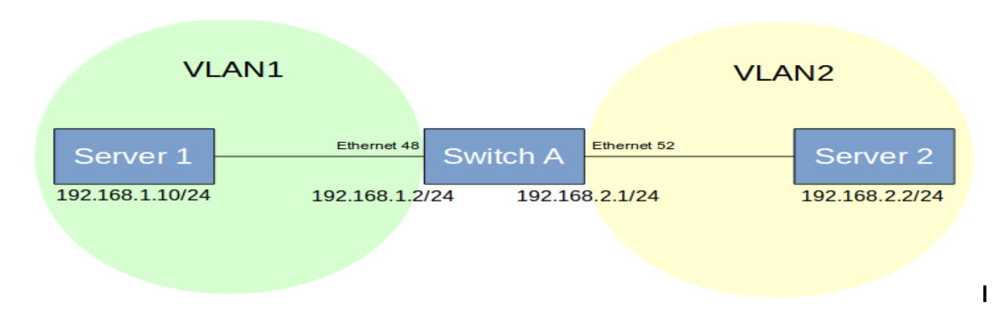

<style>
  table {
    border-collapse: collapse;
    table-layout: fixed;
    width: 100%;
  }

  th, td {
    border: 1px solid black;
    padding: 8px;
    text-align: left;
    vertical-align: top;
    word-wrap: break-word;
    width: 50%; 
  }
</style>

<table>
<tr>
    <th>CUMULUS</th>
    <th>SONiC</th>
</tr>
<tr><th colspan='2'>Port VLAN</th></tr>

<tr>
<td>
    <b># Create VLANs</b><br />
    <p>net add bridge bridge ports swp1-2</p>
    <p>net add bridge bridge vids 100,200</p>

    <b># Configure an Ethernet port to override the bridge VIDs</b><br />
    <p>net add bridge bridge ports swp1-3</p>
    <p>net add bridge bridge vids 100,200</p>
    <p>net add bridge bridge pvid 1</p>
    <p>net add interface swp3 bridge vids 200</p>

    <b># Command to add a primary VLAN nativeVLAN</b><br />
    <p>net add bridge bridge PVID 1</p>

    <b># Configure the new VLAN reserved range</b><br />
    <p>sudo cat /etc/cumulus/switchd.conf</p>
    <p>Resv_vlan_range 1 to 100</p>

    <b># Command to restart switch services</b><br />
    <p>sudo systemctl restart switchd.service</p>
</td>
<td>
    <b># Configure Interface Speed</b><br />
    <p>config interface speed Ethernet&lt;interface> &lt;speed></p>
    <p>config interface advertised-speeds Ethernet&lt;interface> &lt;speed></p>

    <b># Set Auto Negotiation for an Ethernet Interface</b><br />
    <p>config interface autoneg Ethernet&lt;interface> enable</p>

    <b># Show Auto Negotiation Status for an Ethernet Interface</b><br />
    <p>show interface autoneg status Ethernet0</p>

    <b># Show Operational Status of Interfaces</b><br />
    <p>show interface status</p>

    <b># Configure 4x10GE Breakout for a 40GE Port</b><br />
    <p>config interface breakout Ethernet1 '4x10G'</p>

    <b># Show Interface Breakout Options</b><br />
    <p>show interface breakout</p>

    <b># Configure FEC Mode of an Ethernet Interface</b><br />
    <p>config interface fec Ethernet&lt;interface> &lt;FEC_MODE></p>

    <b># Create VLANs</b><br />
    <p>config vlan add &lt;vlan_value1></p>
    <p>config vlan add &lt;vlan_value2></p>

    <b># Show VLAN Configuration</b><br />
    <p>show vlan config</p>

    <b># Add Interface to VLAN in Tagged (Trunk) Mode</b><br />
    <p>config vlan member add &lt;vlan_value1> Ethernet&lt;interface1></p>
    <p>config vlan member add &lt;vlan_value2> Ethernet&lt;interface2></p>

    <b># Add Interface to VLAN in Untagged (Access) Mode</b><br />
    <p>config vlan member add -u &lt;vlan_value1> Ethernet&lt;interface1></p>
    <p>config vlan member add -u &lt;vlan_value2> Ethernet&lt;interface2></p>

    <b># Show VLAN Information</b><br />
    <p>show vlan brief</p>
</td>
</tr>

<tr><td colspan='2'><b>LAG-</b> IEEE 802.3ad link aggregation mode that allows one or more links to be aggregated together to form a link aggregation group (LAG) so that a media access control (MAC) client can treat the group as if it were a single link. IEEE 802.3ad link aggregation is the default mode.
</td></tr>


<tr>
<td>
    <b># Create Dynamic LACP in an Aggregated Interface</b><br />
    <b># Syntax</b><br />
    The bond is configured by default in IEEE 802.3ad link aggregation mode - LACP<br />
    <p>net add bond [bond-name] bond slaves [slaves]</p>
    <p>net pending</p>

    <b># Example</b><br />
    <b># Command to create a bond called bond0 with 4 member link ports swp1, swp2, swp3, and swp4</b><br />
    <p>net add bond bond0 bond slaves swp1-4</p>
    <p>net pending</p>
    <p>net commit</p>

    <b># Change LACP Mode to balance-xor</b><br />
    <p>net add bond bond1 bond mode balance-xor</p>

    <b># Change LACP Mode to 802.3ad</b><br />
    <p>net add bond bond1 bond mode 802.3ad</p>

    <b># Command to Verify LACP LAG Information</b><br />
    <p>net show interface bond1</p>
</td>

<td>
<b># Create Port Channel</b><br />
<b># Syntax</b><br />
<p>config portchannel add PortChannel&lt;Channel1&gt;</p>

<b># Add Members to Port Channel</b><br />
<p>config portchannel add PortChannel&lt;Channel1&gt; Ethernet&lt;interface&gt;</p>

<b># Command to Verify Port Channel Interface</b><br />
<p>show interface portchannel</p>

<b># Command to Show VLAN Status</b><br />
<p>show vlan brief</p>

<b># Command to Show IP Interface Status</b><br />
<p>show ip interfaces</p>
<p>show interfaces status</p>

<b># Command to Create a PortChannel Interface and Set the Specific LACP Key</b><br />
<p>config portchannel add PortChannel&lt;Channel1&gt; --lacp-key &lt;Key-number&gt;</p>
<p>config portchannel member add PortChannel&lt;Channel1&gt; Ethernet&lt;interface&gt;</p>

<b># Command to Create a PortChannel Interface in Fast Rate Mode</b><br />
<p>config portchannel add PortChannel&lt;number&gt; --fast-rate true</p>

<b># Command to Create a PortChannel Interface in Static Mode</b><br />
<p>config portchannel add PortChannel&lt;interface&gt; --static true</p>

<b># Command to Add Member Ports to PortChannel Interface</b><br />
<p>config portchannel member add PortChannel&lt;number&gt; Ethernet&lt;interface1&gt;</p>
<p>config portchannel member add PortChannel&lt;number&gt; Ethernet&lt;interface2&gt;</p>

<b># Save the Setting to config_db.json</b><br />
<p>config save -y</p>

<b># Add Member Ports to PortChannel Interface</b><br />
<p>config portchannel member add PortChannel&lt;interface&gt; Ethernet&lt;interface1&gt;</p>
<p>config portchannel member add PortChannel&lt;interface&gt; Ethernet&lt;interface2&gt;</p>

<b># Command to Show Interface PortChannel</b><br />
<p>show interfaces portchannel</p>
</td>
</tr>
</table>


<style>
  table {
    border-collapse: collapse;
    table-layout: fixed;
    width: 100%;
  }

  th, td {
    border: 1px solid black;
    padding: 8px;
    text-align: left;
    vertical-align: top;
    word-wrap: break-word;
    width: 50%; 
  }

  th, [

  ]
</style>

<table>
<tr><th>CUMULUS</th><th>SONiC</th></tr>

<tr><th colspan='2'>FDB/MAC</th></tr>

<tr>
<td>
    <b># MAC Learning Configurations</b><br /><br />

    <b># Command to Show MAC Addresses of Bridge</b><br />
    <p>net show bridge macs</p>

    <b># Command to Set MAC Aging Address</b><br />
    <p>net add bridge bridge ageing 600</p>

    <b># Command to Show MAC Entries Learned and Filtered Based on Hostname, MAC Address, etc.</b><br />
    <!-- Add the relevant command here -->
</td>
<td>
    <b># Display the MAC (FDB) Entries</b><br />
    <p>show mac</p>

    <b># Display the MACs Learned on a Particular VLAN ID</b><br />
    <p>show mac -v &lt;vlan_value&gt;</p>

    <b># Display the MACs Learned on a Particular Port</b><br />
    <p>show mac -p Ethernet&lt;interface&gt;</p>

    <b># Clear the MAC (FBD) Table</b><br />
    <p>sonic-clear FDB all</p>
</td>
</tr>

</table>

<style>
  table {
    border-collapse: collapse;
    table-layout: fixed;
    width: 100%;
  }

  th, td {
    border: 1px solid black;
    padding: 8px;
    text-align: left;
    vertical-align: top;
    word-wrap: break-word;
    width: 50%; 
  }
</style>
<table>
<tr><th>CUMULUS</th><th>SONiC</th></tr>

<tr>
<td>
    <b># Syntax for Displaying MAC Entries</b><br />
    <p>netq show macs &lt;mac&gt; [vlan &lt;1-4096&gt;] [origin] [around &lt;text-time&gt;] [json]</p>

    <b># Syntax for Displaying MAC Entries on a Specific Host</b><br />
    <p>netq &lt;hostname&gt; show macs &lt;mac&gt; [vlan &lt;1-4096&gt;] [origin | count] [around &lt;text-time&gt;] [json]</p>

    <b># Syntax for Displaying MAC Entries on a Specific Egress Port</b><br />
    <p>netq &lt;hostname&gt; show macs egress-port &lt;egress-port&gt; &lt;mac&gt; [vlan &lt;1-4096&gt;] [origin] [around &lt;text-time&gt;] [json]</p>

    <b># Syntax for Displaying MAC History</b><br />
    <p>netq [&lt;hostname&gt;] show mac-history &lt;mac&gt; [vlan &lt;1-4096&gt;] [diff] [between &lt;text-time&gt; and &lt;text-endtime&gt;] [listby &lt;text-list-by&gt;] [json]</p>

    <b># Syntax for Displaying MAC Commentary</b><br />
    <p>netq [&lt;hostname&gt;] show mac-commentary &lt;mac&gt; vlan &lt;1-4096&gt; [between &lt;text-time&gt; and &lt;text-endtime&gt;] [json]</p>
</td>
<td>
    <b># Check MAC Aging Time</b><br />
    <p>show mac aging-time</p>
</td>
</tr>
</table>


### <b>Multi-Chassis Link Aggregation Group (MC-LAG)</b>

This is a pair of links that terminates on two cooperating switches and appears as an ordinary link aggregation group (LAG). 


#### <b>Layer 2 Multi Chassis LAG</b>

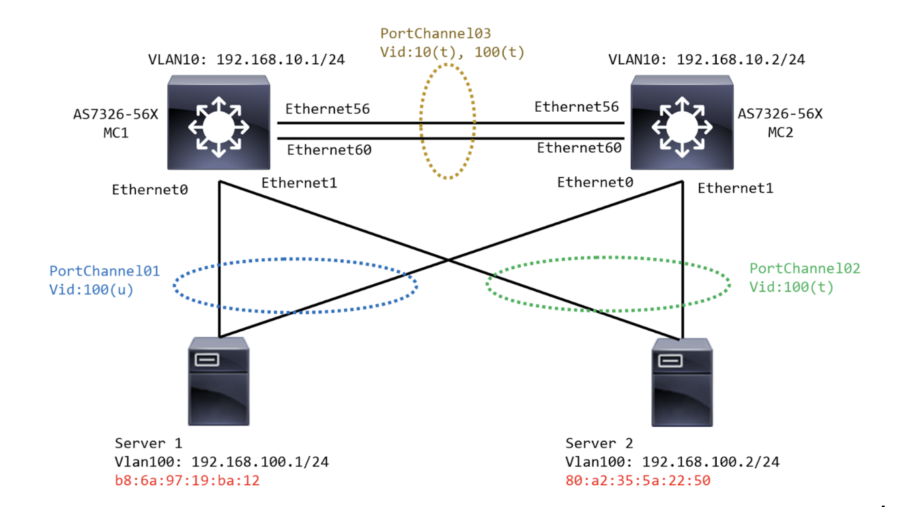

<style>
  table {
    border-collapse: collapse;
    table-layout: fixed;
    width: 100%;
  }

  th, td {
    border: 1px solid black;
    padding: 8px;
    text-align: left;
    vertical-align: top;
    word-wrap: break-word;
    width: 50%; 
  }
  th {
    color: white;
    background-color:  #3393F3;
  }
</style>

<table>
<tr>
<th><b>CUMULUS</b></th>
<th><b>SONiC</b></th>
</tr>

<tr>
<th colspan='2'><b>PortChannel (LACP) and Member </b></th>
</tr>

<tr>
<td>
    <b># Enable LACP</b><br />
    <p>net add bond bond1 bond mode 802.3ad</p>
    <p>net add bond bond2 bond mode 802.3ad</p>

    <b># Add Members</b><br />
    <p>net add bond bond1 bond slaves swp1-4</p>
    <p>net add bond bond2 bond slaves swp5-8</p>
</td>

<td>
    <b># Add Port Channel</b><br />
    <p>config port channel add &lt;PCH ID&gt;</p>

    <b># Add Members</b><br />
    <p>config port channel member add &lt;PCH-ID&gt; &lt;member-port&gt;</p>
</td>
</tr>

<tr><th colspan='2'><b>MC-LAG</b></th></tr>

<tr>
<td>
    <b># Command to add unique MLAG ID (clag-id) to each bond.</b><br />
    <p>net add bond bond1 clag id 1</p>
    <p>net add bond bond2 clag id 2</p>

    <b># Command to add the bonds to a bridge</b><br />
    <p>net add bridge bridge ports bond1,bond2</p>

    <b># Command to set peer link IP address</b><br />
    <p>net add clag peer sys-mac &lt;MAC_ADDRESS_SYSTEM&gt; interface &lt;interface_name&gt;1-4 primary backup-ip &lt;IP_ADDRESS&gt;</p>

    <b># Validate status of MC LAG config</b><br />
    <p>net show clag</p>

    <b># Verify all MCLAG settings</b><br />
    <p>clagctl params</p>

    <b># Monitor MCLAG services</b><br />
    <p>systemctl status clagd.service</p>
</td>
<td>
    <b># MCLAG Domain & Peer Configuration</b><br />
    <p>config interface ip add &lt;VLAN ID&gt; &lt;SVI-IP&gt;</p>
    <p>config mclag add &lt;mclag-id&gt; &lt;local-ip&gt; &lt;remote-ip&gt; &lt;peer-pch&gt;</p>
    <p>config mclag unique-ip add &lt;peer-vlan&gt;</p>

    <b># MCLAG Members</b><br />
    <p>config mclag member add &lt;mclag-id&gt; &lt;member-pch&gt;</p>

    <b># MCLAG Show</b><br />
    <p>show mclag brief</p>
    <p>Show mac</p>
</td>

</tr>

<tr><th colspan='2'><b>VLAN</b></th></tr>

<tr>
<td>
    <b># Add VLAN members to bridge</b><br />
    <p>net add bridge bridge ports &lt;INTERFACE_NAME&gt;1-2</p>
    <p>net add bridge bridge vids &lt;vlan-id1&gt;,&lt;vlan-id2&gt;</p>
</td>

<td>
    <b># VLAN Configuration</b><br />
    <p>config vlan add &lt;id&gt;</p>
    <p>config vlan member add &lt;vid&gt; &lt;pch-id&gt;</p>
</td>

</tr>
</table>


<b>SONiC Port Channel Configuration </b> <br />
<h4 style="color: black"><b>Creating port channel on the MCLAG pair switches running SONiC</b></h4>
```
config portchannel add PortChannel01
config portchannel add PortChannel02
config portchannel add PortChannel03
config portchannel member add PortChannel01 Ethernet0
config portchannel member add PortChannel02 Ethernet1
config portchannel member add PortChannel03 Ethernet56
config portchannel member add PortChannel03 Ethernet60
```

<h4>Creating VLAN interface on MC LAG pair switches running SONiC</h4>
```
config vlan add 10
config vlan add 100
config vlan member add 10 PortChannel03
config vlan member add -u 100 PortChannel01
config vlan member add 100 PortChannel02
config vlan member add 100 PortChannel03
```

<h4>Configure MCLAG pair switches with domain ID and child member links</h4>
```
config mclag add 1 192.168.10.1 192.168.10.2 PortChannel03
config mclag unique-ip add Vlan10
config mclag member add 1 PortChannel01
config mclag member add 1 PortChannel02
```

<h4>SONiC configuration for MC LAG peer health check </h4>
```
config interface ip add Vlan10 192.168.10.1/24
config interface ip add Vlan10 192.168.10.2/24
```

<h4>SONiC Command to Display MC LAG operationalstatus</h4>
```
 show mclag brief
```

<h4>SONiC command to show MAC address learned for host traffic through member link interfaces </h4>
```
show mac
No.    Vlan  MacAddress         Port           Type
-----  ------  -----------------  -------------  -------
    1      10  68:21:5F:29:C0:D2  PortChannel03  Static
    2     100  B8:6A:97:19:BA:12  PortChannel01  Dynamic
    3     100  80:A2:35:5A:22:50  PortChannel02  Dynamic
Total number of entries 3
```


#### Layer 3 Multi Chassis LAG 

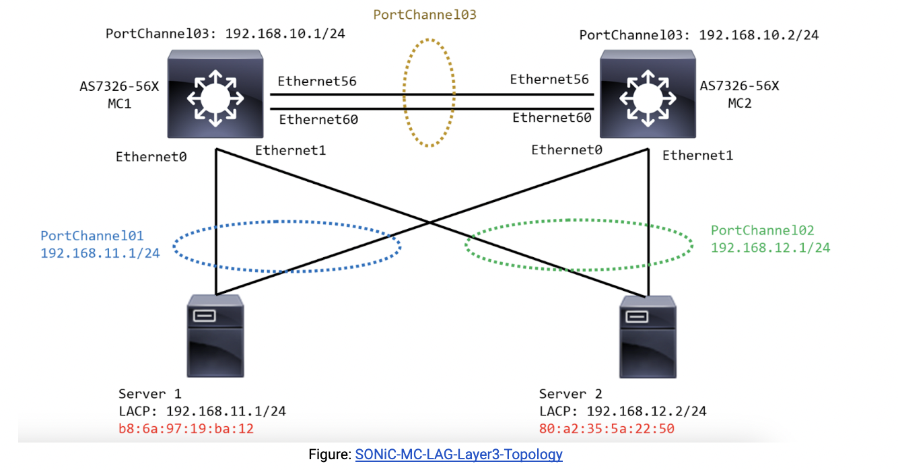

<h4>Command to create PortChannel on MC LAG Pair switches </h4>
```
config portchannel add PortChannel01
config portchannel add PortChannel02
config portchannel add PortChannel03
config portchannel member add PortChannel01 Ethernet0
config portchannel member add PortChannel02 Ethernet1
config portchannel member add PortChannel03 Ethernet56
config portchannel member add PortChannel03 Ethernet60

```

<h4>Commands to Create Port Channel IPs on MC LAG pair switches </h4>

```
config interface ip add PortChannel01 192.168.11.1/24
config interface ip add PortChannel02 192.168.12.1/24
config interface ip add PortChannel03 192.168.10.1/24

config interface ip add PortChannel01 192.168.11.1/24
config interface ip add PortChannel02 192.168.12.1/24
config interface ip add PortChannel03 192.168.10.2/24
```

<h4>Command to configure MCLAG on MC LAG pair switches  (Domain ID, VLANs and MLAG members)</h4>
```
config mclag add 1 192.168.10.2 192.168.10.1
config mclag member add 1 PortChannel01
config mclag member add 1 PortChannel02

config mclag add 1 192.168.10.1 192.168.10.2
config mclag member add 1 PortChannel01
config mclag member add 1 PortChannel02
```


<h4>SONiC command to Configure IP for MCLAG Peer health check on MC LAG peers</h4>
```
config interface ip add Vlan10 192.168.10.1/24
config interface ip add Vlan10 192.168.10.2/24
```

<h4>Command to show MCLAG Status</h4>
<b>MC1 switch configuration - </b>
```
show interfaces portchannel
Flags: A - active, I - inactive, Up - up, Dw - Down, N/A - not available,
       S - selected, D - deselected, * - not synced
  No.  Team Dev       Protocol     Ports                          Oper Key  Admin Key    Fast Rate
-----  -------------  -----------  ---------------------------  ----------  -----------  -----------
  01  PortChannel01  LACP(A)(Up)  Ethernet0(S)                       101  auto         false
  02  PortChannel02  LACP(A)(Up)  Ethernet1(S)                       102  auto         false
  03  PortChannel03  LACP(A)(Up)  Ethernet60(S) Ethernet56(S)        103  auto         false

show mclag brief  
       Domain ID                    : 1
        Role                         : Active
        Session Status               : Up
       Peer Link Status             :
        Source Address               : 192.168.10.1
        Peer Address                 : 192.168.10.2
        Peer Link                    :
       Keepalive Interval           : 1 secs
        Session Timeout              : 15 secs
        System MAC                   : 00:a0:c9:00:00:00
       Number of MCLAG Interfaces   : 2
        MCLAG Interface              Local/Remote Status
        PortChannel01                Up/Up
        PortChannel02                Up/Up
```


<b>MC2 switch configuration - </b>

```
admin@sonic:~$ show interfaces portchannel
Flags: A - active, I - inactive, Up - up, Dw - Down, N/A - not available,
       S - selected, D - deselected, * - not synced
  No.  Team Dev       Protocol     Ports                          Oper Key  Admin Key    Fast Rate
-----  -------------  -----------  ---------------------------  ----------  -----------  -----------
  01  PortChannel01  LACP(A)(Up)  Ethernet0(S)                       101  auto         false
  02  PortChannel02  LACP(A)(Up)  Ethernet1(S)                       102  auto         false
  03  PortChannel03  LACP(A)(Up)  Ethernet60(S) Ethernet56(S)        103  auto         false
admin@sonic:~$ show mclag brief  
       Domain ID                    : 1
        Role                         : Standby
        Session Status               : Up
        Peer Link Status             :
        Source Address               : 192.168.10.2
        Peer Address                 : 192.168.10.1
        Peer Link                    :
        Keepalive Interval           : 1 secs
        Session Timeout              : 15 secs
        System MAC                   : 00:a0:c9:00:00:00
        Number of MCLAG Interfaces   : 2
        MCLAG Interface              Local/Remote Status
        PortChannel01                Up/Up
        PortChannel02                Up/Up

```


<b>SONiC Command to verify ARP synchronization</b>
```
mclagdctl dump arp -i 1
No.   IP                  MAC                 DEV                 Flag
1     192.168.12.2        80:a2:35:5a:22:50   PortChannel02       R
2     192.168.11.2        b8:6a:97:19:ba:12   PortChannel01       L
```


<!-- #################################################### -->

### <b>Link Layer Discovery protocol</b>
LLDP is a standard link-layer discovery protocol which can broadcast its capability, IP address, ID, and interface name as TLVs (Type/Length/Value) in LLDP PDUs (Link Layer Discovery Protocol Data Units). 

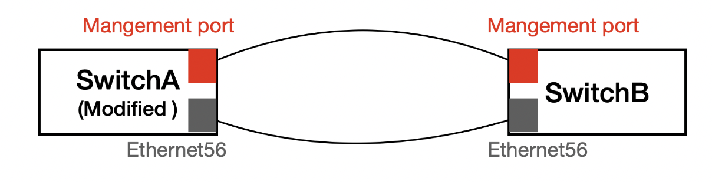

<table>
<tr>
<th>CUMULUS</th>
<th>SONiC</th>
</tr>

<tr>
<td>
<b># Command to Configure LLDP</b>

<p>sudo cat /etc/lldpd.conf</p>

<p>configure lldp tx-interval 40</p>

<p>configure lldp tx-hold 3</p>

<p>configure system interface pattern *,!eth0,swp*</p> <br />

<b># Command to Show All Neighbors on All Ports and Interfaces</b>

<p>sudo lldpcli show neighbors</p><br />

<b># Command to Show LLDP Statistics for All Ports</b>

<p>sudo lldpcli show statistics</p> <br />

<b># Command to Show LLDP Running Configuration</b>

<p>sudo lldpcli show running-configuration</p>
</td><br />

<td>
<b># Command to Enable / Disable LLDP globally</b>

<p>config feature state lldp enabled</p>

<p>config feature state lldp disabled</p> <br />

<b># Command to Configure LLDP information</b>

<p>config lldp global hello_timer &lt;timer_value&gt;</p>

<p>config lldp global management_ip &lt;switch_mgmt_ip&gt;</p>

<p>config lldp global system_description AS5835-Leaf1</p>

<p>config lldp global system_name &lt;LEAF1&gt;</p><br />

<b># Command to validate LLDP status</b>

<p>show feature status lldp</p>

<p>show lldp table</p>

<p>show lldp neighbors</p>

<p>show lldp global</p><br />

<b># Command to enable/disable LLDP over local interfaces</b>

<p>docker exec -i lldp lldpcli</p>

<p>configure ports Ethernet&lt;interface&gt; lldp status disable</p>

<p>configure ports Ethernet&lt;interface&gt; lldp status enable</p>< br /><br />
</td>
</tr>
</table>

## <b>Layer 3 Routing</b>

### <b>Routed Interface</b>
<table>
<tr>
<th ><b>CUMULUS</b></th>
<th><b>SONiC</b></th>
</tr>

<tr>
<td>
<b># Command to configure IP addresses for interface swp1</b>

<p>net add interface swp1 ip address &lt;IP_ADDRESS&gt;/&lt;SUBNET&gt;</p><br />

<b># Command to bring up an interface or apply changes to an existing interface</b>

<p>sudo ifup &lt;ifname&gt;</p><br />

<b># Command to bring down a single interface</b>
<p>sudo ifdown &lt;ifname&gt;</p><br />

<b># Checking the Configuration</b>

<p>net show interface &lt;INTERFACE_NAME&gt;</p>

<p>net show interface alias</p>

<b># Command to add a static route</b>

<p>net add routing route &lt;NETWORK_ROUTE&gt; &lt;NEXT_HOP&gt;</p>

<b># Command to delete a static route</b>

<p>net delete routing route &lt;NETWORK_ROUTE&gt;</p>

<b># Command to verify static routes</b>

<p>net show route static</p>
</td>

<td>
<b># Command to add a Layer 3 Interface address on a physical interface</b>

<p>config interface ip add Ethernet&lt;Number1&gt; &lt;IP_ADDRESS></p>

<p>config interface ip add &lt;vlan_number> &lt;IP_ADDRESS></p>

<b># Example</b>

<p>config interface ip add Loopback&lt;Number&gt; 10.0.2.1/32</p>

<p>config interface ip add Ethernet0 172.16.10.1/31</p>

<p>config interface ip add Vlan100 18.0.0.1/24</p>

<b># Command to create a sub-interface</b>

<p>config interface ip add Ethernet&lt;interface_number&gt;.&lt;vlan-id> &lt;IP_ADDRESS></p>

<b># Example</b>

<p>config interface ip add Ethernet0.10 192.168.10.2/24</p>

<b># Validate sub-interface operational status</b>

<p>show subinterfaces status</p>

<b># Command to add static routes</b>

<p>ip route &lt;Network_IP_ADDRESS> &lt;SUBNET_MASK> &lt;NEXTHOP></p>

<b># Command to delete a static route</b>

<p>no ip route &lt;Network_IP_ADDRESS> &lt;SUBNET_MASK></p>

<b># Command to verify static routes</b>

<p>show ip route</p>
</td>
</table>

### <b>SVI & DHCP Relay</b>

<table>
<tr>
<th><b>CUMULUS</b></th>
<th><b>SONiC</b></th>
</tr>


<tr>
<th colspan='2'>SVI</th>
</tr>

<tr>
<td>
    <b># Create VLAN ID</b>
    
    <p>net add bridge bridge ports &lt;interface_name&gt;1-2</p>
    
    <p>net add bridge bridge vids &lt;vlan-id1&gt;,&lt;vlan-id2&gt;</p>
    

    <b># Create an interface binded to Layer3 VLAN</b>
    
    <p>net add vlan &lt;VLAN-ID> vrf &lt;VRF_NAME></p>
    

    <b># Commands configure an SVI using swp1, swp2 ports and VLAN ID</b>
    
    <p>net add bridge bridge ports&lt;interface_name&gt;1-2</p>
    
    <p>net add vlan &lt;VLAN-ID> ip address &lt;IP_ADDRESS>/&lt;SUBNET></p>
    

    <b># Command to Bring up and Bring down Layer 3 interface</b>
    
    <p>net add interface swp1 link down</p>
    
    <p>net del interface swp1 link down</p>
    

    <b># Verify Layer3 interface</b>
    
    <p>net show interface swp1</p>
    

    <b># Verify IP routes</b>
    
    <p>ip route show</p>
</td>
<td>
    <b># Create VLANs</b>
    
    <p>config vlan add &lt;vlan_value1></p>
    
    <p>config vlan add &lt;vlan_value2></p>
    

    <b># Show VLAN configuration</b>
    
    <p>show vlan config</p>
    

    <b># Add Interface to VLAN in Tagged (Trunk) mode:</b>
    
    <p>config vlan member add &lt;vlan_value1> Ethernet&lt;interface1></p>
    
    <p>config vlan member add &lt;vlan_value2> Ethernet&lt;interface2></p>
    

    <b># Inter-VLAN routing</b>
    
    <b># Configure IP addresses on VLAN1 and VLAN2</b>
    
    <p>config interface ip add Vlan<number1> &lt;IP_ADDRESS1></p>
    
    <p>config interface ip add Vlan<number2> &lt;IP_ADDRESS2></p>
    

    <b># Example</b>
    
    <p>config interface ip add Vlan1 192.168.1.2/24</p>
    
    <p>config interface ip add Vlan2 192.168.2.1/24</p>
    

    <b># Validate IP Interface</b>
    
    <p>show ip interface</p>
    

    <b># Verify the Subinterface and VLAN status</b>
    
    <p>show vlan brief</p>
</td>
</tr>

<tr>
<th colspan='2'><b>DHCP Relay</b></th>
</tr>

<tr>
<td>
    <b># DHCP Relay Command</b>
    
    <b># Command to set DHCP server IP address, layer 3 VLAN, and relay interfaces</b>
    
    <p>net add dhcp relay interface &lt;relay_interface1></p>
    
    <p>net add dhcp relay interface &lt;relay_interface2></p>
    
    <p>net add dhcp relay interface vlan&lt;VLAN-ID></p>
    
    <p>net add dhcp relay server &lt;SERVER_IP></p>
    
    <p>net pending</p>
    
    <p>net commit</p>
    

    <b># Configure the IP address of the DHCP relay agent</b>
    
    <p>net add dhcp relay giaddr-interface &lt;AGENT_INTERFACE></p>
    

    <b># Command to allocate IP to relay Agent</b>
    
    <p>net add dhcp relay giaddr-interface &lt;interface_name> &lt;IP_ADDRESS></p>
</td>
<td>
    <b># SONiC Command to enable DHCP relay</b>
    
    <p>config feature state dhcp_relay enabled</p>
    

    <b># Enable DHCP relay on VLAN number</b>
    
    <p>config vlan dhcp_relay add &lt;vlan_number> &lt;IP_ADDRESS></p>
    

    <b># Enable DHCP relay on Loopback interface</b>
    
    <p>config vlan dhcp_relay src_intf add &lt;vlan_number> Loopback0</p>
    

    <b># Example</b>
    
    <p>config vlan dhcp_relay add 10 192.168.20.100</p>
    
    <p>config vlan dhcp_relay src_intf add 10 Loopback0</p>
</td>

</tr>
</table>


### <b>BGP Routing</b>

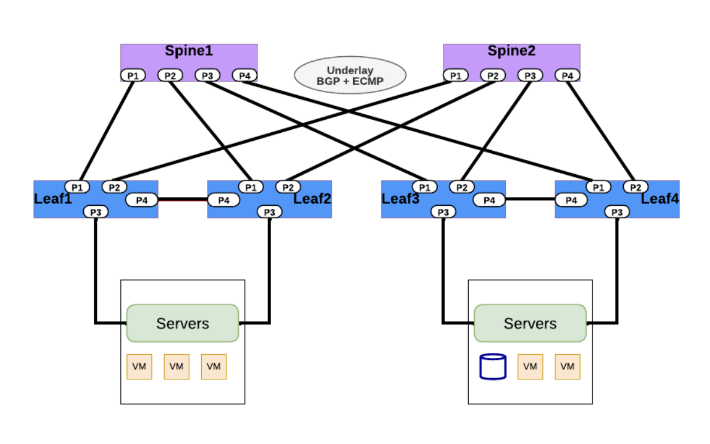

<table>
<tr>
<th><b>CUMULUS</b></th>
<th><b>SONiC</b></th>
</tr>

<tr>
<td>
    <b># Command to configure BGP routing</b>
    
    <b># Command to set BGP node by assigning an ASN</b>
    
    <p>net add bgp autonomous-system &lt;ASN_NUMBER></p>
    

    <b># Command to set auto BGP to assign an ASN automatically</b>
    
    <p>net add bgp auto leaf</p>
    

    <b># Command to assign Router-ID</b>
    
    <p>net add bgp router-id &lt;SYSTEM_LOOPBACK_IP></p>
    

    <b># Command to specify BGP neighbor</b>
    
    <p>net add bgp neighbor &lt;NEIGHBOR_IP_ADDRESS> remote-as external</p>
    

    <b># Command to advertise specifics using network</b>
    
    <p>net add bgp ipv4 unicast network &lt;LOOPBACK_IP></p>
    
    <p>net add bgp ipv4 unicast network &lt;NETWORK_IP_ADDRESS></p>
    

    <b># Example</b>
    
    <p>net add bgp autonomous-system 65101</p>
    
    <p>net add bgp router-id 10.10.10.1</p>
    
    <p>net add bgp neighbor 10.0.1.0 remote-as external</p>
    
    <p>net add bgp ipv4 unicast network 10.10.10.1/32</p>
    
    <p>net add bgp ipv4 unicast network 10.1.10.0/24</p>
    

    <b># Command to show BGP routes summary</b>
    
    <b># Syntax</b>
    
    <p>net show bgp summary</p>
    
    <p>net show bgp ipv4 unicast summary</p>
    
    <p>net show bgp ipv4 unicast</p>
    
    <p>net show bgp ipv4 unicast &lt;network_address></p>
    
    <p>net show bgp neighbor &lt;interface_name></p>
</td>
<td>
    <b># vtysh Sonic command to configure BGP routing</b>
    
    <p>router bgp &lt;ASN_NUMBER></p>
    
    <p>bgp router-id &lt;System_loopback_IP></p>
    
    <p>no bgp ebgp-requires-policy</p>
    
    <p>bgp bestpath as-path multipath-relax</p>
    
    <p>neighbor FABRIC peer-group</p>
    
    <p>neighbor FABRIC capability extended-nexthop</p>
    
    <p>neighbor &lt;Neighbor_IP> remote-as &lt;REMOTE_ASN_NUMBER></p>
    
    <p>neighbor &lt;Neighbor_IP> peer-group FABRIC</p>
    

    <b># Example BGP routing configuration</b>
    
    <p>router bgp 65001</p>
    
    <p>bgp router-id 10.0.2.1</p>
    
    <p>no bgp ebgp-requires-policy</p>
    
    <p>bgp bestpath as-path multipath-relax</p>
    
    <p>neighbor FABRIC peer-group</p>
    
    <p>neighbor FABRIC capability extended-nexthop</p>
    
    <p>neighbor 172.16.10.0 remote-as 2001</p>
    
    <p>neighbor 172.16.10.0 peer-group FABRIC</p>
    
    <p>neighbor 172.16.10.8 remote-as 2002</p>
    
    <p>neighbor 172.16.10.8 peer-group FABRIC</p>
    
    <p>neighbor 192.168.3.1 remote-as 2003</p>
    
    <p>neighbor 192.168.3.1 peer-group FABRIC</p>
    

    <b># Command to show BGP routes summary</b>
    
    <p>show ip bgp summary</p>
    
    <p>show ip bgp neighbors</p>
    
    <p>show ip bgp network</p>
    
    <p>show ipv6 bgp summary</p>
    
    <p>show ipv6 bgp neighbors</p>
    
    <p>show ipv6 bgp network</p>
</td>

</tr>

</table>


### <b>OSPF Routing</b>

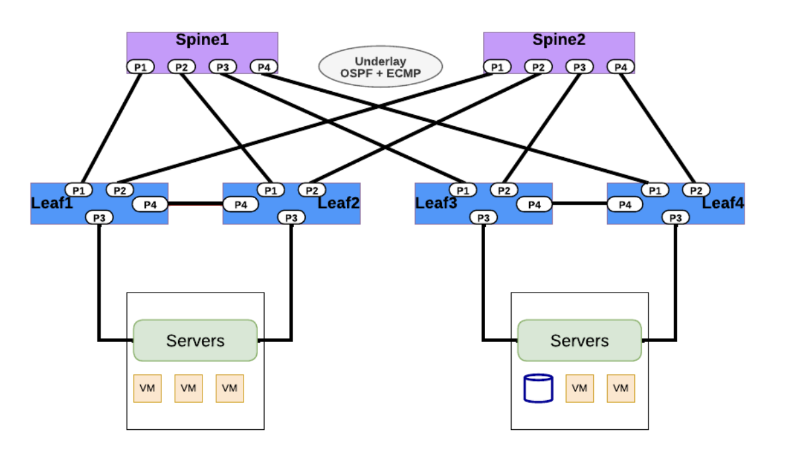

<table>
<tr>
<th><b>CUMULUS</b></th>
<th><b>SONiC</b></th>
</tr>

<tr>
<th colspan='2'><b>OSPF Routing</b></th>
</tr>

<tr>
<td>
    <b># Configure OSPF routing</b>
    
    <b># Configure the unnumbered interface</b>
    
    <p>net add loopback lo ip address &lt;system_loopback_ip></p>
    
    <p>net add interface &lt;interface_number> ip address &lt;ip_address></p>
    
    <p>net add ospf router-id &lt;system_loopback_ip></p>
    
    <p>net add ospf network &lt;network_address> area &lt;AREA_NUMBER></p>
    
    <p>net add ospf passive-interface &lt;interface_name1></p>
    
    <p>net add ospf passive-interface &lt;interface_name2></p>
    

    <b># Command to configure OSPF passive interface</b>
    
    <p>net add ospf passive-interface default</p>
    
    <p>net del ospf passive-interface &lt;interface_name></p>
    

    <b># Configure to set network type to point-to-point</b>
    
    <p>net add interface &lt;interface_name> ospf network point-to-point</p>
    
    <p>net add interface &lt;interface_name> ospf hello-interval &lt;hello-interval-time-secs></p>
    
    <p>net add interface &lt;interface_name> ospf dead-interval &lt;dead-interval-time-secs></p>
    

    <b># Configure OSPF interface with priority</b>
    
    <p>net add interface &lt;interface_name> ospf priority &lt;priority_number></p>
    
    <p>net add interface &lt;interface_name> ospf message-digest-key 1 md5 &lt;KEY_VALUE></p>
    
    <p>net add interface &lt;interface_name> ospf authentication message-digest</p>
    

    <b># Command to create a summary route for all the routes in a network address range in a specific area &lt;Area_number></b>
    
    <p>sudo vtysh</p>
    
    <p>router ospf</p>
    
    <p>area &lt;area_number> range &lt;network_address></p>
    

    <b># Command to verify OSPF neighbor</b>
    
    <p>net show ospf neighbor</p>
    
    <p>net show route ospf</p>
    

    <b># Example Configuration - OSPF Routing</b>
    
    <p>net add loopback lo ip address 10.10.10.1/32</p>
    
    <p>net add interface &lt;interface_name> ip address &lt;address_ip></p>
    
    <p>net add ospf router-id 10.10.10.1</p>
    
    <p>net add ospf network 10.10.10.1/32 area 0</p>
    
    <p>net add ospf network 10.0.1.0/31 area 0</p>
    
    <p>net add ospf passive-interface swp1</p>
    
    <p>net add ospf passive-interface swp2</p>
    

    <b># Configure the unnumbered interface</b>
    
    <p>net add loopback lo ip address 10.10.10.1/32</p>
    
    <p>net add interface swp51 ip address 10.10.10.1/32</p>
</td>

<td>
    <b># Configure OSPF routing</b>
    
    <b># Syntax</b>
    
    <p>router ospf</p>
    
    <p>ospf router-id &lt;router-id></p>
    
    <p>network &lt;Network_address> area &lt;Area_number></p>
    
    <p>network &lt;Network_address1> area &lt;Area_number1></p>
    
    <p>network &lt;Network_address2> area &lt;Area_number2></p>
    

    <b># Command to set OSPF time intervals</b>
    
    <p>interface Ethernet&lt;interface></p>
    
    <p>ip ospf hello-interval &lt;hello-interval-time-secs></p>
    
    <p>ip ospf dead-interval &lt;dead-interval-time-secs></p>
    
    <p>router ospf</p>
    
    <p>area &lt;aread_number> authentication</p>
    

    <b># Command to set OSPF authentication key</b>
    
    <p>interface Ethernet&lt;interface></p>
    
    <p>ip ospf authentication</p>
    
    <p>ip ospf authentication-key &lt;key></p>
    

    <b># Command to set OSPF MD5 Authentication</b>
    
    <p>router ospf</p>
    
    <p>area 0 authentication message-digest</p>
    
    <p>interface Ethernet&lt;interface></p>
    
    <p>ip ospf message-digest-key &lt;key> md5 &lt;key></p>
    

    <b># Command to configure OSPF Virtual links</b>
    
    <p>router ospf</p>
    
    <p>area &lt;area_number> virtual-link &lt;System_loopback></p>
    

    <b># Command to verify OSPF IP routes learned</b>
    
    <p>show ip route</p>
    

    <b># Configuration OSPF Routing - Example</b>
    
    <p>router ospf</p>
    
    <p>ospf router-id 1.1.1.1</p>
    
    <p>network 10.0.0.0/31 area 0</p>
    
    <p>network 192.168.10.0/24 area 0</p>
    
    <p>network 192.168.20.0/24 area 0</p>
    
    <p>network 192.168.30.0/24 area 0</p>
    

    <b># Enable OSPF hello timers under the interface - Example</b>
    
    <p>interface Ethernet56</p>
    
    <p>ip ospf hello-interval 20</p>
    
    <p>ip ospf dead-interval 20</p>
    

    <b># Enable OSPF Authentication globally - Example</b>
    
    <p>router ospf</p>
    
    <p>area 0 authentication</p>
    

    <b># Enable OSPF Authentication over the interface - Example</b>
    
    <p>interface Ethernet56</p>
    
    <p>ip ospf authentication</p>
    
    <p>ip ospf authentication-key 123</p>
    

    <b># Enable OSPF MD5 Key - Example</b>
    
    <p>router ospf</p>
    
    <p>area 0 authentication message-digest</p>
    
    <p>interface Ethernet56</p>
    
    <p>ip ospf message-digest-key 1 md5 123</p>
    

    <b># Verify IP routing Table - Example</b>
    
    <p>show ip route</p>
    

    <b># Configure OSPF virtual links - Example</b>
    
    <p>router ospf</p>
    
    <p>area 1 virtual-link 3.3.3.3</p>
    
    <p>router ospf</p>
    
    <p>area 1 virtual-link 2.2.2.2</p>
</td>

</tr>
</table>

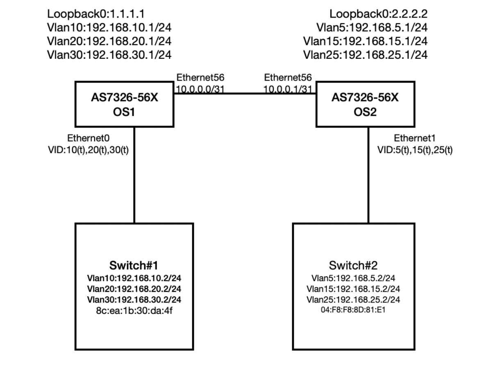

<b>AS7326-56X-OS1 Configuration</b>
<b>VLAN and IP Configuration</b>

```
config interface ip add Loopback0 1.1.1.1/32
config vlan member add 10 Ethernet0
config vlan member add 20 Ethernet0
config vlan member add 30 Ethernet0
config interface ip add Ethernet0.10 192.168.10.1/24
config interface ip add Ethernet0.20 192.168.20.1/24
config interface ip add Ethernet0.30 192.168.30.1/24
config interface ip add Ethernet56 10.0.0.0/31
```

<b>OSPF Configuration</b>

```
admin@sonic:~$ vtysh
sonic(config)# router ospf
sonic(config-router)# network 10.0.0.0/31 area 0
sonic(config-router)# network 192.168.10.0/24 area 0
sonic(config-router)# network 192.168.20.0/24 area 0
sonic(config-router)# network 192.168.30.0/24 area 0
```

<b>OSPF Routing Verification Command</b>

```
sonic# show ip ospf neighbor
Neighbor ID     Pri State           Dead Time Address         Interface            RXmtL RqstL DBsmL
192.168.25.1      1 Full/DR           31.440s 10.0.0.1        Ethernet56:10.0.0.0      0     0     0

sonic# show ip route
Codes: K - kernel route, C - connected, S - static, R - RIP,
       O - OSPF, I - IS-IS, B - BGP, E - EIGRP, N - NHRP,
       T - Table, v - VNC, V - VNC-Direct, A - Babel, D - SHARP,
       F - PBR, f - OpenFabric,
       > - selected route, * - FIB route, q - queued route, r - rejected route
K>* 0.0.0.0/0 [0/202] via 188.188.1.1, eth0, 00:07:45
C>* 1.1.1.1/32 is directly connected, Loopback0, 00:07:25
O   10.0.0.0/31 [110/10] is directly connected, Ethernet56, 00:06:42
C>* 10.0.0.0/31 is directly connected, Ethernet56, 00:07:25
C>* 188.188.0.0/16 is directly connected, eth0, 00:07:46
O>* 192.168.5.0/24 [110/20] via 10.0.0.1, Ethernet56, 00:06:32
O   192.168.10.0/24 [110/10] is directly connected, Vlan10, 00:04:54
C>* 192.168.10.0/24 is directly connected, Vlan10, 00:07:24
O>* 192.168.15.0/24 [110/20] via 10.0.0.1, Ethernet56, 00:06:32
O   192.168.20.0/24 [110/10] is directly connected, Vlan20, 00:04:50
C>* 192.168.20.0/24 is directly connected, Vlan20, 00:07:24
O>* 192.168.25.0/24 [110/20] via 10.0.0.1, Ethernet56, 00:06:32
O   192.168.30.0/24 [110/10] is directly connected, Vlan30, 00:04:47
C>* 192.168.30.0/24 is directly connected, Vlan30, 00:07:24
```


<b>AS7326-56X-OS2 Configuration</b>
<b>VLAN and IP Configuration</b>
```
config interface ip add Loopback0 2.2.2.2/32
config vlan member add 5 Ethernet0
config vlan member add 15 Ethernet0
config vlan member add 25 Ethernet0
config interface ip add Ethernet0.5 192.168.51/24
config interface ip add Ethernet0.15 192.168.15.1/24
config interface ip add Ethernet0.25 192.168.25.1/24
config interface ip add Ethernet56 10.0.0.1/31
```

<b>OSPF Configuration</b>
```
admin@sonic:~$ vtysh
sonic(config)# router ospf
sonic(config-router)# network 10.0.0.0/31 area 0
sonic(config-router)# network 192.168.5.0/24 area 0
sonic(config-router)# network 192.168.15.0/24 area 0
sonic(config-router)# network 192.168.25.0/24 area 0
```

<b>OSPF Routing Verification Command</b>
```
OS2:
sonic# show ip ospf neighbor
Neighbor ID     Pri State           Dead Time Address         Interface            RXmtL RqstL DBsmL
188.188.98.39     1 Full/Backup       33.721s 10.0.0.0        Ethernet56:10.0.0.1      0     0     0

sonic# show ip route
Codes: K - kernel route, C - connected, S - static, R - RIP,
       O - OSPF, I - IS-IS, B - BGP, E - EIGRP, N - NHRP,
       T - Table, v - VNC, V - VNC-Direct, A - Babel, D - SHARP,
       F - PBR, f - OpenFabric,
       > - selected route, * - FIB route, q - queued route, r - rejected route
K>* 0.0.0.0/0 [0/202] via 188.188.1.1, eth0, 02:15:38
C>* 2.2.2.2/32 is directly connected, Loopback0, 02:15:18
O   10.0.0.0/31 [110/10] is directly connected, Ethernet56, 00:08:47
C>* 10.0.0.0/31 is directly connected, Ethernet56, 00:08:47
C>* 188.188.0.0/16 is directly connected, eth0, 02:15:39
O   192.168.5.0/24 [110/10] is directly connected, Vlan5, 00:35:34
C>* 192.168.5.0/24 is directly connected, Vlan5, 00:35:34
O>* 192.168.10.0/24 [110/20] via 10.0.0.0, Ethernet56, 00:06:14
O   192.168.15.0/24 [110/10] is directly connected, Vlan15, 00:35:34
C>* 192.168.15.0/24 is directly connected, Vlan15, 00:35:34
O>* 192.168.20.0/24 [110/20] via 10.0.0.0, Ethernet56, 00:06:10
O   192.168.25.0/24 [110/10] is directly connected, Vlan25, 00:35:34
C>* 192.168.25.0/24 is directly connected, Vlan25, 00:35:34
O>* 192.168.30.0/24 [110/20] via 10.0.0.0, Ethernet56, 00:06:07
```


### <b>VRF Routing</b>

<table>
<tr>
<th><b>CUMULUS</b></th>
<th><b>SONiC</b></th>
</tr>

<tr>
<td>
    <b># Command to configure VRRP</b>
    
    <p>set ip routing enable true</p>
    
    <p>set ip vrf &lt;VRF-ID&gt; description “Description_value”</p>
    
    
    <b># Command to bind the Layer 3 VLAN interface to the VRF.</b>
    
    <p>set vlan-interface interface vlan&lt;vlan-id&gt; vrf &lt;VRF-ID&gt;</p>
    
    
    <b># Command to add a static route entry into the VRF.</b>
    
    <p>set protocols static vrf &lt;VRF-ID&gt;  route &lt;IPV4_address&gt;  next-hop &lt;IPV4_address&gt;</p>
    
    <p>set protocols static vrf &lt;VRF-ID&gt;  route &lt;IPV6_address&gt;  next-hop &lt;IPV6_address&gt;</p>
    
    
    <b># Command to validate and show VRF instances created</b>
    
    <p>run show vrf</p>

</td>
<td>
    <b># SONiC command to create a VRF</b>
    
    <p>config vrf add</p>
    
    <p>config vrf add &lt;vrf-name&gt;</p>
    
    <p>config vrf del &lt;vrf-name&gt;</p>
    
    <p>config vrf add_vrf_vni_map &lt;vrf-name&gt; &lt;vni&gt;</p>
    
    
    <b># Command to bind Layer 3 VLAN interface to the VRF</b>
    
    <p>config vrf add &lt;VRF-ID&gt;</p>
    
    <p>config vxlan add vtep &lt;VTEP_ENDPOINT_IP&gt;</p>
    
    <p>config vxlan evpn_nvo add evpnnvo vtep</p>
    
    <p>config vrf add_vrf_vni_map &lt;VRF-ID&gt; &lt;VNI_VALUE&gt;</p>
    
    
    <b># Command to unbind the Layer 3 VLAN interface from the VRF</b>
    
    <p>config vrf del_vrf_vni_map &lt;vrf-name&gt;</p>
    
    
    <b># Command to configure a static route entry into the VRF</b>
    
    <p>ip route &lt;A.B.C.D/M&gt; &lt;A.B.C.D&gt; nexthop-vrf &lt;vrf-name&gt;</p>
    
    
    <b># Command to import VRF table into the default routing table</b>
    
    <p>import vrf default</p>
    
    
    <b># Command to add BGP routing entry with VRF and import route leaking policy into VRF routing table</b>
    
    <p>router bgp &lt;AS_NUMBER&gt; vrf &lt;VRF-ID></p>
    
    <p>address-family ipv4 unicast</p>
    
    <p>router bgp &lt;AS_NUMBER> vrf &lt;VRF-ID></p>
    
    <p>address-family ipv4 unicast</p>
</td>
</tr>
</table>

<!-- ###################################################### -->

<b>SONIC - VRF Routing</b>
<b>Create VRF instance</b>

```
admin@sonic:~$ config vrf add Vrf_01
```
<b>Binding the Ethernet0 to VRF instance.</b>
```
admin@sonic:~$ config interface vrf bind Ethernet0 Vrf_01
```

<b> Checking the VRF</b>
```
admin@sonic:~$ show vrf
VRF 	Interfaces
------  ------------
Vrf_01  Ethernet0
admin@sonic:~$ show ip interfaces
Interface	Master	IPv4 address/mask	Admin/Oper	BGP Neighbor	Neighbor IP
-----------  --------  -------------------  ------------  --------------  -------------
Ethernet0	Vrf_01	192.168.1.1/24   	up/up   	N/A         	N/A
Loopback0          	10.1.0.1/32      	up/up     	N/A         	N/A
docker0     	       240.127.1.1/24   	up/down   	N/A         	N/A
eth0               	188.188.97.31/16 	up/up     	N/A         	N/A
lo                 	127.0.0.1/8      	up/up     	N/A         	N/A
```

<b>Checking the routing table.</b>
```
admin@sonic:~$ show ip route vrf Vrf_01
Codes: K - kernel route, C - connected, S - static, R - RIP,
   	O - OSPF, I - IS-IS, B - BGP, E - EIGRP, N - NHRP,
   	T - Table, v - VNC, V - VNC-Direct, A - Babel, D - SHARP,
   	F - PBR, f - OpenFabric,
   	> - selected route, * - FIB route, q - queued route, r - rejected route
VRF Vrf_01:
C>* 192.168.1.0/24 is directly connected, Ethernet0, 00:02:37
admin@sonic:~$ show ip route vrf all
Codes: K - kernel route, C - connected, S - static, R - RIP,
   	O - OSPF, I - IS-IS, B - BGP, E - EIGRP, N - NHRP,
   	T - Table, v - VNC, V - VNC-Direct, A - Babel, D - SHARP,
   	F - PBR, f - OpenFabric,
   	> - selected route, * - FIB route, q - queued route, r - rejected route
VRF Vrf_01:
C>* 192.168.1.0/24 is directly connected, Ethernet0, 00:00:31
Codes: K - kernel route, C - connected, S - static, R - RIP,
   	O - OSPF, I - IS-IS, B - BGP, E - EIGRP, N - NHRP,
   	T - Table, v - VNC, V - VNC-Direct, A - Babel, D - SHARP,
   	F - PBR, f - OpenFabric,
   	> - selected route, * - FIB route, q - queued route, r - rejected route
K>* 0.0.0.0/0 [0/202] via 188.188.1.1, eth0, 00:15:16
C>* 10.1.0.1/32 is directly connected, Loopback0, 00:15:16
C>* 188.188.0.0/16 is directly connected, eth0, 00:15:16
```

<b>Management VRF</b>
<b>Create Management VRF</b>
```
admin@sonic:~$ config vrf add mgmt
```
<b>Checking the Management VRF</b>
```
admin@sonic:~$ show mgmt-vrf
ManagementVRF : Enabled
Management VRF interfaces in Linux:
128: mgmt: <NOARP,MASTER,UP,LOWER_UP> mtu 65536 qdisc noqueue state UP mode DEFAULT group default qlen 1000
	link/ether 52:2f:cc:b8:28:b5 brd ff:ff:ff:ff:ff:ff promiscuity 0 minmtu 68 maxmtu 1500
	vrf table 5000 addrgenmode eui64 numtxqueues 1 numrxqueues 1 gso_max_size 65536 gso_max_segs 65535
2: eth0: <BROADCAST,MULTICAST,UP,LOWER_UP> mtu 1500 qdisc mq master mgmt state UP mode DEFAULT group default qlen 1000
	link/ether 80:a2:35:4f:4f:40 brd ff:ff:ff:ff:ff:ff
129: lo-m: <BROADCAST,NOARP,UP,LOWER_UP> mtu 1500 qdisc noqueue master mgmt state UNKNOWN mode DEFAULT group default qlen 1000
	link/ether 0a:25:2e:1f:32:90 brd ff:ff:ff:ff:ff:ff
admin@sonic:~$ show ip interfaces
Interface	Master	IPv4 address/mask	Admin/Oper	BGP Neighbor	Neighbor IP
-----------  --------  -------------------  ------------  --------------  -------------
Ethernet0	Vrf_01	192.168.1.1/24   	up/up     	N/A         	N/A
Loopback0          	10.1.0.1/32      	up/up     	N/A         	N/A
docker0            	240.127.1.1/24   	up/down   	N/A         	N/A
eth0     	mgmt  	188.188.97.31/16 	up/up     	N/A         	N/A
lo                 	127.0.0.1/8      	up/up     	N/A         	N/A
lo-m     	mgmt  	127.0.0.1/8      	up/up     	N/A     	    N/A
```
<b>Checking the routing table.</b>
```
admin@sonic:~$ show ip route vrf mgmt
Codes: K - kernel route, C - connected, S - static, R - RIP,
   	O - OSPF, I - IS-IS, B - BGP, E - EIGRP, N - NHRP,
   	T - Table, v - VNC, V - VNC-Direct, A - Babel, D - SHARP,
   	F - PBR, f - OpenFabric,
   	> - selected route, * - FIB route, q - queued route, r - rejected route
VRF mgmt:
K>* 0.0.0.0/0 [0/0] via 188.188.1.1, eth0, 00:12:12
C>* 188.188.0.0/16 is directly connected, eth0, 00:12:12
admin@sonic:~$ show ip route vrf all
Codes: K - kernel route, C - connected, S - static, R - RIP,
   	O - OSPF, I - IS-IS, B - BGP, E - EIGRP, N - NHRP,
   	T - Table, v - VNC, V - VNC-Direct, A - Babel, D - SHARP,
   	F - PBR, f - OpenFabric,
   	> - selected route, * - FIB route, q - queued route, r - rejected route
VRF Vrf_01:
C>* 192.168.1.0/24 is directly connected, Ethernet0, 00:01:04
Codes: K - kernel route, C - connected, S - static, R - RIP,
   	O - OSPF, I - IS-IS, B - BGP, E - EIGRP, N - NHRP,
   	T - Table, v - VNC, V - VNC-Direct, A - Babel, D - SHARP,
   	F - PBR, f - OpenFabric,
   	> - selected route, * - FIB route, q - queued route, r - rejected route
C>* 10.1.0.1/32 is directly connected, Loopback0, 00:01:05
Codes: K - kernel route, C - connected, S - static, R - RIP,
   	O - OSPF, I - IS-IS, B - BGP, E - EIGRP, N - NHRP,
   	T - Table, v - VNC, V - VNC-Direct, A - Babel, D - SHARP,
   	F - PBR, f - OpenFabric,
   	> - selected route, * - FIB route, q - queued route, r - rejected route
VRF mgmt:
K>* 0.0.0.0/0 [0/0] via 188.188.1.1, eth0, 00:01:21
C>* 188.188.0.0/16 is directly connected, eth0, 00:01:21
```

### <b>L2-VXLAN Asymmetric IRB Configuration</b>

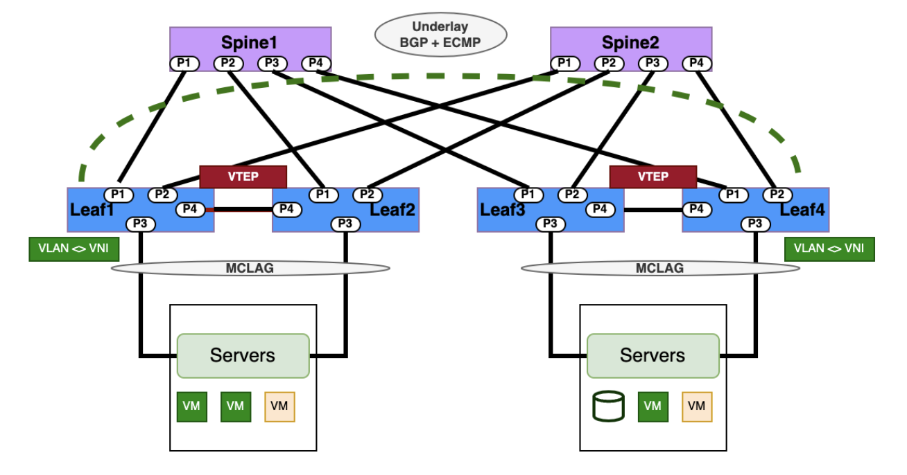

<table>
<tr>
<th><b>CUMULUS</b></th>
<th><b>SONiC</b></th>
</tr>

<tr>
<td>
    <b># Configure VLAN ID, L3 VLAN interfaces, loopback interfaces, and IP addressing.</b>

    <b># Syntax</b>
    <p>net add vlan &lt;VLAN-ID&gt; vrf &lt;VRF_NAME&gt;</p>

    <b># Command to create two unique VXLAN devices-</b>
    <p>net add interface &lt;interface_name1&gt; bridge access &lt;vlan1&gt;</p>
    <p>net add interface &lt;interface_name2&gt; bridge access &lt;vlan2&gt;</p>
    <p>net add vxlan vni&lt;number1&gt; vxlan id &lt;vlan1&gt;</p>
    <p>net add vxlan vni&lt;number2&gt; vxlan id &lt;vlan2&gt;</p>

    <b># Configure VXLAN VNI and map VNI IDs to VLAN IDs.</b>
    <p>net add bridge bridge ports  vni&lt;number1&gt;,vni&lt;number2&gt;</p>
    <p>net add bridge bridge vids &lt;vlan1&gt;,&lt;vlan2&gt;</p>
    <p>net add vxlan vni&lt;number1&gt; bridge access &lt;vlan1&gt;</p>
    <p>net add vxlan vni&lt;number2&gt; bridge access &lt;vlan2&gt;</p>

    <b># Command to configure VXLAN tunnels with local and remote VTEP tunnel IP</b>
    <p>net add loopback lo vxlan local-tunnelip &lt;local_ip&gt;</p>
    <p>net add vxlan vni-&lt;vni_value&gt;  vxlan remoteip &lt;remote_ip&gt;</p>

    <b># Configure and advertise BGP L2 EVPN Routes</b>
    <p>net add bgp autonomous-system &lt;ASN_NUMBER&gt;</p>
    <p>net add bgp l2vpn evpn neighbor &lt;NEIGHBOR_IP&gt; remote-as internal</p>
    <p>net add bgp l2vpn evpn neighbor &lt;NEIGHBOR_IP&gt;  activate</p>
    <p>net add bgp l2vpn evpn advertise-all-vni</p>

    <b># Command to show VXLAN traffic stats</b>
    <p>net show bgp l2vpn evpn summary</p>
    <p>net show bgp l2vpn evpn vni</p>
    <p>net show evpn vni</p>
    <p>net show evpn mac vni &lt;VNI_VALUE&gt;</p>
    <p>net show evpn mac vni all</p>
    <p>net show evpn next-hops vni all</p>
    <p>nv show nve vxlan</p>
</td>
<td>
    <b># Configure LoopBack, VLAN IDs, and IP addressing</b>

    <b># Syntax</b>
    <p>config vlan add &lt;VLAN-ID&gt;</p>
    <p>config vlan member add &lt;VLAN-ID&gt; Ethernet&lt;interface1&gt;</p>
    <p>config interface ip add Loopback0 &lt;SYSTEM_LOOPBACK&gt;</p>

    <b># Configure BGP routing</b>
    <p>router bgp &lt;LOCAL_AS_NUMBER&gt;</p>
    <p>bgp router-id &lt;SYSTEM_LOOPBACK&gt;</p>
    <p>neighbor &lt;ebgp_neighbor_ip> remote-as &lt;REMOTE_AS_NUMBER&gt;</p>
    <p>address-family ipv4</p>
    <p>network &lt;Network_prefix_advertised&gt;</p>

    <b># Configure VXLAN VNI and map VNI IDs to VLAN IDs</b>
    <p>config vxlan add vtep &lt;SOURCE_VTEP_IP&gt;</p>
    <p>config vxlan evpn_nvo add nvo vtep</p>
    <p>config vxlan map add vtep &lt;VLAN-ID> &lt;VNI_VALUE&gt;</p>
    <p>config vxlan add vtep &lt;DEST_VTEP_IP&gt;</p>
    <p>config vxlan evpn_nvo add nvo vtep</p>
    <p>config vxlan map add vtep &lt;VLAN-ID> &lt;VNI_VALUE&gt;</p>

    <b># Configure and advertise BGP L2 EVPN Routes</b>
    <p>router bgp &lt;LOCAL_AS_NUMBER&gt;</p>
    <p>address-family l2vpn evpn</p>
    <p>neighbor &lt;ebgp_neighbor_ip> activate</p>
    <p>Advertise-all-vni</p>

    <b># Show VXLAN tunnels, interfaces, and EVPN route details</b>
    <p>show ip route</p>
    <p>show vxlan interface</p>
    <p>show vxlan vlanvnimap</p>
    <p>show vxlan tunnel</p>
    <p>show vxlan remotevtep</p>
    <p>show evpn vni detail</p>
</td>
</tr>
</table>

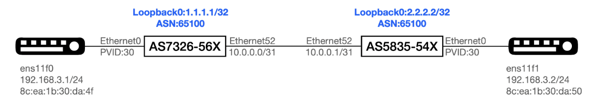

<b>Sample SONiC- L2VXLAN EVPN Asymmetric IRB </b>
<b>Step 1: Configure IP address to Loopback0 of both switches.</b>

<b>AS7326-56X:</b>
```
admin@AS7326-56X:~$ config interface ip remove Loopback0 10.1.0.1/32   
admin@AS7326-56X:~$ config interface ip add Loopback0 1.1.1.1/32
```

<b>AS5835-54X:</b>
```
admin@AS5835-54X:~$ config interface ip remove Loopback0 10.1.0.1/32   
admin@AS5835-54X:~$ config interface ip add Loopback0 2.2.2.2/32
```

<b>Step 2: Establish BGP Session between Ethernet52 and announce the network.</b>
<b>AS7326-56X:</b>
```
admin@AS7326-56X:~$ vtysh
Hello, this is FRRouting (version 7.2.1-sonic).
Copyright 1996-2005 Kunihiro Ishiguro, et al.
AS7326-56X# configure terminal
AS7326-56X(config)# router bgp 65100
AS7326-56X(config-router)# bgp router-id 1.1.1.1
AS7326-56X(config-router)# neighbor 10.0.0.1 remote-as 65100
AS7326-56X(config-router)# address-family ipv4
AS7326-56X(config-router-af)# network 1.1.1.1/32
AS7326-56X(config-router-af)# end
AS7326-56X# exit
AS5835-54X:
admin@AS5835-54X:~$ vtysh
Hello, this is FRRouting (version 7.2.1-sonic).
Copyright 1996-2005 Kunihiro Ishiguro, et al.
AS5835-54X# configure terminal
AS5835-54X(config)# router bgp 65100
AS5835-54X(config-router)# bgp router-id 2.2.2.2
AS5835-54X(config-router)# neighbor 10.0.0.0 remote-as 65100
AS5835-54X(config-router)# address-family ipv4
AS5835-54X(config-router-af)# network 2.2.2.2/32
AS5835-54X(config-router-af)# end
AS5835-54X# exit
```

<b>Step 3. Create Vxlan</b>
<b>AS7326-56X:</b>
```
admin@AS7326-56X:~$ config vxlan add vtep 1.1.1.1
admin@AS7326-56X:~$ config vxlan evpn_nvo add nvo vtep
admin@AS7326-56X:~$ config vxlan map add vtep 30 3000
```
<b>AS5835-54X:</b>
```
admin@AS5835-54X:~$ config vxlan add vtep 2.2.2.2
admin@AS5835-54X:~$ config vxlan evpn_nvo add nvo vtep
admin@AS5835-54X:~$ config vxlan map add vtep 30 3000
Note :
VNI (VxLAN Network Identifier) : virtual extension of VLAN over IP network.
VTEP (VXLAN Tunnel End Point) : an entity that originates and/or terminates VXLAN tunnels which is specified by a source IP address.
Only one VTEP is allowed on one device. Please use loopback IP address for VTEP's IP address.
NVO (Network Virtualization Overlay)
Only one NVO is allowed on one device.
VNI (VxLAN Network Identifier) : virtual extension of VLAN over IP network.
```

<b>Step 4: Advertise  L2VPN EVPN routes. </b>
<b>AS7326-56X:</b>
```
admin@AS7326-56X:~$ vtysh
Hello, this is FRRouting (version 7.2.1-sonic).
Copyright 1996-2005 Kunihiro Ishiguro, et al.
AS7326-56X#
AS7326-56X# configure terminal
AS7326-56X(config)# router bgp 65100
AS7326-56X(config-router)# address-family l2vpn evpn
AS7326-56X(config-router-af)# neighbor 10.0.0.1 activate
AS7326-56X(config-router-af)# advertise-all-vni
```
<b>AS5835-54X:</b>
```
admin@AS5835-54X:~$ vtysh
Hello, this is FRRouting (version 7.2.1-sonic).
AS5835-54X# 
AS5835-54X# configure terminal
AS5835-54X(config)# router bgp 65100
AS5835-54X(config-router)# address-family l2vpn evpn
AS5835-54X(config-router-af)# neighbor 10.0.0.0 activate
AS5835-54X(config-router-af)# advertise-all-vni
```

<b>Check VxLAN  interface configuration.AS7326-56X:</b>
```
admin@AS7326-56X:~$ show vxlan interface 
VTEP Information:
VTEP Name : vtep, SIP : 1.1.1.1
Source interface : Loopback0
AS5835-54X:
admin@AS5835-54X:~$ show vxlan interface 
VTEP Information:
VTEP Name : vtep, SIP : 2.2.2.2
Source interface : Loopback0
```

<b>Check vxlan and VLAN mapping.AS7326-56X:</b>
```
admin@AS7326-56X:~$ show vxlan vlanvnimap
+--------+-------+
| VLAN   |   VNI |
+========+=======+
| Vlan30 |  3000 |
+--------+-------+
Total count : 1
```

<b>AS5835-54X:</b>  
```
admin@AS5835-54X:~$ show vxlan vlanvnimap
+--------+-------+
| VLAN   |   VNI |
+========+=======+
| Vlan30 |  3000 |
+--------+-------+
Total count : 1
```

<b>Check the status for Vxlan tunneling. </b>
<b>AS7326-56X:(202111.3)</b>
```
admin@AS7326-56X:~$ show vxlan tunnel
vxlan tunnel name    source ip    destination ip    tunnel map name    tunnel map mapping(vni -> vlan)
-------------------  -----------  ----------------  -----------------  ---------------------------------
vtep                 1.1.1.1                       map_3000_Vlan30    3000 -> Vlan30
Total count : 1
```

<b>AS7326-56X:(202111.3)</b>
```
admin@AS7326-56X:~$ show vxlan remotevtep
+---------+---------+-------------------+--------------+
| SIP 	| DIP 	| Creation Source   | OperStatus   |
+=========+=========+===================+==============+
| 1.1.1.1 | 2.2.2.2 | EVPN          	| oper_up  	|
+---------+---------+-------------------+--------------+
Total count : 1
```

<b>AS5835-54X:(202111.3)</b>
```
admin@AS5835-54X:~$ show vxlan tunnel
vxlan tunnel name    source ip    destination ip    tunnel map name    tunnel map mapping(vni -> vlan)
-------------------  -----------  ----------------  -----------------  ---------------------------------
vtep                 2.2.2.2                      map_3000_Vlan30    3000 -> Vlan30
Total count : 1
```

<b>AS5835-54X:(202111.3)</b>
```
admin@AS5835-54X:~$ show vxlan remotevtep
| SIP 	| DIP 	| Creation Source   | OperStatus   |
+=========+=========+===================+==============+
| 2.2.2.2 | 1.1.1.1 | EVPN          	| oper_up  	|
+---------+---------+-------------------+--------------+
Total count : 1
```
 
<b>Check the Mac learning.</b>
<b>AS7326-56X:(202111.3)</b>


```
admin@AS7326-56X:~$ show mac
  No.	Vlan  MacAddress     	Port            	Type
-----  ------  -----------------  ------------------  -------
	1  	30  8C:EA:1B:30:DA:50  VxLAN DIP: 2.2.2.2  Static
	2  	30  8C:EA:1B:30:DA:4F  Ethernet0       	Dynamic
Total number of entries 2
```

<b>AS7326-56X(202111.3)</b>
```
admin@AS7326-56X:~$ show mac
  No.	Vlan  MacAddress     	Port   	Type
-----  ------  -----------------  ---------  -------
	1  	30  8C:EA:1B:30:DA:4F  Ethernet0  Dynamic
Total number of entries 1
admin@AS7326-56X:~$ show vxlan remotemac all
+--------+-------------------+--------------+-------+-------+---------+
| VLAN   | MAC           	| RemoteVTEP   | ESI   |   VNI | Type	|
+========+===================+==============+=======+=======+=========+
| Vlan30 | 8c:ea:1b:30:da:50 | 2.2.2.2  	|   	|  3000 | dynamic |
+--------+-------------------+--------------+-------+-------+---------+
Total count : 1
Note.
"8C:EA:1B:30:DA:50" is synced from remote vtep(2.2.2.2).
"8C:EA:1B:30:DA:4F" is learned locally.
```

<b>AS5835-54X:(202111.3)</b>
```
admin@AS5835-54X:~$ show mac
  No.	Vlan  MacAddress     	Port            	Type
-----  ------  -----------------  ------------------  -------
	1  	30  8C:EA:1B:30:DA:50  Ethernet0       	Dynamic
	2  	30  8C:EA:1B:30:DA:4F  VxLAN DIP: 1.1.1.1  Static
Total number of entries 2
```

<b>AS5835-54X:(202111.3)</b>
```
admin@AS5835-54X:~$ show mac
  No.	Vlan  MacAddress     	Port   	Type
-----  ------  -----------------  ---------  -------
	1  	30  8C:EA:1B:30:DA:50  Ethernet0  Dynamic
Total number of entries 1
admin@AS5835-54X:~$ show vxlan remotemac all
+--------+-------------------+--------------+-------+-------+---------+
| VLAN   | MAC           	| RemoteVTEP   | ESI   |   VNI | Type	|
+========+===================+==============+=======+=======+=========+
| Vlan30 | 8c:ea:1b:30:da:4f | 1.1.1.1  	|   	|  3000 | dynamic |
+--------+-------------------+--------------+-------+-------+---------+
Total count : 1
```
 
<b>Check IPv4 BGP session</b>
<b>AS7326-56X:</b>
```
AS7326-56X# show bgp ipv4 summary
IPv4 Unicast Summary:
BGP router identifier 1.1.1.1, local AS number 65100 vrf-id 0
BGP table version 6
RIB entries 3, using 552 bytes of memory
Peers 1, using 20 KiB of memory
Neighbor    	V     	AS MsgRcvd MsgSent   TblVer  InQ OutQ  Up/Down State/PfxRcd
10.0.0.1    	4  	65100  	80  	85    	0	0	0 01:01:28        	1
Total number of neighbors 1
```

<b>AS5835-54X:</b>
```
AS5835-54X# show bgp ipv4 summary
IPv4 Unicast Summary:
BGP router identifier 2.2.2.2, local AS number 65100 vrf-id 0
BGP table version 6
RIB entries 3, using 552 bytes of memory
Peers 1, using 20 KiB of memory
Neighbor    	V     	AS MsgRcvd MsgSent   TblVer  InQ OutQ  Up/Down State/PfxRcd
10.0.0.0    	4  	65100  	79  	79    	0	0	0 01:01:28        	1
Total number of neighbors 1
```

<b>Check L2EVPN BGP session</b>
<b>AS7326-56X:</b>
```
AS7326-56X# show bgp l2vpn evpn summary
BGP router identifier 1.1.1.1, local AS number 65100 vrf-id 0
BGP table version 0
RIB entries 3, using 552 bytes of memory
Peers 1, using 20 KiB of memory
Neighbor    	V     	AS MsgRcvd MsgSent   TblVer  InQ OutQ  Up/Down State/PfxRcd
10.0.0.1    	4  	65100  	82  	87    	0	0	0 01:03:43        	3
Total number of neighbors 1
AS5835-54X:
AS5835-54X# show bgp l2vpn evpn summary
BGP router identifier 2.2.2.2, local AS number 65100 vrf-id 0
BGP table version 0
RIB entries 3, using 552 bytes of memory
Peers 1, using 20 KiB of memory
Neighbor    	V     	AS MsgRcvd MsgSent   TblVer  InQ OutQ  Up/Down State/PfxRcd
10.0.0.0    	4  	65100  	81  	81    	0	0	0 01:03:43        	3
Total number of neighbors 1
```

<b>Check underlay routing</b>
<b>AS7326-56X:</b>


```
AS7326-56X# show ip route
Codes: K - kernel route, C - connected, S - static, R - RIP,
O - OSPF, I - IS-IS, B - BGP, E - EIGRP, N - NHRP,
T - Table, v - VNC, V - VNC-Direct, A - Babel, D - SHARP,
F - PBR, f - OpenFabric,
> - selected route, * - FIB route, q - queued route, r - rejected route
K>* 0.0.0.0/0 [0/202] via 188.188.1.1, eth0, 00:49:45
C>* 1.1.1.1/32 is directly connected, Loopback0, 00:49:14
B>* 2.2.2.2/32 [200/0] via 10.0.0.1, Ethernet52, 00:42:04
C>* 10.0.0.0/31 is directly connected, Ethernet52, 00:49:13
C>* 188.188.0.0/16 is directly connected, eth0, 00:49:45
```

<b>AS5835-54X:</b>


```
AS5835-54X# show ip route
Codes: K - kernel route, C - connected, S - static, R - RIP,
O - OSPF, I - IS-IS, B - BGP, E - EIGRP, N - NHRP,
T - Table, v - VNC, V - VNC-Direct, A - Babel, D - SHARP,
F - PBR, f - OpenFabric,
> - selected route, * - FIB route, q - queued route, r - rejected route
K>* 0.0.0.0/0 [0/0] via 188.188.1.1, eth0, 00:49:57
B>* 1.1.1.1/32 [200/0] via 10.0.0.0, Ethernet52, 00:42:25
C>* 2.2.2.2/32 is directly connected, Loopback0, 00:46:34
C>* 10.0.0.0/31 is directly connected, Ethernet52, 00:46:33
C>* 188.188.0.0/16 is directly connected, eth0, 00:49:57
```

<b>Check Vxlan VNI status</b>
<b>AS7326-56X:</b>
```
AS7326-56X# show evpn vni detail 
VNI: 3000
Type: L2
Tenant VRF: default
VxLAN interface: vtep-30
VxLAN ifIndex: 68
Local VTEP IP: 1.1.1.1
Mcast group: 0.0.0.0
Remote VTEPs for this VNI:
2.2.2.2 flood: HER
Number of MACs (local and remote) known for this VNI: 3
Number of ARPs (IPv4 and IPv6, local and remote) known for this VNI: 3
Advertise-gw-macip: No
```

<b>AS5835-54X:</b>
```
AS5835-54X# show evpn vni detail 
VNI: 3000
Type: L2
Tenant VRF: default
VxLAN interface: vtep-30
VxLAN ifIndex: 66
Local VTEP IP: 2.2.2.2
Mcast group: 0.0.0.0
Remote VTEPs for this VNI:
1.1.1.1 flood: HER
Number of MACs (local and remote) known for this VNI: 3
Number of ARPs (IPv4 and IPv6, local and remote) known for this VNI: 3
Advertise-gw-macip: No
```

<b>Check the evpn mac learning</b>
<b>AS7326-56X:</b>
```
AS7326-56X# show evpn mac vni all
VNI 3000 #MACs (local and remote) 3
MAC           	Type   Intf/Remote VTEP  	VLAN  Seq #'s
8c:ea:1b:30:da:50 remote 2.2.2.2                 	1/0
8c:ea:1b:30:da:4f local  Ethernet0         	30	0/0
```

<b>AS5835-54X:</b>
```
AS5835-54X# show evpn mac vni all
VNI 3000 #MACs (local and remote) 3MAC           	Type   Intf/Remote VTEP  	VLAN  Seq #'s
8c:ea:1b:30:da:50 local  Ethernet0         	30	0/0
8c:ea:1b:30:da:4f remote 1.1.1.1                 	1/0
```

<b>Check the type 2 EVPN route</b>
<b>AS7326-56X:</b>
```
AS7326-56X# show bgp l2vpn evpn route type macip 
BGP table version is 2, local router ID is 1.1.1.1
Status codes: s suppressed, d damped, h history, * valid, > best, i - internal
Origin codes: i - IGP, e - EGP, ? - incomplete
EVPN type-1 prefix: [1]:[EthTag]:[ESI]:[IPlen]:[VTEP-IP]
EVPN type-2 prefix: [2]:[EthTag]:[MAClen]:[MAC]:[IPlen]:[IP]
EVPN type-3 prefix: [3]:[EthTag]:[IPlen]:[OrigIP]
EVPN type-4 prefix: [4]:[ESI]:[IPlen]:[OrigIP]
EVPN type-5 prefix: [5]:[EthTag]:[IPlen]:[IP]
                   Network          Next Hop            Metric LocPrf Weight Path
            Extended Community
Route Distinguisher: 1.1.1.1:2
*> [2]:[0]:[48]:[8c:ea:1b:cc:10:a4]
                    1.1.1.1                            32768 i
                    ET:8 RT:65100:3000
Route Distinguisher: 2.2.2.2:2
*>i[2]:[0]:[48]:[80:a2:35:5a:22:50]
                    2.2.2.2                       100      0 i
                    RT:65100:3000 ET:8
Displayed 2 prefixes (2 paths) (of requested type)
```

<b>AS5835-54X:</b>
```
AS5835-54X# show bgp l2vpn evpn route type macip 
BGP table version is 2, local router ID is 2.2.2.2
Status codes: s suppressed, d damped, h history, * valid, > best, i - internal
Origin codes: i - IGP, e - EGP, ? - incomplete
EVPN type-1 prefix: [1]:[EthTag]:[ESI]:[IPlen]:[VTEP-IP]
EVPN type-2 prefix: [2]:[EthTag]:[MAClen]:[MAC]:[IPlen]:[IP]
EVPN type-3 prefix: [3]:[EthTag]:[IPlen]:[OrigIP]
EVPN type-4 prefix: [4]:[ESI]:[IPlen]:[OrigIP]
EVPN type-5 prefix: [5]:[EthTag]:[IPlen]:[IP]
   Network          Next Hop            Metric LocPrf Weight Path
                    Extended Community
Route Distinguisher: 1.1.1.1:2
*>i[2]:[0]:[48]:[8c:ea:1b:cc:10:a4]
                    1.1.1.1                       100      0 i
                    RT:65100:3000 ET:8
Route Distinguisher: 2.2.2.2:2
*> [2]:[0]:[48]:[80:a2:35:5a:22:50]
                    2.2.2.2                            32768 i
                    ET:8 RT:65100:3000
Displayed 2 prefixes (2 paths) (of requested type)
```

<b>Check the type 3 EVPN route</b>
<b>AS7326-56X:</b>


```
AS7326-56X# show bgp l2vpn evpn route type multicast 
BGP table version is 3, local router ID is 1.1.1.1
Status codes: s suppressed, d damped, h history, * valid, > best, i - internal
Origin codes: i - IGP, e - EGP, ? - incomplete
EVPN type-2 prefix: [2]:[EthTag]:[MAClen]:[MAC]:[IPlen]:[IP]
EVPN type-3 prefix: [3]:[EthTag]:[IPlen]:[OrigIP]
EVPN type-4 prefix: [4]:[ESI]:[IPlen]:[OrigIP]
EVPN type-5 prefix: [5]:[EthTag]:[IPlen]:[IP]
Network Next Hop Metric LocPrf Weight Path
Extended Community
Route Distinguisher: 1.1.1.1:2
*> [3]:[0]:[32]:[1.1.1.1]
1.1.1.1 32768 i
ET:8 RT:65100:3000
Route Distinguisher: 2.2.2.2:2
*>i[3]:[0]:[32]:[2.2.2.2]
2.2.2.2 100 0 i
RT:65100:3000 ET:8
Displayed 2 prefixes (2 paths) (of requested type)
```

<b>AS5835-54X:</b>
```
AS5835-54X# show bgp l2vpn evpn route type multicast 
BGP table version is 3, local router ID is 2.2.2.2
Status codes: s suppressed, d damped, h history, * valid, > best, i - internal
Origin codes: i - IGP, e - EGP, ? - incomplete
EVPN type-2 prefix: [2]:[EthTag]:[MAClen]:[MAC]:[IPlen]:[IP]
EVPN type-3 prefix: [3]:[EthTag]:[IPlen]:[OrigIP]
EVPN type-4 prefix: [4]:[ESI]:[IPlen]:[OrigIP]
EVPN type-5 prefix: [5]:[EthTag]:[IPlen]:[IP]
Network Next Hop Metric LocPrf Weight Path
Extended Community
Route Distinguisher: 1.1.1.1:2
*>i[3]:[0]:[32]:[1.1.1.1]
1.1.1.1 100 0 i
RT:65100:3000 ET:8
Route Distinguisher: 2.2.2.2:2
*> [3]:[0]:[32]:[2.2.2.2]
2.2.2.2 32768 i
ET:8 RT:65100:3000
```


### <b>L3-VXLAN Symmetric IRB Configuration</b>

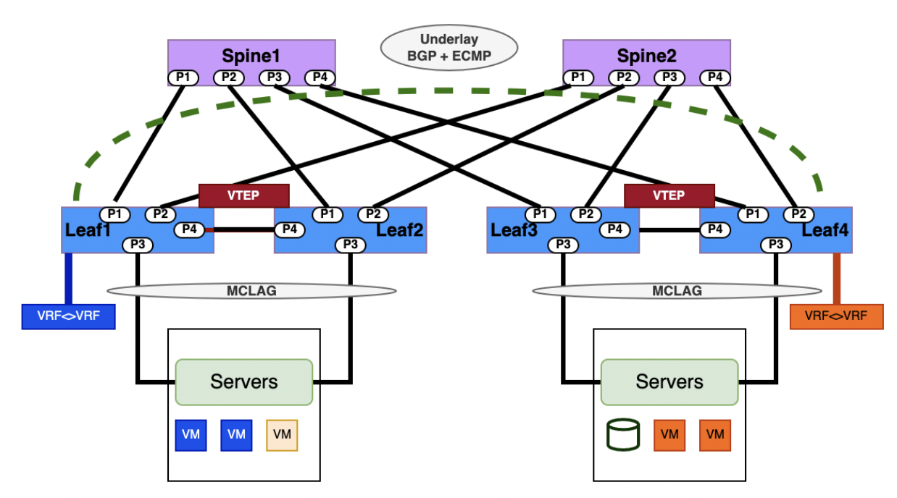

<table>
<tr>
<th><b>CUMULUS</b></th>
<th><b>SONiC</b></th>
</tr>

<tr>
<td>
    <b># Configure physical interfaces, VLAN interfaces, and assign VLAN IDs and IP addresses</b>

    <p>net add vlan &lt;VLAN-ID&gt; vrf &lt;VRF_NAME&gt;</p>

    <b># Create an L3 VNI in vrf1.</b>
    <b># Configure a Per-tenant VXLAN Interface</b>
    <p>net add vxlan vni-&lt;VNI_NUMBER&gt; vxlan id &lt;VLAN-ID&gt;</p>
    <p>net add vxlan vni-&lt;VNI_NUMBER&gt; bridge access &lt;VLAN-ID&gt;</p>
    <p>net add vxlan vni-&lt;VNI_NUMBER&gt; vxlan local-tunnelip &lt;LOCAL_IP&gt;</p>
    <p>net add vxlan vni-&lt;VNI_NUMBER&gt; vxlan remoteip &lt;REMOTE_IP&gt;</p>
    <p>net add bridge bridge ports vni&lt;VNI_NUMBER&gt;</p>

    <b># Configure an SVI for the Layer 3 VNI</b>
    <p>net add vlan &lt;VLAN-ID> vrf &lt;VRF_NAME></p>

    <b># Configure the VRF to Layer 3 VNI Mapping</b>
    <p>net add vrf &lt;VRF_NAME> vni&lt;VNI_NUMBER></p>

    <b># Configure and BGP EVPN routes</b>
    <p>net add bgp vrf &lt;VRF_NAME> l2vpn evpn advertise ipv4 unicast</p>

    <b># Configure and advertise BGP L2 EVPN Routes</b>
    <p>net add bgp autonomous-system &lt;ASN_NUMBER></p>
    <p>net add bgp l2vpn evpn neighbor &lt;NEIGHBOR_IP> remote-as internal</p>
    <p>net add bgp l2vpn evpn neighbor  &lt;NEIGHBOR_IP>  activate</p>
    <p>net add bgp l2vpn evpn advertise-all-vni</p>

    <b># VTYSH command for BGP L2VPN EVPN command</b>
    <p>router bgp &lt;ASN_NUMBER> vrf &lt;VRF_NAME></p>
    <p>address-family l2vpn evpn</p>
    <p>advertise ipv4 unicast</p>

    <b># Command to show BGP L2VPN EVPN VNI routes</b>
    <b># NCLU Command</b>
    <p>net show bgp l2vpn evpn vni &lt;VNI_NUMBER></p>

    <b># VTYSH shell command</b>
    <p>sudo vtysh</p>
    <p>show bgp l2vpn evpn route</p>
    <p>net show bgp vrf &lt;VRF_NAME> ipv4 unicast</p>

    <b># Command to show VXLAN traffic stats</b>
    <p>net show bgp l2vpn evpn summary</p>
    <p>net show bgp l2vpn evpn vni</p>
    <p>net show evpn vni</p>
    <p>net show evpn mac vni &lt;VNI_VALUE></p>
    <p>net show evpn mac vni all</p>
    <p>net show evpn next-hops vni all</p>
    <p>nv show nve vxlan</p>
</td>

<td>
    <b># Configure physical interfaces, VLAN interfaces, and assign VLAN IDs and IP addresses</b>

    <p>config interface ip add Loopback0 &lt;SYSTEM_LOOPBACK&gt;</p>

    <b># Configure VRF Setting</b>
    <p>config vrf add &lt;VRF-NAME&gt;</p>
    <p>config interface vrf bind VLAN&lt;VLAN_NUMBER&gt; &lt;VRF-NAME&gt;</p>
    <p>config interface ip add VLAN&lt;VLAN_NUMBER> &lt;IP_ADDRESS&gt;</p>

    <b># Create VxLAN and map VNI to VLAN</b>
    <p>config vxlan add vtep &lt;SOURCE_VTEP_IP&gt;</p>
    <p>config vxlan evpn_nvo add nvo vtep</p>
    <p>config vxlan map add vtep &lt;VLAN-ID> &lt;VNI_VALUE&gt;</p>
    <p>config save -y</p>

    <b># Configure layer3 VNI and map it to VRF value</b>
    <p>config vrf add_vrf_vni_map &lt;VRF-NAME> &lt;VNI_VALUE></p>
    <p>config save -y</p>

    <b># Establish a BGP environment for EVPN</b>
    <b># vtysh command</b>
    <p>router bgp &lt;LOCAL_AS_NUMBER></p>
    <p>neighbor &lt;ebgp_neighbor_ip> remote-as &lt;REMOTE_AS_NUMBER></p>
    <p>address-family ipv4 unicast</p>
    <p>network &lt;PREFIX_ADVERTISED></p>
    <p>exit</p>
    <p>address-family l2vpn evpn</p>
    <p>neighbor &lt;ebgp_neighbor_ip> activate</p>
    <p>advertise-all-vni</p>
    <p>end</p>

    <b># Configure VRF and VNI values</b>
    <p>configure terminal</p>
    <p>vrf &lt;VRF-NAME></p>
    <p>vni &lt;VNI_VALUE></p>

    <b># Configure BGP routing and advertise EVPN routes</b>
    <p>router bgp &lt;LOCAL_AS_NUMBER>  vrf &lt;VRF-NAME></p>
    <p>address-family ipv4 unicast</p>
    <p>redistribute connected</p>
    <p>address-family l2vpn evpn</p>
    <p>advertise ipv4 unicast</p>
    <p>write</p>

    <b># Commands to verify VXLAN tunnels</b>
    <p>show vxlan interface</p>
    <p>show vxlan vlanvnimap</p>
    <p>show vxlan tunnel</p>
    <p>show vxlan remotevtep</p>

    <b># Commands to verify EVPN routes and BGP routes</b>
    <p>show evpn vni detail</p>
    <p>show bgp summary</p>
    <p>show ip route vrf all</p>
</td> 
</tr>
</table>

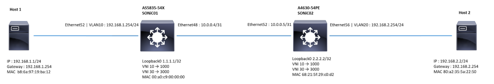

<b>Sample SONiC L3-VXLAN EVPN Symmetric IRB Example</b>

<b> Configure IP address and  Loopback IPs of both switches.</b>

```
AS5835-54X
admin@SONIC01:~$ config interface ip add Loopback0 1.1.1.1/32
admin@SONIC01:~$ config interface ip add Ethernet48 10.0.0.4/31

A4630-54PE
admin@SONIC02:~$ config interface ip add Loopback0 2.2.2.2/32
admin@SONIC02:~$ config interface ip add Ethernet52 10.0.0.5/31
```

<b> Configure VRF Setting</b>
```
AS5835-54X
admin@SONIC01:~$ config vrf add Vrf01                                                           
admin@SONIC01:~$ config interface vrf bind Vlan30 Vrf01                                          
admin@SONIC01:~$ config interface vrf bind Vlan10 Vrf01                                          
admin@SONIC01:~$ config interface ip add Vlan10 192.168.1.254/24                            

A4630-54PE
admin@SONIC02:~$ config vrf add Vrf01                                                             
admin@SONIC02:~$ config interface vrf bind Vlan30 Vrf01                                         
admin@SONIC02:~$ config interface vrf bind Vlan20 Vrf01                                           
admin@SONIC02:~$ config interface ip add Vlan20 192.168.2.254/24  
```                                

<b>Establish BGP Session between Ethernet48 and Ethernet52  </b>
```
AS5835-54X
admin@SONIC01:~$ vtysh                                                                                 
sonic# configure terminal
sonic(config)# router bgp 65100                                                                        
sonic(config-router)# neighbor 10.0.0.5 remote-as 65100                                      
sonic(config-router)# address-family ipv4 unicast                                       
sonic(config-router-af)# network 1.1.1.1/32                                                 
sonic(config-router-af)# exit
sonic(config-router)# address-family l2vpn evpn                                          
sonic(config-router-af)# neighbor 10.0.0.5 activate                                      
sonic(config-router-af)# advertise-all-vni                                                      
sonic(config-router-af)# end

sonic# configure terminal                                                                              
sonic(config)# vrf Vrf01                                                                                 
sonic(config-vrf)# vni 3000                                                                            
sonic(config-vrf)# end
sonic# configure terminal 
sonic(config)# router bgp 65100 vrf Vrf01                                                      
sonic(config-router)# address-family ipv4 unicast                                        
sonic(config-router-af)# redistribute connected                                           
sonic(config-router-af)# exit
sonic(config-router)# address-family l2vpn evpn                                          
sonic(config-router-af)# advertise ipv4 unicast                                              
sonic(config-router-af)# end
sonic# write

A4630-54PE
admin@SONIC02:~$ vtysh                                                                                 
sonic# configure terminal
sonic(config)# router bgp 65100                                                                   
sonic(config-router)# neighbor 10.0.0.4 remote-as 65100             
sonic(config-router)# address-family ipv4 unicast                                       
sonic(config-router-af)# network 2.2.2.2/32                                                 
sonic(config-router-af)# exit
sonic(config-router)# address-family l2vpn evpn                                          
sonic(config-router-af)# neighbor 10.0.0.4 activate                                      
sonic(config-router-af)# advertise-all-vni                                                      
sonic(config-router-af)# end
sonic# configure terminal                                                                              
sonic(config)# vrf Vrf01                                                                                 
sonic(config-vrf)# vni 3000                                                                            
sonic(config-vrf)# end
sonic# configure terminal 
sonic(config)# router bgp 65100 vrf Vrf01                                                     
sonic(config-router)# address-family ipv4 unicast                                        
sonic(config-router-af)# redistribute connected                                           
sonic(config-router-af)# exit
sonic(config-router)# address-family l2vpn evpn                                          
sonic(config-router-af)# advertise ipv4 unicast                                              
sonic(config-router-af)# end
sonic# write
```

<b> Create Vxlan</b>
```
AS5835-54X
```

<b> configuring VTEP_name (vtep) and its IP address </b>

```
admin@SONIC01:~$ config vxlan add vtep 1.1.1.1  
```

<b> create nvo_name (nvo) and bind it to VTEP_name (vtep)</b>
```
admin@SONIC01:~$ config vxlan evpn_nvo add nvo vtep  
```    

<b> Command to map VXLAN VNI to VLAN   </b>
```                                     
admin@SONIC01:~$ config vxlan map add vtep 10 1000                                                
admin@SONIC01:~$ config vxlan map add vtep 30 3000                                               
admin@SONIC01:~$ config save -y
```

<b> A4630-54PE</b>
<b> configuring VTEP_name (vtep) and its IP address </b>
```
admin@SONIC02:~$ config vxlan add vtep 2.2.2.2 
```    

<b>create nvo_name (nvo) and bind it to VTEP_name (vtep)</b>

```
admin@SONIC02:~$ config vxlan evpn_nvo add nvo vtep
```   

<b>Command to map VXLAN VNI to VLAN </b>

```
admin@SONIC02:~$ config vxlan map add vtep 20 2000                                                
admin@SONIC02:~$ config vxlan map add vtep 30 3000                                               
admin@SONIC02:~$ config save -y
```     

<b>Configure the  layer3 VNI on both switches.</b>
<b>AS5835-54X</b>
```
admin@SONIC01:~$ config vrf add_vrf_vni_map Vrf01 3000
```         

<b>A4630-54PE</b>
```
admin@SONIC01:~$ config vrf add_vrf_vni_map Vrf01 3000            
```

<b>Verify  EVPN-VNI Route Status </b>
```
AS5835-54X
sonic# show evpn vni detail
VNI: 1000
 Type: L2
 Tenant VRF: Vrf01
 VxLAN interface: vtep-10
 VxLAN ifIndex: 67
 SVI interface: Vlan10
 SVI ifIndex: 9
 Local VTEP IP: 1.1.1.1
 Mcast group: 0.0.0.0
 No remote VTEPs known for this VNI
 Number of MACs (local and remote) known for this VNI: 1
 Number of ARPs (IPv4 and IPv6, local and remote) known for this VNI: 1
 Advertise-gw-macip: No
 Advertise-svi-macip: No
VNI: 3000
  Type: L3
  Tenant VRF: Vrf01
  Local Vtep Ip: 1.1.1.1
  Vxlan-Intf: vtep-30
  SVI-If: Vlan30
  State: Up
  VNI Filter: none
  System MAC: 00:a0:c9:00:00:00
  Router MAC: 00:a0:c9:00:00:00
  L2 VNIs: 1000
```

<b> A4630-54PE</b>
```
sonic# show evpn vni detail
VNI: 2000
 Type: L2
 Tenant VRF: Vrf01
 VxLAN interface: vtep-20
 VxLAN ifIndex: 78
 SVI interface: Vlan20
 SVI ifIndex: 76
 Local VTEP IP: 2.2.2.2
 Mcast group: 0.0.0.0
 No remote VTEPs known for this VNI
 Number of MACs (local and remote) known for this VNI: 1
 Number of ARPs (IPv4 and IPv6, local and remote) known for this VNI: 1
 Advertise-gw-macip: No
 Advertise-svi-macip: No
VNI: 3000
  Type: L3
  Tenant VRF: Vrf01
  Local Vtep Ip: 2.2.2.2
  Vxlan-Intf: vtep-30
  SVI-If: Vlan30
  State: Up
  VNI Filter: none
  System MAC: 68:21:5f:29:c0:d2
  Router MAC: 68:21:5f:29:c0:d2
  L2 VNIs: 2000
```


<b>Verify BGP Route Summary</b>

<b>AS5835-54X</b>
```
sonic# show bgp summary
IPv4 Unicast Summary (VRF default):
BGP router identifier 188.188.9.14, local AS number 65100 vrf-id 0
BGP table version 17
RIB entries 3, using 552 bytes of memory
Peers 1, using 723 KiB of memory
Neighbor        V         AS   MsgRcvd   MsgSent   TblVer  InQ OutQ  Up/Down State/PfxRcd   PfxSnt Desc
10.0.0.5        4      65100      1436      1449        0    0    0 03:02:18            1        1 N/A
Total number of neighbors 1
L2VPN EVPN Summary (VRF default):
BGP router identifier 188.188.9.14, local AS number 65100 vrf-id 0
BGP table version 0
RIB entries 27, using 4968 bytes of memory
Peers 1, using 723 KiB of memory
Neighbor        V         AS   MsgRcvd   MsgSent   TblVer  InQ OutQ  Up/Down State/PfxRcd   PfxSnt Desc
10.0.0.5        4      65100      1436      1449        0    0    0 03:02:18            4        4 N/A
Total number of neighbors 1
```

<b>A4630-54PE</b>
```
sonic# show bgp summary
IPv4 Unicast Summary (VRF default):
BGP router identifier 188.188.9.6, local AS number 65100 vrf-id 0
BGP table version 8
RIB entries 3, using 552 bytes of memory
Peers 1, using 723 KiB of memory
Neighbor        V         AS   MsgRcvd   MsgSent   TblVer  InQ OutQ  Up/Down State/PfxRcd   PfxSnt Desc
10.0.0.4        4      65100       220       221        0    0    0 03:02:18            1        1 N/A
Total number of neighbors 1
L2VPN EVPN Summary (VRF default):
BGP router identifier 188.188.9.6, local AS number 65100 vrf-id 0
BGP table version 0
RIB entries 11, using 2024 bytes of memory
Peers 1, using 723 KiB of memory
Neighbor        V         AS   MsgRcvd   MsgSent   TblVer  InQ OutQ  Up/Down State/PfxRcd   PfxSnt Desc
10.0.0.4        4      65100       220       221        0    0    0 03:02:18            4        4 N/A
Total number of neighbors 1
```


<b> Validate EVPN route learning</b>
<b>AS5835-54X</b>
```
sonic# show ip route vrf all
Codes: K - kernel route, C - connected, S - static, R - RIP,
       O - OSPF, I - IS-IS, B - BGP, E - EIGRP, N - NHRP,
       T - Table, v - VNC, V - VNC-Direct, A - Babel, F - PBR,
       f - OpenFabric,
       > - selected route, * - FIB route, q - queued, r - rejected, b - backup
       t - trapped, o - offload failure
VRF Vrf01:
C>* 192.168.1.0/24 is directly connected, Vlan10, 03:18:41
K>* 192.168.1.254/32 [0/0] is directly connected, Vlan10, 03:18:41
B>* 192.168.2.0/24 [200/0] via 2.2.2.2, Vlan30 onlink, weight 1, 03:04:24
B>* 192.168.2.2/32 [200/0] via 2.2.2.2, Vlan30 onlink, weight 1, 02:21:18
VRF default:
K>* 0.0.0.0/0 [0/202] via 188.188.1.1, eth0, 22:59:15
K * 1.1.1.1/32 [0/0] is directly connected, Loopback0, 22:54:06
C>* 1.1.1.1/32 is directly connected, Loopback0, 22:54:06
B>* 2.2.2.2/32 [200/0] via 10.0.0.5, Ethernet48, weight 1, 03:04:24
C>* 10.0.0.4/31 is directly connected, Ethernet48, 03:07:18
K>* 10.0.0.4/32 [0/0] is directly connected, Ethernet48, 22:45:24
C>* 188.188.0.0/16 is directly connected, eth0, 22:59:15

sonic# show bgp l2vpn evpn
BGP table version is 14, local router ID is 188.188.9.14
Status codes: s suppressed, d damped, h history, * valid, > best, i - internal
Origin codes: i - IGP, e - EGP, ? - incomplete
EVPN type-1 prefix: [1]:[EthTag]:[ESI]:[IPlen]:[VTEP-IP]
EVPN type-2 prefix: [2]:[EthTag]:[MAClen]:[MAC]:[IPlen]:[IP]
EVPN type-3 prefix: [3]:[EthTag]:[IPlen]:[OrigIP]
EVPN type-4 prefix: [4]:[ESI]:[IPlen]:[OrigIP]
EVPN type-5 prefix: [5]:[EthTag]:[IPlen]:[IP]
   Network          Next Hop            Metric LocPrf Weight Path
Route Distinguisher: 188.188.9.6:2
*>i[2]:[0]:[48]:[80:a2:35:5a:22:50]
                    2.2.2.2                       100      0 i
                    RT:65100:2000 ET:8
*>i[2]:[0]:[48]:[80:a2:35:5a:22:50]:[32]:[192.168.2.2]
                    2.2.2.2                       100      0 i
                    RT:65100:2000 RT:65100:3000 ET:8 Rmac:68:21:5f:29:c0:d2
*>i[3]:[0]:[32]:[2.2.2.2]
                    2.2.2.2                       100      0 i
                    RT:65100:2000 ET:8
Route Distinguisher: 188.188.9.14:2
*> [2]:[0]:[48]:[b8:6a:97:19:ba:12]
                    1.1.1.1                            32768 i
                    ET:8 RT:65100:1000
*> [2]:[0]:[48]:[b8:6a:97:19:ba:12]:[32]:[192.168.1.1]
                    1.1.1.1                            32768 i
                    ET:8 RT:65100:1000 RT:65100:3000 Rmac:00:a0:c9:00:00:00
*> [3]:[0]:[32]:[1.1.1.1]
                    1.1.1.1                            32768 i
                    ET:8 RT:65100:1000
Route Distinguisher: 192.168.1.254:3
*> [5]:[0]:[24]:[192.168.1.0]
                    1.1.1.1                  0         32768 ?
                    ET:8 RT:65100:3000 Rmac:00:a0:c9:00:00:00
Route Distinguisher: 192.168.2.254:3
*>i[5]:[0]:[24]:[192.168.2.0]
                    2.2.2.2                  0    100      0 ?
                    RT:65100:3000 ET:8 Rmac:68:21:5f:29:c0:d2
Displayed 8 out of 8 total prefixes

#A4630-54PE
sonic# show ip route vrf all
Codes: K - kernel route, C - connected, S - static, R - RIP,
       O - OSPF, I - IS-IS, B - BGP, E - EIGRP, N - NHRP,
       T - Table, v - VNC, V - VNC-Direct, A - Babel, F - PBR,
       f - OpenFabric,
       > - selected route, * - FIB route, q - queued, r - rejected, b - backup
       t - trapped, o - offload failure
VRF Vrf01:
B>* 192.168.1.0/24 [200/0] via 1.1.1.1, Vlan30 onlink, weight 1, 03:04:23
B>* 192.168.1.1/32 [200/0] via 1.1.1.1, Vlan30 onlink, weight 1, 02:20:51
C>* 192.168.2.0/24 is directly connected, Vlan20, 03:07:28
K>* 192.168.2.254/32 [0/0] is directly connected, Vlan20, 03:07:28
VRF default:
K>* 0.0.0.0/0 [0/202] via 188.188.1.1, eth0, 03:17:24
B>* 1.1.1.1/32 [200/0] via 10.0.0.4, Ethernet52, weight 1, 03:04:23
K * 2.2.2.2/32 [0/0] is directly connected, Loopback0, 03:07:29
C>* 2.2.2.2/32 is directly connected, Loopback0, 03:07:29
C>* 10.0.0.4/31 is directly connected, Ethernet52, 03:07:17
K>* 10.0.0.5/32 [0/0] is directly connected, Ethernet52, 03:07:18
C>* 188.188.0.0/16 is directly connected, eth0, 03:17:24

sonic# show bgp l2vpn evpn
BGP table version is 12, local router ID is 188.188.9.6
Status codes: s suppressed, d damped, h history, * valid, > best, i - internal
Origin codes: i - IGP, e - EGP, ? - incomplete
EVPN type-1 prefix: [1]:[EthTag]:[ESI]:[IPlen]:[VTEP-IP]
EVPN type-2 prefix: [2]:[EthTag]:[MAClen]:[MAC]:[IPlen]:[IP]
EVPN type-3 prefix: [3]:[EthTag]:[IPlen]:[OrigIP]
EVPN type-4 prefix: [4]:[ESI]:[IPlen]:[OrigIP]
EVPN type-5 prefix: [5]:[EthTag]:[IPlen]:[IP]
   Network          Next Hop            Metric LocPrf Weight Path
Route Distinguisher: 188.188.9.6:2
*> [2]:[0]:[48]:[80:a2:35:5a:22:50]
                    2.2.2.2                            32768 i
                    ET:8 RT:65100:2000
*> [2]:[0]:[48]:[80:a2:35:5a:22:50]:[32]:[192.168.2.2]
                    2.2.2.2                            32768 i
                    ET:8 RT:65100:2000 RT:65100:3000 Rmac:68:21:5f:29:c0:d2
*> [3]:[0]:[32]:[2.2.2.2]
                    2.2.2.2                            32768 i
                    ET:8 RT:65100:2000
Route Distinguisher: 188.188.9.14:2
*>i[2]:[0]:[48]:[b8:6a:97:19:ba:12]
                    1.1.1.1                       100      0 i
                    RT:65100:1000 ET:8
*>i[2]:[0]:[48]:[b8:6a:97:19:ba:12]:[32]:[192.168.1.1]
                    1.1.1.1                       100      0 i
                    RT:65100:1000 RT:65100:3000 ET:8 Rmac:00:a0:c9:00:00:00
*>i[3]:[0]:[32]:[1.1.1.1]
                    1.1.1.1                       100      0 i
                    RT:65100:1000 ET:8
Route Distinguisher: 192.168.1.254:3
*>i[5]:[0]:[24]:[192.168.1.0]
                    1.1.1.1                  0    100      0 ?
                    RT:65100:3000 ET:8 Rmac:00:a0:c9:00:00:00
Route Distinguisher: 192.168.2.254:3
*> [5]:[0]:[24]:[192.168.2.0]
                    2.2.2.2                  0         32768 ?
                    ET:8 RT:65100:3000 Rmac:68:21:5f:29:c0:d2
Displayed 8 out of 8 total prefixes
```

## <b>QoS Configuration</b>
<table>
<tr>
<th><b>CUMULUS(SN2700)</b></th>
<th><b>SONiC</b></th>
</tr>

<tr>
<td>
    <b># Commands to create QoS classifiers</b>

    <b># To change the default profile to map PCP 0 to switch priority 4</b>
    <p>nv set qos mapping default-global trust l2</p>
    <p>nv set qos mapping default-global pcp 0 switch-priority 4</p>

    <b># Configuration to change the default profile to map ingress DSCP 22 to switch priority 4</b>
    <p>nv set qos mapping default-global trust l3</p>
    <p>nv set qos mapping default-global dscp 22 switch-priority 4</p>
    <p>nv show qos mapping default-global dscp 22</p>

    <b># Command to assign all traffic to switch priority 3</b>
    <p>nv set qos mapping default-global trust port</p>
    <p>nv set qos mapping default-global port-default-sp 3</p>
    <p>nv show qos mapping default-global</p>

    <b># Configuration to remark switch priority 0 to egress DSCP 22</b>
    <p>nv set qos remark default-global rewrite l3</p>
    <p>nv set qos remark default-global switch-priority 0 dscp 22</p>

    <b># Configure PFC</b>
    <p>nv set qos pfc default-global switch-priority 0</p>
    <p>nv set qos pfc default-global tx enable</p>
    <p>nv set qos pfc default-global rx disable</p>
    <p>nv set qos pfc default-global cable-length 50</p>

    <b># Assign switch priority 2 to egress queue 7</b>
    <p>nv set qos egress-queue-mapping default-global switch-priority 2 traffic-class 7</p>

    <b># Show the egress queue mapping configuration for the default profile</b>
    <p>nv show qos egress-queue-mapping default-global</p>

    <b># Applies the traffic shaping configuration to swp1, swp2, swp3, and swp5.</b>
    <p>nv set qos egress-shaper shaper1 traffic-class 2 min-rate 100</p>
    <p>nv set qos egress-shaper shaper1 traffic-class 2 max-rate 500</p>
    <p>nv set qos egress-shaper shaper1 port-max-rate 200000</p>
    <p>nv set interface swp1-swp3,swp5 qos egress-shaper profile shaper1</p>

    <b># Remarking configuration</b>
    <p>nv set qos remark remark_port_group1 rewrite l3</p>
    <p>nv set interface swp1 qos remark profile remark_port_group1</p>
    <p>nv set qos remark remark_port_group2 switch-priority 0 dscp 37</p>
    <p>nv set qos remark remark_port_group2 switch-priority 1 dscp 37</p>
    <p>nv set interface swp2 qos remark profile remark_port_group2</p>

    <b># Egress scheduling</b>
    <p>nv set qos egress-scheduler list2 traffic-class 2,5,6 mode dwrr</p>
    <p>nv set qos egress-scheduler list2 traffic-class 2,5 bw-percent 50</p>
    <p>nv set qos egress-scheduler list2 traffic-class 6 mode strict</p>
    <p>nv set interface swp1,swp3,swp18 qos egress-scheduler profile list2</p>
    <p>nv set interface swp2 qos egress-scheduler profile list1</p>
</td>
<td>
    <b># Commands to create QoS classifiers (EdgeCore SONiC Platform - AS9716-32D)</b>

    <b># Create a profile for DOT1P/DSCP mapped to TC (Traffic Class).</b>
    <b># Example for DSCP:</b>
    <p>config qos dscp-tc add DSCP_TC --dscp 7 --tc 1</p>
    <b># Modify the existing Dot1p/DSCP to TC profile.</b>
    <b># Example for DOT1P:</b>
    <p>config qos dot1p-tc update 1p_tc --dot1p 1 --tc 2</p>

    <b># Validate the profile for DOT1P/DSCP to Traffic class.</b>
    <b># DOT1P to TC:</b>
    <p>show qos dot1p-tc</p>

    <b># Validate Queue mapping from DSCP queue to Traffic class.</b>
    <p>show qos dscp-tc</p>

    <b># Create a profile for traffic class and map it to Queue.</b>
    <p>config qos tc-queue add TC_Q --tc 1 --queue 2</p>

    <b># Validate the profile of Traffic class to Queue.</b>
    <p>show qos tc-queue</p>

    <b># Binding the mapping table to the specified interface.</b>
    <p>config interface qos dscp-tc bind Ethernet0 DSCP_TC</p>

    <b># Validate the binding table.</b>
    <p>show interfaces qos</p>

    <b># Clear the queue counter</b>
    <p>sonic-clear queue counters</p>

    <b># Check Specific Ethernet port (egress port) queue counters.</b>
    <p>show queue counters Ethernet8</p>

    <b># Marking configuration</b>
    <b># Create a profile for DOT1P remarking.</b>
    <b># Example for DOT1P:</b>
    <p>config qos remark dot1p add remark_dot1p --tc 0 --dot1p 1</p>

    <b># Validate the remark profile.</b>
    <p>show qos remark dot1p</p>

    <b># Bind the remark table to the egress interface.</b>
    <p>config interface qos remark dot1p bind Ethernet8 remark_dot1p</p>

    <b># Validate the binding table.</b>
    <p>show interfaces qos</p>

    <b># Scheduler Configuration (EdgeCore SONiC platform - AS7326-56X)</b>
    <b># Set the scheduler mode.</b>
    <p>config scheduler add strict_mode --sched_type STRICT</p>

    <b># Validate scheduler status.</b>
    <p>show scheduler</p>

    <b># Bind the scheduler to Ethernet sub-interface.</b>
    <b># Example:</b>
    <p>config interface scheduler bind queue Ethernet 5.3 strict_mode</p>

    <b># Command to unbind the scheduler from the Ethernet interface.</b>
    <p>config interface scheduler unbind queue Ethernet 5.3</p>

    <b># Validate scheduler status.</b>
    <p>show interfaces scheduler</p>

    <b># Set the scheduler mode</b>
    <b># Example:</b>
    <p>config scheduler add wrr_7 --sched_type WRR --weight 7</p>
    <p>config scheduler add wrr_3 --sched_type WRR --weight 3</p>

    <b># Validate scheduler status.</b>
    <p>show scheduler</p>

    <b># Bind the scheduler to Ethernet interface.</b>
    <b># Example:</b>
    <p>config interface scheduler bind queue Ethernet5 3 wrr_7</p>
    <p>config interface scheduler bind queue Ethernet5 4 wrr_3</p>

    <b># Validate scheduler status.</b>
    <p>show interfaces scheduler</p>
</td>
</tr>

</table>

## <b>ACL Configuration</b>

<table>
<tr>
<th><b>CUMULUS(SN2700)</b></th>
<th><b>SONiC</b></th>
</tr>

<tr>
<td>
    <b># Command to create ACL rules</b>

    <b># Install and Manage ACL Rules with NCLU command</b>
    <p>-A FORWARD -i &lt;interface_name> -s &lt;source_ip> -d &lt;destination_ip> -p tcp -j ACCEPT</p>

    <b># Create ACL rule with NCLU command</b>
    <p>net add acl ipv4 &lt;ACL_NAME> accept tcp source-ip &lt;source_ip> source-port any dest-ip &lt;destination_ip> dest-port any</p>

    <b># Apply ACL rule to inbound or outbound interface</b>
    <p>net add int &lt;interface_name> acl ipv4 &lt;ACL_NAME> inbound</p>

    <b># Verify the ACL rule</b>
    <p>net show configuration acl</p>

    <b># Command to apply ACL rule to a control plane interface</b>
    <p>net add control-plane acl ipv4 &lt;ACL_NAME> inbound</p>

    <b># To remove an ACL rule</b>
    <p>net del acl ipv4 &lt;ACL_NAME></p>

    <b># Command to examine the current state of ACLs and list all installed ACL rules</b>
    <p>sudo cl-acltool -L all</p>
</td>
<td>
    <b># Command to create ACL Tables</b>

    <b># Syntax</b>
    <p>config acl add table &lt;ACL_table_name> L3 --description 'ACL_Test1' --stage 'ingress' --ports 'Ethernet&lt;number>'</p>

    <b># Example</b>
    <p>config acl add table ACL_Test1 L3V6 --description 'ACL_Test1' --stage 'egress' --ports 'Ethernet16'</p>

    <b># Command to delete ACL tables</b>
    <p>config acl remove table &lt;ACL_Table_Name></p>

    <b># Command to create ACL Rule with source_ip_address</b>
    <b># Example</b>
    <p>config acl add rule --src-ip4 100.0.0.1 --priority 3 ACL_Test1 deny</p>

    <b># Commands to verify ACL table and rule created</b>
    <p>show acl table</p>
    <p>show acl rule</p>
</td>
</tr>
</table>

## <b>References</b>

### <b>Cumulus References</b>
- <a>https://docs.nvidia.com/networking-ethernet-software/cumulus-linux-42/Quick-Start-Guide/</a>
- <a>https://docs.nvidia.com/networking-ethernet-software/cumulus-linux-41/Layer-3/Management-VRF/</a>
- <a>https://docs.nvidia.com/networking-ethernet-software/cumulus-linux-42/Monitoring-and-Troubleshooting/</a>
- <a>https://docs.nvidia.com/networking-ethernet-software/cumulus-linux-42/Installation-Management/Back-up-and-Restore/</a>
- <a>https://docs.nvidia.com/networking-ethernet-software/cumulus-linux-50/System-Configuration/Smart-System-Manager/</a>
- <a>https://docs.nvidia.com/networking-ethernet-software/knowledge-base/Setup-and-Getting-Started/Cumulus-Linux-Command-Reference-Guide/</a>
- <a>https://docs.nvidia.com/networking-ethernet-software/cumulus-linux-43/Installation-Management/Upgrading-Cumulus-Linux/</a>
- <a>https://docs.nvidia.com/networking-ethernet-software/cumulus-linux-41/Layer-3/Management-VRF/</a>
- <a>https://docs.nvidia.com/networking-ethernet-software/cumulus-linux-42/Layer-2/Link-Layer-Discovery-Protocol/</a>
- <a>https://docs.nvidia.com/networking-ethernet-software/cumulus-linux-44/System-Configuration/Netfilter-ACLs/</a>
- <a>https://docs.nvidia.com/networking-ethernet-software/cumulus-linux-54/Layer-1-and-Switch-Ports/Quality-of-Service/</a>
- <a>https://docs.nvidia.com/networking-ethernet-software/cumulus-linux-41/Network-Virtualization/Ethernet-Virtual-Private-Network-EVPN/Inter-subnet-Routing/</a>
- <a>https://docs.nvidia.com/networking-ethernet-software/cumulus-linux-42/Network-Virtualization/Ethernet-Virtual-Private-Network-EVPN/</a>
- <a>https://docs.nvidia.com/networking-ethernet-software/cumulus-linux-42/Network-Virtualization/Static-VXLAN-Tunnels/</a>


### <b>Edgecore SONIC References</b>

- <a>https://support.edge-core.com/hc/en-us/articles/900004369066--Enterprise-SONiC-OSPF-Open-Shortest-Path-First-</a>
- <a>https://support.edge-core.com/hc/en-us/articles/900000789566--Enterprise-SONiC-BGP-Step-1-Establish-BGP-Session</a>
- <a>https://support.edge-core.com/hc/en-us/articles/900000809363--Enterprise-SONiC-BGP-Step-2-1-Redistribute-routes-to-BGP-process-Optional-</a>
- <a>https://support.edge-core.com/hc/en-us/articles/900002377366--Enterprise-SONiC-BGP-Unnumbered</a>
- <a>https://support.edge-core.com/hc/en-us/articles/900004277226--Enterprise-SONiC-VRF-Virtual-routing-and-forwarding-</a>
- <a>https://support.edge-core.com/hc/en-us/articles/900002380706--Enterprise-SONiC-MC-LAG</a>
- <a>https://support.edge-core.com/hc/en-us/articles/900002741223--Enterprise-SONiC-Symmetric-EVPN-IRB</a>
- <a>https://support.edge-core.com/hc/en-us/articles/900002720523--Enterprise-SONiC-EVPN-L2-VxLAN</a>
- <a>https://support.edge-core.com/hc/en-us/articles/900000214926--Enterprise-SONiC-ACL-Access-Control-List-</a>
- <a>https://support.edge-core.com/hc/en-us/articles/9391323739417--Enterprise-SONiC-ZTP-Zero-Touch-Provisioning-</a>
- <a>https://support.edge-core.com/hc/en-us/articles/900000240066--Enterprise-SONiC-QoS-Quality-of-Service-</a>
- <a>https://support.edge-core.com/hc/en-us/articles/900000198943--Enterprise-SONiC-DHCP-Relay</a>
- <a>https://support.edge-core.com/hc/en-us/articles/900000307246--Enterprise-SONiC-SONiC-overview</a>
- <a>https://support.edge-core.com/hc/en-us/articles/900004277226--Enterprise-SONiC-VRF-Virtual-routing-and-forwarding-</a>
- <a>https://support.edge-core.com/hc/en-us/articles/900000214266--Enterprise-SONiC-LLDP-Link-Layer-Discovery-Protocol-</a>
- <a>https://support.edge-core.com/hc/en-us/articles/900007074363--Enterprise-SONiC-Sub-Interface</a>


