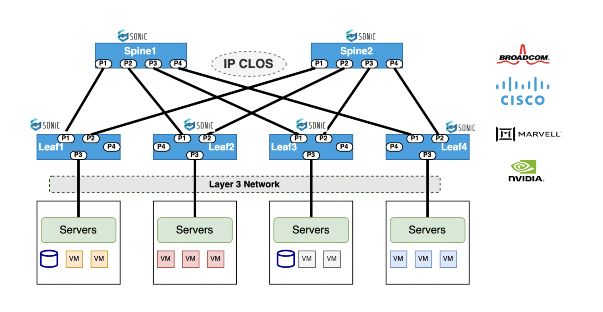

# Day 1 Operations - SONiC 

Layer3  IP-CLOS is a network design and routing architecture commonly used in large-scale data center and cloud environments. IP-CLOS provides a scalable and flexible solution for interconnecting multiple switches  in a hierarchical manner in leaf and spine architecture , allowing efficient utilization of network resources and simplified routing.

Traditionally network operators used to provision day1 operations like interface creation , VLAN creation , BGP neighborship configuration etc using manual CLI provided to network operators for configuring DC switches Leaf , Spine in 2 or 3 CLOS architecture . Configuration application to various DC switches through CLIs is tedious and time consuming for the operations team and validation process of applied config is also manual resulting in probability of errors during commissioning . Operators will then have to troubleshoot the complete control path and data path to isolate issues due to misconfiguration in day1 , day2 network entity provisioning.

Using Sonic Validated Designs (SVD) , commissioning of network services in day1 operations is automated , is greatly simplified and reduces considerable  time to deploy day1 services . SVD ensures consistency , accuracy and availability of all configurations committed in Day 1 operations through a unified fabric automation approach .

Using an overlay architecture in the data center allows end users (network administrators) to place endpoints (servers or virtual machines) anywhere in the network and remain connected to the same logical Layer 2 network, enabling the virtual topology to be decoupled from the physical topology. 

This decoupling allows the data center network to be programmatically provisioned at a per-tenant level. Overlay networking generally supports both Layer 2 and Layer 3 transport between servers or VMs. It also supports a much larger scale. SONiC overlay networks use a control-plane protocol (BGP-EVPN) to facilitate learning and sharing of endpoint information, and use VXLAN tunneling protocol to create the data plane for the overlay layer.

