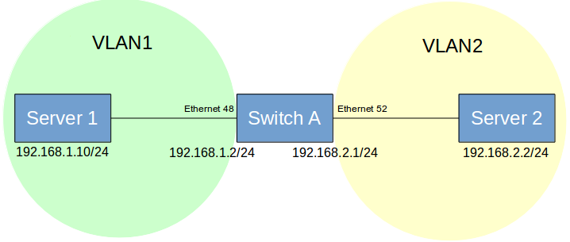

## Inerface and pory VLAN

 <table>
 <tr>
   <th>PICOS</th>
   <th>SONiC</th>
 </tr>
 <tr>
 <th colspan='2'>Port, VLAN</th>
 </tr>
 <tr>
  <tr>
  <td>

<b>#Configure Access and Trunk Mode over interfaces</b>
set interface gigabit-ethernet &lt;ethernet_interface> family ethernet-switching port-mode access
set interface gigabit-ethernet &lt;ethernet_interface> family ethernet-switching port-mode trunk

<b># Create VLANs </b>
set vlans vlan-id &lt;vlan_value>
run show vlans
</>
<b># Add VLAN members to ethernet ports for tagged packet</b>
set interface gigabit-ethernet &lt;ethernet_interface> family ethernet-switching vlan members &lt;vlan_member1>

set interface gigabit-ethernet &lt;ethernet_interface> family ethernet-switching vlan members &lt;vlan_member2>

<b># Add VLAN members to ethernet ports for untagged packet</b>
set interface gigabit-ethernet &lt;ethernet_interface> family ethernet-switching vlan members &lt;member1> untagged

set interface gigabit-ethernet <ethernet_interface> family ethernet-switching vlan members <member2> untagged

  </td>
  <td>

<b>#Configure Access and Trunk Mode over interfaces</b>
config interface speed Ethernet&lt;interface> &lt;speed>
config interface advertised-speeds Ethernet&lt;interface> &lt;speed>

<b>#Command to set Auto Negotiation for an ethernet interface</b>  
config interface autoneg Ethernet&lt;interface> enable

<b>#Command to show status of Auto Negotiation for an ethernet interface</b>
show interface autoneg status Ethernet0

<b>#Command to show operational status of interface</b> 
show interface status

<b>#Example command to configure 4x10GE breakout  for a 40GE port</b>
config interface breakout Ethernet1 '4x10G'

<b>#Command to show interface breakout options</b>
show interface breakout

<b>#Command to configure FEC mode of an ethernet interface</b> 
config interface fec Etherne&lt;interface> &lt;FEC_MODE>

<b># Create VLANs</b> 
config vlan add &lt;vlan_value1>       
config vlan add &lt;vlan_value2>

<b># show vlan configuration </b>
show vlan config 

<b>#Add Interface to vlan in Tagged (Trunk) mode:</b>
config vlan member add &lt;vlan_value1> Ethernet&lt;interface1>
config vlan member add &lt;vlan_value2> Ethernet&lt;interface2>

<b>#Add Interface to vlan in untagged (access) mode:</b>
config vlan member add -u &lt;vlan_value1> Ethernet&lt;interface1>
config vlan member add -u &lt;vlan_value2> Ethernet&lt;interface2>

<b>#Command to show vlan information </b>
show vlan brief   

  </td>
  </tr>
   </table>

  <table>
   <tr>
   <th colspan='2'>LAG</th>
 </tr>
 <tr>
  <tr>
  <td>

<b>#Command to create static LAG in an aggregated interface ae1</b>
<b>#Syntax</b>
ovs-vsctl  add-port br0 ae1 vlan_mode=trunk tag=1 -- set Interface ae1 type=pica8_lag
ovs-vsctl -- set Interface ae1 options:lag_type=static
ovs-vsctl -- set Interface ae1 options:members=ge-x/x/x , ge-x/x/x

<b>#Command to create dynamic LACP in an aggregated interface ae1</b>
set interface aggregate-ethernet ae1 aggregated-ether-options lacp enable true
set interface aggregate-ethernet ae1 aggregated-ether-options min-selected-port &lt;number_of_ports>
set interface gigabit-ethernet ge-x/x/x ether-options 802.3ad ae1
set interface gigabit-ethernet ge-x/x/x ether-options 802.3ad ae1
set interface gigabit-ethernet gge-x/x/x ether-options 802.3ad ae1
set interface gigabit-ethernet ge-x/x/x ether-options 802.3ad ae1
Commit

<b>#Command to display LACP LAG information</b> 
run show interface aggregate-ethernet ae1

<b>#Configure one LAG ae1 with three memberports.</b>
set interface gigabit-ethernet ge-x/y/z ether-options 802.3ad ae1
set interface gigabit-ethernet ge-x/y/z ether-options 802.3ad ae1
set interface gigabit-ethernet ge-x/y/z ether-options 802.3ad ae1

  </td>
  <td>

<b>#Create port channel</b>
<b>#syntax </b>
config portchannel add PortChannel&lt;Channel1>

<b>#Add members to port channel</b>
config portchannel add PortChannel&lt;Channel1>  Ethernet&lt;interface>

<b># Command to verify port channel interface</b>
show interface portchannel

<b># Command to show vlan status</b> 
show vlan brief 

<b># Command to show ip interface status</b> 
show ip interfaces
show interfaces status
<b>#Command to create a PortChannel interface and set the specific LACP key.</b>
config portchannel add PortChannel&lt;Channel1>  --lacp-key &lt;Key-number>
config portchannel member add PortChannel&lt;Channel1>
 Ethernet&lt;interface>

<b>#Command to create a PortChannel interface in fast rate mode</b>
config portchannel add PortChannel&lt;number> --fast-rate true

<b>#Command to create a PortChannel interface in static mode</b>
config portchannel add PortChannel&lt;interface>  --static true

<b>#Command to add member ports to PortChannel interface</b>
config portchannel member add PortChannel&lt;number> Ethernet&lt;interface1> 
config portchannel member add PortChannel&lt;number> Ethernet&lt;interface2> 

<b># Save the setting to config_db.json</b>
config save -y

<b>#Add member ports to PortChannel interface</b>
config portchannel member add PortChannel&lt;interface> Ethernet&lt;interface1> 
config portchannel member add PortChannel&lt;interface> Etherne&lt;interface2> 

<b># Command to show interface portchannel</b>
 show interfaces portchannel 

  </td>
  </tr>
  </table>

 <table>
 <tr>
   <th>PICOS</th>
   <th>SONiC</th>
 </tr>
 <tr>
 <th colspan='2'>FDB/MAC</th>
 </tr>
 <tr>
  <tr>
  <td>

<b># Command for MAC  Learning Configurations-</b> 
set interface ethernet-switching-options mac-table-aging-time &lt;timer>

<b>#Command to show MAC entries learned</b> 
run show ethernet-switching table

  </td>
  <td>

<b>#Display  the MAC (FDB) entries</b>
show mac

<b>#Display the MACs learned on the particular VLAN ID</b>
show mac -v &lt;vlan_value>

<b>#Display  the MACs learned on the particular port</b>
show mac -p Ethernet&lt;interface>

<b>#Clear the MAC (FBD) table</b>
sonic-clear FDB  all

<b>#Check MAC aging time</b>
 show mac aging-time

  </td>
  </tr>
  </table>
