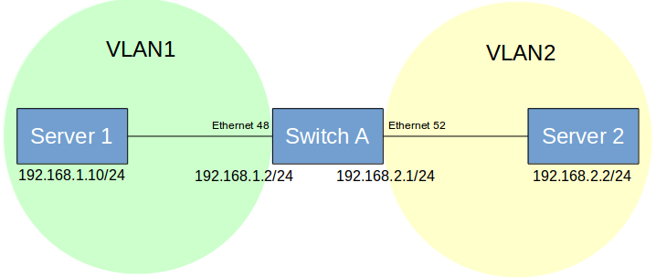

# <b> Layer 2 Switching</b>
## <b> Interface and port VLAN</b>

 <table>
   <tr>
     <th>PICOS</th>
     <th>SONiC</th>
    </tr>
   <tr>
     <th colspan='2'>Port, VLAN</th>
    </tr>
   <tr>
  <td>

<b>#Configure Access and Trunk Mode over interfaces</b> 
set interface gigabit-ethernet &lt;ethernet_interface> family ethernet-switching port-mode access 
set interface gigabit-ethernet &lt;ethernet_interface> family ethernet-switching port-mode trunk 
 
<b># Create VLANs </b> 
set vlans vlan-id &lt;vlan_value> 
run show vlans 
 
<b># Add VLAN members to ethernet ports for tagged packet</b> 
set interface gigabit-ethernet &lt;ethernet_interface> family ethernet-switching vlan members &lt;vlan_member1> 
 
set interface gigabit-ethernet &lt;ethernet_interface> family ethernet-switching vlan members &lt;vlan_member2> 
 
<b># Add VLAN members to ethernet ports for untagged packet</b> 
set interface gigabit-ethernet &lt;ethernet_interface> family ethernet-switching vlan members &lt;member1> untagged 
 
set interface gigabit-ethernet &lt;ethernet_interface> family ethernet-switching vlan members &lt;member2> untagged

  </td>
  <td>

<b>#Configure Access and Trunk Mode over interfaces</b> 
config interface speed Ethernet&lt;interface> &lt;speed> 
config interface advertised-speeds Ethernet&lt;interface> &lt;speed> 
 
<b>#Command to set Auto Negotiation for an ethernet interface</b>   
config interface autoneg Ethernet&lt;interface> enable 
 
<b>#Command to show status of Auto Negotiation for an ethernet interface</b> 
show interface autoneg status Ethernet0 
 
<b>#Command to show operational status of interface</b>  
show interface status 
 
<b>#Example command to configure 4x10GE breakout  for a 40GE port</b> 
config interface breakout Ethernet1 '4x10G' 
 
<b>#Command to show interface breakout options</b> 
show interface breakout 
 
<b>#Command to configure FEC mode of an ethernet interface</b>  
config interface fec Etherne&lt;interface> &lt;FEC_MODE> 
 
<b># Create VLANs</b>  
config vlan add &lt;vlan_value1>        
config vlan add &lt;vlan_value2> 
 
<b># show vlan configuration </b> 
show vlan config  
 
<b>#Add Interface to vlan in Tagged (Trunk) mode:</b> 
config vlan member add &lt;vlan_value1> Ethernet&lt;interface1> 
config vlan member add &lt;vlan_value2> Ethernet&lt;interface2> 
 
<b>#Add Interface to vlan in untagged (access) mode:</b> 
config vlan member add -u &lt;vlan_value1> Ethernet&lt;interface1> 
config vlan member add -u &lt;vlan_value2> Ethernet&lt;interface2> 
 
<b>#Command to show vlan information </b> 
show vlan brief    

  </td>
  </tr>
   </table>

  <table>
   <tr>
   <th colspan='2'>LAG</th>
 </tr>
 <tr>
  <tr>
  <td>

<b>#Command to create static LAG in an aggregated interface ae1</b> 
<b>#Syntax</b> 
ovs-vsctl  add-port br0 ae1 vlan_mode=trunk tag=1 -- set Interface ae1 type=pica8_lag 
ovs-vsctl -- set Interface ae1 options:lag_type=static 
ovs-vsctl -- set Interface ae1 options:members=ge-x/x/x , ge-x/x/x 
 
<b>#Command to create dynamic LACP in an aggregated interface ae1</b> 
set interface aggregate-ethernet ae1 aggregated-ether-options lacp enable true 
set interface aggregate-ethernet ae1 aggregated-ether-options min-selected-port &lt;number_of_ports> 
set interface gigabit-ethernet ge-x/x/x ether-options 802.3ad ae1 
set interface gigabit-ethernet ge-x/x/x ether-options 802.3ad ae1 
set interface gigabit-ethernet gge-x/x/x ether-options 802.3ad ae1 
set interface gigabit-ethernet ge-x/x/x ether-options 802.3ad ae1 
Commit 
 
<b>#Command to display LACP LAG information</b>  
run show interface aggregate-ethernet ae1 
 
<b>#Configure one LAG ae1 with three memberports.</b> 
set interface gigabit-ethernet ge-x/y/z ether-options 802.3ad ae1 
set interface gigabit-ethernet ge-x/y/z ether-options 802.3ad ae1 
set interface gigabit-ethernet ge-x/y/z ether-options 802.3ad ae1 

  </td>
  <td>

<b>#Create port channel</b> 
<b>#syntax </b> 
config portchannel add PortChannel&lt;Channel1> 
 
<b>#Add members to port channel</b> 
config portchannel add PortChannel&lt;Channel1>  Ethernet&lt;interface> 
 
<b># Command to verify port channel interface</b> 
show interface portchannel 
 
<b># Command to show vlan status</b>  
show vlan brief  
 
<b># Command to show ip interface status</b>  
show ip interfaces 
show interfaces status 
<b>#Command to create a PortChannel interface and set the specific LACP key.</b> 
config portchannel add PortChannel&lt;Channel1>  --lacp-key &lt;Key-number> 
config portchannel member add PortChannel&lt;Channel1> 
 Ethernet&lt;interface> 
 
<b>#Command to create a PortChannel interface in fast rate mode</b> 
config portchannel add PortChannel&lt;number> --fast-rate true 
 
<b>#Command to create a PortChannel interface in static mode</b> 
config portchannel add PortChannel&lt;interface>  --static true 
 
<b>#Command to add member ports to PortChannel interface</b> 
config portchannel member add PortChannel&lt;number> Ethernet&lt;interface1>  
config portchannel member add PortChannel&lt;number> Ethernet&lt;interface2>  
 
<b># Save the setting to config_db.json</b> 
config save -y 
 
<b>#Add member ports to PortChannel interface</b> 
config portchannel member add PortChannel&lt;interface> Ethernet&lt;interface1>  
config portchannel member add PortChannel&lt;interface> Etherne&lt;interface2>  
 
<b># Command to show interface portchannel</b> 
 show interfaces portchannel  

  </td>
  </tr>
  </table>

 <table>
 <tr>
   <th>PICOS</th>
   <th>SONiC</th>
 </tr>
 <tr>
 <th colspan='2'>FDB/MAC</th>
 </tr>
 <tr>
  <tr>
  <td>

<b># Command for MAC  Learning Configurations-</b>  
set interface ethernet-switching-options mac-table-aging-time &lt;timer> 
 
<b>#Command to show MAC entries learned</b>  
run show ethernet-switching table

  </td>
  <td>

<b>#Display  the MAC (FDB) entries</b> 
show mac 
 
<b>#Display the MACs learned on the particular VLAN ID</b> 
show mac -v &lt;vlan_value> 
 
<b>#Display  the MACs learned on the particular port</b> 
show mac -p Ethernet&lt;interface> 
 
<b>#Clear the MAC (FBD) table</b> 
sonic-clear FDB  all 
 
<b>#Check MAC aging time</b> 
 show mac aging-time 

  </td>
  </tr>
  </table>
