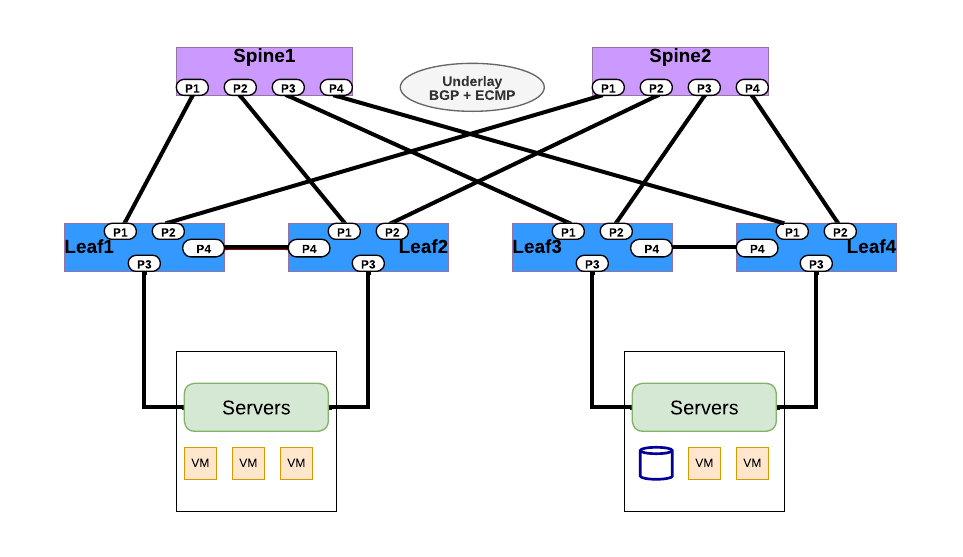

## BGP Routing 

  

<table>
<tr>
<th>PICOS</th>
<th>SONiC</th>
</tr>
<tr>
<th colspan='2'>BGP Routing</th>
</tr>
<tr>
<td>

<b>#Command to configure BGP routing -</b> 
set protocols bgp router-id &lt;System_loopback_IP> 
 set protocols bgp local-as &lt;LOCAL_AS_NUMBER> 
 set protocols bgp local-as &lt;LOCAL_AS_NUMBER> 
 set protocols bgp neighbor &lt;Neighbor_IP> remote-as &lt;REMOTE_AS_NUMBER> 
 set protocols bgp local-as &lt;LOCAL_AS_NUMBER> 
 set protocols bgp neighbor &lt;Neighbor_IP>  remote-as &lt;REMOTE_AS_NUMBER> 
 set protocols bgp peer-group &lt;LEAF_NAME> 
 set protocols bgp neighbor &lt;LEAF_NAME> 
 remote-as external 
 set protocols bgp neighbor &lt;Neighbor_IP> peer-group &lt;LEAF_NAME> 
 set protocols bgp neighbor &lt;Neighbor_IP>  peer-group &lt;LEAF_NAME> 
Commit 
 
<b>#Example BGP routing configuration</b> 
 set protocols bgp router-id 1.1.1.1 
 set protocols bgp local-as 100 
 set protocols bgp local-as 100 
 set protocols bgp neighbor 192.168.49.1 remote-as 200 
 set protocols bgp local-as 100 
 set protocols bgp neighbor 192.168.49.1 remote-as 100 
 set protocols bgp peer-group Leaf1 
 set protocols bgp neighbor leaf1 remote-as external 
 set protocols bgp neighbor 10.10.0.1 peer-group Leaf1 
 set protocols bgp neighbor 10.10.0.12 peer-group Leaf1 
commit 
 
<b>#Command to show BGP routes summary</b> 
run show bgp route &lt;ip>

</td>
<td>

<b>#vtysh sonic command  to configure BGP routing -</b> 
router bgp &lt;ASN_NUMBER> 
bgp router-id &lt;System_loopback_IP> 
no bgp ebgp-requires-policy 
bgp bestpath as-path multipath-relax 
neighbor FABRIC peer-group 
neighbor FABRIC capability extended-nexthop 
neighbor &lt;Neighbor_IP>  remote-as &lt;REMOTE_ASN_NUMBER> 
neighbor &lt;Neighbor_IP>  peer-group FABRIC 
 
<b>#Example BGP routing configuration</b> 
router bgp 65001 
bgp router-id 10.0.2.1 
no bgp ebgp-requires-policy 
bgp bestpath as-path multipath-relax 
neighbor FABRIC peer-group 
neighbor FABRIC capability extended-nexthop 
neighbor 172.16.10.0 remote-as 2001 
neighbor 172.16.10.0 peer-group FABRIC 
neighbor 172.16.10.8 remote-as 2002 
neighbor 172.16.10.8 peer-group FABRIC 
neighbor 192.168.3.1 remote-as 2003 
neighbor 192.168.3.1 peer-group FABRIC 
 
<b>#Command to show BGP routes summary</b> 
show ip bgp summary 
show ip bgp neighbors 
show ip bgp network 
 
show ipv6 bgp summary 
show ipv6 bgp neighbors 
show ipv6 bgp network 
 
</td>
</tr>
</table>