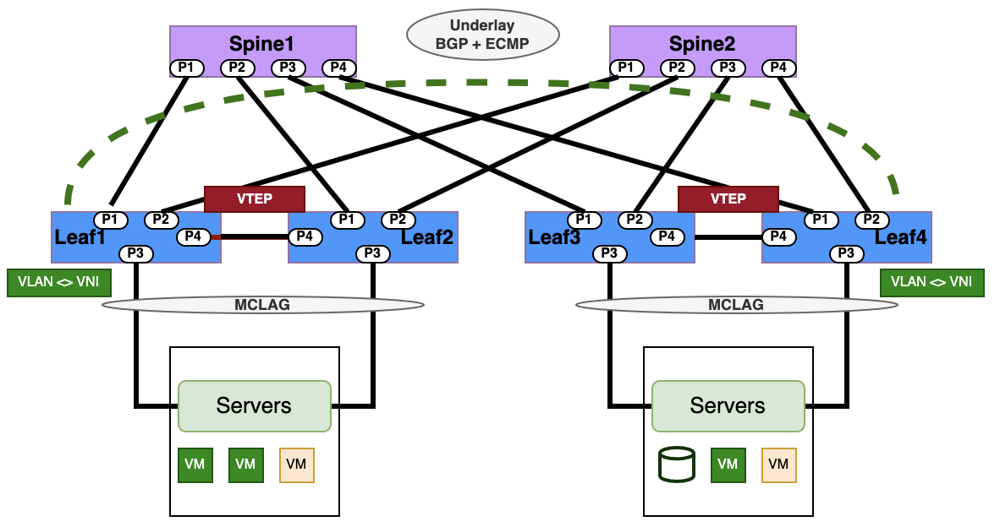

## <b> L2-VXLAN Asymmetric IRB Configuration</b>

  

<table>
<tr>
<th>PICOS</th>
<th>SONiC</th>
</tr>
<tr>
<td>
<b># Configure VLAN ID, L3 VLAN interfaces loopback interfaces and IP addressing.</b> 
<b>#Syntax</b> 
set vlans  vlan-id &lt;VLAN-ID> 
set ip routing enable true 
set ip vrf &lt;VRF_NAME> 
 
set interface gigabit-ethernet ge-x/y/z family ethernet-switching native-vlan-id &lt;vlan-id1> 
set interface gigabit-ethernet ge-a/b/c family ethernet-switching native-vlan-id &lt;vlan-id2> 
 
set l3-interface loopback lo address &lt;System_loopback_1>  prefix-length 32 
 
set l3-interface loopback &lt;VRF_NAME> address &lt;System_loopback_2> prefix-length 32 
 
set l3-interface vlan-interface vlan&lt;vlan_number>  address &lt;IP_address> prefix-length &lt;subnet_length> 
 
<b># Configure VXLAN VNI and map VNI IDs to VLAN IDs.</b> 
set vlans vlan-id &lt;VLAN-ID>  l3-interface "vlan&lt;VLAN_NUMBER>" 
set vxlans source-interface lo address &lt;SYSTEM_LOOPBACK> 
set vxlans vni &lt;VNI_VALUE>  vlan &lt;VLAN-ID> 
 
<b># Configure BGP related configuration</b> 
set protocols bgp local-as &lt;LOCAL_AS_NUMBER> 
set protocols bgp router-id &lt;SYSTEM_LOOPBACK> 
set protocols bgp neighbor &lt;BGP_NEIGHBOR_IP> remote-as "internal" 
set protocols bgp neighbor &lt;BGP_NEIGHBOR_IP> update-source "&lt;SYSTEM_LOOPBACK>" 
set protocols bgp neighbor &lt;BGP_NEIGHBOR_IP>  evpn activate true 
set protocols bgp evpn advertise-all-vni 
set protocols bgp evpn advertise ipv4-unicast 
set protocols bgp local-as &lt;LOCAL_AS_NUMBER> 
set protocols bgp router-id &lt;SYSTEM_LOOPBACK> 
set protocols bgp evpn advertise ipv4-unicast 
 
<b>#Verify Configuration- routes and VXLAN tunnels</b> 
run show route  
run show bgp route  
run show vxlan evpn route  
run show vxlan tunnel 
 
<b>#Advertise BGP EVPN Routes</b>  
set protocols bgp evpn advertise-all-vni 
set vxlans source-interface loopback address &lt;SYSTEM_LOOPBACK> 
set vxlans vni &lt;VNI_VALUE>  encapsulation vlan &lt;VLAN-ID> 
 
<b>#Command to show VXLAN traffic stats</b>  
run show vxlan statistics 

</td>
<td>

<b># Configure LoopBack, VLAN IDs , Ip addressing </b> 
<b># Syntax</b> 
config vlan add &lt;VLAN-ID> 
config vlan member add &lt;VLAN-ID> Ethernet&lt;interface1> 
config interface ip add Loopback0 &lt;SYSTEM_LOOPBACK> 
 
  
<b># Configure BGP routing</b>  
router bgp &lt;LOCAL_AS_NUMBER> 
bgp router-id &lt;SYSTEM_LOOPBACK> 
neighbor &lt;ebgp_neighbor_ip>  remote-as &lt;REMOTE_AS_NUMBER> 
address-family ipv4 
network &lt;Network_prefix_advertised> 
 
<b>#Configure VXLAN VNI and map VNI IDs to VLAN IDs</b> 
config vxlan add vtep &lt;SOURCE_VTEP_IP> 
config vxlan evpn_nvo add nvo vtep 
config vxlan map add vtep &lt;VLAN-ID> &lt;VNI_VALUE> 
 
config vxlan add vtep &lt;DEST_VTEP_IP> 
config vxlan evpn_nvo add nvo vtep 
config vxlan map add vtep &lt;VLAN-ID> &lt;VNI_VALUE> 
 
  
<b>#Advertise L2 EVPN Routes</b>  
router bgp &lt;LOCAL_AS_NUMBER> 
address-family l2vpn evpn 
neighbor &lt;ebgp_neighbor_ip> activate 
Advertise-all-vni 
 
  
<b>#Show VXLAN tunnels , interfaces</b>   
show ip route 
show vxlan interface 
show vxlan vlanvnimap 
show vxlan tunnel 
show vxlan remotevtep 
show evpn vni detail 

</td>
<tr>
</table>

<table>
<tr>
<th colspan='2'>Sample SONiC- L2VXLAN EVPN Asymmetric IRB </th>
</tr>
<tr>
<td colspan='2'>
<b><u>Step 1: Configure IP address to Loopback0 of both switches.</u></b> 
<b>AS7326-56X</b> 
admin@AS7326-56X:~$ config interface ip remove Loopback0 10.1.0.1/32    
admin@AS7326-56X:~$ config interface ip add Loopback0 1.1.1.1/32 
 
<b>AS5835-54X:</b> 
admin@AS5835-54X:~$ config interface ip remove Loopback0 10.1.0.1/32    
admin@AS5835-54X:~$ config interface ip add Loopback0 2.2.2.2/32 
 
<b><u>Step 2: Establish BGP Session between Ethernet52 and announce the network.</u></b> 
<b>AS7326-56X:</b> 
admin@AS7326-56X:~$ vtysh 
Hello, this is FRRouting (version 7.2.1-sonic). 
Copyright 1996-2005 Kunihiro Ishiguro, et al. 
AS7326-56X# configure terminal 
AS7326-56X(config)# router bgp 65100 
AS7326-56X(config-router)# bgp router-id 1.1.1.1 
AS7326-56X(config-router)# neighbor 10.0.0.1 remote-as 65100 
AS7326-56X(config-router)# address-family ipv4 
AS7326-56X(config-router-af)# network 1.1.1.1/32 
AS7326-56X(config-router-af)# end 
AS7326-56X# exit 
<b>AS5835-54X:</b> 
admin@AS5835-54X:~$ vtysh 
Hello, this is FRRouting (version 7.2.1-sonic). 
Copyright 1996-2005 Kunihiro Ishiguro, et al. 
AS5835-54X# configure terminal 
AS5835-54X(config)# router bgp 65100 
AS5835-54X(config-router)# bgp router-id 2.2.2.2 
AS5835-54X(config-router)# neighbor 10.0.0.0 remote-as 65100 
AS5835-54X(config-router)# address-family ipv4 
AS5835-54X(config-router-af)# network 2.2.2.2/32 
AS5835-54X(config-router-af)# end 
AS5835-54X# exit 
 
<u><b>Step 3. Create Vxlan</b> </u>
<b>AS7326-56X:</b>
admin@AS7326-56X:~$ config vxlan add vtep 1.1.1.1 
admin@AS7326-56X:~$ config vxlan evpn_nvo add nvo vtep 
admin@AS7326-56X:~$ config vxlan map add vtep 30 3000 
<b>AS5835-54X:</b> 
admin@AS5835-54X:~$ config vxlan add vtep 2.2.2.2 
admin@AS5835-54X:~$ config vxlan evpn_nvo add nvo vtep 
admin@AS5835-54X:~$ config vxlan map add vtep 30 3000 
<b>Note :</b> 
VNI (VxLAN Network Identifier) : virtual extension of VLAN over IP network. 
VTEP (VXLAN Tunnel End Point) : an entity that originates and/or terminates VXLAN tunnels which is specified by a source IP address. 
Only one VTEP is allowed on one device. Please use loopback IP address for VTEP's IP address. 
NVO (Network Virtualization Overlay) 
Only one NVO is allowed on one device. 
VNI (VxLAN Network Identifier) : virtual extension of VLAN over IP network. 
 
<b><u>Step 4: Advertise  L2VPN EVPN routes.</u></b>  
<b>AS7326-56X:</b> 
admin@AS7326-56X:~$ vtysh 
Hello, this is FRRouting (version 7.2.1-sonic). 
Copyright 1996-2005 Kunihiro Ishiguro, et al. 
AS7326-56X# 
AS7326-56X# configure terminal 
AS7326-56X(config)# router bgp 65100 
AS7326-56X(config-router)# address-family l2vpn evpn 
AS7326-56X(config-router-af)# neighbor 10.0.0.1 activate 
AS7326-56X(config-router-af)# advertise-all-vni 
AS5835-54X: 
admin@AS5835-54X:~$ vtysh 
Hello, this is FRRouting (version 7.2.1-sonic). 
AS5835-54X#  
AS5835-54X# configure terminal 
AS5835-54X(config)# router bgp 65100 
AS5835-54X(config-router)# address-family l2vpn evpn 
AS5835-54X(config-router-af)# neighbor 10.0.0.0 activate 
AS5835-54X(config-router-af)# advertise-all-vni 
 
<u><b>Check VxLAN  interface configuration.AS7326-56X:</b></u> 
admin@AS7326-56X:~$ show vxlan interface  
VTEP Information: 
VTEP Name : vtep, SIP : 1.1.1.1 
Source interface : Loopback0 
AS5835-54X: 
admin@AS5835-54X:~$ show vxlan interface  
VTEP Information: 
VTEP Name : vtep, SIP : 2.2.2.2 
Source interface : Loopback0 
 
<b>Check vxlan and VLAN mapping.AS7326-56X:</b> 
admin@AS7326-56X:~$ show vxlan vlanvnimap 

<pre>
+--------+-------+
| VLAN   |   VNI |
+========+=======+
| Vlan30 |  3000 |
+--------+-------+
Total count : 1
AS5835-54X:
admin@AS5835-54X:~$ show vxlan vlanvnimap
+--------+-------+
| VLAN   |   VNI |
+========+=======+
| Vlan30 |  3000 |
+--------+-------+
Total count : 1
</pre>
  
<b><u>Check the status for Vxlan tunneling.</b></u> 
<u><b>AS7326-56X:(202111.3)</b></u> 
admin@AS7326-56X:~$ show vxlan tunnel 

<pre>
vxlan tunnel name    source ip    destination ip    tunnel map name    tunnel map mapping(vni -> vlan)
-------------------  -----------  ----------------  -----------------  ---------------------------------
vtep                 1.1.1.1                       map_3000_Vlan30    3000 -> Vlan30
Total count : 1
</pre>
  
<b><u>AS7326-56X:(202111.3)</u></b> 
admin@AS7326-56X:~$ show vxlan remotevtep 

<pre>
+---------+---------+-------------------+--------------+
| SIP 	| DIP 	| Creation Source   | OperStatus   |
+=========+=========+===================+==============+

| 1.1.1.1 | 2.2.2.2 | EVPN          	| oper_up  	|
+---------+---------+-------------------+--------------+
Total count : 1
</pre>
  
<u><b>AS5835-54X:(202111.3)</b></u> 
admin@AS5835-54X:~$ show vxlan tunnel 
<pre>
vxlan tunnel name    source ip    destination ip    tunnel map name    tunnel map mapping(vni -> vlan)
-------------------  -----------  ----------------  -----------------  ---------------------------------
vtep                 2.2.2.2                      map_3000_Vlan30    3000 -> Vlan30
Total count : 1
</pre>
  
<u><b>AS5835-54X:(202111.3)</b></u> 
admin@AS5835-54X:~$ show vxlan remotevtep 

<pre>
| SIP 	| DIP 	| Creation Source   | OperStatus   |
+=========+=========+===================+==============+
| 2.2.2.2 | 1.1.1.1 | EVPN          	| oper_up  	|
+---------+---------+-------------------+--------------+
Total count : 1
 </pre>
  
<b><u>Check the Mac learning.</u></b> 
<b>AS7326-56X:(202111.3)</b> 
 
admin@AS7326-56X:~$ show mac 

<pre>
  No.	Vlan  MacAddress     	Port            	Type
-----  ------  -----------------  ------------------  -------
	1  	30  8C:EA:1B:30:DA:50  VxLAN DIP: 2.2.2.2  Static
	2  	30  8C:EA:1B:30:DA:4F  Ethernet0       	Dynamic
Total number of entries 2
</pre>
  
<u><b>AS7326-56X(202111.3)</b></u> 
admin@AS7326-56X:~$ show mac 

<pre>
  No.	Vlan  MacAddress     	Port   	Type
-----  ------  -----------------  ---------  -------
	1  	30  8C:EA:1B:30:DA:4F  Ethernet0  Dynamic
Total number of entries 1
admin@AS7326-56X:~$ show vxlan remotemac all
+--------+-------------------+--------------+-------+-------+---------+
| VLAN   | MAC           	| RemoteVTEP   | ESI   |   VNI | Type	|
+========+===================+==============+=======+=======+=========+
| Vlan30 | 8c:ea:1b:30:da:50 | 2.2.2.2  	|   	|  3000 | dynamic |
+--------+-------------------+--------------+-------+-------+---------+
Total count : 1
Note.
"8C:EA:1B:30:DA:50" is synced from remote vtep(2.2.2.2).
"8C:EA:1B:30:DA:4F" is learned locally.
</pre>
  
<u><b>AS5835-54X:(202111.3)</b></u> 
admin@AS5835-54X:~$ show mac 

<pre>
  No.	Vlan  MacAddress     	Port            	Type
-----  ------  -----------------  ------------------  -------
	1  	30  8C:EA:1B:30:DA:50  Ethernet0       	Dynamic
	2  	30  8C:EA:1B:30:DA:4F  VxLAN DIP: 1.1.1.1  Static
Total number of entries 2
</pre>
  
<u><b>AS5835-54X:(202111.3)</b></u> 
admin@AS5835-54X:~$ show mac 

<pre>
  No.	Vlan  MacAddress     	Port   	Type
-----  ------  -----------------  ---------  -------
	1  	30  8C:EA:1B:30:DA:50  Ethernet0  Dynamic
Total number of entries 1
admin@AS5835-54X:~$ show vxlan remotemac all
+--------+-------------------+--------------+-------+-------+---------+
| VLAN   | MAC           	| RemoteVTEP   | ESI   |   VNI | Type	|
+========+===================+==============+=======+=======+=========+
| Vlan30 | 8c:ea:1b:30:da:4f | 1.1.1.1  	|   	|  3000 | dynamic |
+--------+-------------------+--------------+-------+-------+---------+
Total count : 1
 </pre>
   
<b>Check IPv4 BGP session</b> 
<b><u>AS7326-56X:</u></b> 
 
AS7326-56X# show bgp ipv4 summary 
IPv4 Unicast Summary: 
BGP router identifier 1.1.1.1, local AS number 65100 vrf-id 0 
BGP table version 6 
RIB entries 3, using 552 bytes of memory 
Peers 1, using 20 KiB of memory 

<pre>
Neighbor    	V     	AS MsgRcvd MsgSent   TblVer  InQ OutQ  Up/Down State/PfxRcd
10.0.0.1    	4  	65100  	80  	85    	0	0	0 01:01:28        	1
Total number of neighbors 1
</pre>
  
<u><b>AS5835-54X:</b></u> 
AS5835-54X# show bgp ipv4 summary 
IPv4 Unicast Summary: 
BGP router identifier 2.2.2.2, local AS number 65100 vrf-id 0 
BGP table version 6 
RIB entries 3, using 552 bytes of memory 
Peers 1, using 20 KiB of memory 

<pre>
Neighbor    	V     	AS MsgRcvd MsgSent   TblVer  InQ OutQ  Up/Down State/PfxRcd
10.0.0.0    	4  	65100  	79  	79    	0	0	0 01:01:28        	1
Total number of neighbors 1
</pre>
  
<u><b>Check L2EVPN BGP session</u></b> 
 
<b><u>AS7326-56X:</b></u> 
AS7326-56X# show bgp l2vpn evpn summary 
BGP router identifier 1.1.1.1, local AS number 65100 vrf-id 0 
BGP table version 0 
RIB entries 3, using 552 bytes of memory 
Peers 1, using 20 KiB of memory 

<pre>
Neighbor    	V     	AS MsgRcvd MsgSent   TblVer  InQ OutQ  Up/Down State/PfxRcd
10.0.0.1    	4  	65100  	82  	87    	0	0	0 01:03:43        	3
Total number of neighbors 1
</pre>
  
AS5835-54X: 
AS5835-54X# show bgp l2vpn evpn summary 
BGP router identifier 2.2.2.2, local AS number 65100 vrf-id 0 
BGP table version 0 
RIB entries 3, using 552 bytes of memory 
Peers 1, using 20 KiB of memory 

<pre>
Neighbor    	V     	AS MsgRcvd MsgSent   TblVer  InQ OutQ  Up/Down State/PfxRcd
10.0.0.0    	4  	65100  	81  	81    	0	0	0 01:03:43        	3
Total number of neighbors 1
</pre>
  
<u><b>Check underlay routing</b></u> 
<u><b>AS7326-56X:</b></u> 
  
AS7326-56X# show ip route 
Codes: K - kernel route, C - connected, S - static, R - RIP, 
O - OSPF, I - IS-IS, B - BGP, E - EIGRP, N - NHRP, 
T - Table, v - VNC, V - VNC-Direct, A - Babel, D - SHARP, 
F - PBR, f - OpenFabric, 
\> - selected route, * - FIB route, q - queued route, r - rejected route 
K>* 0.0.0.0/0 [0/202] via 188.188.1.1, eth0, 00:49:45 
C>* 1.1.1.1/32 is directly connected, Loopback0, 00:49:14 
B>* 2.2.2.2/32 [200/0] via 10.0.0.1, Ethernet52, 00:42:04 
C>* 10.0.0.0/31 is directly connected, Ethernet52, 00:49:13 
C>* 188.188.0.0/16 is directly connected, eth0, 00:49:45 
 
<b><u>AS5835-54X:</u></b> 
 
AS5835-54X# show ip route 
Codes: K - kernel route, C - connected, S - static, R - RIP, 
O - OSPF, I - IS-IS, B - BGP, E - EIGRP, N - NHRP, 
T - Table, v - VNC, V - VNC-Direct, A - Babel, D - SHARP, 
F - PBR, f - OpenFabric, 
\> - selected route, * - FIB route, q - queued route, r - rejected route 
K>* 0.0.0.0/0 [0/0] via 188.188.1.1, eth0, 00:49:57 
B>* 1.1.1.1/32 [200/0] via 10.0.0.0, Ethernet52, 00:42:25 
C>* 2.2.2.2/32 is directly connected, Loopback0, 00:46:34 
C>* 10.0.0.0/31 is directly connected, Ethernet52, 00:46:33 
C>* 188.188.0.0/16 is directly connected, eth0, 00:49:57 
 
<u><b>Check Vxlan VNI status</b></u> 
<u><b>AS7326-56X:</b></u> 
AS7326-56X# show evpn vni detail  
VNI: 3000 
Type: L2 
Tenant VRF: default 
VxLAN interface: vtep-30 
VxLAN ifIndex: 68 
Local VTEP IP: 1.1.1.1 
Mcast group: 0.0.0.0 
Remote VTEPs for this VNI: 
2.2.2.2 flood: HER 
Number of MACs (local and remote) known for this VNI: 3 
Number of ARPs (IPv4 and IPv6, local and remote) known for this VNI: 3 
Advertise-gw-macip: No 
  
<b><u>AS5835-54X:</u></b> 
AS5835-54X# show evpn vni detail  
VNI: 3000 
Type: L2 
Tenant VRF: default 
VxLAN interface: vtep-30 
VxLAN ifIndex: 66 
Local VTEP IP: 2.2.2.2 
Mcast group: 0.0.0.0 
Remote VTEPs for this VNI: 
1.1.1.1 flood: HER 
Number of MACs (local and remote) known for this VNI: 3 
Number of ARPs (IPv4 and IPv6, local and remote) known for this VNI: 3 
Advertise-gw-macip: No 
  
<b><u>Check the evpn mac learning</u></b> 
<b><u>AS7326-56X:</u></b> 
AS7326-56X# show evpn mac vni all 
VNI 3000 #MACs (local and remote) 3 
<pre>
MAC           	Type   Intf/Remote VTEP  	VLAN  Seq #'s
8c:ea:1b:30:da:50 remote 2.2.2.2                 	1/0
8c:ea:1b:30:da:4f local  Ethernet0         	30	0/0
</pre>
  
<u><b>AS5835-54X:</b></u> 
AS5835-54X# show evpn mac vni all 
</pre>
VNI 3000 #MACs (local and remote) 3MAC           	Type   Intf/Remote VTEP  	VLAN  Seq #'s
8c:ea:1b:30:da:50 local  Ethernet0         	30	0/0
8c:ea:1b:30:da:4f remote 1.1.1.1                 	1/0
</pre>
  
<u><b>Check the type 2 EVPN route</b></u> 
<b><u>AS7326-56X:</u></b> 
AS7326-56X# show bgp l2vpn evpn route type macip  
BGP table version is 2, local router ID is 1.1.1.1 
Status codes: s suppressed, d damped, h history, * valid, > best, i - internal 
Origin codes: i - IGP, e - EGP, ? - incomplete 
EVPN type-1 prefix: [1]:[EthTag]:[ESI]:[IPlen]:[VTEP-IP] 
EVPN type-2 prefix: [2]:[EthTag]:[MAClen]:[MAC]:[IPlen]:[IP] 
EVPN type-3 prefix: [3]:[EthTag]:[IPlen]:[OrigIP] 
EVPN type-4 prefix: [4]:[ESI]:[IPlen]:[OrigIP] 
EVPN type-5 prefix: [5]:[EthTag]:[IPlen]:[IP] 
<pre>
                   Network          Next Hop            Metric LocPrf Weight Path
            Extended Community
Route Distinguisher: 1.1.1.1:2
*> [2]:[0]:[48]:[8c:ea:1b:cc:10:a4]
                    1.1.1.1                            32768 i
                    ET:8 RT:65100:3000
Route Distinguisher: 2.2.2.2:2
*>i[2]:[0]:[48]:[80:a2:35:5a:22:50]
                    2.2.2.2                       100      0 i
                    RT:65100:3000 ET:8
Displayed 2 prefixes (2 paths) (of requested type)
</pre>
  
<b><u>AS5835-54X:</u></b> 
AS5835-54X# show bgp l2vpn evpn route type macip  
BGP table version is 2, local router ID is 2.2.2.2 
Status codes: s suppressed, d damped, h history, * valid, > best, i - internal 
Origin codes: i - IGP, e - EGP, ? - incomplete 
EVPN type-1 prefix: [1]:[EthTag]:[ESI]:[IPlen]:[VTEP-IP] 
EVPN type-2 prefix: [2]:[EthTag]:[MAClen]:[MAC]:[IPlen]:[IP] 
EVPN type-3 prefix: [3]:[EthTag]:[IPlen]:[OrigIP] 
EVPN type-4 prefix: [4]:[ESI]:[IPlen]:[OrigIP] 
EVPN type-5 prefix: [5]:[EthTag]:[IPlen]:[IP] 
<pre>
   Network          Next Hop            Metric LocPrf Weight Path
                    Extended Community
Route Distinguisher: 1.1.1.1:2
*>i[2]:[0]:[48]:[8c:ea:1b:cc:10:a4]
                    1.1.1.1                       100      0 i
                    RT:65100:3000 ET:8
Route Distinguisher: 2.2.2.2:2
*> [2]:[0]:[48]:[80:a2:35:5a:22:50]
                    2.2.2.2                            32768 i
                    ET:8 RT:65100:3000
Displayed 2 prefixes (2 paths) (of requested type)
</pre>
  
<b><u>Check the type 3 EVPN route</u></b> 
 <b><u>AS7326-56X:</b></u> 
  
AS7326-56X# show bgp l2vpn evpn route type multicast  
BGP table version is 3, local router ID is 1.1.1.1 
Status codes: s suppressed, d damped, h history, * valid, > best, i - internal 
Origin codes: i - IGP, e - EGP, ? - incomplete 
EVPN type-2 prefix: [2]:[EthTag]:[MAClen]:[MAC]:[IPlen]:[IP] 
EVPN type-3 prefix: [3]:[EthTag]:[IPlen]:[OrigIP] 
EVPN type-4 prefix: [4]:[ESI]:[IPlen]:[OrigIP] 
EVPN type-5 prefix: [5]:[EthTag]:[IPlen]:[IP] 
Network Next Hop Metric LocPrf Weight Path 
Extended Community 
Route Distinguisher: 1.1.1.1:2 
*> [3]:[0]:[32]:[1.1.1.1] 
1.1.1.1 32768 i 
ET:8 RT:65100:3000 
Route Distinguisher: 2.2.2.2:2 
*>i[3]:[0]:[32]:[2.2.2.2] 
2.2.2.2 100 0 i 
RT:65100:3000 ET:8 
Displayed 2 prefixes (2 paths) (of requested type) 
  
<b><u>AS5835-54X:</u></b> 
AS5835-54X# show bgp l2vpn evpn route type multicast  
BGP table version is 3, local router ID is 2.2.2.2 
Status codes: s suppressed, d damped, h history, * valid, > best, i - internal 
Origin codes: i - IGP, e - EGP, ? - incomplete 
EVPN type-2 prefix: [2]:[EthTag]:[MAClen]:[MAC]:[IPlen]:[IP] 
EVPN type-3 prefix: [3]:[EthTag]:[IPlen]:[OrigIP] 
EVPN type-4 prefix: [4]:[ESI]:[IPlen]:[OrigIP] 
EVPN type-5 prefix: [5]:[EthTag]:[IPlen]:[IP] 
Network Next Hop Metric LocPrf Weight Path 
Extended Community 
Route Distinguisher: 1.1.1.1:2 
*>i[3]:[0]:[32]:[1.1.1.1] 
1.1.1.1 100 0 i 
RT:65100:3000 ET:8 
Route Distinguisher: 2.2.2.2:2 
*> [3]:[0]:[32]:[2.2.2.2] 
2.2.2.2 32768 i 
ET:8 RT:65100:3000 

</td>
</tr>
</table>