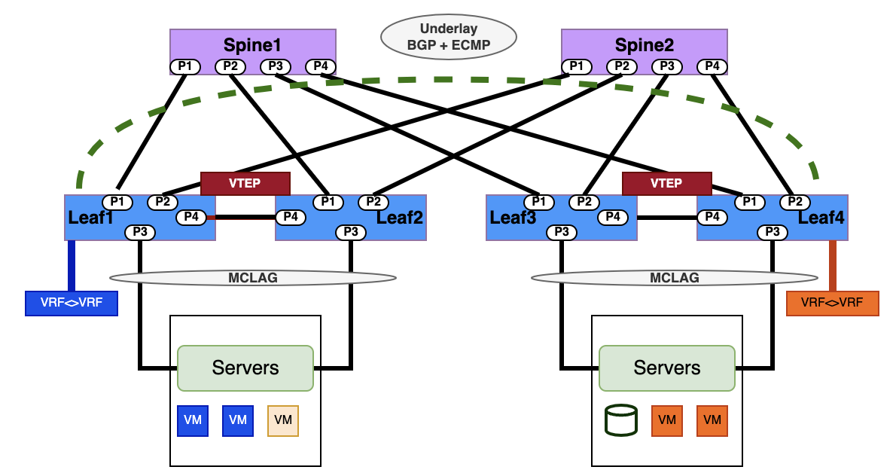
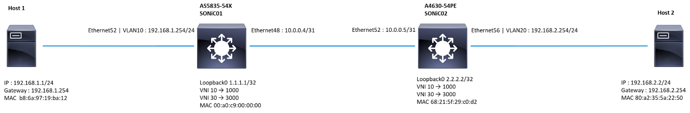

## L3-VXLAN Symmetric IRB Configuration

<table>
<tr>
<th>PICOS </th>
<th>SONiC</th>
</tr>
<tr>
<td>

<b># Configure physical interfaces, VLAN interfaces and assign VLAN IDs and IP addresses.</b> 
set interface gigabit-ethernet ge-x/y/z  family ethernet-switching native-vlan-id &lt;vlan-id1> 
set interface gigabit-ethernet ge-x/y/z  family ethernet-switching native-vlan-id &lt;vlan-id2> 
 
set interface gigabit-ethernet ge-x/y/z  family ethernet-switching port-mode "trunk" 
set interface gigabit-ethernet ge-x/y/z family ethernet-switching vlan members &lt;vlan-id1> 
set interface gigabit-ethernet ge-x/y/z family ethernet-switching vlan members &lt;vlan-id2> 
 
set l3-interface loopback lo address &lt;SYSTEM_LOOPBACK1>  prefix-length 32 
set l3-interface loopback lo address &lt;SYSTEM_LOOPBACK2>  prefix-length 32 
set l3-interface loopback lo address &lt;SYSTEM_LOOPBACK_IPV6>  prefix-length 128 
 
set l3-interface vlan-interface vlan&lt;VLAN_NUMBER>  vrf "VRF_NAME" 
set l3-interface vlan-interface vlan&lt;VLAN_NUMBER>  address &lt;IP_ADDRESS>  prefix-length &lt;SUBNET_LENGTH> 
 
set l3-interface vlan-interface vlan&lt;VLAN_NUMBER>  vrf "VRF_NAME" 
 
<b>#Enable IP routing and configure VRF and hostname</b> 
set ip routing enable true 
set ip vrf &lt;VRF_NAME> 
set vxlans vrf &lt;VRF_NAME>  l3-vni &lt;VNI_VALUE>  prefix-routes-only 
delete vxlans vrf &lt;VRF_NAME>  l3-vni &lt;VNI_VALUE>  prefix-routes-only 
set vxlans vrf vrf1 l3-vni &lt;VNI_VALUE>  prefix-routes-only 
  
<b># Enable IP Routing and Configure VRF</b> 
set ip routing enable true 
set ip vrf vrf1 
 
<b>#Create an L3 VNI in vrf1.</b> 
set vxlans source-interface lo address &lt;SYSTEM_LOOPBACK> 
set vxlans vrf &lt;VRF-NAME> l3-vni &lt;VNI_VALUE> 
 
<b>#Advertise all VNI through BGP routing</b> 
set protocol bgp evpn advertise-all-vni 
 
<b>#Enable EVPN Between BGP Peers</b> 
set protocols bgp local-as &lt;LOCAL_AS_NUMBER> 
set protocols bgp router-id &lt;SYSTEM_LOOPBACK> 
set protocols bgp neighbor &lt;ebgp_neighbor_ip>  remote-as &lt;REMOTE_AS_NUMBER> 
set protocols bgp ebgp-requires-policy false 
set protocols bgp local-as &lt;LOCAL_ASN_NUMBER> 
set protocols bgp router-id &lt;SYSTEM_LOOPBACK> 
set protocols bgp neighbor &lt;ebgp_neighbor_ip> remote-as "external" 
set protocols bgp neighbor &lt;ebgp_neighbor_ip>  update-source "&lt;SYSTEM_LOOPBACK>” 
set protocols bgp neighbor &lt;ebgp_neighbor_ip>  evpn activate true 
set protocols bgp ipv4-unicast network &lt;Prefix_subnet_advertised>  
 
<b># Configure BGP routing and advertise EVPN routes</b>  
set protocols bgp evpn advertise-all-vni 
set protocols bgp evpn advertise ipv4-unicast 
set protocols bgp vrf &lt;VRF_NAME>  local-as &lt;LOCAL_AS_NUMBER> 
set protocols bgp vrf &lt;VRF_NAME>  router-id &lt;SYSTEM_LOOPBACK> 
set protocols bgp vrf &lt;VRF_NAME>  ipv4-unicast network &lt;PREFIX_SUBNET_ADVERTISED> 
set protocols bgp vrf &lt;VRF_NAME>  evpn advertise ipv4-unicast 

</td>
<td>

<b># Configure physical interfaces, VLAN interfaces and assign VLAN IDs and IP addresses</b>
<b>config interface ip add Loopback0 &lt;SYSTEM_LOOPBACK></b> 
 
<b>#Configure VRF Setting</b> 
config vrf add &lt;VRF-NAME> 
config interface vrf bind VLAN&lt;VLAN_NUMBER> &lt;VRF-NAME> 
config interface ip add VLAN&lt;VLAN_NUMBER> &lt;IP_ADDRESS> 
 
<b>#Create VxLAN,map VNI to VLAN</b> 
config vxlan add vtep &lt;SOURCE_VTEP_IP> 
config vxlan evpn_nvo add nvo vtep 
config vxlan map add vtep &lt;VLAN-ID> &lt;VNI_VALUE> 
config save -y  
 
<b>#Configure layer3 VNI and map it to VRF value</b> 
config vrf add_vrf_vni_map &lt;VRF-NAME> &lt;VNI_VALUE>   
config save -y  
 
<b>#Establish a BGP environment for EVPN</b> 
\# vtysh command 
router bgp &lt;LOCAL_AS_NUMBER>  
neighbor &lt;ebgp_neighbor_ip> remote-as &lt;REMOTE_AS_NUMBER> 
address-family ipv4 unicast 
network %lt;PREFIX_ADVERTISED> 
exit 
address-family l2vpn evpn 
neighbor &lt;ebgp_neighbor_ip> activate  =
advertise-all-vni 
end 
 
<b># Configure VRF and VNI values</b>  
configure terminal 
vrf &lt;VRF-NAME> 
vni &lt;VNI_VALUE> 
end 
 
<b># Configure BGP routing and advertise EVPN routes</b>  
router bgp &lt;LOCAL_AS_NUMBER>  vrf &lt;VRF-NAME>     
address-family ipv4 unicast                                         
redistribute connected                                    
address-family l2vpn evpn                                           
advertise ipv4 unicast 
write 
 
<b># Commands to verify VXLAN tunnels</b>  
show vxlan interface 
show vxlan vlanvnimap 
show vxlan tunnel 
show vxlan remotevtep 
 
<b>#Commands to verify EVPN routes and BGP routes</b>  
show evpn vni detail 
show bgp summary 
show ip route vrf all 

</td>
</tr>
</table>
 

 
<table>
<tr>
<th>Sample SONiC L3-VXLAN EVPN Symmetric IRB Example</th>
</tr>
<tr>
<td>

</u><b>#Configure IP address and  Loopback IPs of both switches.</b></u> 
</u></b>AS5835-54X</b></u> 
admin@SONIC01:~$ config interface ip add Loopback0 1.1.1.1/32 
admin@SONIC01:~$ config interface ip add Ethernet48 10.0.0.4/31 
 
<u><b>A4630-54PE</b></u> 
admin@SONIC02:~$ config interface ip add Loopback0 2.2.2.2/32 
admin@SONIC02:~$ config interface ip add Ethernet52 10.0.0.5/31 
 
<b># Configure VRF Setting</b> 
<u><b>AS5835-54X</b></u> 
admin@SONIC01:~$ config vrf add Vrf01 
admin@SONIC01:~$ config interface vrf bind Vlan30 Vrf01 
admin@SONIC01:~$ config interface vrf bind Vlan10 Vrf01 
admin@SONIC01:~$ config interface ip add Vlan10 192.168.1.254/24  
 
<u><b>A4630-54PE</b></u> 
admin@SONIC02:~$ config vrf add Vrf01 
admin@SONIC02:~$ config interface vrf bind Vlan30 Vrf01 
admin@SONIC02:~$ config interface vrf bind Vlan20 Vrf01 
admin@SONIC02:~$ config interface ip add Vlan20 192.168.2.254/24 
 
<b><u>#Establish BGP Session between Ethernet48 and Ethernet52</u></b>   
<b><u>AS5835-54X</u></b> 
admin@SONIC01:~$ vtysh 
sonic# configure terminal 
sonic(config)# router bgp 65100 
sonic(config-router)# neighbor 10.0.0.5 remote-as 65100 
sonic(config-router)# address-family ipv4 unicast 
sonic(config-router-af)# network 1.1.1.1/32 
sonic(config-router-af)# exit 
sonic(config-router)# address-family l2vpn evpn 
sonic(config-router-af)# neighbor 10.0.0.5 activate 
sonic(config-router-af)# advertise-all-vni 
sonic(config-router-af)# end 
 
sonic# configure terminal 
sonic(config)# vrf Vrf01 
sonic(config-vrf)# vni 3000 
sonic(config-vrf)# end 
sonic# configure terminal  
sonic(config)# router bgp 65100 vrf Vrf01 
sonic(config-router)# address-family ipv4 unicast 
sonic(config-router-af)# redistribute connected 
sonic(config-router-af)# exit 
sonic(config-router)# address-family l2vpn evpn 
sonic(config-router-af)# advertise ipv4 unicast  
sonic(config-router-af)# end 
sonic# write 
 
<u><b>A4630-54PE</b></u> 
admin@SONIC02:~$ vtysh 
sonic# configure terminal 
sonic(config)# router bgp 65100 
sonic(config-router)# neighbor 10.0.0.4 remote-as 65100              
sonic(config-router)# address-family ipv4 unicast 
sonic(config-router-af)# network 2.2.2.2/32 
sonic(config-router-af)# exit 
sonic(config-router)# address-family l2vpn evpn 
sonic(config-router-af)# neighbor 10.0.0.4 activate 
sonic(config-router-af)# advertise-all-vni 
sonic(config-router-af)# end 
sonic# configure terminal 
sonic(config)# vrf Vrf01 
sonic(config-vrf)# vni 3000 
sonic(config-vrf)# end 
sonic# configure terminal  
sonic(config)# router bgp 65100 vrf Vrf01 
sonic(config-router)# address-family ipv4 unicast 
sonic(config-router-af)# redistribute connected 
sonic(config-router-af)# exit 
sonic(config-router)# address-family l2vpn evpn 
sonic(config-router-af)# advertise ipv4 unicast 
sonic(config-router-af)# end 
sonic# write 
 
<b><u>#Create Vxlan</u></b> 
<b><u>AS5835-54X</u></b> 
<b># configuring VTEP_name (vtep) and its IP address</b>  
admin@SONIC01:~$ config vxlan add vtep 1.1.1.1 
 
<b>#create nvo_name (nvo) and bind it to VTEP_name (vtep)</b> 
admin@SONIC01:~$ config vxlan evpn_nvo add nvo vtep 
 
<b># Command to map VXLAN VNI to VLAN</b> 
admin@SONIC01:~$ config vxlan map add vtep 10 1000 
admin@SONIC01:~$ config vxlan map add vtep 30 3000 
admin@SONIC01:~$ config save -y 
 
<b><u>#A4630-54PE</u></b> 
<b># configuring VTEP_name (vtep) and its IP address</b>  
admin@SONIC02:~$ config vxlan add vtep 2.2.2.2 
 
<b>#create nvo_name (nvo) and bind it to VTEP_name (vtep)</b> 
admin@SONIC02:~$ config vxlan evpn_nvo add nvo vtep 
 
<b># Command to map VXLAN VNI to VLAN</b> 
admin@SONIC02:~$ config vxlan map add vtep 20 2000 
admin@SONIC02:~$ config vxlan map add vtep 30 3000 
admin@SONIC02:~$ config save -y 
 
<b># Configure the  layer3 VNI on both switches.</b> 
<b><u>AS5835-54X</u></b> 
admin@SONIC01:~$ config vrf add_vrf_vni_map Vrf01 3000 
 
<b><u>A4630-54PE</u></b> 
admin@SONIC01:~$ config vrf add_vrf_vni_map Vrf01 3000 
 
<b># Verify  EVPN-VNI Route Status</b>
<b><u>AS5835-54X</u></b> 
sonic# show evpn vni detail 
VNI: 1000 
 Type: L2 
 Tenant VRF: Vrf01 
 VxLAN interface: vtep-10 
 VxLAN ifIndex: 67 
 SVI interface: Vlan10 
 SVI ifIndex: 9 
 Local VTEP IP: 1.1.1.1 
 Mcast group: 0.0.0.0 
 No remote VTEPs known for this VNI 
 Number of MACs (local and remote) known for this VNI: 1 
 Number of ARPs (IPv4 and IPv6, local and remote) known for this VNI: 1 
 Advertise-gw-macip: No 
 Advertise-svi-macip: No 
VNI: 3000 
  Type: L3 
  Tenant VRF: Vrf01 
  Local Vtep Ip: 1.1.1.1 
  Vxlan-Intf: vtep-30 
  SVI-If: Vlan30 
  State: Up 
  VNI Filter: none 
  System MAC: 00:a0:c9:00:00:00 
  Router MAC: 00:a0:c9:00:00:00 
  L2 VNIs: 1000 
 
<b><u>#A4630-54PE</u></b> 
sonic# show evpn vni detail 
VNI: 2000 
 Type: L2 
 Tenant VRF: Vrf01 
 VxLAN interface: vtep-20 
 VxLAN ifIndex: 78 
 SVI interface: Vlan20 
 SVI ifIndex: 76 
 Local VTEP IP: 2.2.2.2 
 Mcast group: 0.0.0.0 
 No remote VTEPs known for this VNI 
 Number of MACs (local and remote) known for this VNI: 1 
 Number of ARPs (IPv4 and IPv6, local and remote) known for this VNI: 1 
 Advertise-gw-macip: No 
 Advertise-svi-macip: No 
VNI: 3000 
  Type: L3 
  Tenant VRF: Vrf01 
  Local Vtep Ip: 2.2.2.2 
  Vxlan-Intf: vtep-30 
  SVI-If: Vlan30 
  State: Up 
  VNI Filter: none 
  System MAC: 68:21:5f:29:c0:d2 
  Router MAC: 68:21:5f:29:c0:d2 
  L2 VNIs: 2000 
 
 
<b># Verify BGP Route Summary</b> 
 
<b><u>AS5835-54X</u></b> 
sonic# show bgp summary 
IPv4 Unicast Summary (VRF default): 
BGP router identifier 188.188.9.14, local AS number 65100 vrf-id 0 
BGP table version 17 
RIB entries 3, using 552 bytes of memory 
Peers 1, using 723 KiB of memory 

<pre>
Neighbor        V         AS   MsgRcvd   MsgSent   TblVer  InQ OutQ  Up/Down State/PfxRcd   PfxSnt Desc
10.0.0.5        4      65100      1436      1449        0    0    0 03:02:18            1        1 N/A
Total number of neighbors 1
</pre>
 
L2VPN EVPN Summary (VRF default): 
BGP router identifier 188.188.9.14, local AS number 65100 vrf-id 0 
BGP table version 0 
RIB entries 27, using 4968 bytes of memory 
Peers 1, using 723 KiB of memory 

<pre>
Neighbor        V         AS   MsgRcvd   MsgSent   TblVer  InQ OutQ  Up/Down State/PfxRcd   PfxSnt Desc
10.0.0.5        4      65100      1436      1449        0    0    0 03:02:18            4        4 N/A
Total number of neighbors 1
</pre>
 
<b><u>A4630-54PE</u></b> 
sonic# show bgp summary 
IPv4 Unicast Summary (VRF default): 
BGP router identifier 188.188.9.6, local AS number 65100 vrf-id 0 
BGP table version 8 
RIB entries 3, using 552 bytes of memory 
Peers 1, using 723 KiB of memory 

<pre>
Neighbor        V         AS   MsgRcvd   MsgSent   TblVer  InQ OutQ  Up/Down State/PfxRcd   PfxSnt Desc
10.0.0.4        4      65100       220       221        0    0    0 03:02:18            1        1 N/A
Total number of neighbors 1
</pre>
 
L2VPN EVPN Summary (VRF default): 
BGP router identifier 188.188.9.6, local AS number 65100 vrf-id 0 
BGP table version 0 
RIB entries 11, using 2024 bytes of memory 
Peers 1, using 723 KiB of memory 

<pre>
Neighbor        V         AS   MsgRcvd   MsgSent   TblVer  InQ OutQ  Up/Down State/PfxRcd   PfxSnt Desc
10.0.0.4        4      65100       220       221        0    0    0 03:02:18            4        4 N/A
Total number of neighbors 1
</pre>
 
<b># Validate EVPN route learning</b> 
<b><u>AS5835-54X</u></b> 
<b>sonic# show ip route vrf all</b> 
Codes: K - kernel route, C - connected, S - static, R - RIP, 
&nbsp;&nbsp;&nbsp;&nbsp;&nbsp;&nbsp;O - OSPF, I - IS-IS, B - BGP, E - EIGRP, N - NHRP, 
&nbsp;&nbsp;&nbsp;&nbsp;&nbsp;&nbsp;T - Table, v - VNC, V - VNC-Direct, A - Babel, F - PBR, 
&nbsp;&nbsp;&nbsp;&nbsp;&nbsp;&nbsp;f - OpenFabric, 
&nbsp;&nbsp;&nbsp;&nbsp;&nbsp;&nbsp;> - selected route, * - FIB route, q - queued, r - rejected, b - backup 
&nbsp;&nbsp;&nbsp;&nbsp;&nbsp;&nbsp;t - trapped, o - offload failure 
VRF Vrf01: 
C>* 192.168.1.0/24 is directly connected, Vlan10, 03:18:41 
K>* 192.168.1.254/32 [0/0] is directly connected, Vlan10, 03:18:41 
B>* 192.168.2.0/24 [200/0] via 2.2.2.2, Vlan30 onlink, weight 1, 03:04:24 
B>* 192.168.2.2/32 [200/0] via 2.2.2.2, Vlan30 onlink, weight 1, 02:21:18 
VRF default: 
K>* 0.0.0.0/0 [0/202] via 188.188.1.1, eth0, 22:59:15 
K * 1.1.1.1/32 [0/0] is directly connected, Loopback0, 22:54:06 
C>* 1.1.1.1/32 is directly connected, Loopback0, 22:54:06 
B>* 2.2.2.2/32 [200/0] via 10.0.0.5, Ethernet48, weight 1, 03:04:24 
C>* 10.0.0.4/31 is directly connected, Ethernet48, 03:07:18 
K>* 10.0.0.4/32 [0/0] is directly connected, Ethernet48, 22:45:24 
C>* 188.188.0.0/16 is directly connected, eth0, 22:59:15 
 
sonic# show bgp l2vpn evpn 
BGP table version is 14, local router ID is 188.188.9.14 
Status codes: s suppressed, d damped, h history, * valid, > best, i - internal 
Origin codes: i - IGP, e - EGP, ? - incomplete 
EVPN type-1 prefix: [1]:[EthTag]:[ESI]:[IPlen]:[VTEP-IP] 
EVPN type-2 prefix: [2]:[EthTag]:[MAClen]:[MAC]:[IPlen]:[IP] 
EVPN type-3 prefix: [3]:[EthTag]:[IPlen]:[OrigIP] 
EVPN type-4 prefix: [4]:[ESI]:[IPlen]:[OrigIP] 
EVPN type-5 prefix: [5]:[EthTag]:[IPlen]:[IP] 
 

<pre>
   Network          Next Hop            Metric LocPrf Weight Path
Route Distinguisher: 188.188.9.6:2
*>i[2]:[0]:[48]:[80:a2:35:5a:22:50]
                    2.2.2.2                       100      0 i
                    RT:65100:2000 ET:8
*>i[2]:[0]:[48]:[80:a2:35:5a:22:50]:[32]:[192.168.2.2]
                    2.2.2.2                       100      0 i
                    RT:65100:2000 RT:65100:3000 ET:8 Rmac:68:21:5f:29:c0:d2
*>i[3]:[0]:[32]:[2.2.2.2]
                    2.2.2.2                       100      0 i
                    RT:65100:2000 ET:8
Route Distinguisher: 188.188.9.14:2
*> [2]:[0]:[48]:[b8:6a:97:19:ba:12]
                    1.1.1.1                            32768 i
                    ET:8 RT:65100:1000
*> [2]:[0]:[48]:[b8:6a:97:19:ba:12]:[32]:[192.168.1.1]
                    1.1.1.1                            32768 i
                    ET:8 RT:65100:1000 RT:65100:3000 Rmac:00:a0:c9:00:00:00
*> [3]:[0]:[32]:[1.1.1.1]
                    1.1.1.1                            32768 i
                    ET:8 RT:65100:1000
Route Distinguisher: 192.168.1.254:3
*> [5]:[0]:[24]:[192.168.1.0]
                    1.1.1.1                  0         32768 ?
                    ET:8 RT:65100:3000 Rmac:00:a0:c9:00:00:00
Route Distinguisher: 192.168.2.254:3
*>i[5]:[0]:[24]:[192.168.2.0]
                    2.2.2.2                  0    100      0 ?
                    RT:65100:3000 ET:8 Rmac:68:21:5f:29:c0:d2
Displayed 8 out of 8 total prefixes
</pre>

<b><u>>#A4630-54PE</u></b><btr>
<b>sonic# show ip route vrf all</b> 
Codes: K - kernel route, C - connected, S - static, R - RIP, 
&nbsp;&nbsp;&nbsp;&nbsp;&nbsp;&nbsp;O - OSPF, I - IS-IS, B - BGP, E - EIGRP, N - NHRP, 
&nbsp;&nbsp;&nbsp;&nbsp;&nbsp;&nbsp;T - Table, v - VNC, V - VNC-Direct, A - Babel, F - PBR, 
&nbsp;&nbsp;&nbsp;&nbsp;&nbsp;&nbsp;f - OpenFabric, 
&nbsp;&nbsp;&nbsp;&nbsp;&nbsp;&nbsp;> - selected route, * - FIB route, q - queued, r - rejected, b - backup 
&nbsp;&nbsp;&nbsp;&nbsp;&nbsp;&nbsp;t - trapped, o - offload failure 
VRF Vrf01: 
B>* 192.168.1.0/24 [200/0] via 1.1.1.1, Vlan30 onlink, weight 1, 03:04:23 
B>* 192.168.1.1/32 [200/0] via 1.1.1.1, Vlan30 onlink, weight 1, 02:20:51 
C>* 192.168.2.0/24 is directly connected, Vlan20, 03:07:28 
K>* 192.168.2.254/32 [0/0] is directly connected, Vlan20, 03:07:28 
VRF default: 
K>* 0.0.0.0/0 [0/202] via 188.188.1.1, eth0, 03:17:24 
B>* 1.1.1.1/32 [200/0] via 10.0.0.4, Ethernet52, weight 1, 03:04:23 
K * 2.2.2.2/32 [0/0] is directly connected, Loopback0, 03:07:29 
C>* 2.2.2.2/32 is directly connected, Loopback0, 03:07:29 
C>* 10.0.0.4/31 is directly connected, Ethernet52, 03:07:17 
K>* 10.0.0.5/32 [0/0] is directly connected, Ethernet52, 03:07:18 
C>* 188.188.0.0/16 is directly connected, eth0, 03:17:24 
 
sonic# show bgp l2vpn evpn 
BGP table version is 12, local router ID is 188.188.9.6 
Status codes: s suppressed, d damped, h history, * valid, > best, i - internal 
Origin codes: i - IGP, e - EGP, ? - incomplete 
EVPN type-1 prefix: [1]:[EthTag]:[ESI]:[IPlen]:[VTEP-IP] 
EVPN type-2 prefix: [2]:[EthTag]:[MAClen]:[MAC]:[IPlen]:[IP] 
EVPN type-3 prefix: [3]:[EthTag]:[IPlen]:[OrigIP] 
EVPN type-4 prefix: [4]:[ESI]:[IPlen]:[OrigIP] 
EVPN type-5 prefix: [5]:[EthTag]:[IPlen]:[IP] 
<pre>
   Network          Next Hop            Metric LocPrf Weight Path
Route Distinguisher: 188.188.9.6:2
*> [2]:[0]:[48]:[80:a2:35:5a:22:50]
                    2.2.2.2                            32768 i
                    ET:8 RT:65100:2000
*> [2]:[0]:[48]:[80:a2:35:5a:22:50]:[32]:[192.168.2.2]
                    2.2.2.2                            32768 i
                    ET:8 RT:65100:2000 RT:65100:3000 Rmac:68:21:5f:29:c0:d2
*> [3]:[0]:[32]:[2.2.2.2]
                    2.2.2.2                            32768 i
                    ET:8 RT:65100:2000
Route Distinguisher: 188.188.9.14:2
*>i[2]:[0]:[48]:[b8:6a:97:19:ba:12]
                    1.1.1.1                       100      0 i
                    RT:65100:1000 ET:8
*>i[2]:[0]:[48]:[b8:6a:97:19:ba:12]:[32]:[192.168.1.1]
                    1.1.1.1                       100      0 i
                    RT:65100:1000 RT:65100:3000 ET:8 Rmac:00:a0:c9:00:00:00
*>i[3]:[0]:[32]:[1.1.1.1]
                    1.1.1.1                       100      0 i
                    RT:65100:1000 ET:8
Route Distinguisher: 192.168.1.254:3
*>i[5]:[0]:[24]:[192.168.1.0]
                    1.1.1.1                  0    100      0 ?
                    RT:65100:3000 ET:8 Rmac:00:a0:c9:00:00:00
Route Distinguisher: 192.168.2.254:3
*> [5]:[0]:[24]:[192.168.2.0]
                    2.2.2.2                  0         32768 ?
                    ET:8 RT:65100:3000 Rmac:68:21:5f:29:c0:d2
Displayed 8 out of 8 total prefixes
</pre>

</td>
</tr>
</table>