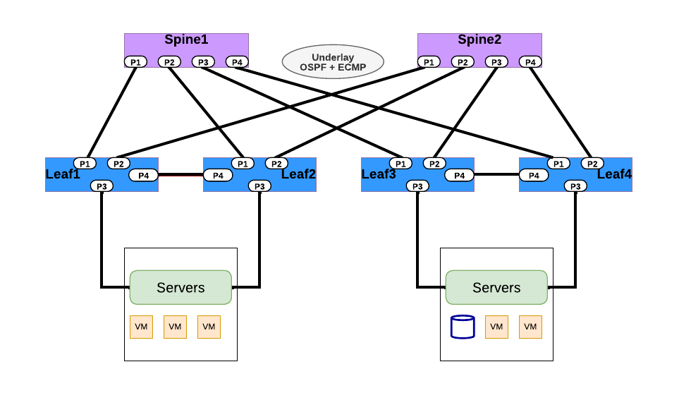
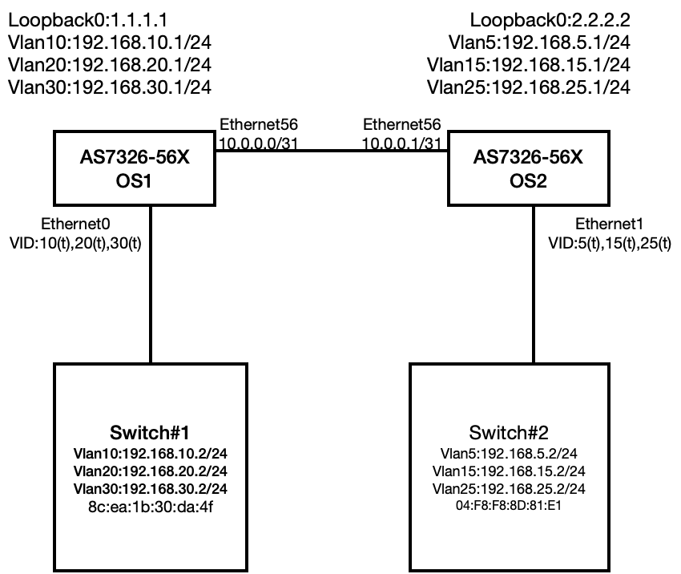

## <b> OSPF Routing </b>

<table>
<tr>
<th>PICOS</th>
<th>SONiC</th>
</tr>
<tr>
<th colspan='2'>OSPF Routing </th>
</tr>
<tr>
<td>
<b>#Configure OSPF routing</b>  
set protocols ospf router-id &lt;Router_ID> 
set protocols ospf area &lt;area-id> area-type <type> 
set protocols ospf area &lt;Aread_ID> 
set protocols ospf area &lt;Aread_ID>  area-type stub 
set protocols ospf area &lt;Aread_ID> area-type nssa 
set protocol ospf interface &lt;vlan-interface> area {&lt;ipv4>|&lt;0-4294967295>} 
set vlans vlan-id &lt;vlan-id>  l3-interface "vlan-number" 
set interface gigabit-ethernet ge-x/y/z family ethernet-switching native-vlan-id &lt;vlan-id> 
set interface gigabit-ethernet ge-x/y/z family ethernet-switching native-vlan-id &lt;vlan-id> 
 
set l3-interface vlan-interface vlan&lt;number> address &lt;IPV4_Address>  prefix-length &lt;Subnet> 
set l3-interface vlan-interface vlan&lt;number> address &lt;IPV4_Address>  prefix-length &lt;Subnet> 
set protocols ospf interface vlan-&lt;number> area &lt;aread_id> 
 
  
<b># Example Configuration - OSPF Routing</b>  
set protocols ospf router-id 1.1.1.1 
set protocols ospf area &lt;area-id> area-type <type> 
set protocols ospf area 0.0.0.0 
set protocols ospf area 1.1.1.1 area-type stub 
set protocols ospf area 2.2.2.2 area-type nssa 
set protocol ospf interface &lt;vlan-interface> area {&lt;ipv4>|&lt;0-4294967295>} 
 
set vlans vlan-id 20 l3-interface "vlan-20" 
set vlans vlan-id 30 l3-interface "vlan-30" 
set interface gigabit-ethernet ge-1/1/1 family ethernet-switching native-vlan-id 20 
 
set interface gigabit-ethernet ge-1/1/2 family ethernet-switching native-vlan-id 30 
 
set l3-interface vlan-interface vlan20 address 10.10.70.10 prefix-length 24 
set l3-interface vlan-interface vlan30 address 10.10.71.10 prefix-length 24 
 
set protocols ospf interface vlan-20 area 0.0.0.0 
set protocols ospf interface vlan-30 area 0.0.0.0 

</td>
<td>
<b>#Configure OSPF routing</b>  
<b>#Syntax</b>  
router ospf 
ospf router-id &lt;router-id> 
network &lt;Network_address>  area &lt;Area_number> 
network &lt;Network_address1>  area &lt;Area_number1> 
network &lt;Network_address2>  area &lt;Area_number2> 
 
<b>#Command to set OSPF time intervals</b> 
interface Ethernet&lt;interface> 
ip ospf hello-interval &lt;hello-interval-time-secs> 
ip ospf dead-interval &lt;dead-interval-time-secs> 
router ospf 
area &lt;aread_number> authentication 
</b>
<b># Command to set OSPF authentication key</b> 
interface Ethernet&lt;interface> 
ip ospf authentication 
ip ospf authentication-key &lt;key> 
 
<b># Command to set OSPF  MD5 Authentication</b>  
router ospf 
area 0 authentication message-digest 
interface Ethernet&lt;interface> 
ip ospf message-digest-key &lt;key> md5 &lt;key> 
 
<b># Command to configure OSPF Virtual links</b>  
router ospf 
area &lt;area_number>  virtual-link &lt;System_loopback> 
 
<b># Command to verify OSPF ip routes learned</b>  
show ip route 
 
<b># Configuration OSPF Routing </b> 
<b># Example</b> 
router ospf 
ospf router-id 1.1.1.1 
network 10.0.0.0/31 area 0 
network 192.168.10.0/24 area 0 
network 192.168.20.0/24 area 0 
network 192.168.30.0/24 area 0 
 
<b>#Enable OSPF hello timers under interface</b>  
<b>#Example</b>  
interface Ethernet56 
ip ospf hello-interval 20 
ip ospf dead-interval 20 
 
<b># Enable OSPF Authentication globally</b>  
<b>#Example</b>  
router ospf 
area 0 authentication 
 
<b># Enable OSPF Authentication over interface</b> 
<b>#Example</b>  
interface Ethernet56 
ip ospf authentication 
ip ospf authentication-key 123 
 
<b>#Enable OSPF MD5 Key </b> 
<b>#Example </b> 
router ospf 
area 0 authentication message-digest 
interface Ethernet56 
ip ospf message-digest-key 1 md5 123 
 
<b>#Verify Ip routing Table</b> 
<b>#Example </b> 
show ip route 
 
<b>#Configure OSPF virtual links</b> 
<b>#Example </b> 
 
router ospf 
area 1 virtual-link 3.3.3.3 
router ospf 
area 1 virtual-link 2.2.2.2

</td>
</tr>
</table>

  

<table>
<tr>
<th colspan='2'>PICOS</th>
</tr>
<tr>
<td colspan='2'>

<u><b>#AS7326-56X-OS1 Configuration</b> </u>
 
<b># VLAN and IP Configuration</b> 
config interface ip add Loopback0 1.1.1.1/32 
config vlan member add 10 Ethernet0 
config vlan member add 20 Ethernet0 
config vlan member add 30 Ethernet0 
config interface ip add Ethernet0.10 192.168.10.1/24 
config interface ip add Ethernet0.20 192.168.20.1/24 
config interface ip add Ethernet0.30 192.168.30.1/24 
config interface ip add Ethernet56 10.0.0.0/31 
 
<b>#OSPF Configuration</b> 
admin@sonic:~\$ vtysh
sonic(config)# router ospf 
sonic(config-router)# network 10.0.0.0/31 area 0 
sonic(config-router)# network 192.168.10.0/24 area 0 
sonic(config-router)# network 192.168.20.0/24 area 0 
sonic(config-router)# network 192.168.30.0/24 area 0 
 
<b>#OSPF Routing Verification Command</b> 
sonic# show ip ospf neighbor 
Neighbor ID&nbsp;&nbsp;&nbsp;&nbsp;Pri&nbsp;State&nbsp;&nbsp;&nbsp;&nbsp;&nbsp;&nbsp;&nbsp;&nbsp;&nbsp;Dead Time&nbsp;Address&nbsp;&nbsp;&nbsp;&nbsp;&nbsp;&nbsp;&nbsp;&nbsp;&nbsp;&nbsp;Interface&nbsp;&nbsp;&nbsp;&nbsp;&nbsp;&nbsp;&nbsp;&nbsp;&nbsp;&nbsp;&nbsp;&nbsp;&nbsp;&nbsp;RXmtL&nbsp;RqstL&nbsp;DBsmL 
192.168.25.1&nbsp;&nbsp;&nbsp;1&nbsp;Full/DR&nbsp;&nbsp;&nbsp;&nbsp;&nbsp;&nbsp;&nbsp;&nbsp;31.440s&nbsp;10.0.0.1&nbsp;&nbsp;&nbsp;&nbsp;&nbsp;&nbsp;&nbsp;&nbsp;&nbsp;&nbsp;Ethernet56:10.0.0.0 &nbsp;&nbsp;&nbsp;&nbsp;&nbsp;&nbsp;&nbsp;&nbsp;&nbsp;&nbsp;&nbsp;&nbsp;&nbsp;&nbsp;0     0     0 
 
sonic# show ip route 
Codes: K - kernel route, C - connected, S - static, R - RIP, 
       O - OSPF, I - IS-IS, B - BGP, E - EIGRP, N - NHRP, 
       T - Table, v - VNC, V - VNC-Direct, A - Babel, D - SHARP, 
       F - PBR, f - OpenFabric, 
       > - selected route, * - FIB route, q - queued route, r - rejected route 
K>* 0.0.0.0/0 [0/202] via 188.188.1.1, eth0, 00:07:45 
C>* 1.1.1.1/32 is directly connected, Loopback0, 00:07:25 
O   10.0.0.0/31 [110/10] is directly connected, Ethernet56, 00:06:42 
C>* 10.0.0.0/31 is directly connected, Ethernet56, 00:07:25 
C>* 188.188.0.0/16 is directly connected, eth0, 00:07:46 
O>* 192.168.5.0/24 [110/20] via 10.0.0.1, Ethernet56, 00:06:32 
O   192.168.10.0/24 [110/10] is directly connected, Vlan10, 00:04:54 
C>* 192.168.10.0/24 is directly connected, Vlan10, 00:07:24 
O>* 192.168.15.0/24 [110/20] via 10.0.0.1, Ethernet56, 00:06:32 
O   192.168.20.0/24 [110/10] is directly connected, Vlan20, 00:04:50 
C>* 192.168.20.0/24 is directly connected, Vlan20, 00:07:24 
O>* 192.168.25.0/24 [110/20] via 10.0.0.1, Ethernet56, 00:06:32 
O   192.168.30.0/24 [110/10] is directly connected, Vlan30, 00:04:47 
C>* 192.168.30.0/24 is directly connected, Vlan30, 00:07:24 
 
<b><u>#AS7326-56X-OS2 Configuration</u></b> 
<b># VLAN and IP Configuration</b> 
config interface ip add Loopback0 2.2.2.2/32 
config vlan member add 5 Ethernet0 
config vlan member add 15 Ethernet0 
config vlan member add 25 Ethernet0 
config interface ip add Ethernet0.5 192.168.51/24 
config interface ip add Ethernet0.15 192.168.15.1/24 
config interface ip add Ethernet0.25 192.168.25.1/24 
config interface ip add Ethernet56 10.0.0.1/31 
 
<b>#OSPF Configuration</b> 
admin@sonic:~$ vtysh 
sonic(config)# router ospf 
sonic(config-router)# network 10.0.0.0/31 area 0 
sonic(config-router)# network 192.168.5.0/24 area 0 
sonic(config-router)# network 192.168.15.0/24 area 0 
sonic(config-router)# network 192.168.25.0/24 area 0 
 
<b>#OSPF Routing Verification Command</b> 
OS2: 
sonic# show ip ospf neighbor 
Neighbor&nbsp;ID&nbsp;&nbsp;&nbsp;&nbsp;&nbsp;&nbsp;&Pri State&nbsp;&nbsp;&nbsp;&nbsp;&nbsp;&nbsp;&nbsp;&nbsp;&nbsp;Dead Time Address&nbsp;&nbsp;&nbsp;&nbsp;&nbsp;&nbsp;&nbsp;Interface&nbsp;&nbsp;&nbsp;&nbsp;&nbsp;&nbsp;&nbsp;&nbsp;&nbsp;&nbsp;&nbsp;&nbsp;&nbsp;&nbsp;&nbsp;&nbsp;&nbsp;&nbsp;&nbsp;&nbsp;&nbsp;RXmtL RqstL DBsmL 
188.188.98.39&nbsp;&nbsp;&nbsp;1 Full/Backup&nbsp;&nbsp;&nbsp;&nbsp;33.721s 10.0.0.0&nbsp;&nbsp;&nbsp;&nbsp;&nbsp;&nbsp;&nbsp;&nbsp;&nbsp;&nbsp;&nbsp;&nbsp;&nbsp;Ethernet56:10.0.0.1&nbsp;&nbsp;&nbsp;&nbsp;&nbsp;&nbsp;&nbsp;&nbsp;&nbsp;&nbsp;&nbsp;&nbsp;&nbsp;&nbsp;&nbsp;&nbsp;0     0     0 
 
<b>sonic# show ip route</b> 
Codes: K - kernel route, C - connected, S - static, R - RIP, 
       O - OSPF, I - IS-IS, B - BGP, E - EIGRP, N - NHRP, 
       T - Table, v - VNC, V - VNC-Direct, A - Babel, D - SHARP, 
       F - PBR, f - OpenFabric, 
       > - selected route, * - FIB route, q - queued route, r - rejected route 
K>* 0.0.0.0/0 [0/202] via 188.188.1.1, eth0, 02:15:38 
C>* 2.2.2.2/32 is directly connected, Loopback0, 02:15:18 
O   10.0.0.0/31 [110/10] is directly connected, Ethernet56, 00:08:47 
C>* 10.0.0.0/31 is directly connected, Ethernet56, 00:08:47 
C>* 188.188.0.0/16 is directly connected, eth0, 02:15:39 
O   192.168.5.0/24 [110/10] is directly connected, Vlan5, 00:35:34 
C>* 192.168.5.0/24 is directly connected, Vlan5, 00:35:34 
O>* 192.168.10.0/24 [110/20] via 10.0.0.0, Ethernet56, 00:06:14 
O   192.168.15.0/24 [110/10] is directly connected, Vlan15, 00:35:34 
C>* 192.168.15.0/24 is directly connected, Vlan15, 00:35:34 
O>* 192.168.20.0/24 [110/20] via 10.0.0.0, Ethernet56, 00:06:10 
O   192.168.25.0/24 [110/10] is directly connected, Vlan25, 00:35:34 
C>* 192.168.25.0/24 is directly connected, Vlan25, 00:35:34 
O>* 192.168.30.0/24 [110/20] via 10.0.0.0, Ethernet56, 00:06:07 

</td>
</tr>
</table>