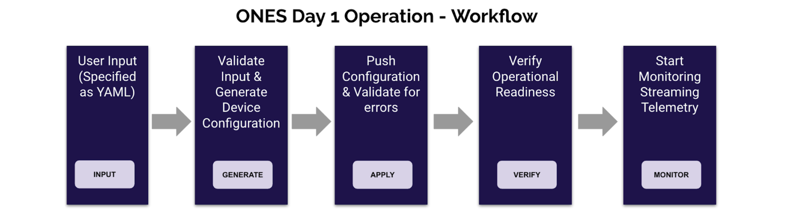

# <b> Overview - ONES Validated Designs </b>
## <b> ONES Validated Designs </b>

Aviz ONES has pre-validated templates for various data center fabric deployments using SONiC. The template defines the simplified configuration intent, which is then consumed by ONES fabric manager to orchestrate the network running SONiC on multi-vendor platforms. Following fabric deployments are validated using ONES Application-

- BGP-IP-CLOS
- BGP-IP-CLOS-MC LAG 
- L3-VXLAN + EVPN Symmetric IRB over MC-LAG
- L2-VXLAN + EVPN Asymmetric IRB over MC-LAG
- DCI (Data Center Interconnect) EVPN Multihoming
- Data Center Interconnect (DCI) EVPN Multihoming 
- Layer2 Leaf Spine Deployment  
- Rack-2-Rack Deployment
- Layer3  MC-LAG Deployment 
- Layer 3 Fabric with BGP over Port channel 
  
Sonic validated design fully integrates with Aviz ONES orchestration and supportability application which does configuration management life cycle for Day1 and Day2 operations . This includes the validation for the applied configurations to the  enrolled devices and configuration change control workflow  in a SONiC fabric .

