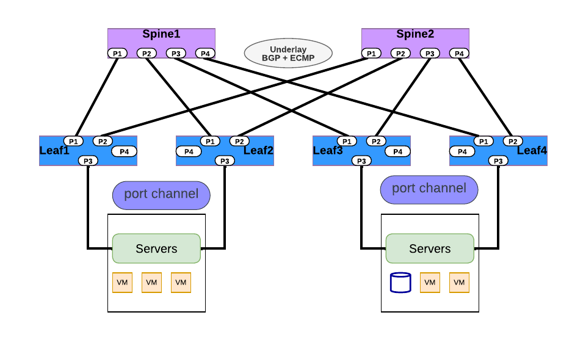
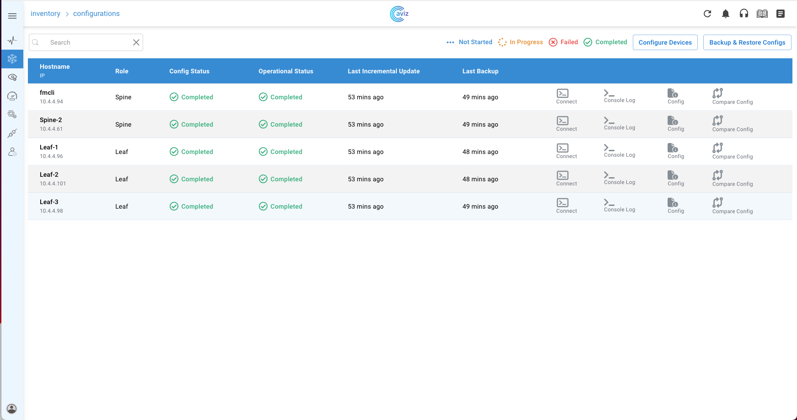

# <b>DCI EVPN Multihoming</b>
DCI EVPN Multihoming is a technology designed to enhance the reliability, redundancy, and load balancing capabilities of data center networks by allowing devices to connect to and utilize resources across multiple data center locations simultaneously. It leverages EVPN for efficient layer 2 and layer 3 connectivity and introduces multihoming concepts to achieve its goals.




<br />

## <b> YAML Template</b>

```yaml
Inventory:
  SSpines: 0
  Spines: 2
  Leafs: 4
  Tors: 0
Connectivity:
  SSpine: []
  Spine:
    - switchId: 1
      switchName: "Spine-1"
      ipAddress: "x.x.x.11"
      ASN: 2001
      Credentials:
        user: "admin"
        password: "admin"
      mclag:
      Links:
        - link: "S1_Ethernet0 | L1_Ethernet48"
          staticLink: true
          properties:
        - link: "S1_Ethernet4 | L2_Ethernet48"
          staticLink: true
          properties:
        - link: "S1_Ethernet8 | L3_Ethernet48"
          staticLink: true
          properties:
        - link: "S1_Ethernet12 | L4_Ethernet48"
          staticLink: true
          properties:
    - switchId: 2
      switchName: "Spine-2"
      ipAddress: "x.x.x.12"
      ASN: 2001
      Credentials:
        user: "admin"
        password: "admin"
      mclag:
      Links:
        - link: "S2_Ethernet0 | L1_Ethernet52"
          staticLink: true
          properties:
        - link: "S2_Ethernet4 | L2_Ethernet52"
          staticLink: true
          properties:
        - link: "S2_Ethernet8 | L3_Ethernet52"
          staticLink: true
          properties:
        - link: "S2_Ethernet12 | L4_Ethernet52"
          staticLink: true
          properties:
  Leaf:
    - switchId: 1
      switchName: "Leaf-1"
      ipAddress: "x.x.x.13"
      ASN: 2001
      Credentials:
        user: "admin"
        password: "admin"
      mclag:
      Links:
        - link: "L1_Ethernet48 | S1_Ethernet0"
          staticLink: true
          properties:
        - link: "L1_Ethernet52 | S2_Ethernet0"
          staticLink: true
          properties:
        - link: "L1_Ethernet56 |  L2_Ethernet56"
          staticLink: true
          properties:
        - link: "L1_Ethernet0 |  H1_Ethernet0"
          staticLink: true
          properties:
            mode: "L2-Trunk"
            vlan: 201
            mh_enabled: true
            mh_po_group: 201
        - link: "L1_Ethernet4 |  H2_Ethernet0"
          staticLink: true
          properties:
            mode: "L2-Trunk"
            vlan: 202
            mh_enabled: true
            mh_po_group: 202
    - switchId: 2
      switchName: "Leaf-2"
      ipAddress: "x.x.x.14"
      ASN: 2001
      Credentials:
        user: "admin"
        password: "admin"
      mclag:
      Links:
        - link: "L2_Ethernet48 | S1_Ethernet4"
          staticLink: true
          properties:
        - link: "L2_Ethernet52 | S2_Ethernet4"
          staticLink: true
          properties:
        - link: "L2_Ethernet56 | L1_Ethernet56"
          staticLink: true
          properties:
        - link: "L2_Ethernet0 |  H1_Ethernet1"
          staticLink: true
          properties:
            mode: "L2-Trunk"
            vlan: 201
            mh_enabled: true
            mh_po_group: 201
        - link: "L2_Ethernet4 |  H2_Ethernet1"
          staticLink: true
          properties:
            mode: "L2-Trunk"
            vlan: 202
            mh_enabled: true
            mh_po_group: 202
    - switchId: 3
      switchName: "Leaf-3"
      ipAddress: "x.x.x.15"
      ASN: 2001
      Credentials:
        user: "admin"
        password: "YourPaSsWoRd"
      mclag:
      Links:
        - link: "L3_Ethernet48 | S1_Ethernet8"
          staticLink: true
          properties:
        - link: "L3_Ethernet52 | S2_Ethernet8"
          staticLink: true
          properties:
        - link: "L3_Ethernet56 | L4_Ethernet56"
          staticLink: true
          properties:
        - link: "L3_Ethernet0 |  H3_Ethernet0"
          staticLink: true
          properties:
            mode: "L2-Trunk"
            vlan: 203
            mh_enabled: true
            mh_po_group: 203
        - link: "L3_Ethernet4 |  H4_Ethernet0"
          staticLink: true
          properties:
            mode: "L2-Trunk"
            vlan: 204
            mh_enabled: true
            mh_po_group: 204
    - switchId: 4
      switchName: "Leaf-4"
      ipAddress: "x.x.x.16"
      ASN: 2001
      Credentials:
        user: "admin"
        password: "YourPaSsWoRd"
      mclag:
      Links:
        - link: "L4_Ethernet48 | S1_Ethernet12"
          staticLink: true
          properties:
        - link: "L4_Ethernet52 | S2_Ethernet12"
          staticLink: true
          properties:
        - link: "L4_Ethernet56 | L3_Ethernet56"
          staticLink: true
          properties:
        - link: "L4_Ethernet0 |  H3_Ethernet1"
          staticLink: true
          properties:
            mode: "L2-Trunk"
            vlan: 203
            mh_enabled: true
            mh_po_group: 203
        - link: "L4_Ethernet4 |  H4_Ethernet1"
          staticLink: true
          properties:
            mode: "L2-Trunk"
            vlan: 204
            mh_enabled: true
            mh_po_group: 204
  Tor: []
BGP:
  BGP_U: false
  ND_RA: 30
PhysicalIfCfg:
  FEC: "Off"
  MTU: 9000
  AdminStatus: "Up"
ASN:
  SSpine: "10000-20000"
  Spine: "21000-50000"
  Leaf: "51000-60000"
  Tor: "61000-70000"
IPv4Pool:
  Loopback: "10.10.10.0/24"
  LeafSpine: "40.0.0.0/24"
  LeafTor: "39.0.0.0/24"
  Host: "49.0.0.0/24"
IPv6Pool:
  LeafSpine:
  LeafTor:
  Host:
NTP:
  server: "x.x.x.10"
  timezone: "Asia/Kolkata"
SYSLOG:
  server: "x.x.x.10"
SNMP:
  trapserver: "x.x.x.10"
Parameters:
  vlan: "200-205"
  vni: "20000-20005"
  anycast_gateway: "x.x.x.0/23"
  anycast_mac: "00:11:22:33:44:55"
  hosts_per_vlan: 10
  routing_symmetric: false
  sag: true

```

<br />

## <b> Config Applied and Validated</b>




## <b> Applied Configuration on Switches</b>

=== "Leaf1"

    ``` sh
    configure terminal
    router-id 10.10.10.2
    ntp add 10.101.118.10
    clock timezone Asia/Kolkata
    syslog add 10.101.118.10
    snmp-server trap modify 2 10.101.118.10 port 161 vrf None community Public
    hostname Leaf-1
    ip protocol bgp route-map RM_SET_SRC
    !
    route-map FMCLI_IPV6_NH_GLOBAL permit 1
    on-match next
    set ipv6 next-hop prefer-global
    !
    route-map RM_SET_SRC permit 10
    set src 10.10.10.2
    !
    vlan 200
    !
    vlan 201
    !
    vlan 202
    !
    vlan 203
    !
    vlan 204
    !
    vlan 205
    !
    vxlan vtep
    loopback-ip 10.10.10.3
    evpn_nvo nvo
    map vlan 200 vni 20000
    map vlan 201 vni 20001
    map vlan 202 vni 20002
    map vlan 203 vni 20003
    map vlan 204 vni 20004
    map vlan 205 vni 20005
    !
    interface port-channel 201
    switchport mode trunk
    switchport trunk allowed vlan add 201
    mtu 9000
    evpn-mh es-id 1 es-sys-mac 1c:f6:1a:7d:c7:82
    !
    interface port-channel 202
    switchport mode trunk
    switchport trunk allowed vlan add 202
    mtu 9000
    evpn-mh es-id 2 es-sys-mac b2:24:08:47:36:38
    !
    interface ethernet Ethernet0
    channel-group 201 mode active
    mtu 9000
    forward-error-correction none
    !
    interface ethernet Ethernet4
    channel-group 202 mode active
    mtu 9000
    forward-error-correction none
    !
    interface ethernet Ethernet48
    ip address 40.0.0.1/31
    mtu 9000
    forward-error-correction none
    evpn-mh uplink
    !
    interface ethernet Ethernet52
    ip address 40.0.0.9/31
    mtu 9000
    forward-error-correction none
    evpn-mh uplink
    !
    interface vlan 200
    anycast-gateway 100.10.0.1/26
    !
    interface vlan 201
    anycast-gateway 100.10.0.65/26
    !
    interface vlan 202
    anycast-gateway 100.10.0.129/26
    !
    interface vlan 203
    anycast-gateway 100.10.0.193/26
    !
    interface vlan 204
    anycast-gateway 100.10.1.1/26
    !
    interface vlan 205
    anycast-gateway 100.10.1.65/26
    !
    interface loopback 1
    ip address 10.10.10.2/32
    !
    interface loopback 2
    ip address 10.10.10.3/32
    !
    router bgp 2001
    neighbor 40.0.0.0 remote-as 2001
    neighbor 40.0.0.8 remote-as 2001
    neighbor 40.0.0.0 capability extended-nexthop
    neighbor 40.0.0.8 capability extended-nexthop
    bgp bestpath as-path multipath-relax
    no bgp ebgp-requires-policy
    address-family ipv4 unicast
    neighbor 40.0.0.0 allowas-in 1
    neighbor 40.0.0.8 allowas-in 1
    network 40.0.0.0/31
    network 40.0.0.8/31
    redistribute connected
    redistribute static
    !
    address-family ipv6 unicast
    redistribute connected
    redistribute static
    !
    address-family l2vpn evpn
    neighbor 40.0.0.0 activate
    neighbor 40.0.0.8 activate
    neighbor 40.0.0.0 allowas-in 1
    neighbor 40.0.0.8 allowas-in 1
    advertise-all-vni
    !
    sag
    anycast-gateway-mac 00:11:22:33:44:55
    enable ip
    enable ipv6
    !

    ```

=== "Leaf2"

    ``` sh
    configure terminal
    router-id 10.10.10.4
    ntp add 10.101.118.10
    clock timezone Asia/Kolkata
    syslog add 10.101.118.10
    snmp-server trap modify 2 10.101.118.10 port 161 vrf None community Public
    hostname Leaf-2
    ip protocol bgp route-map RM_SET_SRC
    !
    route-map FMCLI_IPV6_NH_GLOBAL permit 1
    on-match next
    set ipv6 next-hop prefer-global
    !
    route-map RM_SET_SRC permit 10
    set src 10.10.10.4
    !
    vlan 200
    !
    vlan 201
    !
    vlan 202
    !
    vlan 203
    !
    vlan 204
    !
    vlan 205
    !
    vxlan vtep
    loopback-ip 10.10.10.5
    evpn_nvo nvo
    map vlan 200 vni 20000
    map vlan 201 vni 20001
    map vlan 202 vni 20002
    map vlan 203 vni 20003
    map vlan 204 vni 20004
    map vlan 205 vni 20005
    !
    interface port-channel 201
    switchport mode trunk
    switchport trunk allowed vlan add 201
    mtu 9000
    evpn-mh es-id 1 es-sys-mac 1c:f6:1a:7d:c7:82
    !
    interface port-channel 202
    switchport mode trunk
    switchport trunk allowed vlan add 202
    mtu 9000
    evpn-mh es-id 2 es-sys-mac b2:24:08:47:36:38
    !
    interface ethernet Ethernet0
    channel-group 201 mode active
    mtu 9000
    forward-error-correction none
    !
    interface ethernet Ethernet4
    channel-group 202 mode active
    mtu 9000
    forward-error-correction none
    !
    interface ethernet Ethernet48
    ip address 40.0.0.3/31
    mtu 9000
    forward-error-correction none
    evpn-mh uplink
    !
    interface ethernet Ethernet52
    ip address 40.0.0.11/31
    mtu 9000
    forward-error-correction none
    evpn-mh uplink
    !
    interface vlan 200
    anycast-gateway 100.10.0.1/26
    !
    interface vlan 201
    anycast-gateway 100.10.0.65/26
    !
    interface vlan 202
    anycast-gateway 100.10.0.129/26
    !
    interface vlan 203
    anycast-gateway 100.10.0.193/26
    !
    interface vlan 204
    anycast-gateway 100.10.1.1/26
    !
    interface vlan 205
    anycast-gateway 100.10.1.65/26
    !
    interface loopback 1
    ip address 10.10.10.4/32
    !
    interface loopback 2
    ip address 10.10.10.5/32
    !
    router bgp 2001
    neighbor 40.0.0.10 remote-as 2001
    neighbor 40.0.0.2 remote-as 2001
    neighbor 40.0.0.10 capability extended-nexthop
    neighbor 40.0.0.2 capability extended-nexthop
    bgp bestpath as-path multipath-relax
    no bgp ebgp-requires-policy
    address-family ipv4 unicast
    neighbor 40.0.0.10 allowas-in 1
    neighbor 40.0.0.2 allowas-in 1
    network 40.0.0.10/31
    network 40.0.0.2/31
    redistribute connected
    redistribute static
    !
    address-family ipv6 unicast
    redistribute connected
    redistribute static
    !
    address-family l2vpn evpn
    neighbor 40.0.0.10 activate
    neighbor 40.0.0.2 activate
    neighbor 40.0.0.10 allowas-in 1
    neighbor 40.0.0.2 allowas-in 1
    advertise-all-vni
    !
    sag
    anycast-gateway-mac 00:11:22:33:44:55
    enable ip
    enable ipv6
    !

    ```

=== "Leaf3"

    ``` sh
    configure terminal
    router-id 10.10.10.6
    ntp add 10.101.118.10
    clock timezone Asia/Kolkata
    syslog add 10.101.118.10
    snmp-server trap modify 2 10.101.118.10 port 161 vrf None community Public
    hostname Leaf-3
    ip protocol bgp route-map RM_SET_SRC
    !
    route-map FMCLI_IPV6_NH_GLOBAL permit 1
    on-match next
    set ipv6 next-hop prefer-global
    !
    route-map RM_SET_SRC permit 10
    set src 10.10.10.6
    !
    vlan 200
    !
    vlan 201
    !
    vlan 202
    !
    vlan 203
    !
    vlan 204
    !
    vlan 205
    !
    vxlan vtep
    loopback-ip 10.10.10.7
    evpn_nvo nvo
    map vlan 200 vni 20000
    map vlan 201 vni 20001
    map vlan 202 vni 20002
    map vlan 203 vni 20003
    map vlan 204 vni 20004
    map vlan 205 vni 20005
    !
    interface port-channel 203
    switchport mode trunk
    switchport trunk allowed vlan add 203
    mtu 9000
    evpn-mh es-id 3 es-sys-mac 28:6f:43:ff:45:d0
    !
    interface port-channel 204
    switchport mode trunk
    switchport trunk allowed vlan add 204
    mtu 9000
    evpn-mh es-id 4 es-sys-mac 3c:b9:e1:0e:e8:0c
    !
    interface ethernet Ethernet0
    channel-group 203 mode active
    mtu 9000
    forward-error-correction none
    !
    interface ethernet Ethernet4
    channel-group 204 mode active
    mtu 9000
    forward-error-correction none
    !
    interface ethernet Ethernet48
    ip address 40.0.0.5/31
    mtu 9000
    forward-error-correction none
    evpn-mh uplink
    !
    interface ethernet Ethernet52
    ip address 40.0.0.13/31
    mtu 9000
    forward-error-correction none
    evpn-mh uplink
    !
    interface vlan 200
    anycast-gateway 100.10.0.1/26
    !
    interface vlan 201
    anycast-gateway 100.10.0.65/26
    !
    interface vlan 202
    anycast-gateway 100.10.0.129/26
    !
    interface vlan 203
    anycast-gateway 100.10.0.193/26
    !
    interface vlan 204
    anycast-gateway 100.10.1.1/26
    !
    interface vlan 205
    anycast-gateway 100.10.1.65/26
    !
    interface loopback 1
    ip address 10.10.10.6/32
    !
    interface loopback 2
    ip address 10.10.10.7/32
    !
    router bgp 2001
    neighbor 40.0.0.12 remote-as 2001
    neighbor 40.0.0.4 remote-as 2001
    neighbor 40.0.0.12 capability extended-nexthop
    neighbor 40.0.0.4 capability extended-nexthop
    bgp bestpath as-path multipath-relax
    no bgp ebgp-requires-policy
    address-family ipv4 unicast
    neighbor 40.0.0.12 allowas-in 1
    neighbor 40.0.0.4 allowas-in 1
    network 40.0.0.12/31
    network 40.0.0.4/31
    redistribute connected
    redistribute static
    !
    address-family ipv6 unicast
    redistribute connected
    redistribute static
    !
    address-family l2vpn evpn
    neighbor 40.0.0.12 activate
    neighbor 40.0.0.4 activate
    neighbor 40.0.0.12 allowas-in 1
    neighbor 40.0.0.4 allowas-in 1
    advertise-all-vni
    !
    sag
    anycast-gateway-mac 00:11:22:33:44:55
    enable ip
    enable ipv6
    !

    ```

=== "Leaf4"

    ``` sh
    configure terminal
    router-id 10.10.10.8
    ntp add 10.101.118.10
    clock timezone Asia/Kolkata
    syslog add 10.101.118.10
    snmp-server trap modify 2 10.101.118.10 port 161 vrf None community Public
    hostname Leaf-4
    ip protocol bgp route-map RM_SET_SRC
    !
    route-map FMCLI_IPV6_NH_GLOBAL permit 1
    on-match next
    set ipv6 next-hop prefer-global
    !
    route-map RM_SET_SRC permit 10
    set src 10.10.10.8
    !
    vlan 200
    !
    vlan 201
    !
    vlan 202
    !
    vlan 203
    !
    vlan 204
    !
    vlan 205
    !
    vxlan vtep
    loopback-ip 10.10.10.9
    evpn_nvo nvo
    map vlan 200 vni 20000
    map vlan 201 vni 20001
    map vlan 202 vni 20002
    map vlan 203 vni 20003
    map vlan 204 vni 20004
    map vlan 205 vni 20005
    !
    interface port-channel 203
    switchport mode trunk
    switchport trunk allowed vlan add 203
    mtu 9000
    evpn-mh es-id 3 es-sys-mac 28:6f:43:ff:45:d0
    !
    interface port-channel 204
    switchport mode trunk
    switchport trunk allowed vlan add 204
    mtu 9000
    evpn-mh es-id 4 es-sys-mac 3c:b9:e1:0e:e8:0c
    !
    interface ethernet Ethernet0
    channel-group 203 mode active
    mtu 9000
    forward-error-correction none
    !
    interface ethernet Ethernet4
    channel-group 204 mode active
    mtu 9000
    forward-error-correction none
    !
    interface ethernet Ethernet48
    ip address 40.0.0.7/31
    mtu 9000
    forward-error-correction none
    evpn-mh uplink
    !
    interface ethernet Ethernet52
    ip address 40.0.0.15/31
    mtu 9000
    forward-error-correction none
    evpn-mh uplink
    !
    interface vlan 200
    anycast-gateway 100.10.0.1/26
    !
    interface vlan 201
    anycast-gateway 100.10.0.65/26
    !
    interface vlan 202
    anycast-gateway 100.10.0.129/26
    !
    interface vlan 203
    anycast-gateway 100.10.0.193/26
    !
    interface vlan 204
    anycast-gateway 100.10.1.1/26
    !
    interface vlan 205
    anycast-gateway 100.10.1.65/26
    !
    interface loopback 1
    ip address 10.10.10.8/32
    !
    interface loopback 2
    ip address 10.10.10.9/32
    !
    router bgp 2001
    neighbor 40.0.0.14 remote-as 2001
    neighbor 40.0.0.6 remote-as 2001
    neighbor 40.0.0.14 capability extended-nexthop
    neighbor 40.0.0.6 capability extended-nexthop
    bgp bestpath as-path multipath-relax
    no bgp ebgp-requires-policy
    address-family ipv4 unicast
    neighbor 40.0.0.14 allowas-in 1
    neighbor 40.0.0.6 allowas-in 1
    network 40.0.0.14/31
    network 40.0.0.6/31
    redistribute connected
    redistribute static
    !
    address-family ipv6 unicast
    redistribute connected
    redistribute static
    !
    address-family l2vpn evpn
    neighbor 40.0.0.14 activate
    neighbor 40.0.0.6 activate
    neighbor 40.0.0.14 allowas-in 1
    neighbor 40.0.0.6 allowas-in 1
    advertise-all-vni
    !
    sag
    anycast-gateway-mac 00:11:22:33:44:55
    enable ip
    enable ipv6
    !

    ```

=== "Spine1"

    ``` sh
    configure terminal
    router-id 10.10.10.0
    ntp add 10.101.118.10
    clock timezone Asia/Kolkata
    syslog add 10.101.118.10
    snmp-server trap modify 2 10.101.118.10 port 161 vrf None community Public
    hostname Spine-1
    ip protocol bgp route-map RM_SET_SRC
    !
    route-map FMCLI_IPV6_NH_GLOBAL permit 1
    on-match next
    set ipv6 next-hop prefer-global
    !
    route-map RM_SET_SRC permit 10
    set src 10.10.10.0
    !
    interface ethernet Ethernet0
    ip address 40.0.0.0/31
    mtu 9000
    forward-error-correction none
    !
    interface ethernet Ethernet12
    ip address 40.0.0.6/31
    mtu 9000
    forward-error-correction none
    !
    interface ethernet Ethernet4
    ip address 40.0.0.2/31
    mtu 9000
    forward-error-correction none
    !
    interface ethernet Ethernet8
    ip address 40.0.0.4/31
    mtu 9000
    forward-error-correction none
    !
    interface loopback 1
    ip address 10.10.10.0/32
    !
    router bgp 2001
    neighbor 40.0.0.1 remote-as 2001
    neighbor 40.0.0.3 remote-as 2001
    neighbor 40.0.0.5 remote-as 2001
    neighbor 40.0.0.7 remote-as 2001
    neighbor 40.0.0.1 capability extended-nexthop
    neighbor 40.0.0.3 capability extended-nexthop
    neighbor 40.0.0.5 capability extended-nexthop
    neighbor 40.0.0.7 capability extended-nexthop
    bgp bestpath as-path multipath-relax
    no bgp ebgp-requires-policy
    address-family ipv4 unicast
    neighbor 40.0.0.1 allowas-in 1
    neighbor 40.0.0.3 allowas-in 1
    neighbor 40.0.0.5 allowas-in 1
    neighbor 40.0.0.7 allowas-in 1
    neighbor 40.0.0.1 route-reflector-client
    neighbor 40.0.0.3 route-reflector-client
    neighbor 40.0.0.5 route-reflector-client
    neighbor 40.0.0.7 route-reflector-client
    neighbor 40.0.0.1 next-hop-self force
    neighbor 40.0.0.3 next-hop-self force
    neighbor 40.0.0.5 next-hop-self force
    neighbor 40.0.0.7 next-hop-self force
    network 40.0.0.0/31
    network 40.0.0.2/31
    network 40.0.0.4/31
    network 40.0.0.6/31
    redistribute connected
    redistribute static
    !
    address-family ipv6 unicast
    redistribute connected
    redistribute static
    !
    address-family l2vpn evpn
    neighbor 40.0.0.1 activate
    neighbor 40.0.0.3 activate
    neighbor 40.0.0.5 activate
    neighbor 40.0.0.7 activate
    neighbor 40.0.0.1 allowas-in 1
    neighbor 40.0.0.3 allowas-in 1
    neighbor 40.0.0.5 allowas-in 1
    neighbor 40.0.0.7 allowas-in 1
    neighbor 40.0.0.1 route-reflector-client
    neighbor 40.0.0.3 route-reflector-client
    neighbor 40.0.0.5 route-reflector-client
    neighbor 40.0.0.7 route-reflector-client
    neighbor 40.0.0.1 next-hop-self force
    neighbor 40.0.0.3 next-hop-self force
    neighbor 40.0.0.5 next-hop-self force
    neighbor 40.0.0.7 next-hop-self force
    !

    ```

=== "Spine2"

    ``` sh
    configure terminal
    router-id 10.10.10.1
    ntp add 10.101.118.10
    clock timezone Asia/Kolkata
    syslog add 10.101.118.10
    snmp-server trap modify 2 10.101.118.10 port 161 vrf None community Public
    hostname Spine-2
    ip protocol bgp route-map RM_SET_SRC
    !
    route-map FMCLI_IPV6_NH_GLOBAL permit 1
    on-match next
    set ipv6 next-hop prefer-global
    !
    route-map RM_SET_SRC permit 10
    set src 10.10.10.1
    !
    interface ethernet Ethernet0
    ip address 40.0.0.8/31
    mtu 9000
    forward-error-correction none
    !
    interface ethernet Ethernet12
    ip address 40.0.0.14/31
    mtu 9000
    forward-error-correction none
    !
    interface ethernet Ethernet4
    ip address 40.0.0.10/31
    mtu 9000
    forward-error-correction none
    !
    interface ethernet Ethernet8
    ip address 40.0.0.12/31
    mtu 9000
    forward-error-correction none
    !
    interface loopback 1
    ip address 10.10.10.1/32
    !
    router bgp 2001
    neighbor 40.0.0.11 remote-as 2001
    neighbor 40.0.0.13 remote-as 2001
    neighbor 40.0.0.15 remote-as 2001
    neighbor 40.0.0.9 remote-as 2001
    neighbor 40.0.0.11 capability extended-nexthop
    neighbor 40.0.0.13 capability extended-nexthop
    neighbor 40.0.0.15 capability extended-nexthop
    neighbor 40.0.0.9 capability extended-nexthop
    bgp bestpath as-path multipath-relax
    no bgp ebgp-requires-policy
    address-family ipv4 unicast
    neighbor 40.0.0.11 allowas-in 1
    neighbor 40.0.0.13 allowas-in 1
    neighbor 40.0.0.15 allowas-in 1
    neighbor 40.0.0.9 allowas-in 1
    neighbor 40.0.0.11 route-reflector-client
    neighbor 40.0.0.13 route-reflector-client
    neighbor 40.0.0.15 route-reflector-client
    neighbor 40.0.0.9 route-reflector-client
    neighbor 40.0.0.11 next-hop-self force
    neighbor 40.0.0.13 next-hop-self force
    neighbor 40.0.0.15 next-hop-self force
    neighbor 40.0.0.9 next-hop-self force
    network 40.0.0.10/31
    network 40.0.0.12/31
    network 40.0.0.14/31
    network 40.0.0.8/31
    redistribute connected
    redistribute static
    !
    address-family ipv6 unicast
    redistribute connected
    redistribute static
    !
    address-family l2vpn evpn
    neighbor 40.0.0.11 activate
    neighbor 40.0.0.13 activate
    neighbor 40.0.0.15 activate
    neighbor 40.0.0.9 activate
    neighbor 40.0.0.11 allowas-in 1
    neighbor 40.0.0.13 allowas-in 1
    neighbor 40.0.0.15 allowas-in 1
    neighbor 40.0.0.9 allowas-in 1
    neighbor 40.0.0.11 route-reflector-client
    neighbor 40.0.0.13 route-reflector-client
    neighbor 40.0.0.15 route-reflector-client
    neighbor 40.0.0.9 route-reflector-client
    neighbor 40.0.0.11 next-hop-self force
    neighbor 40.0.0.13 next-hop-self force
    neighbor 40.0.0.15 next-hop-self force
    neighbor 40.0.0.9 next-hop-self force
    !

    ```
