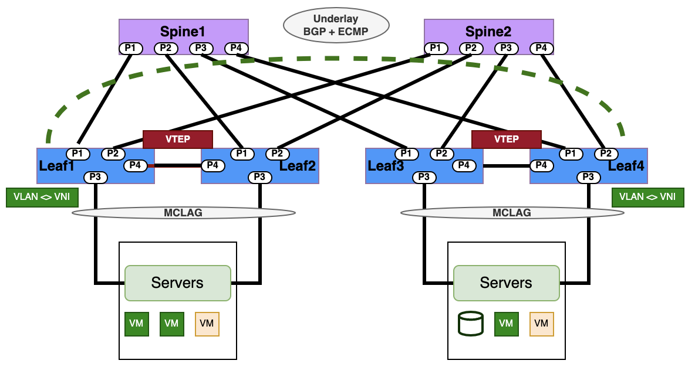
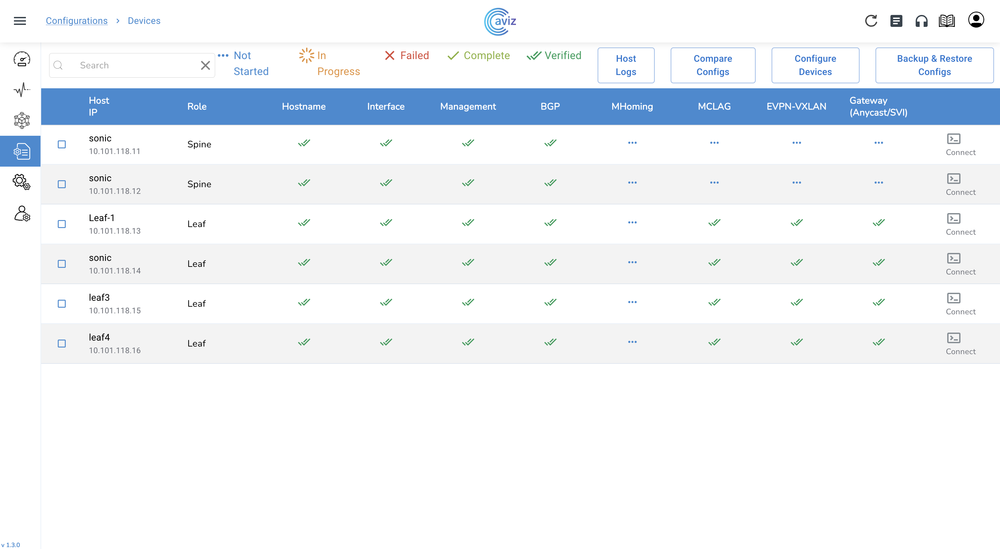

# L2 VXLAN + EVPN Asymmetric IRB over MC-LAG

With the asymmetric model, leaf devices serving as VXLAN tunnel endpoints (VTEPs) perform both  routing  and bridging  to initiate the VXLAN tunnel (tunnel ingress). 

With this model, VXLAN traffic must use the destination L2 VNI in each direction. The source VTEP always routes the traffic to the destination VLAN and sends it using the destination L2 VNI. When the traffic arrives at the destination VTEP then the leaf device forwards the traffic to the destination VLAN.

Operators have to configure all source and destination VLANs and their corresponding L2VNI values on each leaf switch even if a leaf switch does not host traffic for some of those VLANs. As a result, this model has scaling issues when the network has a large number of VLANs. However, when Data centers operations have fewer VLANs, this model will have lower latency over the L3VNI symmetric model. 




## Configuration

In a "L2 VXLAN EVPN with MC LAG”  Data Center fabric topology, the configuration sequence involves setting up the necessary components to enable Layer 2 VXLAN with EBGP EVPN over MC LAG interfaces . Following are  the summarized configuration sequence:


### IP Addressing and EBGP Underlay Configuration:
- Assign IP addresses to all the switches participating in the fabric. 
- Configure the underlay routing protocol (usually EBGP) between the spine switches and the leaf switches to establish an IP reachability.
- Establish eBGP  routing protocols  to exchange routing information between the data center sites.

### Overlay VXLAN Tunnel Interface Configuration:
- Create a VXLAN tunnel interface over  each leaf switch to serve as the endpoint for VXLAN traffic. Assign an IP address to each tunnel interface.


### MC-LAG Configuration:

- Enable MCLAG on the leaf switches. Configure the MC LAG system ID and dual peering links between the MC LAG peer switches.
- Set up a dedicated link between the MC LAG peer switches for control plane communication.
- Configure MC LAG interfaces on each  of the leaf switches  to bundle the physical links connected to servers.
- VLAN Configuration on MC LAG Interfaces -  Apply the VLANs that need to be extended over the VXLAN fabric to the MC LAG interfaces.


### VLAN-to-VNI Mapping:

- Create a VLAN-to-VNI (VXLAN Network Identifier) mapping on all the leaf switches in the DC fabric. This maps VLANs to VXLAN segments (VNIs) that will be used for VXLAN encapsulation.
- Configure VLAN-to-VNI (VXLAN Network Identifier) mapping to associate each VLAN in the data center with a specific VNI for Layer 2 extension.
- Configure the designated ingress and egress  leaf switches with  VXLAN VTEP (VXLAN Tunnel Endpoint). This involves associating the VXLAN tunnel interface with the VLAN-to-VNI mapping.


### BGP EVPN Configuration:

- Enable BGP EVPN on each leaf switch and establish a BGP peering relationship with the other leaf switches.
- Configure the BGP EVPN address family and activate the BGP EVPN signaling
- Enable  BGP with EVPN address family to exchange MAC and IP reachability information across the VXLAN fabric between data center sites.

### Scenarios for L2 VXLAN Asymmetric Model

- Data Center Fabric networks which  leverages centralized gateway models.
- Small and medium scale data center deployments with low latency use cases. 


### YAML template

```yaml
Inventory:
  SSpines: 0
  Spines: 2
  Leafs: 4
  Tors: 0
Connectivity:
  SSpine: []
  Spine:
    - switchId: 1
      switchName: "Spine-1"
      ipAddress: "10.101.118.11"
      ASN: 2001
      Credentials:
        user: "admin"
        password: "Edge-core"
      mclag:
      Links:
        - link: "S1_Ethernet0 | L1_Ethernet48"
          staticLink: true
          properties:
        - link: "S1_Ethernet4 | L2_Ethernet48"
          staticLink: true
          properties:
        - link: "S1_Ethernet8 | L3_Ethernet48"
          staticLink: true
          properties:
        - link: "S1_Ethernet12 | L4_Ethernet48"
          staticLink: true
          properties:
    - switchId: 2
      switchName: "Spine-2"
      ipAddress: "10.101.118.12"
      ASN: 2002
      Credentials:
        user: "admin"
        password: "Edge-core"
      mclag:
      Links:
        - link: "S2_Ethernet0 | L1_Ethernet52"
          staticLink: true
          properties:
        - link: "S2_Ethernet4 | L2_Ethernet52"
          staticLink: true
          properties:
        - link: "S2_Ethernet8 | L3_Ethernet52"
          staticLink: true
          properties:
        - link: "S2_Ethernet12 | L4_Ethernet52"
          staticLink: true
          properties:
  Leaf:
    - switchId: 1
      switchName: "Leaf-1"
      ipAddress: "10.101.118.13"
      ASN: 1001
      Credentials:
        user: "admin"
        password: "Edge-core"
      mclag:
        enabled: true
        peer: "L2"
        keepalive_vlan: 10
      Links:
        - link: "L1_Ethernet48 | S1_Ethernet0"
          staticLink: true
          properties:
        - link: "L1_Ethernet52 | S2_Ethernet0"
          staticLink: true
          properties:
        - link: "L1_Ethernet56 |  L2_Ethernet56"
          staticLink: true
          properties:
        - link: "L1_Ethernet0 |  H1_Ethernet0"
          staticLink: true
          properties:
            mode: "L2-Trunk"
            vlan: 201
            mc_po_group: 201
        - link: "L1_Ethernet4 |  H2_Ethernet0"
          staticLink: true
          properties:
            mode: "L2-Trunk"
            vlan: 202
            mc_po_group: 202
    - switchId: 2
      switchName: "Leaf-2"
      ipAddress: "10.101.118.14"
      ASN: 1001
      Credentials:
        user: "admin"
        password: "Edge-core"
      mclag:
        enabled: true
        peer: "L1"
        keepalive_vlan: 10
      Links:
        - link: "L2_Ethernet48 | S1_Ethernet4"
          staticLink: true
          properties:
        - link: "L2_Ethernet52 | S2_Ethernet4"
          staticLink: true
          properties:
        - link: "L2_Ethernet56 | L1_Ethernet56"
          staticLink: true
          properties:
        - link: "L2_Ethernet0 |  H1_Ethernet1"
          staticLink: true
          properties:
            mode: "L2-Trunk"
            vlan: 201
            mc_po_group: 201
        - link: "L2_Ethernet4 |  H2_Ethernet1"
          staticLink: true
          properties:
            mode: "L2-Trunk"
            vlan: 202
            mc_po_group: 202
    - switchId: 3
      switchName: "Leaf-3"
      ipAddress: "10.101.118.15"
      ASN: 1002
      Credentials:
        user: "admin"
        password: "YourPaSsWoRd"
      mclag:
        enabled: true
        peer: "L4"
        keepalive_vlan: 10
      Links:
        - link: "L3_Ethernet48 | S1_Ethernet8"
          staticLink: true
          properties:
        - link: "L3_Ethernet52 | S2_Ethernet8"
          staticLink: true
          properties:
        - link: "L3_Ethernet56 | L4_Ethernet56"
          staticLink: true
          properties:
        - link: "L3_Ethernet0 |  H3_Ethernet0"
          staticLink: true
          properties:
            mode: "L2-Trunk"
            vlan: 203
            mc_po_group: 203
        - link: "L3_Ethernet4 |  H4_Ethernet0"
          staticLink: true
          properties:
            mode: "L2-Trunk"
            vlan: 204
            mc_po_group: 204
- switchId: 4
      switchName: "Leaf-4"
      ipAddress: "10.101.118.16"
      ASN: 1002
      Credentials:
        user: "admin"
        password: "YourPaSsWoRd"
      mclag:
        enabled: true
        peer: "L3"
        keepalive_vlan: 10
      Links:
        - link: "L4_Ethernet48 | S1_Ethernet12"
          staticLink: true
          properties:
        - link: "L4_Ethernet52 | S2_Ethernet12"
          staticLink: true
          properties:
        - link: "L4_Ethernet56 | L3_Ethernet56"
          staticLink: true
          properties:
        - link: "L4_Ethernet0 |  H3_Ethernet1"
          staticLink: true
          properties:
            mode: "L2-Trunk"
            vlan: 203
            mc_po_group: 203
        - link: "L4_Ethernet4 |  H4_Ethernet1"
          staticLink: true
          properties:
            mode: "L2-Trunk"
            vlan: 204
            mc_po_group: 204
  Tor: []
BGP:
  BGP_U: false
  ND_RA: 30
PhysicalIfCfg:
  FEC: "Off"
  MTU: 9000
  AdminStatus: "Up"
ASN:
  SSpine: "10000-20000"
  Spine: "21000-50000"
  Leaf: "51000-60000"
  Tor: "61000-70000"
IPv4Pool:
  Loopback: "10.10.10.0/24"
  LeafSpine: "40.0.0.0/24"
  LeafTor: "39.0.0.0/24"
  Host: "49.0.0.0/24"
IPv6Pool:
  LeafSpine:
  LeafTor:
  Host:
NTP:
  server: "10.101.118.10"
  timezone: "Asia/Kolkata"
SYSLOG:
  server: "10.101.118.10"
SNMP:
  trapserver: "10.101.118.10"
Parameters:
  vlan: "200-205"
  vni: "20000-20005"
  anycast_gateway: "100.10.0.0/23"
  anycast_mac: "00:11:22:33:44:55"
 hosts_per_vlan: 10
  routing_symmetric: false
  sag: true

```
### Config Applied and Verified



### Applied Configuration on Switches

=== "Leaf1"

    ``` sh
    configure terminal
    router-id 10.10.10.3
    ntp add 10.101.118.10
    clock timezone Asia/Kolkata
    syslog add 10.101.118.10
    snmp-server trap modify 2 10.101.118.10 port 161 vrf None community Public
    hostname Leaf-1
    ip protocol bgp route-map RM_SET_SRC
    !
    route-map FMCLI_IPV6_NH_GLOBAL permit 1
    on-match next
    set ipv6 next-hop prefer-global
    !
    route-map RM_SET_SRC permit 10
    set src 10.10.10.3
    !
    vlan 10
    !
    vlan 200
    !
    vlan 201
    !
    vlan 202
    !
    vlan 203
    !
    vlan 204
    !
    vlan 205
    !
    vxlan vtep
    loopback-ip 10.10.10.2
    evpn_nvo nvo
    map vlan 200 vni 20000
    map vlan 201 vni 20001
    map vlan 202 vni 20002
    map vlan 203 vni 20003
    map vlan 204 vni 20004
    map vlan 205 vni 20005
    !
    interface port-channel 201
    switchport mode trunk
    switchport trunk allowed vlan add 201
    mtu 9000
    !
    interface port-channel 202
    switchport mode trunk
    switchport trunk allowed vlan add 202
    mtu 9000
    !
    interface port-channel 999
    switchport mode trunk
    switchport trunk allowed vlan add 10
    switchport trunk allowed vlan add 201
    switchport trunk allowed vlan add 202
    mtu 9000
    !
    interface ethernet Ethernet0
    channel-group 201 mode active
    mtu 9000
    forward-error-correction none
    !
    interface ethernet Ethernet4
    channel-group 202 mode active
    mtu 9000
    forward-error-correction none
    !
    interface ethernet Ethernet48
    ip address 40.0.0.1/31
    mtu 9000
    forward-error-correction none
    !
    interface ethernet Ethernet52
    ip address 40.0.0.9/31
    mtu 9000
    forward-error-correction none
    !
    interface ethernet Ethernet56
    channel-group 999 mode active
    mtu 9000
    forward-error-correction none
    !
    interface vlan 10
    ip address 192.168.0.0/31
    !
    interface vlan 200
    anycast-gateway 100.10.0.1/26
    !
    interface vlan 201
    anycast-gateway 100.10.0.65/26
    !
    interface vlan 202
    anycast-gateway 100.10.0.129/26
    !
    interface vlan 203
    anycast-gateway 100.10.0.193/26
    !
    interface vlan 204
    anycast-gateway 100.10.1.1/26
    !
    interface vlan 205
    anycast-gateway 100.10.1.65/26
    !
    interface loopback 1
    ip address 10.10.10.3/32
    !
    interface loopback 2
    ip address 10.10.10.2/32
    !
    router bgp 1001
    neighbor 40.0.0.0 remote-as 2001
    neighbor 40.0.0.8 remote-as 2002
    neighbor 40.0.0.0 capability extended-nexthop
    neighbor 40.0.0.8 capability extended-nexthop
    bgp bestpath as-path multipath-relax
    no bgp ebgp-requires-policy
    address-family ipv4 unicast
      neighbor 40.0.0.0 allowas-in 1
      neighbor 40.0.0.8 allowas-in 1
      network 40.0.0.0/31
      network 40.0.0.8/31
      redistribute connected
      redistribute static
    !
    address-family ipv6 unicast
      redistribute connected
      redistribute static
    !
    address-family l2vpn evpn
    neighbor 40.0.0.0 activate
    neighbor 40.0.0.8 activate
    neighbor 40.0.0.0 allowas-in 1
    neighbor 40.0.0.8 allowas-in 1
    advertise-all-vni
    !
    mlag domain-id 1
    peer-address 192.168.0.1
    peer-link port-channel 999
    src-address 192.168.0.0
    member port-channel 201
    member port-channel 202
    local-interface vlan 10
    !
    sag
    anycast-gateway-mac 00:11:22:33:44:55
    enable ip
    enable ipv6
    !
    ```

=== "Leaf2"

    ``` sh
    configure terminal
    router-id 10.10.10.4
    ntp add 10.101.118.10
    clock timezone Asia/Kolkata
    syslog add 10.101.118.10
    snmp-server trap modify 2 10.101.118.10 port 161 vrf None community Public
    hostname Leaf-2
    ip protocol bgp route-map RM_SET_SRC
    !
    route-map FMCLI_IPV6_NH_GLOBAL permit 1
    on-match next
    set ipv6 next-hop prefer-global
    !
    route-map RM_SET_SRC permit 10
    set src 10.10.10.4
    !
    vlan 10
    !
    vlan 200
    !
    vlan 201
    !
    vlan 202
    !
    vlan 203
    !
    vlan 204
    !
    vlan 205
    !
    vxlan vtep
    loopback-ip 10.10.10.2
    evpn_nvo nvo
    map vlan 200 vni 20000
    map vlan 201 vni 20001
    map vlan 202 vni 20002
    map vlan 203 vni 20003
    map vlan 204 vni 20004
    map vlan 205 vni 20005
    !
    interface port-channel 201
    switchport mode trunk
    switchport trunk allowed vlan add 201
    mtu 9000
    !
    interface port-channel 202
    switchport mode trunk
    switchport trunk allowed vlan add 202
    mtu 9000
    !
    interface port-channel 999
    switchport mode trunk
    switchport trunk allowed vlan add 10
    switchport trunk allowed vlan add 201
    switchport trunk allowed vlan add 202
    mtu 9000
    !
    interface ethernet Ethernet0
    channel-group 201 mode active
    mtu 9000
    forward-error-correction none
    !
    interface ethernet Ethernet4
    channel-group 202 mode active
    mtu 9000
    forward-error-correction none
    !
    interface ethernet Ethernet48
    ip address 40.0.0.3/31
    mtu 9000
    forward-error-correction none
    !
    interface ethernet Ethernet52
    ip address 40.0.0.11/31
    mtu 9000
    forward-error-correction none
    !
    interface ethernet Ethernet56
    channel-group 999 mode active
    mtu 9000
    forward-error-correction none
    !
    interface vlan 10
    ip address 192.168.0.1/31
    !
    interface vlan 200
    anycast-gateway 100.10.0.1/26
    !
    interface vlan 201
    anycast-gateway 100.10.0.65/26
    !
    interface vlan 202
    anycast-gateway 100.10.0.129/26
    !
    interface vlan 203
    anycast-gateway 100.10.0.193/26
    !
    interface vlan 204
    anycast-gateway 100.10.1.1/26
    !
    interface vlan 205
    anycast-gateway 100.10.1.65/26
    !
    interface loopback 1
    ip address 10.10.10.4/32
    !
    interface loopback 2
    ip address 10.10.10.2/32
    !
    router bgp 1001
    neighbor 40.0.0.10 remote-as 2002
    neighbor 40.0.0.2 remote-as 2001
    neighbor 40.0.0.10 capability extended-nexthop
    neighbor 40.0.0.2 capability extended-nexthop
    bgp bestpath as-path multipath-relax
    no bgp ebgp-requires-policy
    address-family ipv4 unicast
      neighbor 40.0.0.10 allowas-in 1
      neighbor 40.0.0.2 allowas-in 1
      network 40.0.0.10/31
      network 40.0.0.2/31
      redistribute connected
      redistribute static
    !
    address-family ipv6 unicast
      redistribute connected
      redistribute static
    !
    address-family l2vpn evpn
    neighbor 40.0.0.10 activate
    neighbor 40.0.0.2 activate
    neighbor 40.0.0.10 allowas-in 1
    neighbor 40.0.0.2 allowas-in 1
    advertise-all-vni
    !
    mlag domain-id 1
    peer-address 192.168.0.0
    peer-link port-channel 999
    src-address 192.168.0.1
    member port-channel 201
    member port-channel 202
    local-interface vlan 10
    !
    sag
    anycast-gateway-mac 00:11:22:33:44:55
    enable ip
    enable ipv6
    !
    ```

=== "Leaf3"

    ``` sh
    configure terminal
    router-id 10.10.10.6
    ntp add 10.101.118.10
    clock timezone Asia/Kolkata
    syslog add 10.101.118.10
    snmp-server trap modify 2 10.101.118.10 port 161 vrf None community Public
    hostname Leaf-3
    ip protocol bgp route-map RM_SET_SRC
    !
    route-map FMCLI_IPV6_NH_GLOBAL permit 1
    on-match next
    set ipv6 next-hop prefer-global
    !
    route-map RM_SET_SRC permit 10
    set src 10.10.10.6
    !
    vlan 10
    !
    vlan 200
    !
    vlan 201
    !
    vlan 202
    !
    vlan 203
    !
    vlan 204
    !
    vlan 205
    !
    vxlan vtep
    loopback-ip 10.10.10.5
    evpn_nvo nvo
    map vlan 200 vni 20000
    map vlan 201 vni 20001
    map vlan 202 vni 20002
    map vlan 203 vni 20003
    map vlan 204 vni 20004
    map vlan 205 vni 20005
    !
    interface port-channel 203
    switchport mode trunk
    switchport trunk allowed vlan add 203
    mtu 9000
    !
    interface port-channel 204
    switchport mode trunk
    switchport trunk allowed vlan add 204
    mtu 9000
    !
    interface port-channel 999
    switchport mode trunk
    switchport trunk allowed vlan add 10
    switchport trunk allowed vlan add 203
    switchport trunk allowed vlan add 204
    mtu 9000
    !
    interface ethernet Ethernet0
    channel-group 203 mode active
    mtu 9000
    forward-error-correction none
    !
    interface ethernet Ethernet4
    channel-group 204 mode active
    mtu 9000
    forward-error-correction none
    !
    interface ethernet Ethernet48
    ip address 40.0.0.5/31
    mtu 9000
    forward-error-correction none
    !
    interface ethernet Ethernet52
    ip address 40.0.0.13/31
    mtu 9000
    forward-error-correction none
    !
    interface ethernet Ethernet56
    channel-group 999 mode active
    mtu 9000
    forward-error-correction none
    !
    interface vlan 10
    ip address 192.168.0.2/31
    !
    interface vlan 200
    anycast-gateway 100.10.0.1/26
    !
    interface vlan 201
    anycast-gateway 100.10.0.65/26
    !
    interface vlan 202
    anycast-gateway 100.10.0.129/26
    !
    interface vlan 203
    anycast-gateway 100.10.0.193/26
    !
    interface vlan 204
    anycast-gateway 100.10.1.1/26
    !
    interface vlan 205
    anycast-gateway 100.10.1.65/26
    !
    interface loopback 1
    ip address 10.10.10.6/32
    !
    interface loopback 2
    ip address 10.10.10.5/32
    !
    router bgp 1002
    neighbor 40.0.0.12 remote-as 2002
    neighbor 40.0.0.4 remote-as 2001
    neighbor 40.0.0.12 capability extended-nexthop
    neighbor 40.0.0.4 capability extended-nexthop
    bgp bestpath as-path multipath-relax
    no bgp ebgp-requires-policy
    address-family ipv4 unicast
      neighbor 40.0.0.12 allowas-in 1
      neighbor 40.0.0.4 allowas-in 1
      network 40.0.0.12/31
      network 40.0.0.4/31
      redistribute connected
      redistribute static
    !
    address-family ipv6 unicast
      redistribute connected
      redistribute static
    !
    address-family l2vpn evpn
    neighbor 40.0.0.12 activate
    neighbor 40.0.0.4 activate
    neighbor 40.0.0.12 allowas-in 1
    neighbor 40.0.0.4 allowas-in 1
    advertise-all-vni
    !
    mlag domain-id 1
    peer-address 192.168.0.3
    peer-link port-channel 999
    src-address 192.168.0.2
    member port-channel 203
    member port-channel 204
    local-interface vlan 10
    !
    sag
    anycast-gateway-mac 00:11:22:33:44:55
    enable ip
    enable ipv6
    !
    ```

=== "Leaf4"

    ``` sh
    configure terminal
    router-id 10.10.10.7
    ntp add 10.101.118.10
    clock timezone Asia/Kolkata
    syslog add 10.101.118.10
    snmp-server trap modify 2 10.101.118.10 port 161 vrf None community Public
    hostname Leaf-4
    ip protocol bgp route-map RM_SET_SRC
    !
    route-map FMCLI_IPV6_NH_GLOBAL permit 1
    on-match next
    set ipv6 next-hop prefer-global
    !
    route-map RM_SET_SRC permit 10
    set src 10.10.10.7
    !
    vlan 10
    !
    vlan 200
    !
    vlan 201
    !
    vlan 202
    !
    vlan 203
    !
    vlan 204
    !
    vlan 205
    !
    vxlan vtep
    loopback-ip 10.10.10.5
    evpn_nvo nvo
    map vlan 200 vni 20000
    map vlan 201 vni 20001
    map vlan 202 vni 20002
    map vlan 203 vni 20003
    map vlan 204 vni 20004
    map vlan 205 vni 20005
    !
    interface port-channel 203
    switchport mode trunk
    switchport trunk allowed vlan add 203
    mtu 9000
    !
    interface port-channel 204
    switchport mode trunk
    switchport trunk allowed vlan add 204
    mtu 9000
    !
    interface port-channel 999
    switchport mode trunk
    switchport trunk allowed vlan add 10
    switchport trunk allowed vlan add 203
    switchport trunk allowed vlan add 204
    mtu 9000
    !
    interface ethernet Ethernet0
    channel-group 203 mode active
    mtu 9000
    forward-error-correction none
    !
    interface ethernet Ethernet4
    channel-group 204 mode active
    mtu 9000
    forward-error-correction none
    !
    interface ethernet Ethernet48
    ip address 40.0.0.7/31
    mtu 9000
    forward-error-correction none
    !
    interface ethernet Ethernet52
    ip address 40.0.0.15/31
    mtu 9000
    forward-error-correction none
    !
    interface ethernet Ethernet56
    channel-group 999 mode active
    mtu 9000
    forward-error-correction none
    !
    interface vlan 10
    ip address 192.168.0.3/31
    !
    interface vlan 200
    anycast-gateway 100.10.0.1/26
    !
    interface vlan 201
    anycast-gateway 100.10.0.65/26
    !
    interface vlan 202
    anycast-gateway 100.10.0.129/26
    !
    interface vlan 203
    anycast-gateway 100.10.0.193/26
    !
    interface vlan 204
    anycast-gateway 100.10.1.1/26
    !
    interface vlan 205
    anycast-gateway 100.10.1.65/26
    !
    interface loopback 1
    ip address 10.10.10.7/32
    !
    interface loopback 2
    ip address 10.10.10.5/32
    !
    router bgp 1002
    neighbor 40.0.0.14 remote-as 2002
    neighbor 40.0.0.6 remote-as 2001
    neighbor 40.0.0.14 capability extended-nexthop
    neighbor 40.0.0.6 capability extended-nexthop
    bgp bestpath as-path multipath-relax
    no bgp ebgp-requires-policy
    address-family ipv4 unicast
      neighbor 40.0.0.14 allowas-in 1
      neighbor 40.0.0.6 allowas-in 1
      network 40.0.0.14/31
      network 40.0.0.6/31
      redistribute connected
      redistribute static
    !
    address-family ipv6 unicast
      redistribute connected
      redistribute static
    !
    address-family l2vpn evpn
    neighbor 40.0.0.14 activate
    neighbor 40.0.0.6 activate
    neighbor 40.0.0.14 allowas-in 1
    neighbor 40.0.0.6 allowas-in 1
    advertise-all-vni
    !
    mlag domain-id 1
    peer-address 192.168.0.2
    peer-link port-channel 999
    src-address 192.168.0.3
    member port-channel 203
    member port-channel 204
    local-interface vlan 10
    !
    sag
    anycast-gateway-mac 00:11:22:33:44:55
    enable ip
    enable ipv6
    !
    ```

=== "Spine1"

    ``` sh
    configure terminal
    router-id 10.10.10.0
    ntp add 10.101.118.10
    clock timezone Asia/Kolkata
    syslog add 10.101.118.10
    snmp-server trap modify 2 10.101.118.10 port 161 vrf None community Public
    hostname Spine-1
    ip protocol bgp route-map RM_SET_SRC
    !
    route-map FMCLI_IPV6_NH_GLOBAL permit 1
    on-match next
    set ipv6 next-hop prefer-global
    !
    route-map RM_SET_SRC permit 10
    set src 10.10.10.0
    !
    interface ethernet Ethernet0
    ip address 40.0.0.0/31
    mtu 9000
    forward-error-correction none
    !
    interface ethernet Ethernet12
    ip address 40.0.0.6/31
    mtu 9000
    forward-error-correction none
    !
    interface ethernet Ethernet4
    ip address 40.0.0.2/31
    mtu 9000
    forward-error-correction none
    !
    interface ethernet Ethernet8
    ip address 40.0.0.4/31
    mtu 9000
    forward-error-correction none
    !
    interface loopback 1
    ip address 10.10.10.0/32
    !
    router bgp 2001
    neighbor 40.0.0.1 remote-as 1001
    neighbor 40.0.0.3 remote-as 1001
    neighbor 40.0.0.5 remote-as 1002
    neighbor 40.0.0.7 remote-as 1002
    neighbor 40.0.0.1 capability extended-nexthop
    neighbor 40.0.0.3 capability extended-nexthop
    neighbor 40.0.0.5 capability extended-nexthop
    neighbor 40.0.0.7 capability extended-nexthop
    bgp bestpath as-path multipath-relax
    no bgp ebgp-requires-policy
    address-family ipv4 unicast
      neighbor 40.0.0.1 allowas-in 1
      neighbor 40.0.0.3 allowas-in 1
      neighbor 40.0.0.5 allowas-in 1
      neighbor 40.0.0.7 allowas-in 1
      network 40.0.0.0/31
      network 40.0.0.2/31
      network 40.0.0.4/31
      network 40.0.0.6/31
      redistribute connected
      redistribute static
    !
    address-family ipv6 unicast
      redistribute connected
      redistribute static
    !
    address-family l2vpn evpn
    neighbor 40.0.0.1 activate
    neighbor 40.0.0.3 activate
    neighbor 40.0.0.5 activate
    neighbor 40.0.0.7 activate
    neighbor 40.0.0.1 allowas-in 1
    neighbor 40.0.0.3 allowas-in 1
    neighbor 40.0.0.5 allowas-in 1
    neighbor 40.0.0.7 allowas-in 1
    !
    ```

=== "Spine2"

    ``` sh
    configure terminal
    router-id 10.10.10.1
    ntp add 10.101.118.10
    clock timezone Asia/Kolkata
    syslog add 10.101.118.10
    snmp-server trap modify 2 10.101.118.10 port 161 vrf None community Public
    hostname Spine-2
    ip protocol bgp route-map RM_SET_SRC
    !
    route-map FMCLI_IPV6_NH_GLOBAL permit 1
    on-match next
    set ipv6 next-hop prefer-global
    !
    route-map RM_SET_SRC permit 10
    set src 10.10.10.1
    !
    interface ethernet Ethernet0
    ip address 40.0.0.8/31
    mtu 9000
    forward-error-correction none
    !
    interface ethernet Ethernet12
    ip address 40.0.0.14/31
    mtu 9000
    forward-error-correction none
    !
    interface ethernet Ethernet4
    ip address 40.0.0.10/31
    mtu 9000
    forward-error-correction none
    !
    interface ethernet Ethernet8
    ip address 40.0.0.12/31
    mtu 9000
    forward-error-correction none
    !
    interface loopback 1
    ip address 10.10.10.1/32
    !
    router bgp 2002
    neighbor 40.0.0.11 remote-as 1001
    neighbor 40.0.0.13 remote-as 1002
    neighbor 40.0.0.15 remote-as 1002
    neighbor 40.0.0.9 remote-as 1001
    neighbor 40.0.0.11 capability extended-nexthop
    neighbor 40.0.0.13 capability extended-nexthop
    neighbor 40.0.0.15 capability extended-nexthop
    neighbor 40.0.0.9 capability extended-nexthop
    bgp bestpath as-path multipath-relax
    no bgp ebgp-requires-policy
    address-family ipv4 unicast
      neighbor 40.0.0.11 allowas-in 1
      neighbor 40.0.0.13 allowas-in 1
      neighbor 40.0.0.15 allowas-in 1
      neighbor 40.0.0.9 allowas-in 1
      network 40.0.0.10/31
      network 40.0.0.12/31
      network 40.0.0.14/31
      network 40.0.0.8/31
      redistribute connected
      redistribute static
    !
    address-family ipv6 unicast
      redistribute connected
      redistribute static
    !
    address-family l2vpn evpn
    neighbor 40.0.0.11 activate
    neighbor 40.0.0.13 activate
    neighbor 40.0.0.15 activate
    neighbor 40.0.0.9 activate
    neighbor 40.0.0.11 allowas-in 1
    neighbor 40.0.0.13 allowas-in 1
    neighbor 40.0.0.15 allowas-in 1
    neighbor 40.0.0.9 allowas-in 1
    !
    ```


