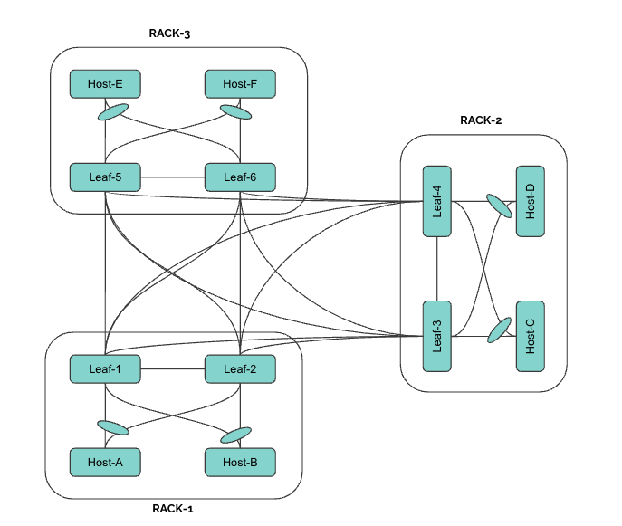

# <b>Rack-2-Rack Deployment</b>

A deployment scenario tailored for fabrics designed with interconnection with leaf devices exclusively over Layer2 port channels between leafs , eliminating the need for spines. This streamlined configuration suits specific network architectures. 



## <b> YAML Template </b>

```yaml
Inventory:
  SSpines: 0
  Spines: 2
  Leafs: 4
  Tors: 0
Connectivity:
  SSpine: []
  Spine: []
  Leaf:
    - switchId: 1
      switchName: "Leaf-1"
      ipAddress: "x.x.x.13"
      ASN: 1001
      Credentials:
        user: "admin"
        password: "YourPaSsWoRd"
      mclag:
        enabled: true
        peer: "L2"
        keepalive_vlan: 10
      Links:
        - link: "L1_Ethernet48 | L5_Ethernet0"
          staticLink: true
          properties:
        - link: "L1_Ethernet52 | L6_Ethernet0"
          staticLink: true
          properties:
        - link: "L1_Ethernet56 |  L2_Ethernet56"
          staticLink: true
          properties:
            mode: "MC-LAG-BGP"
        - link: "L1_Ethernet45 |  L3_Ethernet45"
          staticLink: true
          properties:
        - link: "L1_Ethernet46 |  L4_Ethernet45"
          staticLink: true
          properties:
        - link: "L1_Ethernet0 |  H1_Ethernet0"
          staticLink: true
          properties:
            mode: "L2-Access"
            vlan: 201
            mc_po_group: 201
        - link: "L1_Ethernet4 |  H2_Ethernet0"
          staticLink: true
          properties:
            mode: "L2-Access"
            vlan: 202
            mc_po_group: 202
    - switchId: 2
      switchName: "Leaf-2"
      ipAddress: "x.x.x.14"
      ASN: 1002
      Credentials:
        user: "admin"
        password: "YourPaSsWoRd"
      mclag:
        enabled: true
        peer: "L1"
        keepalive_vlan: 10
      Links:
        - link: "L2_Ethernet48 | L5_Ethernet4"
          staticLink: true
          properties:
        - link: "L2_Ethernet52 | L6_Ethernet4"
          staticLink: true
          properties:
        - link: "L2_Ethernet56 | L1_Ethernet56"
          staticLink: true
          properties:
            mode: "MC-LAG-BGP"
        - link: "L2_Ethernet45 | L3_Ethernet46"
          staticLink: true
          properties:
        - link: "L2_Ethernet46 | L4_Ethernet46"
          staticLink: true
          properties:
        - link: "L2_Ethernet0 |  H1_Ethernet1"
          staticLink: true
          properties:
            mode: "L2-Access"
            vlan: 201
            mc_po_group: 201
        - link: "L2_Ethernet4 |  H2_Ethernet1"
          staticLink: true
          properties:
            mode: "L2-Access"
            vlan: 202
            mc_po_group: 202
    - switchId: 3
      switchName: "Leaf-3"
      ipAddress: "x.x.x.15"
      ASN: 1003
      Credentials:
        user: "admin"
        password: "YourPaSsWoRd"
      mclag:
        enabled: true
        peer: "L4"
        keepalive_vlan: 10
      Links:
        - link: "L3_Ethernet48 | L5_Ethernet8"
          staticLink: true
          properties:
        - link: "L3_Ethernet52 | L6_Ethernet8"
          staticLink: true
          properties:
        - link: "L3_Ethernet56 | L4_Ethernet56"
          staticLink: true
          properties:
            mode: "MC-LAG-BGP"
        - link: "L3_Ethernet45 | L1_Ethernet45"
          staticLink: true
          properties:
        - link: "L3_Ethernet46 | L2_Ethernet45"
          staticLink: true
          properties:
        - link: "L3_Ethernet0 |  H3_Ethernet0"
          staticLink: true
          properties:
            mode: "L2-Access"
            vlan: 203
            mc_po_group: 203
        - link: "L3_Ethernet4 |  H4_Ethernet0"
          staticLink: true
          properties:
            mode: "L2-Access"
            vlan: 204
            mc_po_group: 204
    - switchId: 4
      switchName: "Leaf-4"
      ipAddress: "x.x.x.16"
      ASN: 1004
      Credentials:
        user: "admin"
        password: "YourPaSsWoRd"
      mclag:
        enabled: true
        peer: "L3"
        keepalive_vlan: 10
      Links:
        - link: "L4_Ethernet48 | L5_Ethernet12"
          staticLink: true
          properties:
        - link: "L4_Ethernet52 | L6_Ethernet12"
          staticLink: true
          properties:
        - link: "L4_Ethernet56 | L3_Ethernet56"
          staticLink: true
          properties:
            mode: "MC-LAG-BGP"
        - link: "L4_Ethernet45 | L1_Ethernet46"
          staticLink: true
          properties:
        - link: "L4_Ethernet46 | L2_Ethernet46"
          staticLink: true
          properties:
        - link: "L4_Ethernet0 |  H3_Ethernet1"
          staticLink: true
          properties:
            mode: "L2-Access"
            vlan: 203
            mc_po_group: 203
        - link: "L4_Ethernet4 |  H4_Ethernet1"
          staticLink: true
          properties:
            mode: "L2-Access"
            vlan: 204
            mc_po_group: 204
    - switchId: 5
      switchName: "Leaf-5-Spine-1"
      ipAddress: "x.x.x.11"
      ASN: 1005
      Credentials:
        user: "admin"
        password: "YourPaSsWoRd"
      mclag:
        enabled: true
        peer: "L6"
        keepalive_vlan: 10
      Links:
        - link: "L5_Ethernet0 | L1_Ethernet48"
          staticLink: true
          properties:
        - link: "L5_Ethernet4 | L2_Ethernet48"
          staticLink: true
          properties:
        - link: "L5_Ethernet8 | L3_Ethernet48"
          staticLink: true
          properties:
        - link: "L5_Ethernet12 | L4_Ethernet48"
          staticLink: true
          properties:
        - link: "L5_Ethernet124 | L6_Ethernet124"
          staticLink: true
          properties:
            mode: "MC-LAG-BGP"
    - switchId: 6
      switchName: "Leaf-6-Spine-2"
      ipAddress: "x.x.x.12"
      ASN: 1006
      Credentials:
        user: "admin"
        password: "YourPaSsWoRd"
      mclag:
        enabled: true
        peer: "L5"
        keepalive_vlan: 10
      Links:
        - link: "L6_Ethernet0 | L1_Ethernet52"
          staticLink: true
          properties:
        - link: "L6_Ethernet4 | L2_Ethernet52"
          staticLink: true
          properties:
        - link: "L6_Ethernet8 | L3_Ethernet52"
          staticLink: true
          properties:
        - link: "L6_Ethernet12 | L4_Ethernet52"
          staticLink: true
          properties:
        - link: "L6_Ethernet124 | L5_Ethernet124"
          staticLink: true
          properties:
            mode: "MC-LAG-BGP"
  Tor: []
BGP:
PhysicalIfCfg:
  FEC: "Off"
  MTU: 9000
  AdminStatus: "Up"
ASN:
  SSpine: "10000-20000"
  Spine: "21000-50000"
  Leaf: "51000-60000"
  Tor: "61000-70000"
IPv4Pool:
  Loopback: "10.10.10.0/24"
  LeafSpine: "40.0.0.0/24"
  LeafTor: "39.0.0.0/24"
  Host: "49.0.0.0/24"
IPv6Pool:
NTP:
  server: "x.x.x.10"
  timezone: "Asia/Kolkata"
SYSLOG:
  server: "x.x.x.10"
SNMP:
  trapserver: "x.x.x.10"
Parameters:
  vlan: "201,202,203,204,205,206,207,208"
  anycast_gateway: "x.x.x.0/23"
  hosts_per_vlan: 10
L2LS:
  enabled: false
  mode: "L2" # OverL2 and OverL3
    vlan: "201,202,203,204,205,206,207,208"     

```

## <b> Configure, Validate & Verify through UI </b>


## <b> Applied Configuration on Switches </b>

=== "Leaf-1"

    ```sh
    router-id 10.10.10.1
    ntp add x.x.x.10
    clock timezone Asia/Kolkata
    syslog add x.x.x.10
    snmp-server trap modify 2 x.x.x.10 port 161 vrf None community Public
    hostname Leaf-1
    ip protocol bgp route-map RM_SET_SRC
    !
    route-map FMCLI_IPV6_NH_GLOBAL permit 1
    on-match next
    set ipv6 next-hop prefer-global
    !
    route-map RM_SET_SRC permit 10
    set src 10.10.10.1
    !
    vlan 10
    !
    vlan 201
    !
    vlan 202
    !
    interface port-channel 201
    mtu 9000
    switchport access vlan 201
    !
    interface port-channel 202
    mtu 9000
    switchport access vlan 202
    !
    interface port-channel 999
    mtu 9000
    switchport mode trunk
    switchport trunk allowed vlan add 10
    switchport trunk allowed vlan add 201
    switchport trunk allowed vlan add 202
    !
    interface ethernet Ethernet0
    no shutdown
    mtu 9000
    channel-group 201 mode active
    forward-error-correction none
    !
    interface ethernet Ethernet4
    no shutdown
    mtu 9000
    channel-group 202 mode active
    forward-error-correction none
    !
    interface ethernet Ethernet45
    no shutdown
    mtu 9000
    ip address 40.0.0.6/31
    forward-error-correction none
    !
    interface ethernet Ethernet46
    no shutdown
    mtu 9000
    ip address 40.0.0.8/31
    forward-error-correction none
    !
    interface ethernet Ethernet48
    no shutdown
    mtu 9000
    ip address 40.0.0.0/31
    forward-error-correction none
    !
    interface ethernet Ethernet52
    no shutdown
    mtu 9000
    ip address 40.0.0.2/31
    forward-error-correction none
    !
    interface ethernet Ethernet56
    no shutdown
    mtu 9000
    channel-group 999 mode active
    forward-error-correction none
    !
    interface vlan 10
    ip address 192.168.0.0/31
    !
    interface vlan 201
    ip address x.x.x.1/25
    !
    interface vlan 202
    ip address x.x.x.129/25
    !
    interface loopback 1
    ip address 10.10.10.1/32
    !
    router bgp 1001
    neighbor 192.168.0.1 remote-as 1002
    neighbor 40.0.0.1 remote-as 1005
    neighbor 40.0.0.3 remote-as 1006
    neighbor 40.0.0.7 remote-as 1003
    neighbor 40.0.0.9 remote-as 1004
    neighbor 192.168.0.1 capability extended-nexthop
    neighbor 40.0.0.1 capability extended-nexthop
    neighbor 40.0.0.3 capability extended-nexthop
    neighbor 40.0.0.7 capability extended-nexthop
    neighbor 40.0.0.9 capability extended-nexthop
    bgp bestpath as-path multipath-relax
    no bgp ebgp-requires-policy
    address-family ipv4 unicast
    neighbor 192.168.0.1 allowas-in 1
    neighbor 40.0.0.1 allowas-in 1
    neighbor 40.0.0.3 allowas-in 1
    neighbor 40.0.0.7 allowas-in 1
    neighbor 40.0.0.9 allowas-in 1
    network 40.0.0.0/31
    network 40.0.0.2/31
    network 40.0.0.6/31
    network 40.0.0.8/31
    redistribute connected
    redistribute static
    !
    address-family ipv6 unicast
    redistribute connected
    redistribute static
    !
    !
    mlag domain-id 1
    peer-address 192.168.0.1
    peer-link port-channel 999
    src-address 192.168.0.0
    member port-channel 201
    member port-channel 202
    local-interface vlan 10
    ```

=== "Leaf-2"

    ```sh
    router-id 10.10.10.2
    ntp add x.x.x.10
    clock timezone Asia/Kolkata
    syslog add x.x.x.10
    snmp-server trap modify 2 x.x.x.10 port 161 vrf None community Public
    hostname Leaf-2
    ip protocol bgp route-map RM_SET_SRC
    !
    route-map FMCLI_IPV6_NH_GLOBAL permit 1
    on-match next
    set ipv6 next-hop prefer-global
    !
    route-map RM_SET_SRC permit 10
    set src 10.10.10.2
    !
    vlan 10
    !
    vlan 201
    !
    vlan 202
    !
    interface port-channel 201
    mtu 9000
    switchport access vlan 201
    !
    interface port-channel 202
    mtu 9000
    switchport access vlan 202
    !
    interface port-channel 999
    mtu 9000
    switchport mode trunk
    switchport trunk allowed vlan add 10
    switchport trunk allowed vlan add 201
    switchport trunk allowed vlan add 202
    !
    interface ethernet Ethernet0
    no shutdown
    mtu 9000
    channel-group 201 mode active
    forward-error-correction none
    !
    interface ethernet Ethernet4
    no shutdown
    mtu 9000
    channel-group 202 mode active
    forward-error-correction none
    !
    interface ethernet Ethernet45
    no shutdown
    mtu 9000
    ip address 40.0.0.16/31
    forward-error-correction none
    !
    interface ethernet Ethernet46
    no shutdown
    mtu 9000
    ip address 40.0.0.18/31
    forward-error-correction none
    !
    interface ethernet Ethernet48
    no shutdown
    mtu 9000
    ip address 40.0.0.10/31
    forward-error-correction none
    !
    interface ethernet Ethernet52
    no shutdown
    mtu 9000
    ip address 40.0.0.12/31
    forward-error-correction none
    !
    interface ethernet Ethernet56
    no shutdown
    mtu 9000
    channel-group 999 mode active
    forward-error-correction none
    !
    interface vlan 10
    ip address 192.168.0.1/31
    !
    interface vlan 201
    ip address x.x.x.1/25
    !
    interface vlan 202
    ip address x.x.x.129/25
    !
    interface loopback 1
    ip address 10.10.10.2/32
    !
    router bgp 1002
    neighbor 192.168.0.0 remote-as 1001
    neighbor 40.0.0.11 remote-as 1005
    neighbor 40.0.0.13 remote-as 1006
    neighbor 40.0.0.17 remote-as 1003
    neighbor 40.0.0.19 remote-as 1004
    neighbor 192.168.0.0 capability extended-nexthop
    neighbor 40.0.0.11 capability extended-nexthop
    neighbor 40.0.0.13 capability extended-nexthop
    neighbor 40.0.0.17 capability extended-nexthop
    neighbor 40.0.0.19 capability extended-nexthop
    bgp bestpath as-path multipath-relax
    no bgp ebgp-requires-policy
    address-family ipv4 unicast
    neighbor 192.168.0.0 allowas-in 1
    neighbor 40.0.0.11 allowas-in 1
    neighbor 40.0.0.13 allowas-in 1
    neighbor 40.0.0.17 allowas-in 1
    neighbor 40.0.0.19 allowas-in 1
    network 40.0.0.10/31
    network 40.0.0.12/31
    network 40.0.0.16/31
    network 40.0.0.18/31
    redistribute connected
    redistribute static
    !
    address-family ipv6 unicast
    redistribute connected
    redistribute static
    !
    !
    mlag domain-id 1
    peer-address 192.168.0.0
    peer-link port-channel 999
    src-address 192.168.0.1
    member port-channel 201
    member port-channel 202
    local-interface vlan 10
    ```

=== "Leaf-3"

    ```sh
    router-id 10.10.10.4
    ntp add x.x.x.10
    clock timezone Asia/Kolkata
    syslog add x.x.x.10
    snmp-server trap modify 2 x.x.x.10 port 161 vrf None community Public
    hostname Leaf-3
    ip protocol bgp route-map RM_SET_SRC
    !
    route-map FMCLI_IPV6_NH_GLOBAL permit 1
    on-match next
    set ipv6 next-hop prefer-global
    !
    route-map RM_SET_SRC permit 10
    set src 10.10.10.4
    !
    vlan 10
    !
    vlan 203
    !
    vlan 204
    !
    interface port-channel 203
    mtu 9000
    switchport access vlan 203
    !
    interface port-channel 204
    mtu 9000
    switchport access vlan 204
    !
    interface port-channel 999
    mtu 9000
    switchport mode trunk
    switchport trunk allowed vlan add 10
    switchport trunk allowed vlan add 203
    switchport trunk allowed vlan add 204
    !
    interface ethernet Ethernet0
    no shutdown
    mtu 9000
    channel-group 203 mode active
    forward-error-correction none
    !
    interface ethernet Ethernet4
    no shutdown
    mtu 9000
    channel-group 204 mode active
    forward-error-correction none
    !
    interface ethernet Ethernet45
    no shutdown
    mtu 9000
    ip address 40.0.0.7/31
    forward-error-correction none
    !
    interface ethernet Ethernet46
    no shutdown
    mtu 9000
    ip address 40.0.0.17/31
    forward-error-correction none
    !
    interface ethernet Ethernet48
    no shutdown
    mtu 9000
    ip address 40.0.0.20/31
    forward-error-correction none
    !
    interface ethernet Ethernet52
    no shutdown
    mtu 9000
    ip address 40.0.0.22/31
    forward-error-correction none
    !
    interface ethernet Ethernet56
    no shutdown
    mtu 9000
    channel-group 999 mode active
    forward-error-correction none
    !
    interface vlan 10
    ip address 192.168.0.2/31
    !
    interface vlan 203
    ip address 100.10.1.1/25
    !
    interface vlan 204
    ip address 100.10.1.129/25
    !
    interface loopback 1
    ip address 10.10.10.4/32
    !
    router bgp 1003
    neighbor 192.168.0.3 remote-as 1004
    neighbor 40.0.0.16 remote-as 1002
    neighbor 40.0.0.21 remote-as 1005
    neighbor 40.0.0.23 remote-as 1006
    neighbor 40.0.0.6 remote-as 1001
    neighbor 192.168.0.3 capability extended-nexthop
    neighbor 40.0.0.16 capability extended-nexthop
    neighbor 40.0.0.21 capability extended-nexthop
    neighbor 40.0.0.23 capability extended-nexthop
    neighbor 40.0.0.6 capability extended-nexthop
    bgp bestpath as-path multipath-relax
    no bgp ebgp-requires-policy
    address-family ipv4 unicast
    neighbor 192.168.0.3 allowas-in 1
    neighbor 40.0.0.16 allowas-in 1
    neighbor 40.0.0.21 allowas-in 1
    neighbor 40.0.0.23 allowas-in 1
    neighbor 40.0.0.6 allowas-in 1
    network 40.0.0.16/31
    network 40.0.0.20/31
    network 40.0.0.22/31
    network 40.0.0.6/31
    redistribute connected
    redistribute static
    !
    address-family ipv6 unicast
    redistribute connected
    redistribute static
    !
    !
    mlag domain-id 1
    peer-address 192.168.0.3
    peer-link port-channel 999
    src-address 192.168.0.2
    member port-channel 203
    member port-channel 204
    local-interface vlan 10
    ```

=== "Leaf-4"

    ```sh
    router-id 10.10.10.5
    ntp add x.x.x.10
    clock timezone Asia/Kolkata
    syslog add x.x.x.10
    snmp-server trap modify 2 x.x.x.10 port 161 vrf None community Public
    hostname Leaf-4
    ip protocol bgp route-map RM_SET_SRC
    !
    route-map FMCLI_IPV6_NH_GLOBAL permit 1
    on-match next
    set ipv6 next-hop prefer-global
    !
    route-map RM_SET_SRC permit 10
    set src 10.10.10.5
    !
    vlan 10
    !
    vlan 203
    !
    vlan 204
    !
    interface port-channel 203
    mtu 9000
    switchport access vlan 203
    !
    interface port-channel 204
    mtu 9000
    switchport access vlan 204
    !
    interface port-channel 999
    mtu 9000
    switchport mode trunk
    switchport trunk allowed vlan add 10
    switchport trunk allowed vlan add 203
    switchport trunk allowed vlan add 204
    !
    interface ethernet Ethernet0
    no shutdown
    mtu 9000
    channel-group 203 mode active
    forward-error-correction none
    !
    interface ethernet Ethernet4
    no shutdown
    mtu 9000
    channel-group 204 mode active
    forward-error-correction none
    !
    interface ethernet Ethernet45
    no shutdown
    mtu 9000
    ip address 40.0.0.9/31
    forward-error-correction none
    !
    interface ethernet Ethernet46
    no shutdown
    mtu 9000
    ip address 40.0.0.19/31
    forward-error-correction none
    !
    interface ethernet Ethernet48
    no shutdown
    mtu 9000
    ip address 40.0.0.26/31
    forward-error-correction none
    !
    interface ethernet Ethernet52
    no shutdown
    mtu 9000
    ip address 40.0.0.28/31
    forward-error-correction none
    !
    interface ethernet Ethernet56
    no shutdown
    mtu 9000
    channel-group 999 mode active
    forward-error-correction none
    !
    interface vlan 10
    ip address 192.168.0.3/31
    !
    interface vlan 203
    ip address 100.10.1.1/25
    !
    interface vlan 204
    ip address 100.10.1.129/25
    !
    interface loopback 1
    ip address 10.10.10.5/32
    !
    router bgp 1004
    neighbor 192.168.0.2 remote-as 1003
    neighbor 40.0.0.18 remote-as 1002
    neighbor 40.0.0.27 remote-as 1005
    neighbor 40.0.0.29 remote-as 1006
    neighbor 40.0.0.8 remote-as 1001
    neighbor 192.168.0.2 capability extended-nexthop
    neighbor 40.0.0.18 capability extended-nexthop
    neighbor 40.0.0.27 capability extended-nexthop
    neighbor 40.0.0.29 capability extended-nexthop
    neighbor 40.0.0.8 capability extended-nexthop
    bgp bestpath as-path multipath-relax
    no bgp ebgp-requires-policy
    address-family ipv4 unicast
    neighbor 192.168.0.2 allowas-in 1
    neighbor 40.0.0.18 allowas-in 1
    neighbor 40.0.0.27 allowas-in 1
    neighbor 40.0.0.29 allowas-in 1
    neighbor 40.0.0.8 allowas-in 1
    network 40.0.0.18/31
    network 40.0.0.26/31
    network 40.0.0.28/31
    network 40.0.0.8/31
    redistribute connected
    redistribute static
    !
    address-family ipv6 unicast
    redistribute connected
    redistribute static
    !
    !
    mlag domain-id 1
    peer-address 192.168.0.2
    peer-link port-channel 999
    src-address 192.168.0.3
    member port-channel 203
    member port-channel 204
    local-interface vlan 10
    ```

=== "Leaf-5"

    ```sh
    router-id 10.10.10.7
    ntp add x.x.x.10
    clock timezone Asia/Kolkata
    syslog add x.x.x.10
    snmp-server trap modify 2 x.x.x.10 port 161 vrf None community Public
    hostname Leaf-5-Spine-1
    ip protocol bgp route-map RM_SET_SRC
    !
    route-map FMCLI_IPV6_NH_GLOBAL permit 1
    on-match next
    set ipv6 next-hop prefer-global
    !
    route-map RM_SET_SRC permit 10
    set src 10.10.10.7
    !
    vlan 10
    !
    interface port-channel 999
    mtu 9000
    switchport mode trunk
    switchport trunk allowed vlan add 10
    !
    interface ethernet Ethernet0
    no shutdown
    mtu 9000
    ip address 40.0.0.1/31
    forward-error-correction none
    !
    interface ethernet Ethernet12
    no shutdown
    mtu 9000
    ip address 40.0.0.27/31
    forward-error-correction none
    !
    interface ethernet Ethernet124
    no shutdown
    mtu 9000
    channel-group 999 mode active
    forward-error-correction none
    !
    interface ethernet Ethernet4
    no shutdown
    mtu 9000
    ip address 40.0.0.11/31
    forward-error-correction none
    !
    interface ethernet Ethernet8
    no shutdown
    mtu 9000
    ip address 40.0.0.21/31
    forward-error-correction none
    !
    interface vlan 10
    ip address 192.168.0.4/31
    !
    interface loopback 1
    ip address 10.10.10.7/32
    !
    router bgp 1005
    neighbor 192.168.0.5 remote-as 1006
    neighbor 40.0.0.0 remote-as 1001
    neighbor 40.0.0.10 remote-as 1002
    neighbor 40.0.0.20 remote-as 1003
    neighbor 40.0.0.26 remote-as 1004
    neighbor 192.168.0.5 capability extended-nexthop
    neighbor 40.0.0.0 capability extended-nexthop
    neighbor 40.0.0.10 capability extended-nexthop
    neighbor 40.0.0.20 capability extended-nexthop
    neighbor 40.0.0.26 capability extended-nexthop
    bgp bestpath as-path multipath-relax
    no bgp ebgp-requires-policy
    address-family ipv4 unicast
    neighbor 192.168.0.5 allowas-in 1
    neighbor 40.0.0.0 allowas-in 1
    neighbor 40.0.0.10 allowas-in 1
    neighbor 40.0.0.20 allowas-in 1
    neighbor 40.0.0.26 allowas-in 1
    network 40.0.0.0/31
    network 40.0.0.10/31
    network 40.0.0.20/31
    network 40.0.0.26/31
    redistribute connected
    redistribute static
    !
    address-family ipv6 unicast
    redistribute connected
    redistribute static
    !
    !
    mlag domain-id 1
    peer-address 192.168.0.5
    peer-link port-channel 999
    src-address 192.168.0.4
    local-interface vlan 10

    ```

=== "Leaf-6"

    ```sh
    router-id 10.10.10.8
    ntp add x.x.x.10
    clock timezone Asia/Kolkata
    syslog add x.x.x.10
    snmp-server trap modify 2 x.x.x.10 port 161 vrf None community Public
    hostname Leaf-6-Spine-2
    ip protocol bgp route-map RM_SET_SRC
    !
    route-map FMCLI_IPV6_NH_GLOBAL permit 1
    on-match next
    set ipv6 next-hop prefer-global
    !
    route-map RM_SET_SRC permit 10
    set src 10.10.10.8
    !
    vlan 10
    !
    interface port-channel 999
    mtu 9000
    switchport mode trunk
    switchport trunk allowed vlan add 10
    !
    interface ethernet Ethernet0
    no shutdown
    mtu 9000
    ip address 40.0.0.3/31
    forward-error-correction none
    !
    interface ethernet Ethernet12
    no shutdown
    mtu 9000
    ip address 40.0.0.29/31
    forward-error-correction none
    !
    interface ethernet Ethernet124
    no shutdown
    mtu 9000
    channel-group 999 mode active
    forward-error-correction none
    !
    interface ethernet Ethernet4
    no shutdown
    mtu 9000
    ip address 40.0.0.13/31
    forward-error-correction none
    !
    interface ethernet Ethernet8
    no shutdown
    mtu 9000
    ip address 40.0.0.23/31
    forward-error-correction none
    !
    interface vlan 10
    ip address 192.168.0.5/31
    !
    interface loopback 1
    ip address 10.10.10.8/32
    !
    router bgp 1006
    neighbor 192.168.0.4 remote-as 1005
    neighbor 40.0.0.12 remote-as 1002
    neighbor 40.0.0.2 remote-as 1001
    neighbor 40.0.0.22 remote-as 1003
    neighbor 40.0.0.28 remote-as 1004
    neighbor 192.168.0.4 capability extended-nexthop
    neighbor 40.0.0.12 capability extended-nexthop
    neighbor 40.0.0.2 capability extended-nexthop
    neighbor 40.0.0.22 capability extended-nexthop
    neighbor 40.0.0.28 capability extended-nexthop
    bgp bestpath as-path multipath-relax
    no bgp ebgp-requires-policy
    address-family ipv4 unicast
    neighbor 192.168.0.4 allowas-in 1
    neighbor 40.0.0.12 allowas-in 1
    neighbor 40.0.0.2 allowas-in 1
    neighbor 40.0.0.22 allowas-in 1
    neighbor 40.0.0.28 allowas-in 1
    network 40.0.0.12/31
    network 40.0.0.2/31
    network 40.0.0.22/31
    network 40.0.0.28/31
    redistribute connected
    redistribute static
    !
    address-family ipv6 unicast
    redistribute connected
    redistribute static
    !
    !
    mlag domain-id 1
    peer-address 192.168.0.4
    peer-link port-channel 999
    src-address 192.168.0.5
    local-interface vlan 10
    ```
