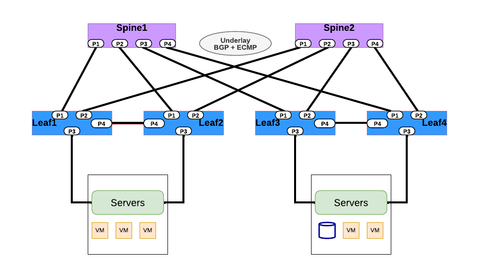
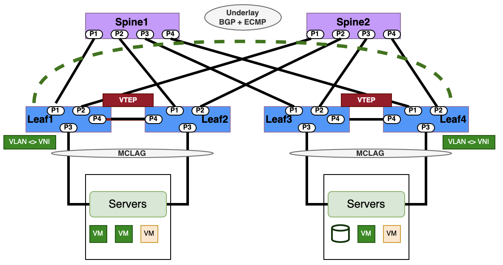
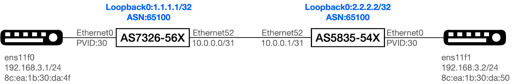
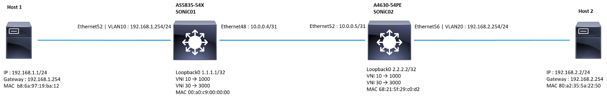

# <b>Configuration convertor from PICOS to SONiC</b>

This configuration converter  is intended for network administrators with PICOS background. This guide will help network admins to migrate their current PICOS deployment for various Fabric architectures to SONiC. PICOS User guide  https://docs.pica8.com/ can be used as a checklist to get started with the  migration plan from PICOS to SONiC. Following  document provides example configuration commands for comparison.

##  <b>Switch Management</b>
Operator has to login to PICOS and SONiC switch as super user using “sudo su”

<style>
  table {
    border-collapse: collapse;
    table-layout: fixed;
    width: 100%;
  }

  th, td {
    border: 1px solid black;
    padding: 8px;
    text-align: left;
    vertical-align: top;
    word-wrap: break-word;
    width: 50%; 
  }
</style>


<table>
  <tr>
    <th>PICOS</th>
    <th>SONiC</th>
  </tr>
  <tr>
  <th colspan='2'>Management IP</th>
  </tr>
 <tr>
   <td>
  
  <b># OOB Management IP</b><br>
  <b># Syntax</b><br>
   set system management-ethernet &lt;mgmt-if> ip-address IPv4 &lt;ip-address>
   run show system management-ethernet<br>
</br>
   <b>#Example</b><br>
   set system management-ethernet eth0 ip-address IPv4 192.168.10.5/24<br><br>
   <b>#Inband Management IP</b><br>
   <b>#Syntax</b><br>
   set system inband vlan-interface &lt;vlan-interface-name><br>
   set system inband loopback &lt;ip-address><br>
   set system inband routed-interface &lt;routed-interface-name><br>
</br>
   <b>#Example</b><br>
   set system inband vlan-interface VLAN400<br>
   set system inband loopback 192.168.10.1<br>
   set system inband routed-interface rif-ge3<br>

</td>

<td>

<b># OOB Management IP</b><br>
<b>#Syntax</b><Br>
config interface ip add &ltmgmt-if> &ltIpv4_address> / &ltIpv4_subnet> &ltgateway_ipv4_address><br>
</br>
<b>#Example</b><br>
config interface ip add eth0 192.168.1.1/24 192.168.1.254<br> 
</br>
<b># OOB Management IP with VRF</b><br>
<b>#Syntax</b><Br>
config VRF  add mgmt<br>
config interface ip add mgmt &lt;VRF-NAME> Ipv4_address>/ &lt;Ipv4_subnet> &lt;gateway_IPV4_address> <br>
</br>
<b>#Example</b></br>
config VRF  add mgmt<Br>
config interface ip add mgmt VRF-1 192.168.1.1/24 192.168.1.254<br>
</br>
<b># Command to verify management ip address configured</b><br> 
show management_interface address<br>
Management IP address = 192.168.1.1/24<br>
Management Network Default Gateway = 192.168.1.254<br>

</td>
 </tr>
 <tr>
   <th colspan="2">Switch Reboot</th>
 </tr>
 <tr>
 <td>

<b>#Command in PICOS to reboot system but it will cause traffic disruption</b><br>
request system reboot<br>
<br>
<b># Command sets the system log file to save to disk.</b><br>
set system syslog local-file disk<br>
tail -f /var/log/messages<br>

</td>
 <td>

<b>#Command  to perform system reboot which cause some disruption of data traffic -</b><br> 
reboot<br>
</br>
<b>#Command defines the cause of reboot of a sonic device</b><Br> 
show reboot-cause<Br>
show reboot-cause history<br>
</br>
<b>#Command  enables a switch to reboot up quickly  with minimum disruption to the data plane. </b><br>
fast-reboot<br>
</br>
<b>#Warm reboot commands perform  in-service NOS upgrade without impacting the data plane traffic</b><br> 
warm-reboot -v<br>
config warm_restart enable/disable<Br>
config warm_restart enable<br>
</br>
<b># Command shows configuration of warm restart setting and show whether that service is enabled or disabled </b><br>
show warm_restart config<br>
show warm_restart state<br>
</br>
<b># Command to view syslogs</b><br>
tail -f /var/log/syslog <br>

</td>
 </tr>
 <tr>
   <th colspan="2">Upgrade NOS</th>
 </tr>
 <tr>
 <td>

<b>#Command to check the version in PICOS</b><br> 
Version<br>
</br>
<b>#Command to upgrade  the version in PICOS</b><br> 
upgrade<br>
upgrade [image_name] [factory-default] [backup-file=(*.lst)]<br>
image_name - Image with bin format file(*.bin)<br>
factory-default - Recovery configuration to factory default<br>
backup-file=(*.lst) - Specify a user defined backup list<br>
</br>
upgrade backup-file=/admin/back_files.lst onie-installer-picos-4.0.1-x86.bin Sync<br>
</br>
<b># Example</b><br>
upgrade onie-installer-picos-4.0.1-x86.bin

  </td>
<td>

<b>#Syntax</b> <Br>
<b>#Command to check the version in SONiC</b><br> 
Show version<Br>
</br>
<b>#Command to upgrade  the version in SONiC</b><br> 
sonic-installer<br>
sonic-installer install<br>
sonic-installer install [OPTIONS] &lt;image_file_path><br>
sonic-installer list<br>
</br>
<b># Command to set which image will be used for default boot image after any system reboot</b><br>
sonic-installer set-default<br>
sonic-installer set-default &lt;image_name><br>
sonic-installer set-next-boot <image_name><br>
</br>
<b># Operator can use following command to remove a saved sonic image in device flash/disk -</b><br>
sonic-installer remove<br>
sonic-installer remove [y|-yes] &lt;image_name>

</td>
    </tr>
 <tr>
   <th colspan="2">Configuration Save</th>
 </tr>
 <tr>
 <td>

<b># Command to save the configuration on PICOS</b><br>
save myconfig.conf<br>
</br>
<b># CLI to  delete and re-add  a new save config -</b><Br>
load override myconfig.conf<br>
</br>
<b># Merge a new config on top of existing running configuration –</b><br>
load merge myconfig.conf<br>

</td>
 <td>
 
<b># Command to save the configuration on SONiC</b><br>
config save -y<br>
</br>
<b># Command  to  delete and re-add  a new save config -</b><br> 
config reload &lt;config_db.json/SONiCYang><br>
</br>
<b># Command to load the configuration from json.db</b><br>
config load &lt;config json file><br>
</br>
<b># Replace  a new configuration on top of existing running configuration -</b><br>
config replace &lt;config_db.json/SONiCYang>

</td>
 </tr>
 <tr>
   <th colspan="2">Platform Information</th>
 </tr>   
<tr>
 <td>
<b>#Platform show commands</b><br>
<b>#syntax</b><br>
run show system serial-number<br>
run show system rpsu<br>
 run show system serial-number<br>
run show system temperature<br>
run show system uptime<br>
run show system connections<br>
 run show system core-dumps<br>
run show system cpu-usage<Br>
run show system rpsu<br>
run show system date<br>
run show system fan<br>
 run show system memory-usage<br>
run show system name<Br>
run show system temperature<br>
run show system users<br>
</td>
 <td>
<b>#Command to verify platform details in SONiC</b></br>
<b>#Syntax</b><br>
show system Status<br>
show clock<Br>
show boot<br>
show environment<br>
show system status<br>
show reboot-cause<br>
show uptime<br>
show logging<Br>
show users<Br>
show platform fan<br>
show platform firmware status<br>
show platform firmware version<br>
show platform pcieinfo<Br>
show platform psustatus<Br>
show platform ssdhealth<br>
show platform summary<BR>
show platform syseeprom<br>
show platform temperature<br>
show interfaces transceiver<br>
</td>
 </tr>

 
</table>


## <b>Management Services</b>

<style>
  table {
    border-collapse: collapse;
    table-layout: fixed;
    width: 100%;
  }

  th, td {
    border: 1px solid black;
    padding: 8px;
    text-align: left;
    vertical-align: top;
    word-wrap: break-word;
    width: 50%; 
  }
</style>


<table>
  <tr>
    <th>PICOS</th>
    <th>SONiC</th>
  </tr>
 <tr>
   <th>SYSLOG<th>
 </tr>
 <tr>
  <tr>
    <td>

<b>#Syslog commands in PICOS</b><br>
<b>#Syntax</b><br> 
set system log-level info<br>
syslog monitor on<Br>
set protocols OSPF  traceoptions packet all detail<br>
set system log-level trace<br>
commit<br>
syslog monitor on<br>

</td>
<td>

<b>#Syslog commands in SONiC</b><br>
<b>#Syntax</b><br> 
config syslog add<br> 
config syslog delete<br> 
</br>
<b>#Command to add or delete a specific syslog server IP</b><br>
config syslog add &lt;ipv4-address> --source &lt;source_ipv4_address>&lt;/config><br>
config syslog del &lt;ipv4-address></config><br>
</br>
<b>#View syslog for a particular protocol in SONIC -</b><br>
show logging<br> 
show logging &lt;any_protocol><br> 
</br>
<b># Command to show syslog server IP and port configuration</b><br> 
show syslog<br>
</br>
<b>#Location of syslog configuration file -</b><br>
Configuration file for syslog available at: /etc/rsyslog.conf<br>
</br>
<b>#Example Configuration</b><br>
config syslog add 1.1.1.1 --source 192.168.8.231<br>
config syslog del 1.1.1.1<br>
</br>
<b># Command to view syslog file location</b><br>
Path: /var/log/syslog*

</td>
  </tr>
  <tr>
   <th>ZTP<th>
 </tr>
 <tr>
  <tr>
  <td>
<b># Configuration to enable and disable Zero Touch Provisioning</b><br>
<b># Syntax</b><br>
</br>

ztp-config<br>
Please configure the default PicOS ZTP options:<br>
 (Press other key if no change)<br>
    [1]  PicOS ZTP enabled   * default<br>
    [2]  PicOS ZTP disabled<br>
Enter your choice (1,2):2<br>
PicOS ZTP is disabled.<Br>
 admin@LEAF-A$<Br>
</br>
<b># Alternative Method is to  edit the PICOS  configuration file picos_start.conf and change the value of the ztp_disable variable.</b><br> 
</br>
admin@LEAF-A\$more /etc/picos/picos_start.conf | grep ztp
ztp_disable=true<br>

\# To enable ZTP, the user needs to set ztp_disable to false.

</td>
 <td>

<b>#Configuration</b></br>
<b>#Syntax</b><br>
</br>
<b>#Enable the ZTP services</b><br>
admin@sonic:~$ config ztp enable
<br></br>
<b># Running the ZTP Services</b><br>
admin@sonic:~$ config ztp run -y
<br></br>
<b>#Check the ZTP Status</b>
admin@sonic:~$ show ztp status<br>
</br>
<b>#Check the  /etc/sonic , user will be able to see config_db.json</b><br>
admin@sonic:~$ ls /etc/sonic/ | grep config_db.json<br>
Config_db.json<br>
</br>
<b># Server where ZTP server is hosted , operator can edit in a customized way various parameters like URL , source path  location , destination path location during ZTP automated discovery  process.</b><br>
<b>#Using ZTP to download the config_db.json and the new SONiC version.</b><br>
<b>#Example</b><br>
<b>Example for ztp.json.</b><br>
</br>
```
{
"ztp": {
 "01-configdb-json": {
    "url": {
      "source": "tftp://188.188.36.36/7326_56X_config_db.json",
        "destination": "/etc/sonic/config_db.json"
     }
    },
   "02-firmware": {
      "install": {
        "url": "http://188.188.36.36：8000/sonic-broadcom.bin",
         "skip-reboot": true
         }
      } 
   }
}
```

  </td>
  </tr>
  <tr>
  <th>SNMP</th>
  <th></th>
  </tr>
  <tr>
  <td>

<b># Add SNMP Community and Agent Address</b><br> 
ovs-vsctl set-snmp-enable true<br>
ovs-vsctl show-snmp<br>
snmp is enabled<br>
ovs-vsctl set-snmp-community-name  pica8<br>
ovs-vsctl set-snmp-community-name<br>
</br>
<b>#Syntax</b><br> 
<b># Add SNMP traps and SNMP server target address -</b><br> 
<br>
ovs-vsctl  show-snmp-trap-targets<br>
ovs-vsctl set-snmp-trap-targets &lt;Server_IP_Address><br>
ovs-vsctl set-snmp-trap-targets

  </td>
  <td>

<b># SONiC - Add SNMP Community and Agent Address</b><br> 
<b>#syntax</b><br>
 config snmp community add &ltsnmp_community_name>  &ltMode_Readonly or read Write><br> 
</br>
<b>#Example</b><br>
config snmp community add testcomm ro<br>
</br>
<b># Command to add SNMP Agent IP address</b><br> 
config snmpagent add &lt;Agent_IPV4_Address> -v &lt;VRF-NAME><br> 
</br>
<b># Command to add SNMP user</b><br>
<b>#Syntax </b><br>
config snmp user add &lt;user> (noAuthNoPriv | AuthNoPriv | Priv) (RO | RW) [[(MD5 | SHA | MMAC-SHA-2) &ltauth_password>] [(DES |AES) &lt;encrypt_password>]]<br>
</br>
<b>#Example</b><br>
config snmp user add testuser3 priv rw md5 testuser3_auth_pass aes testuser3_encrypt_pass<br>
</br>
<b># Add SNMP traps and SNMP server target address -</b><br> 
config snmptrap modify 2 &lt;Server_IP_Address><br>
show snmptrap<br>
show snmp agentaddress<br>
show running configuration snmp<br>

  </td>
  </tr>
  <tr>
   <th>AAA/Radius<th>
 </tr>
 <tr>
  <tr>
  <td>

<b># Configure Radius Server IP and Port</b><br>  
set system aaa radius authorization disable &lt;true | false><br>
set system aaa radius authorization server-ip &lt;ipv4_address><br>
set system aaa radius authorization server-ip &lt:ipv4_address> port &lt;integer><br>
set system aaa radius source-interface &lt;interface-name><Br> 
</br>
<b># Show-</b><br>
show system aaa radius<br>
</br>
<b>Enable RADIUS accounting -</b><br>
set system aaa radius accounting disable &lt;true | false><br>
set system aaa radius accounting server-ip <ipv4_address><br>
  </td>
  <td>
<b># SONiC - Configure Radius Server IP and Port</b><br> 
<b>#Syntax </b><br>
config aaa authentication login {radius | tacacs+ | local}  [radius | tacacs+ | local].<br>
config radius add &lt;Radius_server_ip><br>
</br>
<b>#Show Radius commands-</b><br>
show aaa <br>
show radius <br>
</br>
<b>#Command for aaa authentication options</b><br> 
<b>#Syntax</b><br>
aaa  authentication login tacacs+<br>
</br>
<b># If one AAA server fails , go to backup AAA server for authentication</b><br> 
aaa authentication failthrough &lt;enable/disable/default><br> 
aaa authentication fallback &lt;enable/disable/default> <br>
</br>
<b># AAA accounting enable commands in SONiC</b><br>
<b>#Syntax </b><br>
config aaa accounting local<br>
config aaa accounting tacacs+<br>
</br>
<b># Command to add aaa accounting server IP and bind it to a data interface  </b><br>
config radius add &lt;accounting_server_ip><br>
config radius add &lt;accounting_server_ip> --s &lt;source_interface><br>

  </td>
  </tr>
  <tr>
   <th>sFlOW<th>
 </tr>
 <tr>
  <tr>
  <td>

<b>#sflow commands</b><br>
ovs-vsctl  --id=@s create sFlow agent=eth0 target=\"10.10.50.207:9901\" header=128 sampling=5000 polling=30 -- set Bridge br0 sflow=@s<br>
ovs-vsctl list sflow<br>
ovs-vsctl -- clear Bridge br0 sflow

  </td>
  <td>

<b># Command to add  sflow  collector</b><br> 
config sflow collector add &lt;collector_name1>  &lt;sflow_collector_ipv4> &lt;port_number><br>
config sflow collector add &lt;collector_name2>  &lt;sflow_collector_ipv6> &lt;port_number><br>
</br>
<b># Command to delete   sflow  collector </b><br>
config sflow collector del &lt;collector-name1><br>
config sflow collector del &lt;collector-name2><br>
</br>
<b># Command to add  and delete  sflow agent</b><br> 
config sflow  agent-id add<br>
config sflow  agent-id del<br>
</br>
<b># Command to bind  sflow agent  to an interface</b><br> 
config sflow  agent-id add &lt;Ethernet_interface_number><br>
config sflow  agent-id add &lt;loop_interface_number><br>
</br>
<b># Command  Enable / Disable sflow -</b><br>
config sflow  enable<br>
config sflow  disable<br>
config sflow interface<br>
config sflow interface &lt;enable/disable><br>
config sflow  interface enable &lt;Ethernet_interface><br>
<br>
<b># Configure sflow sample rate , interval</b><br> 
config sflow interface sample-rate &lt;interface_name> &lt;sample_rate><br>
config sflow  polling-interval <time_interval_seconds><br>
 </br>
<b># Command to show  sflow  configuration -</b><br>
show sflow<br> 
show sflow  interface
  
  </td>
  </tr>
  <tr>
   <th>NTP<th>
 </tr>
 <tr>
  <tr>
  
  <td>
<b># Configuring the NTP Server IP Address</b><br>
 set system ntp server-ip &lt;NTP_SERVER_IP><br>
</br>
<b># Configuring NTP Source Interface</b>
set system ntp source-interface &lt;VLAN-INTERFACE-NUMBER><br>
</br>
<b>#Configuring Time Zone</b><br>
set system timezone &lt;TIME_ZONE><br>
</br>
<b>#Configuring System Clock</b><br>
set date YYYY:MM:DD -TT

  </td>
  <td>

<b># Command to configure  NTP Server IP</b><br> 
<b>#Syntax </b><br>
config ntp add &lt;NTP_SERVER_IP><br>
</br>
<b># Example</b><br>
config ntp add 10.101.118.10<br>
<br>
<b># Command to delete a configure NTP Server IP</b><br>
config ntp del &lt;ip_address><br>
</br>
<b>#restart NTP-config daemon after applying NTP server config through config_db.json</b><br>
systemctl restart ntp-config<br> 
</br>
<b># Command to list  system timezone.</b><br>
timedatectl list-timezones<br>
</br>
<b>#Command  to modify the time zone</b><br>
timedatectl set-timezone &lt;TIME_ZONE><br>
</br>
<b>#Command  to show the NTP server information</b><br> 
show ntp

  </td>
  </tr>
</table>

## Port Mirroring

 <style>
  table {
    border-collapse: collapse;
    table-layout: fixed;
    width: 100%;
  }

  th, td {
    border: 1px solid black;
    padding: 8px;
    text-align: left;
    vertical-align: top;
    word-wrap: break-word;
    width: 50%; 
  }
</style>

<table>
 <tr>
   <th>PICOS</th>
   <th>SONiC</th>
 </tr>
 <tr>
  <tr>
  <td>
  
<b>#Configuring port as port mirroring</b><br>
<b>#Syntax </b><br>
</br>
set interface ethernet-switching-options analyzer 111 output ge-&lt;x/y/z><br>
</br>
<b># Configure Monitor the flows of ingress port</b><br>
set interface ethernet-switching-options analyzer &lt;number> input ingress ge-x/y/z<br>
</br>
<b># Configure Monitor the Flows of Egress Port</b><br>
set interface ethernet-switching-options analyzer &lt;number> input egress ge-&lt;x/yz><br>
</br>
<b>#Configuring Mirroring on Egress or Ingress Port</b><br>
 set interface ethernet-switching-options analyzer &lt;number> input ingress ge-&lt;x/y/z><br>
 set interface ethernet-switching-options analyzer <number> input egress ge-<x/yz>

  </td>
  <td>

<b>#Create a mirror session</b><br>
<b>#Syntax</b><br>
config mirror_session add ts1_everflow &lt;Source_Ip_address><br> 
&lt;destination_Ip_Address>  &lt;dscp_number> &lt;queue_number><br>
</br>
<b># Command to create  ACL table</b><br>
 config acl add table ACL_Mirror MIRROR --description 'mirror' --stage ingress --ports Ethernet0<br>
</br>
<b># Command  an ACL JSON file and load it to the configuration database for everflow.</b><br>
cat acl.json
```
{
    "ACL_RULE": {
        "ACL_Mirror|ACE_Mirror": {
            "PRIORITY": "55",
            "IP_TYPE": "ipv4any",
            "MIRROR_ACTION": "ts1_everflow"
        }
    }
}
```
<b># Command to load the acl.json with new config related to ACL applied 
config load acl.json -y</b><br>
</br>
<b>#Command to verify  the mirror status</b><br>
 show mirror_session<br>
</br>
<b># Command to create  a mirror session for SPAN</b><Br>
<b>#Syntax</b><br>
config mirror_session span add &lt;session_name> &lt;Destination_interface_Analyzer> &lt;Source_intertface_switch><br>
<br>
<b># Command to create a mirror session for Remote SPAN</b><br>
config mirror_session erspan add &lt;session_name> &lt;src_ip> &lt;dst_ip> &lt;dscp> &lt;ttl> [gre_type] [queue] [src_port] [direction]<br>
</br>
<b>#Command to create  a mirror session and  ACL table</b><br>
config mirror_session span add &lt;session_name>  &lt;Destination_port> &lt;Source_port> &lt;Direction><br>
</br>
<b># Example</b> <br>
config acl add  table Test MIRROR -p Ethernet8 -s ingress<br>
</br>
<b>#Command to verify  the mirror table</b><br>
show mirror_session<br>
</br>
<b># Create ACL JSON file and load it to the configuration database for Mirror</b><br>
cat acl.json<br>
```
{
"ACL_RULE": {
        "Test|Forward": {
                "PRIORITY": "2",
                "MIRROR_ACTION": "test",
                "VLAN_ID": "20"
                }
        }
}
```
<b># Command to load the json file with ACL config applied</b><br> 
config load acl.json -y <br>
config  save -y<br>
</br>
<b>#Command to check  the status of ACL table and mirror session</b><br> 
show mirror_session<br>
show acl table<br>

  </td>
  </tr>
</table>


## <b>Layer 2 Switching</b>
####  <b>Interface and port VLAN</b>


<style>
  table {
    border-collapse: collapse;
    table-layout: fixed;
    width: 100%;
  }

  th, td {
    border: 1px solid black;
    padding: 8px;
    text-align: left;
    vertical-align: top;
    word-wrap: break-word;
    width: 50%;
  }

</style>

 <table>
   <tr>
     <th>PICOS</th>
     <th>SONiC</th>
    </tr>
   <tr>
     <th colspan='2'>Port, VLAN</th>
    </tr>
   <tr>
  <td>

<b>#Configure Access and Trunk Mode over interfaces</b><br>
set interface gigabit-ethernet &lt;ethernet_interface> family ethernet-switching port-mode access<br>
set interface gigabit-ethernet &lt;ethernet_interface> family ethernet-switching port-mode trunk<br>
</br>
<b># Create VLANs </b><br>
set vlans vlan-id &lt;vlan_value><Br>
run show vlans<br>
</br>
<b># Add VLAN members to ethernet ports for tagged packet</b><br>
set interface gigabit-ethernet &lt;ethernet_interface> family ethernet-switching vlan members &lt;vlan_member1><br>
</br>
set interface gigabit-ethernet &lt;ethernet_interface> family ethernet-switching vlan members &lt;vlan_member2><br>
</br>
<b># Add VLAN members to ethernet ports for untagged packet</b><br>
set interface gigabit-ethernet &lt;ethernet_interface> family ethernet-switching vlan members &lt;member1> untagged<Br>
</br>
set interface gigabit-ethernet &lt;ethernet_interface> family ethernet-switching vlan members &lt;member2> untagged

  </td>
  <td>

<b>#Configure Access and Trunk Mode over interfaces</b><br>
config interface speed Ethernet&lt;interface> &lt;speed><br>
config interface advertised-speeds Ethernet&lt;interface> &lt;speed><br>
</br>
<b>#Command to set Auto Negotiation for an ethernet interface</b><Br>  
config interface autoneg Ethernet&lt;interface> enable<Br>
</br>
<b>#Command to show status of Auto Negotiation for an ethernet interface</b><Br>
show interface autoneg status Ethernet0<br>
</Br>
<b>#Command to show operational status of interface</b><br> 
show interface status<Br>
</br>
<b>#Example command to configure 4x10GE breakout  for a 40GE port</b><br>
config interface breakout Ethernet1 '4x10G'<br>
</br>
<b>#Command to show interface breakout options</b><br>
show interface breakout<br>
</br>
<b>#Command to configure FEC mode of an ethernet interface</b><br> 
config interface fec Etherne&lt;interface> &lt;FEC_MODE><br>
</br>
<b># Create VLANs</b><br> 
config vlan add &lt;vlan_value1> <br>      
config vlan add &lt;vlan_value2><br>
</br>
<b># show vlan configuration </b><br>
show vlan config <Br>
</br>
<b>#Add Interface to vlan in Tagged (Trunk) mode:</b><br>
config vlan member add &lt;vlan_value1> Ethernet&lt;interface1><br>
config vlan member add &lt;vlan_value2> Ethernet&lt;interface2><br>
</br>
<b>#Add Interface to vlan in untagged (access) mode:</b><br>
config vlan member add -u &lt;vlan_value1> Ethernet&lt;interface1><br>
config vlan member add -u &lt;vlan_value2> Ethernet&lt;interface2><br>
</br>
<b>#Command to show vlan information </b><br>
show vlan brief   <br>

  </td>
  </tr>
   </table>

  <table>
   <tr>
   <th colspan='2'>LAG</th>
 </tr>
 <tr>
  <tr>
  <td>

<b>#Command to create static LAG in an aggregated interface ae1</b><br>
<b>#Syntax</b><br>
ovs-vsctl  add-port br0 ae1 vlan_mode=trunk tag=1 -- set Interface ae1 type=pica8_lag<br>
ovs-vsctl -- set Interface ae1 options:lag_type=static<br>
ovs-vsctl -- set Interface ae1 options:members=ge-x/x/x , ge-x/x/x<Br>
</br>
<b>#Command to create dynamic LACP in an aggregated interface ae1</b><br>
set interface aggregate-ethernet ae1 aggregated-ether-options lacp enable true<br>
set interface aggregate-ethernet ae1 aggregated-ether-options min-selected-port &lt;number_of_ports><br>
set interface gigabit-ethernet ge-x/x/x ether-options 802.3ad ae1<Br>
set interface gigabit-ethernet ge-x/x/x ether-options 802.3ad ae1<br>
set interface gigabit-ethernet gge-x/x/x ether-options 802.3ad ae1<br>
set interface gigabit-ethernet ge-x/x/x ether-options 802.3ad ae1<br>
Commit<BR>
</br>
<b>#Command to display LACP LAG information</b> <BR>
run show interface aggregate-ethernet ae1<br>
</br>
<b>#Configure one LAG ae1 with three memberports.</b><br>
set interface gigabit-ethernet ge-x/y/z ether-options 802.3ad ae1<br>
set interface gigabit-ethernet ge-x/y/z ether-options 802.3ad ae1<br>
set interface gigabit-ethernet ge-x/y/z ether-options 802.3ad ae1<br>

  </td>
  <td>

<b>#Create port channel</b><br>
<b>#syntax </b><br>
config portchannel add PortChannel&lt;Channel1><br>
</br>
<b>#Add members to port channel</b><br>
config portchannel add PortChannel&lt;Channel1>  Ethernet&lt;interface><br>
</br>
<b># Command to verify port channel interface</b><br>
show interface portchannel<Br>
</br>
<b># Command to show vlan status</b><br> 
show vlan brief <br>
</br>
<b># Command to show ip interface status</b><br> 
show ip interfaces<br>
show interfaces status<br>
<b>#Command to create a PortChannel interface and set the specific LACP key.</b><br>
config portchannel add PortChannel&lt;Channel1>  --lacp-key &lt;Key-number><br>
config portchannel member add PortChannel&lt;Channel1><br>
 Ethernet&lt;interface><br>
</br>
<b>#Command to create a PortChannel interface in fast rate mode</b><br>
config portchannel add PortChannel&lt;number> --fast-rate true<br>
</br>
<b>#Command to create a PortChannel interface in static mode</b><br>
config portchannel add PortChannel&lt;interface>  --static true<br>
</br>
<b>#Command to add member ports to PortChannel interface</b><br>
config portchannel member add PortChannel&lt;number> Ethernet&lt;interface1><Br> 
config portchannel member add PortChannel&lt;number> Ethernet&lt;interface2> <br>
</br>
<b># Save the setting to config_db.json</b><br>
config save -y<br>
</br>
<b>#Add member ports to PortChannel interface</b><br>
config portchannel member add PortChannel&lt;interface> Ethernet&lt;interface1><Br> 
config portchannel member add PortChannel&lt;interface> Etherne&lt;interface2><Br> 
</br>
<b># Command to show interface portchannel</b><br>
 show interfaces portchannel <br>

  </td>
  </tr>
  </table>

 <table>
 <tr>
   <th>PICOS</th>
   <th>SONiC</th>
 </tr>
 <tr>
 <th colspan='2'>FDB/MAC</th>
 </tr>
 <tr>
  <tr>
  <td>

<b># Command for MAC  Learning Configurations-</b><Br> 
set interface ethernet-switching-options mac-table-aging-time &lt;timer><br>
</br>
<b>#Command to show MAC entries learned</b><br> 
run show ethernet-switching table

  </td>
  <td>

<b>#Display  the MAC (FDB) entries</b><Br>
show mac<Br>
</br>
<b>#Display the MACs learned on the particular VLAN ID</b><Br>
show mac -v &lt;vlan_value><br>
</br>
<b>#Display  the MACs learned on the particular port</b><br>
show mac -p Ethernet&lt;interface><Br>
</br>
<b>#Clear the MAC (FBD) table</b><br>
sonic-clear FDB  all<br>
</br>
<b>#Check MAC aging time</b><br>
 show mac aging-time<br>

  </td>
  </tr>
  </table>


### <b>Multi-Chassis Link Aggregation Group (MC-LAG)</b>

This is a pair of links that terminates on two cooperating switches and appears as an ordinary link aggregation group (LAG). 

#### <b>Layer 2 Multi Chassis LAG</b>

.png)

<style>
  table {
    border-collapse: collapse;
    table-layout: fixed;
    width: 100%;
  }

  th, td {
    border: 1px solid black;
    padding: 8px;
    text-align: left;
    vertical-align: top;
    word-wrap: break-word;
    width: 50%; 
  }
</style>


<table>
 <tr>
   <th>PICOS</th>
   <th>SONiC</th>
 </tr>
 <tr>
 <th colspan='2'>PortChannel(LACP) and Member</th>
 </tr>
 <tr>
  <tr>
  <td>

<b># Enable LACP</b><br>
set interface aggregate-ethernet &lt;lag-if-name><br>
 aggregated-ether-options lacp enable true<br>
</br>
<b># Add members</b><br>
set interface gigabit-ethernet &lt;port-id> ether-options 802.3ad ae1

  </td>
  <td>

<b>#Add Port Channel</b><br>
config port channel add &lt;PCH ID><br><br>
<b>#Add Members</b><br>
config port channel member add &lt;PCH-ID> &lt;member-port>

  </td>
  </tr>
  <tr>
  <th colspan='2'>MC-LAG</th>
  </tr>
  <tr>
  <td>

<b>#MCLAG Domain</b><br>
set protocols mlag domain<Br>
set protocols mlag domain <domain-id> node <0 | 1><br>
</br>
<b>#MCLAG PEER</b><br>
set protocols mlag domain &lt;domain-id> interface &lt;lag-interface> link &lt;link-id><br>
set protocols mlag domain &lt;domain-id> peer-ip &lt;peer-ipv4-address> peer-link &lt;peer-interface-name><br>
set protocols mlag domain &lt;domain-id> peer-ip &lt;peer-ipv4-address> peer-vlan &lt;vlan-id><br>
</br>
<b>#MCLAG Members</b><br>
set interface gigabit-ethernet <port-id> ether-options 802.3ad <lag-if><br>
</br>
<b>#MCLAG Show</b><br>
run show mlag link {<link-id>| summary}<Br>


  </td>
  <td>

<b>#MCLAG Domain & Peer Configuration</b><br>
config interface ip add &lt;VLAN ID> &lt;SVI-IP><br>
config mclag add &lt;mclag-id> &lt;local-ip> &lt;remote-ip> &lt;peer-pch><br>
config mclag unique-ip add &lt;peer-vlan>,br
</br>
<b>#MCLAG  Members</b><br>
</br>
config mclag member add &lt;mclag-id> &lt;member-pch><br>
</br>
<b>#MCLAG Show</b><br>
show mclag brief<br>
Show mac<br>

  </td>
  </tr>
  <tr>
  <th colspan='2'>VLAN</th>
  </tr>
  <tr>
  <td>

<b>#VLAN Configuration</b><br>
set vlans vlan-id <id><br>
set interface aggregate-ethernet &lt;lag-if> family ethernet-switching port-mode trunk<br>
set interface aggregate-ethernet &lt;lag-if> family ethernet-switching vlan members &lt;vid><br>

  </td>
  <td>

<b>#VLAN Configuration</b><br>
config vlan add &lt;id><br>
config vlan member add &lt;vid> &lt;pch-id><br>

  </td>
  </tr>
</table>

```yaml
# Creating port channel on the MCLAG pair switches running SONiC 
config portchannel add PortChannel01
config portchannel add PortChannel02
config portchannel add PortChannel03
config portchannel member add PortChannel01 Ethernet0
config portchannel member add PortChannel02 Ethernet1
config portchannel member add PortChannel03 Ethernet56
config portchannel member add PortChannel03 Ethernet60

# Creating VLAN interface on MC LAG pair switches running SONiC
config vlan add 10
config vlan add 100
config vlan member add 10 PortChannel03
config vlan member add -u 100 PortChannel01
config vlan member add 100 PortChannel02
config vlan member add 100 PortChannel03

#Configure MCLAG pair switches with domain ID and child member links
config mclag add 1 192.168.10.1 192.168.10.2 PortChannel03
config mclag unique-ip add Vlan10
config mclag member add 1 PortChannel01
config mclag member add 1 PortChannel02

#SONiC configuration for MC LAG peer health check 
config interface ip add Vlan10 192.168.10.1/24
config interface ip add Vlan10 192.168.10.2/24

#SONiC Command to Display MC LAG operationalstatus
 show mclag brief

# SONiC command to show MAC address learned for host traffic through member link interfaces 
show mac
No.    Vlan  MacAddress         Port           Type
-----  ------  -----------------  -------------  -------
    1      10  68:21:5F:29:C0:D2  PortChannel03  Static
    2     100  B8:6A:97:19:BA:12  PortChannel01  Dynamic
    3     100  80:A2:35:5A:22:50  PortChannel02  Dynamic
Total number of entries 3
```

#### <b>Layer 3 Multi Chassis LAG</b>

.png)

```yaml
# Command to create PortChannel on MC LAG Pair switches 
config portchannel add PortChannel01
config portchannel add PortChannel02
config portchannel add PortChannel03
config portchannel member add PortChannel01 Ethernet0
config portchannel member add PortChannel02 Ethernet1
config portchannel member add PortChannel03 Ethernet56
config portchannel member add PortChannel03 Ethernet60

```


<br>

```yaml
# Commands to Create Port Channel IPs on MC LAG pair switches 
config interface ip add PortChannel01 192.168.11.1/24
config interface ip add PortChannel02 192.168.12.1/24
config interface ip add PortChannel03 192.168.10.1/24

config interface ip add PortChannel01 192.168.11.1/24
config interface ip add PortChannel02 192.168.12.1/24
config interface ip add PortChannel03 192.168.10.2/24

```

<br>

```yaml
# command to configure MCLAG on MC LAG pair switches  (Domain ID, VLANs and MLAG members)
config mclag add 1 192.168.10.2 192.168.10.1
config mclag member add 1 PortChannel01
config mclag member add 1 PortChannel02

config mclag add 1 192.168.10.1 192.168.10.2
config mclag member add 1 PortChannel01
config mclag member add 1 PortChannel02

```

<br>

```yaml
SONiC command to Configure IP for MCLAG Peer health check on MC LAG peers
config interface ip add Vlan10 192.168.10.1/24
config interface ip add Vlan10 192.168.10.2/24

```

<br>

```yaml
# Command to show MCLAG Status
#MC1 switch configuration - 
show interfaces portchannel
Flags: A - active, I - inactive, Up - up, Dw - Down, N/A - not available,
       S - selected, D - deselected, * - not synced
  No.  Team Dev       Protocol     Ports                          Oper Key  Admin Key    Fast Rate
-----  -------------  -----------  ---------------------------  ----------  -----------  -----------
  01  PortChannel01  LACP(A)(Up)  Ethernet0(S)                       101  auto         false
  02  PortChannel02  LACP(A)(Up)  Ethernet1(S)                       102  auto         false
  03  PortChannel03  LACP(A)(Up)  Ethernet60(S) Ethernet56(S)        103  auto         false

show mclag brief  
       Domain ID                    : 1
        Role                         : Active
        Session Status               : Up
       Peer Link Status             :
        Source Address               : 192.168.10.1
        Peer Address                 : 192.168.10.2
        Peer Link                    :
       Keepalive Interval           : 1 secs
        Session Timeout              : 15 secs
        System MAC                   : 00:a0:c9:00:00:00
       Number of MCLAG Interfaces   : 2
        MCLAG Interface              Local/Remote Status
        PortChannel01                Up/Up
        PortChannel02                Up/Up


MC2 switch configuration - 

admin@sonic:~$ show interfaces portchannel
Flags: A - active, I - inactive, Up - up, Dw - Down, N/A - not available,
       S - selected, D - deselected, * - not synced
  No.  Team Dev       Protocol     Ports                          Oper Key  Admin Key    Fast Rate
-----  -------------  -----------  ---------------------------  ----------  -----------  -----------
  01  PortChannel01  LACP(A)(Up)  Ethernet0(S)                       101  auto         false
  02  PortChannel02  LACP(A)(Up)  Ethernet1(S)                       102  auto         false
  03  PortChannel03  LACP(A)(Up)  Ethernet60(S) Ethernet56(S)        103  auto         false
admin@sonic:~$ show mclag brief  
       Domain ID                    : 1
        Role                         : Standby
        Session Status               : Up
        Peer Link Status             :
        Source Address               : 192.168.10.2
        Peer Address                 : 192.168.10.1
        Peer Link                    :
        Keepalive Interval           : 1 secs
        Session Timeout              : 15 secs
        System MAC                   : 00:a0:c9:00:00:00
        Number of MCLAG Interfaces   : 2
        MCLAG Interface              Local/Remote Status
        PortChannel01                Up/Up
        PortChannel02                Up/Up

```
<br>


```yaml
SONiC Command to verify ARP synchronization
mclagdctl dump arp -i 1
No.   IP                  MAC                 DEV                 Flag
1     192.168.12.2        80:a2:35:5a:22:50   PortChannel02       R
2     192.168.11.2        b8:6a:97:19:ba:12   PortChannel01       L
```


### <b>Link Layer Discovery protocol</b>

LLDP is a standard link-layer discovery protocol which can broadcast its capability, IP address, ID, and interface name as TLVs (Type/Length/Value) in LLDP PDUs (Link Layer Discovery Protocol Data Units).<br> 
</br>

<br>

</br>

<style>
  table {
    border-collapse: collapse;
    table-layout: fixed;
    width: 100%;
  }

  th, td {
    border: 1px solid black;
    padding: 8px;
    text-align: left;
    vertical-align: top;
    word-wrap: break-word;
    width: 50%; 
  }
</style>

<table>
<tr>
<th>PICOS</th>
<th>SONiC</th>
</tr>
<tr>
<td>

<b>#Command to validate the  LLDP  status</b><br>
 show protocols lldp<br>
</br>
<b>#Command to Enable LLDP service:</b><br>
set protocols lldp enable true<Br>
</br>
<b>#Command to Configure LLDP information</b><br> 
set protocols lldp interface &lt;interface_name> working-mode tx_rx<br>
set protocols lldp tlv-select mac-phy-cfg true<br>
set protocols lldp tlv-select management-address true<Br>
set protocols lldp tlv-select port-description true<br>
set protocols lldp tlv-select system-capabilities true<br>

</td>
<td>

<b>#Command to Enable / Disable  LLDP globally</b><br> 
config feature state lldp enabled<br>
config feature state lldp disabled<br>

<b>#Command to Configure LLDP information</b><br>
config lldp global hello_timer &lt;timer_value><br>
config lldp global management_ip &lt;switch_mgmt_ip><br>
config lldp global system_description AS5835-Leaf1<Br>
config lldp global system_name&lt;LEAF1><br>
</br>
<b>#Command to validate the  LLDP  status</b><br>
show feature status lldp<br>
show lldp table <br>
show lldp neighbors<Br>
show lldp global<br>
</br>
<b>#Command to enable/disable LLDP over local interfaces</b><br> 
docker exec -i lldp lldpcli<Br>
configure ports Ethernet&lt;interface> lldp status disable <Br>
configure ports Ethernet&lt;interface>  lldp status enable <br>

</td>
</tr>
</table>

## <b>Layer 3 Routing</b>

### <b>Routed Interface</b>

<style>
  table {
    border-collapse: collapse;
    table-layout: fixed;
    width: 100%;
  }

  th, td {
    border: 1px solid black;
    padding: 8px;
    text-align: left;
    vertical-align: top;
    word-wrap: break-word;
    width: 50%; 
  }
</style>

<table>
<tr>
<th>PICOS</th>
<th>SONiC</th>
</tr>
<tr>
<td>
<b># Configuring Routed Interface</b><br>
<b># Enable Ethernet port as a layer 3 routed interface.</b><br>
 set interface gigabit-ethernet &lt;interface-name> routed-interface enable &lt;true | false><br>
set interface gigabit-ethernet &lt;interface-name> routed-interface name &lt;string><br>
</br>
<b># Command to bring up the parent routed interface.</b><br> 
 set l3-interface routed-interface &lt;interface-name><br>
</br>
<b>#  Enable IP routing to perform layer 3 forwarding.</b><br>
 set ip routing enable true<br>
</br>
<b># Configuring Sub-interface</b><br>
set vlans vlan-id &lt;vlan-id><br>
set interface gigabit-ethernet &lt;interface-name> routed-interface sub-interface &lt;sub-interface-name> vlan-id &lt;vlan-id><br>
set l3-interface routed-interface &lt;interface-name> address &lt;ip-address> prefix-length &lt;prefix-number><br>
</br>
<b># Checking the Configuration</b><br>
run show interface routed-interface brief<br> 
run show l3-interface routed-interface &lt;interface-name> 

</td>
<td>
<b>#Command to add a Layer3 Interface address on physical interface -</b><br>
<b># Configure physical interface IP</b> <br>
config interface ip add Ethernet&lt;Number1> &lt;IP_ADDRESS><br>
config interface ip add &lt;vlan_number> &lt;IP_ADDRESS><br>
<br>
<b>#Example</b><br>
config interface ip add Loopback&lt;Number> 10.0.2.1/32<br>
config interface ip add Ethernet0 172.16.10.1/31<br>
config interface ip add Vlan100 18.0.0.1/24<Br>
</br>
<b># Command to create a  sub-interface</b> 
config interface ip add Ethernet&lt;interace_number>.&lt;vlan-id> &lt;IP_ADDRESS><br> 
</br>
<b>#Example</b><br>
config interface ip add Ethernet0.10 192.168.10.2/24<br>
</br>
<b># Validate sub-interface operational status</b><br> 
show subinterfaces status<br>

</td>
</tr>
</table>


### <b>SVI & DHCP Relay:</b>

<style>
  table {
    border-collapse: collapse;
    table-layout: fixed;
    width: 100%;
  }

  th, td {
    border: 1px solid black;
    padding: 8px;
    text-align: left;
    vertical-align: top;
    word-wrap: break-word;
    width: 50%; 
  }
</style>

<table>
<tr>
<th>PICOS</th>
<th>SONiC</th>
</tr>
<tr>
<th colspan='2'>SVI</th>
</tr>
<tr>
<td>

<b># Create VLAN IDs</b> <br>
<b>#Syntax </b><br>
set vlans vlan-id &lt;vlan1><br>
set vlans vlan-id &lt;vlan2><br>
</br>
<b># Create an interface binded to Layer3 VLAN</b><br>
set interface gigabit-ethernet ge-x/y/z family ethernet-switching native-vlan-id &lt;vlan1><br>
set interface gigabit-ethernet ge-x/y/z family ethernet-switching native-vlan-id &lt;vlan2><br>
</br>
<b># Create Layer 3 VLAN IDs</b><br> 
<b>#Syntax </b><br>
set vlans vlan-id&lt;vlan1> l3-interface vlan-&lt;number1><br>
set vlans vlan-id <vlan2> l3-interface vlan-&lt;number2><br>
set vlan-interface interface vlan-&lt;number1> vif vlan-&lt;number1> address &lt;ip_address1> prefix-length &lt;subnet><br>
set vlan-interface interface vlan-&lt;number1>  vif vlan-&lt;number1> address &lt;ip_address2>1 prefix-length &lt;subnet><br>
</br>
<b># Verify Layer3 interface</b><br>
run show vlan-interface<br>
</br>
<b>#Verify Ip routes</b><br>
run show ip routes 

</td>
<td>
<b># Create VLANs</b><br> 
config vlan add &lt;vlan_value1><br>       
config vlan add &lt;vlan_value2><br>
</br>
<b># show vlan configuration</b><br>
show vlan config <br>
</br>
<b>#Add Interface to vlan in Tagged (Trunk) mode:</b>
config vlan member add &lt;vlan_value1> Ethernet&lt;interface1><br>
config vlan member add &lt;vlan_value2> Ethernet&lt;interface2><br>
<br>
<b># Inter-VLAN routing</b><br>
<b># Configure IP addresses on VLAN1 and VLAN2</b>
<b># Syntax</b><br>
config interface ip add Vlan&lt;number1> &lt;IP_ADDRESS1><br>    
config interface ip add Vlan&lt;number2> &lt;IP_ADDRESS2> <br>   
</br>
<b># Example</b><br>
config interface ip add Vlan1 192.168.1.2/24<br>       
config interface ip add Vlan2 192.168.2.1/24<br>
</br>
<b># Validate  Ip Interface</b><br>
show ip interface<br>
</br>
<b># Verify the Subinterface and VLAN status</b><br>
show vlan  brief<br>

</td>
</tr>
<tr>
<th colspan='2'>DHCP Relay</th>
</tr>
<tr>
<td>

<b># DHCP Relay Command</b><br>
<b>#Enable IP routing function when using DHCP relay.</b><br>
<br>set ip routing enable &lt;true | false><br>
</br>
<b># Enable the DHCP relay function on the L3 VLAN interface connected to the client.</b><br>
 set protocols dhcp relay interface &lt;vlan-interface-name> disable &lt;true | false><br>
</br>
<b># Configure the IP address of the DHCP server.</b><br>
  set protocols dhcp relay interface&lt;vlan-interface-name> dhcp-server-address &lt;ipv4-address><br>
</br>
<b># Configure the IP address of the DHCP relay agent.</b><br>
  set protocols dhcp relay interface &lt;vlan-interface-name> relay-agent-address &lt;agent-ipv4-address>
  
</td>
<td>
<b>#  SONiC Command to enable DHCP relay</b><br>
config feature state dhcp_relay enabled<br>
</br>
<b># Enable DHCP relay on Vlan number</b><br> 
config vlan dhcp_relay add &lt;vlan_number> &lt;IP_ADDRESS><br>
</br>
<b>#Enable DHCP relay on Loopback interface</b><br>
config vlan dhcp_relay src_intf add &lt;vlan_number> Loopback0<br>
</br>
<b>#Example</b><br>
config vlan dhcp_relay add 10 192.168.20.100<Br>
config vlan dhcp_relay src_intf add 10 Loopback0<br>


</td>
</tr>
</table>

### <b>BGP Routing</b>



<style>
  table {
    border-collapse: collapse;
    table-layout: fixed;
    width: 100%;
  }

  th, td {
    border: 1px solid black;
    padding: 8px;
    text-align: left;
    vertical-align: top;
    word-wrap: break-word;
    width: 50%; 
  }
</style>

<br></br>

<table>
<tr>
<th>PICOS</th>
<th>SONiC</th>
</tr>
<tr>
<th colspan='2'>BGP Routing</th>
</tr>
<tr>
<td>

<b>#Command to configure BGP routing -</b><br>
set protocols bgp router-id &lt;System_loopback_IP><br>
 set protocols bgp local-as &lt;LOCAL_AS_NUMBER><br>
 set protocols bgp local-as &lt;LOCAL_AS_NUMBER><Br>
 set protocols bgp neighbor &lt;Neighbor_IP> remote-as &lt;REMOTE_AS_NUMBER><br>
 set protocols bgp local-as &lt;LOCAL_AS_NUMBER><br>
 set protocols bgp neighbor &lt;Neighbor_IP>  remote-as &lt;REMOTE_AS_NUMBER><br>
 set protocols bgp peer-group &lt;LEAF_NAME><br>
 set protocols bgp neighbor &lt;LEAF_NAME><br>
 remote-as external<br>
 set protocols bgp neighbor &lt;Neighbor_IP> peer-group &lt;LEAF_NAME><br>
 set protocols bgp neighbor &lt;Neighbor_IP>  peer-group &lt;LEAF_NAME><br>
Commit<br>
</br>
<b>#Example BGP routing configuration</b><br>
 set protocols bgp router-id 1.1.1.1<br>
 set protocols bgp local-as 100<Br>
 set protocols bgp local-as 100<br>
 set protocols bgp neighbor 192.168.49.1 remote-as 200<br>
 set protocols bgp local-as 100<br>
 set protocols bgp neighbor 192.168.49.1 remote-as 100<br>
 set protocols bgp peer-group Leaf1<br>
 set protocols bgp neighbor leaf1 remote-as external<br>
 set protocols bgp neighbor 10.10.0.1 peer-group Leaf1<br>
 set protocols bgp neighbor 10.10.0.12 peer-group Leaf1<br>
commit<br>
</br>
<b>#Command to show BGP routes summary</b><br>
run show bgp route &lt;ip>

</td>
<td>

<b>#vtysh sonic command  to configure BGP routing -</b><br>
router bgp &lt;ASN_NUMBER><br>
bgp router-id &lt;System_loopback_IP><br>
no bgp ebgp-requires-policy<br>
bgp bestpath as-path multipath-relax<br>
neighbor FABRIC peer-group<br>
neighbor FABRIC capability extended-nexthop<br>
neighbor &lt;Neighbor_IP>  remote-as &lt;REMOTE_ASN_NUMBER><br>
neighbor &lt;Neighbor_IP>  peer-group FABRIC<br>
</br>
<b>#Example BGP routing configuration</b><br>
router bgp 65001<br>
bgp router-id 10.0.2.1<br>
no bgp ebgp-requires-policy<br>
bgp bestpath as-path multipath-relax<br>
neighbor FABRIC peer-group<br>
neighbor FABRIC capability extended-nexthop<br>
neighbor 172.16.10.0 remote-as 2001<br>
neighbor 172.16.10.0 peer-group FABRIC<br>
neighbor 172.16.10.8 remote-as 2002<br>
neighbor 172.16.10.8 peer-group FABRIC<br>
neighbor 192.168.3.1 remote-as 2003<br>
neighbor 192.168.3.1 peer-group FABRIC<br>
</br>
<b>#Command to show BGP routes summary</b><br>
show ip bgp summary<br>
show ip bgp neighbors<br>
show ip bgp network<br>
</br>
show ipv6 bgp summary</br>
show ipv6 bgp neighbors<br>
show ipv6 bgp network<Br>
</br>
</td>
</tr>
</table>

### <b>OSPF Routing</b>


<style>
  table {
    border-collapse: collapse;
    table-layout: fixed;
    width: 100%;
  }

  th, td {
    border: 1px solid black;
    padding: 8px;
    text-align: left;
    vertical-align: top;
    word-wrap: break-word;
    width: 50%; 
  }
</style>


<table>
<tr>
<th>PICOS</th>
<th>SONiC</th>
</tr>
<tr>
<th colspan='2'>OSPF Routing </th>
</tr>
<tr>
<td>
<b>#Configure OSPF routing</b><br> 
set protocols ospf router-id &lt;Router_ID><br>
set protocols ospf area &lt;area-id> area-type <type><br>
set protocols ospf area &lt;Aread_ID><br>
set protocols ospf area &lt;Aread_ID>  area-type stub<br>
set protocols ospf area &lt;Aread_ID> area-type nssa<Br>
set protocol ospf interface &lt;vlan-interface> area {&lt;ipv4>|&lt;0-4294967295>}<br>
set vlans vlan-id &lt;vlan-id>  l3-interface "vlan-number"<Br>
set interface gigabit-ethernet ge-x/y/z family ethernet-switching native-vlan-id &lt;vlan-id><Br>
set interface gigabit-ethernet ge-x/y/z family ethernet-switching native-vlan-id &lt;vlan-id><br>
</br>
set l3-interface vlan-interface vlan&lt;number> address &lt;IPV4_Address>  prefix-length &lt;Subnet><br>
set l3-interface vlan-interface vlan&lt;number> address &lt;IPV4_Address>  prefix-length &lt;Subnet><Br>
set protocols ospf interface vlan-&lt;number> area &lt;aread_id><br>
</br>
<br></br>
<b># Example Configuration - OSPF Routing</b><br> 
set protocols ospf router-id 1.1.1.1<br>
set protocols ospf area &lt;area-id> area-type <type><Br>
set protocols ospf area 0.0.0.0<br>
set protocols ospf area 1.1.1.1 area-type stub<Br>
set protocols ospf area 2.2.2.2 area-type nssa<br>
set protocol ospf interface &lt;vlan-interface> area {&lt;ipv4>|&lt;0-4294967295>}<br>
</br>
set vlans vlan-id 20 l3-interface "vlan-20"<br>
set vlans vlan-id 30 l3-interface "vlan-30"<br>
set interface gigabit-ethernet ge-1/1/1 family ethernet-switching native-vlan-id 20<br>
</br>
set interface gigabit-ethernet ge-1/1/2 family ethernet-switching native-vlan-id 30<br>
</br>
set l3-interface vlan-interface vlan20 address 10.10.70.10 prefix-length 24<br>
set l3-interface vlan-interface vlan30 address 10.10.71.10 prefix-length 24<br>
</br>
set protocols ospf interface vlan-20 area 0.0.0.0<br>
set protocols ospf interface vlan-30 area 0.0.0.0<Br>

</td>
<td>
<b>#Configure OSPF routing</b><br> 
<b>#Syntax</b> <br>
router ospf<br>
ospf router-id &lt;router-id><br>
network &lt;Network_address>  area &lt;Area_number><br>
network &lt;Network_address1>  area &lt;Area_number1><br>
network &lt;Network_address2>  area &lt;Area_number2><br>
</br>
<b>#Command to set OSPF time intervals</b><br>
interface Ethernet&lt;interface><br>
ip ospf hello-interval &lt;hello-interval-time-secs><br>
ip ospf dead-interval &lt;dead-interval-time-secs><br>
router ospf<BR>
area &lt;aread_number> authentication<br>
</b>
<b># Command to set OSPF authentication key</b><br>
interface Ethernet&lt;interface><br>
ip ospf authentication<br>
ip ospf authentication-key &lt;key><br>
</br>
<b># Command to set OSPF  MD5 Authentication</b><br> 
router ospf<br>
area 0 authentication message-digest<br>
interface Ethernet&lt;interface><Br>
ip ospf message-digest-key &lt;key> md5 &lt;key><br>
</br>
<b># Command to configure OSPF Virtual links</b><br> 
router ospf<br>
area &lt;area_number>  virtual-link &lt;System_loopback><br>
</br>
<b># Command to verify OSPF ip routes learned</b><br> 
show ip route<br>
</br>
<b># Configuration OSPF Routing </b><br>
<b># Example</b><br>
router ospf<br>
ospf router-id 1.1.1.1<br>
network 10.0.0.0/31 area 0<br>
network 192.168.10.0/24 area 0<br>
network 192.168.20.0/24 area 0<br>
network 192.168.30.0/24 area 0<br>
</br>
<b>#Enable OSPF hello timers under interface</b><br> 
<b>#Example</b> <Br>
interface Ethernet56<br>
ip ospf hello-interval 20<Br>
ip ospf dead-interval 20<br>
</br>
<b># Enable OSPF Authentication globally</b><br> 
<b>#Example</b> <br>
router ospf<br>
area 0 authentication<br>
</br>
<b># Enable OSPF Authentication over interface</b><br>
<b>#Example</b> <br>
interface Ethernet56<br>
ip ospf authentication<br>
ip ospf authentication-key 123<br>
</br>
<b>#Enable OSPF MD5 Key </b><br>
<b>#Example </b><br>
router ospf<Br>
area 0 authentication message-digest<Br>
interface Ethernet56<br>
ip ospf message-digest-key 1 md5 123<br>
</br>
<b>#Verify Ip routing Table</b><br>
<b>#Example </b><br>
show ip route<Br>
</br>
<b>#Configure OSPF virtual links</b><br>
<b>#Example </b><br>
</br>
router ospf<br>
area 1 virtual-link 3.3.3.3<br>
router ospf<Br>
area 1 virtual-link 2.2.2.2

</td>
</tr>
</table>


<br></br>

```yaml
#AS7326-56X-OS1 Configuration

# VLAN and IP Configuration
config interface ip add Loopback0 1.1.1.1/32
config vlan member add 10 Ethernet0
config vlan member add 20 Ethernet0
config vlan member add 30 Ethernet0
config interface ip add Ethernet0.10 192.168.10.1/24
config interface ip add Ethernet0.20 192.168.20.1/24
config interface ip add Ethernet0.30 192.168.30.1/24
config interface ip add Ethernet56 10.0.0.0/31

#OSPF Configuration
admin@sonic:~$ vtysh
sonic(config)# router ospf
sonic(config-router)# network 10.0.0.0/31 area 0
sonic(config-router)# network 192.168.10.0/24 area 0
sonic(config-router)# network 192.168.20.0/24 area 0
sonic(config-router)# network 192.168.30.0/24 area 0

#OSPF Routing Verification Command
sonic# show ip ospf neighbor
Neighbor ID     Pri State           Dead Time Address         Interface            RXmtL RqstL DBsmL
192.168.25.1      1 Full/DR           31.440s 10.0.0.1        Ethernet56:10.0.0.0      0     0     0

sonic# show ip route
Codes: K - kernel route, C - connected, S - static, R - RIP,
       O - OSPF, I - IS-IS, B - BGP, E - EIGRP, N - NHRP,
       T - Table, v - VNC, V - VNC-Direct, A - Babel, D - SHARP,
       F - PBR, f - OpenFabric,
       > - selected route, * - FIB route, q - queued route, r - rejected route
K>* 0.0.0.0/0 [0/202] via 188.188.1.1, eth0, 00:07:45
C>* 1.1.1.1/32 is directly connected, Loopback0, 00:07:25
O   10.0.0.0/31 [110/10] is directly connected, Ethernet56, 00:06:42
C>* 10.0.0.0/31 is directly connected, Ethernet56, 00:07:25
C>* 188.188.0.0/16 is directly connected, eth0, 00:07:46
O>* 192.168.5.0/24 [110/20] via 10.0.0.1, Ethernet56, 00:06:32
O   192.168.10.0/24 [110/10] is directly connected, Vlan10, 00:04:54
C>* 192.168.10.0/24 is directly connected, Vlan10, 00:07:24
O>* 192.168.15.0/24 [110/20] via 10.0.0.1, Ethernet56, 00:06:32
O   192.168.20.0/24 [110/10] is directly connected, Vlan20, 00:04:50
C>* 192.168.20.0/24 is directly connected, Vlan20, 00:07:24
O>* 192.168.25.0/24 [110/20] via 10.0.0.1, Ethernet56, 00:06:32
O   192.168.30.0/24 [110/10] is directly connected, Vlan30, 00:04:47
C>* 192.168.30.0/24 is directly connected, Vlan30, 00:07:24

#AS7326-56X-OS2 Configuration
# VLAN and IP Configuration
config interface ip add Loopback0 2.2.2.2/32
config vlan member add 5 Ethernet0
config vlan member add 15 Ethernet0
config vlan member add 25 Ethernet0
config interface ip add Ethernet0.5 192.168.51/24
config interface ip add Ethernet0.15 192.168.15.1/24
config interface ip add Ethernet0.25 192.168.25.1/24
config interface ip add Ethernet56 10.0.0.1/31

#OSPF Configuration
admin@sonic:~$ vtysh
sonic(config)# router ospf
sonic(config-router)# network 10.0.0.0/31 area 0
sonic(config-router)# network 192.168.5.0/24 area 0
sonic(config-router)# network 192.168.15.0/24 area 0
sonic(config-router)# network 192.168.25.0/24 area 0

#OSPF Routing Verification Command
OS2:
sonic# show ip ospf neighbor
Neighbor ID     Pri State           Dead Time Address         Interface            RXmtL RqstL DBsmL
188.188.98.39     1 Full/Backup       33.721s 10.0.0.0        Ethernet56:10.0.0.1      0     0     0

sonic# show ip route
Codes: K - kernel route, C - connected, S - static, R - RIP,
       O - OSPF, I - IS-IS, B - BGP, E - EIGRP, N - NHRP,
       T - Table, v - VNC, V - VNC-Direct, A - Babel, D - SHARP,
       F - PBR, f - OpenFabric,
       > - selected route, * - FIB route, q - queued route, r - rejected route
K>* 0.0.0.0/0 [0/202] via 188.188.1.1, eth0, 02:15:38
C>* 2.2.2.2/32 is directly connected, Loopback0, 02:15:18
O   10.0.0.0/31 [110/10] is directly connected, Ethernet56, 00:08:47
C>* 10.0.0.0/31 is directly connected, Ethernet56, 00:08:47
C>* 188.188.0.0/16 is directly connected, eth0, 02:15:39
O   192.168.5.0/24 [110/10] is directly connected, Vlan5, 00:35:34
C>* 192.168.5.0/24 is directly connected, Vlan5, 00:35:34
O>* 192.168.10.0/24 [110/20] via 10.0.0.0, Ethernet56, 00:06:14
O   192.168.15.0/24 [110/10] is directly connected, Vlan15, 00:35:34
C>* 192.168.15.0/24 is directly connected, Vlan15, 00:35:34
O>* 192.168.20.0/24 [110/20] via 10.0.0.0, Ethernet56, 00:06:10
O   192.168.25.0/24 [110/10] is directly connected, Vlan25, 00:35:34
C>* 192.168.25.0/24 is directly connected, Vlan25, 00:35:34
O>* 192.168.30.0/24 [110/20] via 10.0.0.0, Ethernet56, 00:06:07

```


### <b>VRF Routing</b>

<style>
  table {
    border-collapse: collapse;
    table-layout: fixed;
    width: 100%;
  }

  th, td {
    border: 1px solid black;
    padding: 8px;
    text-align: left;
    vertical-align: top;
    word-wrap: break-word;
    width: 50%; 
  }
</style>

<table>
<tr>
<th>PICOS</th>
<th>SONiC</th>
</tr>
<tr>
<td>
<b># Command to configure VRRP</b><br>
set ip routing enable true<Br>
set ip vrf vrf1 description east<br>
set ip vrf vrf2 description east<br>
</br>
<br># Command to  bind the Layer 3 VLAN interface to the VRF.<br>
 set vlan-interface interface vlan&lt;vlan-id> vrf &lt;VRF-ID><br>
</br>
<b># Command to add static route entry into the VRF.</b><br>
 set protocols static vrf &lt;VRF-ID>  route &lt;IPV4_address>  next-hop &lt;IPV4_address><br>
 set protocols static vrf &lt;VRF-ID>  route &lt;IPV6_address>  next-hop &lt;IPV6_address<br>
</br>
<b># Command to validate show VRF instance created</b><br> 
run show vrf<br>

</td>
<td>
<b># SONiC command to create a VRF-</b><br>
<b>#Syntax</b> <br>
config vrf add<br>
config vrf add &lt;vrf-name><br>
config vrf del &lt;vrf-name><Br>
config vrf add_vrf_vni_map &lt;vrf-name> <vni><Br>
</br>
<b>#  Command  to bind Layer 3 VLAN interface to the VRF.</b><br>
config vrf add &lt;VRF-ID><br>
config vxlan add vtep &lt;VTEP_ENDPOINT_IP><br>
config vxlan evpn_nvo add evpnnvo vtep<br>
config vrf add_vrf_vni_map &lt;VRF-ID>  &lt;VNI_VALUE><br>
</br>
<b># Command  to unbind the Layer 3 VLAN interface to the VRF</b><br>
<b># Syntax </b><br>
config vrf del_vrf_vni_map &lt;vrf-name><br>
</br>
<b># Command to configure  a static route entry into the VRF</b><br>
<b># Example</b><Br>
ip route &lt;A.B.C.D/M> &lt;A.B.C.D> nexthop-vrf &lt;vrf-name><br>
</br>
<b># Command to import VRF table into default routing table</b><br>  
import vrf default<br>
</br>
<b>#Command to add bgp routing entry with VRF  and import route leaking policy into VRF routing table</b><br>
router bgp &lt;AS_NUMBER> vrf <VRF-ID><br>
address-family ipv4 unicast<br>
router bgp &lt;AS_NUMBER>  vrf <VRF-ID><br>
address-family ipv4 unicast<br>

</td>
</tr>
</table>

```yaml
# Create VRF instance
admin@sonic:~$ config vrf add Vrf_01
# Binding the Ethernet0 to VRF instance.
admin@sonic:~$ config interface vrf bind Ethernet0 Vrf_01
# Checking the VRF
admin@sonic:~$ show vrf
VRF 	Interfaces
------  ------------
Vrf_01  Ethernet0
admin@sonic:~$ show ip interfaces
Interface	Master	IPv4 address/mask	Admin/Oper	BGP Neighbor	Neighbor IP
-----------  --------  -------------------  ------------  --------------  -------------
Ethernet0	Vrf_01	192.168.1.1/24   	up/up   	N/A         	N/A
Loopback0          	10.1.0.1/32      	up/up     	N/A         	N/A
docker0     	       240.127.1.1/24   	up/down   	N/A         	N/A
eth0               	188.188.97.31/16 	up/up     	N/A         	N/A
lo                 	127.0.0.1/8      	up/up     	N/A         	N/A
# Checking the routing table.
admin@sonic:~$ show ip route vrf Vrf_01
Codes: K - kernel route, C - connected, S - static, R - RIP,
   	O - OSPF, I - IS-IS, B - BGP, E - EIGRP, N - NHRP,
   	T - Table, v - VNC, V - VNC-Direct, A - Babel, D - SHARP,
   	F - PBR, f - OpenFabric,
   	> - selected route, * - FIB route, q - queued route, r - rejected route
VRF Vrf_01:
C>* 192.168.1.0/24 is directly connected, Ethernet0, 00:02:37
admin@sonic:~$ show ip route vrf all
Codes: K - kernel route, C - connected, S - static, R - RIP,
   	O - OSPF, I - IS-IS, B - BGP, E - EIGRP, N - NHRP,
   	T - Table, v - VNC, V - VNC-Direct, A - Babel, D - SHARP,
   	F - PBR, f - OpenFabric,
   	> - selected route, * - FIB route, q - queued route, r - rejected route
VRF Vrf_01:
C>* 192.168.1.0/24 is directly connected, Ethernet0, 00:00:31
Codes: K - kernel route, C - connected, S - static, R - RIP,
   	O - OSPF, I - IS-IS, B - BGP, E - EIGRP, N - NHRP,
   	T - Table, v - VNC, V - VNC-Direct, A - Babel, D - SHARP,
   	F - PBR, f - OpenFabric,
   	> - selected route, * - FIB route, q - queued route, r - rejected route
K>* 0.0.0.0/0 [0/202] via 188.188.1.1, eth0, 00:15:16
C>* 10.1.0.1/32 is directly connected, Loopback0, 00:15:16
C>* 188.188.0.0/16 is directly connected, eth0, 00:15:16

# Management VRF
# Create Management VRF
admin@sonic:~$ config vrf add mgmt
# Checking the Management VRF
admin@sonic:~$ show mgmt-vrf
ManagementVRF : Enabled
Management VRF interfaces in Linux:
128: mgmt: <NOARP,MASTER,UP,LOWER_UP> mtu 65536 qdisc noqueue state UP mode DEFAULT group default qlen 1000
	link/ether 52:2f:cc:b8:28:b5 brd ff:ff:ff:ff:ff:ff promiscuity 0 minmtu 68 maxmtu 1500
	vrf table 5000 addrgenmode eui64 numtxqueues 1 numrxqueues 1 gso_max_size 65536 gso_max_segs 65535
2: eth0: <BROADCAST,MULTICAST,UP,LOWER_UP> mtu 1500 qdisc mq master mgmt state UP mode DEFAULT group default qlen 1000
	link/ether 80:a2:35:4f:4f:40 brd ff:ff:ff:ff:ff:ff
129: lo-m: <BROADCAST,NOARP,UP,LOWER_UP> mtu 1500 qdisc noqueue master mgmt state UNKNOWN mode DEFAULT group default qlen 1000
	link/ether 0a:25:2e:1f:32:90 brd ff:ff:ff:ff:ff:ff
admin@sonic:~$ show ip interfaces
Interface	Master	IPv4 address/mask	Admin/Oper	BGP Neighbor	Neighbor IP
-----------  --------  -------------------  ------------  --------------  -------------
Ethernet0	Vrf_01	192.168.1.1/24   	up/up     	N/A         	N/A
Loopback0          	10.1.0.1/32      	up/up     	N/A         	N/A
docker0            	240.127.1.1/24   	up/down   	N/A         	N/A
eth0     	mgmt  	188.188.97.31/16 	up/up     	N/A         	N/A
lo                 	127.0.0.1/8      	up/up     	N/A         	N/A
lo-m     	mgmt  	127.0.0.1/8      	up/up     	N/A     	    N/A
#Checking the routing table.
admin@sonic:~$ show ip route vrf mgmt
Codes: K - kernel route, C - connected, S - static, R - RIP,
   	O - OSPF, I - IS-IS, B - BGP, E - EIGRP, N - NHRP,
   	T - Table, v - VNC, V - VNC-Direct, A - Babel, D - SHARP,
   	F - PBR, f - OpenFabric,
   	> - selected route, * - FIB route, q - queued route, r - rejected route
VRF mgmt:
K>* 0.0.0.0/0 [0/0] via 188.188.1.1, eth0, 00:12:12
C>* 188.188.0.0/16 is directly connected, eth0, 00:12:12
admin@sonic:~$ show ip route vrf all
Codes: K - kernel route, C - connected, S - static, R - RIP,
   	O - OSPF, I - IS-IS, B - BGP, E - EIGRP, N - NHRP,
   	T - Table, v - VNC, V - VNC-Direct, A - Babel, D - SHARP,
   	F - PBR, f - OpenFabric,
   	> - selected route, * - FIB route, q - queued route, r - rejected route
VRF Vrf_01:
C>* 192.168.1.0/24 is directly connected, Ethernet0, 00:01:04
Codes: K - kernel route, C - connected, S - static, R - RIP,
   	O - OSPF, I - IS-IS, B - BGP, E - EIGRP, N - NHRP,
   	T - Table, v - VNC, V - VNC-Direct, A - Babel, D - SHARP,
   	F - PBR, f - OpenFabric,
   	> - selected route, * - FIB route, q - queued route, r - rejected route
C>* 10.1.0.1/32 is directly connected, Loopback0, 00:01:05
Codes: K - kernel route, C - connected, S - static, R - RIP,
   	O - OSPF, I - IS-IS, B - BGP, E - EIGRP, N - NHRP,
   	T - Table, v - VNC, V - VNC-Direct, A - Babel, D - SHARP,
   	F - PBR, f - OpenFabric,
   	> - selected route, * - FIB route, q - queued route, r - rejected route
VRF mgmt:
K>* 0.0.0.0/0 [0/0] via 188.188.1.1, eth0, 00:01:21
C>* 188.188.0.0/16 is directly connected, eth0, 00:01:21

```

### <b>L2-VXLAN Asymmetric IRB Configuration</b>



<style>
  table {
    border-collapse: collapse;
    table-layout: fixed;
    width: 100%;
  }

  th, td {
    border: 1px solid black;
    padding: 8px;
    text-align: left;
    vertical-align: top;
    word-wrap: break-word;
    width: 50%; 
  }

</style>

<br><br>

<table>
<tr>
<th>PICOS</th>
<th>SONiC</th>
</tr>
<tr>
<td>
<b># Configure VLAN ID, L3 VLAN interfaces loopback interfaces and IP addressing.</b><br>
<b>#Syntax</b><br>
set vlans  vlan-id &lt;VLAN-ID><br>
set ip routing enable true<br>
set ip vrf &lt;VRF_NAME><br>
<br>
set interface gigabit-ethernet ge-x/y/z family ethernet-switching native-vlan-id &lt;vlan-id1><br>
set interface gigabit-ethernet ge-a/b/c family ethernet-switching native-vlan-id &lt;vlan-id2><br>
<br>
set l3-interface loopback lo address &lt;System_loopback_1>  prefix-length 32<br>
<br>
set l3-interface loopback &lt;VRF_NAME> address &lt;System_loopback_2> prefix-length 32<br>
<br>
set l3-interface vlan-interface vlan&lt;vlan_number>  address &lt;IP_address> prefix-length &lt;subnet_length><br>
<br>
<b># Configure VXLAN VNI and map VNI IDs to VLAN IDs.</b><br>
set vlans vlan-id &lt;VLAN-ID>  l3-interface "vlan&lt;VLAN_NUMBER>"<Br>
set vxlans source-interface lo address &lt;SYSTEM_LOOPBACK><br>
set vxlans vni &lt;VNI_VALUE>  vlan &lt;VLAN-ID><Br>
<br>
<b># Configure BGP related configuration</b><br>
set protocols bgp local-as &lt;LOCAL_AS_NUMBER><br>
set protocols bgp router-id &lt;SYSTEM_LOOPBACK><br>
set protocols bgp neighbor &lt;BGP_NEIGHBOR_IP> remote-as "internal"<br>
set protocols bgp neighbor &lt;BGP_NEIGHBOR_IP> update-source "&lt;SYSTEM_LOOPBACK>"<br>
set protocols bgp neighbor &lt;BGP_NEIGHBOR_IP>  evpn activate true<br>
set protocols bgp evpn advertise-all-vni<br>
set protocols bgp evpn advertise ipv4-unicast<br>
set protocols bgp local-as &lt;LOCAL_AS_NUMBER><br>
set protocols bgp router-id &lt;SYSTEM_LOOPBACK><br>
set protocols bgp evpn advertise ipv4-unicast<br>
<br>
<b>#Verify Configuration- routes and VXLAN tunnels</b><br>
run show route <br>
run show bgp route<br> 
run show vxlan evpn route <Br>
run show vxlan tunnel<br>
<br>
<b>#Advertise BGP EVPN Routes</b><br> 
set protocols bgp evpn advertise-all-vni<br>
set vxlans source-interface loopback address &lt;SYSTEM_LOOPBACK><br>
set vxlans vni &lt;VNI_VALUE>  encapsulation vlan &lt;VLAN-ID><br>
<br>
<b>#Command to show VXLAN traffic stats</b><br> 
run show vxlan statistics<br>

</td>
<td>

<b># Configure LoopBack, VLAN IDs , Ip addressing </b><br>
<b># Syntax</b><Br>
config vlan add &lt;VLAN-ID><br>
config vlan member add &lt;VLAN-ID> Ethernet&lt;interface1><br>
config interface ip add Loopback0 &lt;SYSTEM_LOOPBACK><br>
<br>
<br><br>
<b># Configure BGP routing</b><br> 
router bgp &lt;LOCAL_AS_NUMBER><Br>
bgp router-id &lt;SYSTEM_LOOPBACK><BR>
neighbor &lt;ebgp_neighbor_ip>  remote-as &lt;REMOTE_AS_NUMBER><br>
address-family ipv4<br>
network &lt;Network_prefix_advertised><br>
<br>
<b>#Configure VXLAN VNI and map VNI IDs to VLAN IDs</b><br>
config vxlan add vtep &lt;SOURCE_VTEP_IP><br>
config vxlan evpn_nvo add nvo vtep<br>
config vxlan map add vtep &lt;VLAN-ID> &lt;VNI_VALUE><br>
<br>
config vxlan add vtep &lt;DEST_VTEP_IP><br>
config vxlan evpn_nvo add nvo vtep<br>
config vxlan map add vtep &lt;VLAN-ID> &lt;VNI_VALUE><br>
<br>
<br><br>
<b>#Advertise L2 EVPN Routes</b><br> 
router bgp &lt;LOCAL_AS_NUMBER><br>
address-family l2vpn evpn<br>
neighbor &lt;ebgp_neighbor_ip> activate<br>
Advertise-all-vni<br>
<br>
<br><br>
<b>#Show VXLAN tunnels , interfaces</b><br>  
show ip route<br>
show vxlan interface<br>
show vxlan vlanvnimap<br>
show vxlan tunnel<Br>
show vxlan remotevtep<Br>
show evpn vni detail<Br>

</td>
<tr>
</table>



```yaml
Step 1: Configure IP address to Loopback0 of both switches.
AS7326-56X
admin@AS7326-56X:~$ config interface ip remove Loopback0 10.1.0.1/32   
admin@AS7326-56X:~$ config interface ip add Loopback0 1.1.1.1/32

AS5835-54X:
admin@AS5835-54X:~$ config interface ip remove Loopback0 10.1.0.1/32   
admin@AS5835-54X:~$ config interface ip add Loopback0 2.2.2.2/32

Step 2: Establish BGP Session between Ethernet52 and announce the network.
AS7326-56X:
admin@AS7326-56X:~$ vtysh
Hello, this is FRRouting (version 7.2.1-sonic).
Copyright 1996-2005 Kunihiro Ishiguro, et al.
AS7326-56X# configure terminal
AS7326-56X(config)# router bgp 65100
AS7326-56X(config-router)# bgp router-id 1.1.1.1
AS7326-56X(config-router)# neighbor 10.0.0.1 remote-as 65100
AS7326-56X(config-router)# address-family ipv4
AS7326-56X(config-router-af)# network 1.1.1.1/32
AS7326-56X(config-router-af)# end
AS7326-56X# exit
AS5835-54X:
admin@AS5835-54X:~$ vtysh
Hello, this is FRRouting (version 7.2.1-sonic).
Copyright 1996-2005 Kunihiro Ishiguro, et al.
AS5835-54X# configure terminal
AS5835-54X(config)# router bgp 65100
AS5835-54X(config-router)# bgp router-id 2.2.2.2
AS5835-54X(config-router)# neighbor 10.0.0.0 remote-as 65100
AS5835-54X(config-router)# address-family ipv4
AS5835-54X(config-router-af)# network 2.2.2.2/32
AS5835-54X(config-router-af)# end
AS5835-54X# exit

Step 3. Create Vxlan
AS7326-56X:
admin@AS7326-56X:~$ config vxlan add vtep 1.1.1.1
admin@AS7326-56X:~$ config vxlan evpn_nvo add nvo vtep
admin@AS7326-56X:~$ config vxlan map add vtep 30 3000
AS5835-54X:
admin@AS5835-54X:~$ config vxlan add vtep 2.2.2.2
admin@AS5835-54X:~$ config vxlan evpn_nvo add nvo vtep
admin@AS5835-54X:~$ config vxlan map add vtep 30 3000
Note :
VNI (VxLAN Network Identifier) : virtual extension of VLAN over IP network.
VTEP (VXLAN Tunnel End Point) : an entity that originates and/or terminates VXLAN tunnels which is specified by a source IP address.
Only one VTEP is allowed on one device. Please use loopback IP address for VTEP's IP address.
NVO (Network Virtualization Overlay)
Only one NVO is allowed on one device.
VNI (VxLAN Network Identifier) : virtual extension of VLAN over IP network.

Step 4: Advertise  L2VPN EVPN routes. 
AS7326-56X:
admin@AS7326-56X:~$ vtysh
Hello, this is FRRouting (version 7.2.1-sonic).
Copyright 1996-2005 Kunihiro Ishiguro, et al.
AS7326-56X#
AS7326-56X# configure terminal
AS7326-56X(config)# router bgp 65100
AS7326-56X(config-router)# address-family l2vpn evpn
AS7326-56X(config-router-af)# neighbor 10.0.0.1 activate
AS7326-56X(config-router-af)# advertise-all-vni
AS5835-54X:
admin@AS5835-54X:~$ vtysh
Hello, this is FRRouting (version 7.2.1-sonic).
AS5835-54X# 
AS5835-54X# configure terminal
AS5835-54X(config)# router bgp 65100
AS5835-54X(config-router)# address-family l2vpn evpn
AS5835-54X(config-router-af)# neighbor 10.0.0.0 activate
AS5835-54X(config-router-af)# advertise-all-vni

Check VxLAN  interface configuration.AS7326-56X:
admin@AS7326-56X:~$ show vxlan interface 
VTEP Information:
VTEP Name : vtep, SIP : 1.1.1.1
Source interface : Loopback0
AS5835-54X:
admin@AS5835-54X:~$ show vxlan interface 
VTEP Information:
VTEP Name : vtep, SIP : 2.2.2.2
Source interface : Loopback0

Check vxlan and VLAN mapping.AS7326-56X:
admin@AS7326-56X:~$ show vxlan vlanvnimap
+--------+-------+
| VLAN   |   VNI |
+========+=======+
| Vlan30 |  3000 |
+--------+-------+
Total count : 1
AS5835-54X:
admin@AS5835-54X:~$ show vxlan vlanvnimap
+--------+-------+
| VLAN   |   VNI |
+========+=======+
| Vlan30 |  3000 |
+--------+-------+
Total count : 1

Check the status for Vxlan tunneling. 
AS7326-56X:(202111.3)
admin@AS7326-56X:~$ show vxlan tunnel
vxlan tunnel name    source ip    destination ip    tunnel map name    tunnel map mapping(vni -> vlan)
-------------------  -----------  ----------------  -----------------  ---------------------------------
vtep                 1.1.1.1                       map_3000_Vlan30    3000 -> Vlan30
Total count : 1

AS7326-56X:(202111.3)
admin@AS7326-56X:~$ show vxlan remotevtep
+---------+---------+-------------------+--------------+
| SIP 	| DIP 	| Creation Source   | OperStatus   |
+=========+=========+===================+==============+
| 1.1.1.1 | 2.2.2.2 | EVPN          	| oper_up  	|
+---------+---------+-------------------+--------------+
Total count : 1

AS5835-54X:(202111.3)
admin@AS5835-54X:~$ show vxlan tunnel
vxlan tunnel name    source ip    destination ip    tunnel map name    tunnel map mapping(vni -> vlan)
-------------------  -----------  ----------------  -----------------  ---------------------------------
vtep                 2.2.2.2                      map_3000_Vlan30    3000 -> Vlan30
Total count : 1

AS5835-54X:(202111.3)
admin@AS5835-54X:~$ show vxlan remotevtep
| SIP 	| DIP 	| Creation Source   | OperStatus   |
+=========+=========+===================+==============+
| 2.2.2.2 | 1.1.1.1 | EVPN          	| oper_up  	|
+---------+---------+-------------------+--------------+
Total count : 1
 
Check the Mac learning.
AS7326-56X:(202111.3)


admin@AS7326-56X:~$ show mac
  No.	Vlan  MacAddress     	Port            	Type
-----  ------  -----------------  ------------------  -------
	1  	30  8C:EA:1B:30:DA:50  VxLAN DIP: 2.2.2.2  Static
	2  	30  8C:EA:1B:30:DA:4F  Ethernet0       	Dynamic
Total number of entries 2

AS7326-56X(202111.3)
admin@AS7326-56X:~$ show mac
  No.	Vlan  MacAddress     	Port   	Type
-----  ------  -----------------  ---------  -------
	1  	30  8C:EA:1B:30:DA:4F  Ethernet0  Dynamic
Total number of entries 1
admin@AS7326-56X:~$ show vxlan remotemac all
+--------+-------------------+--------------+-------+-------+---------+
| VLAN   | MAC           	| RemoteVTEP   | ESI   |   VNI | Type	|
+========+===================+==============+=======+=======+=========+
| Vlan30 | 8c:ea:1b:30:da:50 | 2.2.2.2  	|   	|  3000 | dynamic |
+--------+-------------------+--------------+-------+-------+---------+
Total count : 1
Note.
"8C:EA:1B:30:DA:50" is synced from remote vtep(2.2.2.2).
"8C:EA:1B:30:DA:4F" is learned locally.

AS5835-54X:(202111.3)
admin@AS5835-54X:~$ show mac
  No.	Vlan  MacAddress     	Port            	Type
-----  ------  -----------------  ------------------  -------
	1  	30  8C:EA:1B:30:DA:50  Ethernet0       	Dynamic
	2  	30  8C:EA:1B:30:DA:4F  VxLAN DIP: 1.1.1.1  Static
Total number of entries 2

AS5835-54X:(202111.3)
admin@AS5835-54X:~$ show mac
  No.	Vlan  MacAddress     	Port   	Type
-----  ------  -----------------  ---------  -------
	1  	30  8C:EA:1B:30:DA:50  Ethernet0  Dynamic
Total number of entries 1
admin@AS5835-54X:~$ show vxlan remotemac all
+--------+-------------------+--------------+-------+-------+---------+
| VLAN   | MAC           	| RemoteVTEP   | ESI   |   VNI | Type	|
+========+===================+==============+=======+=======+=========+
| Vlan30 | 8c:ea:1b:30:da:4f | 1.1.1.1  	|   	|  3000 | dynamic |
+--------+-------------------+--------------+-------+-------+---------+
Total count : 1
 
Check IPv4 BGP session
AS7326-56X:


AS7326-56X# show bgp ipv4 summary
IPv4 Unicast Summary:
BGP router identifier 1.1.1.1, local AS number 65100 vrf-id 0
BGP table version 6
RIB entries 3, using 552 bytes of memory
Peers 1, using 20 KiB of memory
Neighbor    	V     	AS MsgRcvd MsgSent   TblVer  InQ OutQ  Up/Down State/PfxRcd
10.0.0.1    	4  	65100  	80  	85    	0	0	0 01:01:28        	1
Total number of neighbors 1

AS5835-54X:
AS5835-54X# show bgp ipv4 summary
IPv4 Unicast Summary:
BGP router identifier 2.2.2.2, local AS number 65100 vrf-id 0
BGP table version 6
RIB entries 3, using 552 bytes of memory
Peers 1, using 20 KiB of memory
Neighbor    	V     	AS MsgRcvd MsgSent   TblVer  InQ OutQ  Up/Down State/PfxRcd
10.0.0.0    	4  	65100  	79  	79    	0	0	0 01:01:28        	1
Total number of neighbors 1

Check L2EVPN BGP session

AS7326-56X:
AS7326-56X# show bgp l2vpn evpn summary
BGP router identifier 1.1.1.1, local AS number 65100 vrf-id 0
BGP table version 0
RIB entries 3, using 552 bytes of memory
Peers 1, using 20 KiB of memory
Neighbor    	V     	AS MsgRcvd MsgSent   TblVer  InQ OutQ  Up/Down State/PfxRcd
10.0.0.1    	4  	65100  	82  	87    	0	0	0 01:03:43        	3
Total number of neighbors 1
AS5835-54X:
AS5835-54X# show bgp l2vpn evpn summary
BGP router identifier 2.2.2.2, local AS number 65100 vrf-id 0
BGP table version 0
RIB entries 3, using 552 bytes of memory
Peers 1, using 20 KiB of memory
Neighbor    	V     	AS MsgRcvd MsgSent   TblVer  InQ OutQ  Up/Down State/PfxRcd
10.0.0.0    	4  	65100  	81  	81    	0	0	0 01:03:43        	3
Total number of neighbors 1

Check underlay routing
AS7326-56X:


AS7326-56X# show ip route
Codes: K - kernel route, C - connected, S - static, R - RIP,
O - OSPF, I - IS-IS, B - BGP, E - EIGRP, N - NHRP,
T - Table, v - VNC, V - VNC-Direct, A - Babel, D - SHARP,
F - PBR, f - OpenFabric,
> - selected route, * - FIB route, q - queued route, r - rejected route
K>* 0.0.0.0/0 [0/202] via 188.188.1.1, eth0, 00:49:45
C>* 1.1.1.1/32 is directly connected, Loopback0, 00:49:14
B>* 2.2.2.2/32 [200/0] via 10.0.0.1, Ethernet52, 00:42:04
C>* 10.0.0.0/31 is directly connected, Ethernet52, 00:49:13
C>* 188.188.0.0/16 is directly connected, eth0, 00:49:45

AS5835-54X:


AS5835-54X# show ip route
Codes: K - kernel route, C - connected, S - static, R - RIP,
O - OSPF, I - IS-IS, B - BGP, E - EIGRP, N - NHRP,
T - Table, v - VNC, V - VNC-Direct, A - Babel, D - SHARP,
F - PBR, f - OpenFabric,
> - selected route, * - FIB route, q - queued route, r - rejected route
K>* 0.0.0.0/0 [0/0] via 188.188.1.1, eth0, 00:49:57
B>* 1.1.1.1/32 [200/0] via 10.0.0.0, Ethernet52, 00:42:25
C>* 2.2.2.2/32 is directly connected, Loopback0, 00:46:34
C>* 10.0.0.0/31 is directly connected, Ethernet52, 00:46:33
C>* 188.188.0.0/16 is directly connected, eth0, 00:49:57

Check Vxlan VNI status
AS7326-56X:
AS7326-56X# show evpn vni detail 
VNI: 3000
Type: L2
Tenant VRF: default
VxLAN interface: vtep-30
VxLAN ifIndex: 68
Local VTEP IP: 1.1.1.1
Mcast group: 0.0.0.0
Remote VTEPs for this VNI:
2.2.2.2 flood: HER
Number of MACs (local and remote) known for this VNI: 3
Number of ARPs (IPv4 and IPv6, local and remote) known for this VNI: 3
Advertise-gw-macip: No

AS5835-54X:
AS5835-54X# show evpn vni detail 
VNI: 3000
Type: L2
Tenant VRF: default
VxLAN interface: vtep-30
VxLAN ifIndex: 66
Local VTEP IP: 2.2.2.2
Mcast group: 0.0.0.0
Remote VTEPs for this VNI:
1.1.1.1 flood: HER
Number of MACs (local and remote) known for this VNI: 3
Number of ARPs (IPv4 and IPv6, local and remote) known for this VNI: 3
Advertise-gw-macip: No

Check the evpn mac learning
AS7326-56X:
AS7326-56X# show evpn mac vni all
VNI 3000 #MACs (local and remote) 3
MAC           	Type   Intf/Remote VTEP  	VLAN  Seq #'s
8c:ea:1b:30:da:50 remote 2.2.2.2                 	1/0
8c:ea:1b:30:da:4f local  Ethernet0         	30	0/0

AS5835-54X:
AS5835-54X# show evpn mac vni all
VNI 3000 #MACs (local and remote) 3MAC           	Type   Intf/Remote VTEP  	VLAN  Seq #'s
8c:ea:1b:30:da:50 local  Ethernet0         	30	0/0
8c:ea:1b:30:da:4f remote 1.1.1.1                 	1/0

Check the type 2 EVPN route
AS7326-56X:
AS7326-56X# show bgp l2vpn evpn route type macip 
BGP table version is 2, local router ID is 1.1.1.1
Status codes: s suppressed, d damped, h history, * valid, > best, i - internal
Origin codes: i - IGP, e - EGP, ? - incomplete
EVPN type-1 prefix: [1]:[EthTag]:[ESI]:[IPlen]:[VTEP-IP]
EVPN type-2 prefix: [2]:[EthTag]:[MAClen]:[MAC]:[IPlen]:[IP]
EVPN type-3 prefix: [3]:[EthTag]:[IPlen]:[OrigIP]
EVPN type-4 prefix: [4]:[ESI]:[IPlen]:[OrigIP]
EVPN type-5 prefix: [5]:[EthTag]:[IPlen]:[IP]
                   Network          Next Hop            Metric LocPrf Weight Path
            Extended Community
Route Distinguisher: 1.1.1.1:2
*> [2]:[0]:[48]:[8c:ea:1b:cc:10:a4]
                    1.1.1.1                            32768 i
                    ET:8 RT:65100:3000
Route Distinguisher: 2.2.2.2:2
*>i[2]:[0]:[48]:[80:a2:35:5a:22:50]
                    2.2.2.2                       100      0 i
                    RT:65100:3000 ET:8
Displayed 2 prefixes (2 paths) (of requested type)

AS5835-54X:
AS5835-54X# show bgp l2vpn evpn route type macip 
BGP table version is 2, local router ID is 2.2.2.2
Status codes: s suppressed, d damped, h history, * valid, > best, i - internal
Origin codes: i - IGP, e - EGP, ? - incomplete
EVPN type-1 prefix: [1]:[EthTag]:[ESI]:[IPlen]:[VTEP-IP]
EVPN type-2 prefix: [2]:[EthTag]:[MAClen]:[MAC]:[IPlen]:[IP]
EVPN type-3 prefix: [3]:[EthTag]:[IPlen]:[OrigIP]
EVPN type-4 prefix: [4]:[ESI]:[IPlen]:[OrigIP]
EVPN type-5 prefix: [5]:[EthTag]:[IPlen]:[IP]
   Network          Next Hop            Metric LocPrf Weight Path
                    Extended Community
Route Distinguisher: 1.1.1.1:2
*>i[2]:[0]:[48]:[8c:ea:1b:cc:10:a4]
                    1.1.1.1                       100      0 i
                    RT:65100:3000 ET:8
Route Distinguisher: 2.2.2.2:2
*> [2]:[0]:[48]:[80:a2:35:5a:22:50]
                    2.2.2.2                            32768 i
                    ET:8 RT:65100:3000
Displayed 2 prefixes (2 paths) (of requested type)

Check the type 3 EVPN route
 AS7326-56X:


AS7326-56X# show bgp l2vpn evpn route type multicast 
BGP table version is 3, local router ID is 1.1.1.1
Status codes: s suppressed, d damped, h history, * valid, > best, i - internal
Origin codes: i - IGP, e - EGP, ? - incomplete
EVPN type-2 prefix: [2]:[EthTag]:[MAClen]:[MAC]:[IPlen]:[IP]
EVPN type-3 prefix: [3]:[EthTag]:[IPlen]:[OrigIP]
EVPN type-4 prefix: [4]:[ESI]:[IPlen]:[OrigIP]
EVPN type-5 prefix: [5]:[EthTag]:[IPlen]:[IP]
Network Next Hop Metric LocPrf Weight Path
Extended Community
Route Distinguisher: 1.1.1.1:2
*> [3]:[0]:[32]:[1.1.1.1]
1.1.1.1 32768 i
ET:8 RT:65100:3000
Route Distinguisher: 2.2.2.2:2
*>i[3]:[0]:[32]:[2.2.2.2]
2.2.2.2 100 0 i
RT:65100:3000 ET:8
Displayed 2 prefixes (2 paths) (of requested type)

AS5835-54X:
AS5835-54X# show bgp l2vpn evpn route type multicast 
BGP table version is 3, local router ID is 2.2.2.2
Status codes: s suppressed, d damped, h history, * valid, > best, i - internal
Origin codes: i - IGP, e - EGP, ? - incomplete
EVPN type-2 prefix: [2]:[EthTag]:[MAClen]:[MAC]:[IPlen]:[IP]
EVPN type-3 prefix: [3]:[EthTag]:[IPlen]:[OrigIP]
EVPN type-4 prefix: [4]:[ESI]:[IPlen]:[OrigIP]
EVPN type-5 prefix: [5]:[EthTag]:[IPlen]:[IP]
Network Next Hop Metric LocPrf Weight Path
Extended Community
Route Distinguisher: 1.1.1.1:2
*>i[3]:[0]:[32]:[1.1.1.1]
1.1.1.1 100 0 i
RT:65100:3000 ET:8
Route Distinguisher: 2.2.2.2:2
*> [3]:[0]:[32]:[2.2.2.2]
2.2.2.2 32768 i
ET:8 RT:65100:3000

```

### <b>L3-VXLAN Symmetric IRB Configuration</b>


<style>
  table {
    border-collapse: collapse;
    table-layout: fixed;
    width: 100%;
  }

  th, td {
    border: 1px solid black;
    padding: 8px;
    text-align: left;
    vertical-align: top;
    word-wrap: break-word;
    width: 50%; 
  }
</style>

<table>
<tr>
<th>PICOS </th>
<th>SONiC</th>
</tr>
<tr>
<td>

<b># Configure physical interfaces, VLAN interfaces and assign VLAN IDs and IP addresses.</b><br>
set interface gigabit-ethernet ge-x/y/z  family ethernet-switching native-vlan-id &lt;vlan-id1><br>
set interface gigabit-ethernet ge-x/y/z  family ethernet-switching native-vlan-id &lt;vlan-id2><br>
<br>
set interface gigabit-ethernet ge-x/y/z  family ethernet-switching port-mode "trunk"<br>
set interface gigabit-ethernet ge-x/y/z family ethernet-switching vlan members &lt;vlan-id1><br>
set interface gigabit-ethernet ge-x/y/z family ethernet-switching vlan members &lt;vlan-id2><br>
<br>
set l3-interface loopback lo address &lt;SYSTEM_LOOPBACK1>  prefix-length 32<br>
set l3-interface loopback lo address &lt;SYSTEM_LOOPBACK2>  prefix-length 32<Br>
set l3-interface loopback lo address &lt;SYSTEM_LOOPBACK_IPV6>  prefix-length 128<br>
<br>
set l3-interface vlan-interface vlan&lt;VLAN_NUMBER>  vrf "VRF_NAME"<br>
set l3-interface vlan-interface vlan&lt;VLAN_NUMBER>  address &lt;IP_ADDRESS>  prefix-length &lt;SUBNET_LENGTH><br>
<br>
set l3-interface vlan-interface vlan&lt;VLAN_NUMBER>  vrf "VRF_NAME"<br>
<br>
<b>#Enable IP routing and configure VRF and hostname</b><br>
set ip routing enable true<br>
set ip vrf &lt;VRF_NAME><br>
set vxlans vrf &lt;VRF_NAME>  l3-vni &lt;VNI_VALUE>  prefix-routes-only<br>
delete vxlans vrf &lt;VRF_NAME>  l3-vni &lt;VNI_VALUE>  prefix-routes-only<br>
set vxlans vrf vrf1 l3-vni &lt;VNI_VALUE>  prefix-routes-only<br>
<br><br>
<b># Enable IP Routing and Configure VRF</b><br>
set ip routing enable true<br>
set ip vrf vrf1<br>
<br>
<b>#Create an L3 VNI in vrf1.</b><br>
set vxlans source-interface lo address &lt;SYSTEM_LOOPBACK><br>
set vxlans vrf &lt;VRF-NAME> l3-vni &lt;VNI_VALUE><br>
<br>
<b>#Advertise all VNI through BGP routing</b><br>
set protocol bgp evpn advertise-all-vni<br>
<br>
<b>#Enable EVPN Between BGP Peers</b><br>
set protocols bgp local-as &lt;LOCAL_AS_NUMBER><br>
set protocols bgp router-id &lt;SYSTEM_LOOPBACK><br>
set protocols bgp neighbor &lt;ebgp_neighbor_ip>  remote-as &lt;REMOTE_AS_NUMBER><br>
set protocols bgp ebgp-requires-policy false<br>
set protocols bgp local-as &lt;LOCAL_ASN_NUMBER><br>
set protocols bgp router-id &lt;SYSTEM_LOOPBACK><br>
set protocols bgp neighbor &lt;ebgp_neighbor_ip> remote-as "external"<br>
set protocols bgp neighbor &lt;ebgp_neighbor_ip>  update-source "&lt;SYSTEM_LOOPBACK>”<br>
set protocols bgp neighbor &lt;ebgp_neighbor_ip>  evpn activate true<br>
set protocols bgp ipv4-unicast network &lt;Prefix_subnet_advertised> <br>
<br>
<b># Configure BGP routing and advertise EVPN routes</b><br> 
set protocols bgp evpn advertise-all-vni<br>
set protocols bgp evpn advertise ipv4-unicast<br>
set protocols bgp vrf &lt;VRF_NAME>  local-as &lt;LOCAL_AS_NUMBER><br>
set protocols bgp vrf &lt;VRF_NAME>  router-id &lt;SYSTEM_LOOPBACK><br>
set protocols bgp vrf &lt;VRF_NAME>  ipv4-unicast network &lt;PREFIX_SUBNET_ADVERTISED><br>
set protocols bgp vrf &lt;VRF_NAME>  evpn advertise ipv4-unicast<br>

</td>
<td>

<b># Configure physical interfaces, VLAN interfaces and assign VLAN IDs and IP addresses</b>
<b>config interface ip add Loopback0 &lt;SYSTEM_LOOPBACK></b><br>
<br>
<b>#Configure VRF Setting</b><br>
config vrf add &lt;VRF-NAME><br>
config interface vrf bind VLAN&lt;VLAN_NUMBER> &lt;VRF-NAME><br>
config interface ip add VLAN&lt;VLAN_NUMBER> &lt;IP_ADDRESS><br>
<br>
<b>#Create VxLAN,map VNI to VLAN</b><br>
config vxlan add vtep &lt;SOURCE_VTEP_IP><br>
config vxlan evpn_nvo add nvo vtep<br>
config vxlan map add vtep &lt;VLAN-ID> &lt;VNI_VALUE><Br>
config save -y <br>
<br>
<b>#Configure layer3 VNI and map it to VRF value</b><br>
config vrf add_vrf_vni_map &lt;VRF-NAME> &lt;VNI_VALUE>  <br>
config save -y <br>
<br>
<b>#Establish a BGP environment for EVPN</b><br>
\# vtysh command<br>
router bgp &lt;LOCAL_AS_NUMBER> <br>
neighbor &lt;ebgp_neighbor_ip> remote-as &lt;REMOTE_AS_NUMBER><br>
address-family ipv4 unicast<br>
network %lt;PREFIX_ADVERTISED><br>
exit<br>
address-family l2vpn evpn<br>
neighbor &lt;ebgp_neighbor_ip> activate<br> =
advertise-all-vni<br>
end<br>
<br>
<b># Configure VRF and VNI values</b> <br>
configure terminal<br>
vrf &lt;VRF-NAME><br>
vni &lt;VNI_VALUE><br>
end<br>
<br>
<b># Configure BGP routing and advertise EVPN routes</b><br> 
router bgp &lt;LOCAL_AS_NUMBER>  vrf &lt;VRF-NAME><br>    
address-family ipv4 unicast<br>                                        
redistribute connected<br>                                   
address-family l2vpn evpn<br>                                          
advertise ipv4 unicast<br>
write<br>
<br>
<b># Commands to verify VXLAN tunnels</b><br> 
show vxlan interface<br>
show vxlan vlanvnimap<br>
show vxlan tunnel<br>
show vxlan remotevtep<Br>
<br>
<b>#Commands to verify EVPN routes and BGP routes</b><br> 
show evpn vni detail<br>
show bgp summary<br>
show ip route vrf all<Br>

</td>
</tr>
</table>
<br>



<br>

```yaml
#Configure IP address and  Loopback IPs of both switches.
AS5835-54X
admin@SONIC01:~$ config interface ip add Loopback0 1.1.1.1/32
admin@SONIC01:~$ config interface ip add Ethernet48 10.0.0.4/31

A4630-54PE
admin@SONIC02:~$ config interface ip add Loopback0 2.2.2.2/32
admin@SONIC02:~$ config interface ip add Ethernet52 10.0.0.5/31

# Configure VRF Setting
AS5835-54X
admin@SONIC01:~$ config vrf add Vrf01                                                           
admin@SONIC01:~$ config interface vrf bind Vlan30 Vrf01                                          
admin@SONIC01:~$ config interface vrf bind Vlan10 Vrf01                                          
admin@SONIC01:~$ config interface ip add Vlan10 192.168.1.254/24                            

A4630-54PE
admin@SONIC02:~$ config vrf add Vrf01                                                             
admin@SONIC02:~$ config interface vrf bind Vlan30 Vrf01                                         
admin@SONIC02:~$ config interface vrf bind Vlan20 Vrf01                                           
admin@SONIC02:~$ config interface ip add Vlan20 192.168.2.254/24                                  

#Establish BGP Session between Ethernet48 and Ethernet52  
AS5835-54X
admin@SONIC01:~$ vtysh                                                                                 
sonic# configure terminal
sonic(config)# router bgp 65100                                                                        
sonic(config-router)# neighbor 10.0.0.5 remote-as 65100                                      
sonic(config-router)# address-family ipv4 unicast                                       
sonic(config-router-af)# network 1.1.1.1/32                                                 
sonic(config-router-af)# exit
sonic(config-router)# address-family l2vpn evpn                                          
sonic(config-router-af)# neighbor 10.0.0.5 activate                                      
sonic(config-router-af)# advertise-all-vni                                                      
sonic(config-router-af)# end

sonic# configure terminal                                                                              
sonic(config)# vrf Vrf01                                                                                 
sonic(config-vrf)# vni 3000                                                                            
sonic(config-vrf)# end
sonic# configure terminal 
sonic(config)# router bgp 65100 vrf Vrf01                                                      
sonic(config-router)# address-family ipv4 unicast                                        
sonic(config-router-af)# redistribute connected                                           
sonic(config-router-af)# exit
sonic(config-router)# address-family l2vpn evpn                                          
sonic(config-router-af)# advertise ipv4 unicast                                              
sonic(config-router-af)# end
sonic# write

A4630-54PE
admin@SONIC02:~$ vtysh                                                                                 
sonic# configure terminal
sonic(config)# router bgp 65100                                                                   
sonic(config-router)# neighbor 10.0.0.4 remote-as 65100             
sonic(config-router)# address-family ipv4 unicast                                       
sonic(config-router-af)# network 2.2.2.2/32                                                 
sonic(config-router-af)# exit
sonic(config-router)# address-family l2vpn evpn                                          
sonic(config-router-af)# neighbor 10.0.0.4 activate                                      
sonic(config-router-af)# advertise-all-vni                                                      
sonic(config-router-af)# end
sonic# configure terminal                                                                              
sonic(config)# vrf Vrf01                                                                                 
sonic(config-vrf)# vni 3000                                                                            
sonic(config-vrf)# end
sonic# configure terminal 
sonic(config)# router bgp 65100 vrf Vrf01                                                     
sonic(config-router)# address-family ipv4 unicast                                        
sonic(config-router-af)# redistribute connected                                           
sonic(config-router-af)# exit
sonic(config-router)# address-family l2vpn evpn                                          
sonic(config-router-af)# advertise ipv4 unicast                                              
sonic(config-router-af)# end
sonic# write


#Create Vxlan
AS5835-54X
# configuring VTEP_name (vtep) and its IP address 
admin@SONIC01:~$ config vxlan add vtep 1.1.1.1  

#create nvo_name (nvo) and bind it to VTEP_name (vtep)
admin@SONIC01:~$ config vxlan evpn_nvo add nvo vtep      

# Command to map VXLAN VNI to VLAN                                        
admin@SONIC01:~$ config vxlan map add vtep 10 1000                                                
admin@SONIC01:~$ config vxlan map add vtep 30 3000                                               
admin@SONIC01:~$ config save -y

#A4630-54PE
# configuring VTEP_name (vtep) and its IP address 
admin@SONIC02:~$ config vxlan add vtep 2.2.2.2     

#create nvo_name (nvo) and bind it to VTEP_name (vtep)
admin@SONIC02:~$ config vxlan evpn_nvo add nvo vtep     

# Command to map VXLAN VNI to VLAN                                           
admin@SONIC02:~$ config vxlan map add vtep 20 2000                                                
admin@SONIC02:~$ config vxlan map add vtep 30 3000                                               
admin@SONIC02:~$ config save -y     

# Configure the  layer3 VNI on both switches.
AS5835-54X
admin@SONIC01:~$ config vrf add_vrf_vni_map Vrf01 3000            

A4630-54PE
admin@SONIC01:~$ config vrf add_vrf_vni_map Vrf01 3000            

# Verify  EVPN-VNI Route Status 
AS5835-54X
sonic# show evpn vni detail
VNI: 1000
 Type: L2
 Tenant VRF: Vrf01
 VxLAN interface: vtep-10
 VxLAN ifIndex: 67
 SVI interface: Vlan10
 SVI ifIndex: 9
 Local VTEP IP: 1.1.1.1
 Mcast group: 0.0.0.0
 No remote VTEPs known for this VNI
 Number of MACs (local and remote) known for this VNI: 1
 Number of ARPs (IPv4 and IPv6, local and remote) known for this VNI: 1
 Advertise-gw-macip: No
 Advertise-svi-macip: No
VNI: 3000
  Type: L3
  Tenant VRF: Vrf01
  Local Vtep Ip: 1.1.1.1
  Vxlan-Intf: vtep-30
  SVI-If: Vlan30
  State: Up
  VNI Filter: none
  System MAC: 00:a0:c9:00:00:00
  Router MAC: 00:a0:c9:00:00:00
  L2 VNIs: 1000

#A4630-54PE
sonic# show evpn vni detail
VNI: 2000
 Type: L2
 Tenant VRF: Vrf01
 VxLAN interface: vtep-20
 VxLAN ifIndex: 78
 SVI interface: Vlan20
 SVI ifIndex: 76
 Local VTEP IP: 2.2.2.2
 Mcast group: 0.0.0.0
 No remote VTEPs known for this VNI
 Number of MACs (local and remote) known for this VNI: 1
 Number of ARPs (IPv4 and IPv6, local and remote) known for this VNI: 1
 Advertise-gw-macip: No
 Advertise-svi-macip: No
VNI: 3000
  Type: L3
  Tenant VRF: Vrf01
  Local Vtep Ip: 2.2.2.2
  Vxlan-Intf: vtep-30
  SVI-If: Vlan30
  State: Up
  VNI Filter: none
  System MAC: 68:21:5f:29:c0:d2
  Router MAC: 68:21:5f:29:c0:d2
  L2 VNIs: 2000


# Verify BGP Route Summary

AS5835-54X
sonic# show bgp summary
IPv4 Unicast Summary (VRF default):
BGP router identifier 188.188.9.14, local AS number 65100 vrf-id 0
BGP table version 17
RIB entries 3, using 552 bytes of memory
Peers 1, using 723 KiB of memory
Neighbor        V         AS   MsgRcvd   MsgSent   TblVer  InQ OutQ  Up/Down State/PfxRcd   PfxSnt Desc
10.0.0.5        4      65100      1436      1449        0    0    0 03:02:18            1        1 N/A
Total number of neighbors 1
L2VPN EVPN Summary (VRF default):
BGP router identifier 188.188.9.14, local AS number 65100 vrf-id 0
BGP table version 0
RIB entries 27, using 4968 bytes of memory
Peers 1, using 723 KiB of memory
Neighbor        V         AS   MsgRcvd   MsgSent   TblVer  InQ OutQ  Up/Down State/PfxRcd   PfxSnt Desc
10.0.0.5        4      65100      1436      1449        0    0    0 03:02:18            4        4 N/A
Total number of neighbors 1

A4630-54PE
sonic# show bgp summary
IPv4 Unicast Summary (VRF default):
BGP router identifier 188.188.9.6, local AS number 65100 vrf-id 0
BGP table version 8
RIB entries 3, using 552 bytes of memory
Peers 1, using 723 KiB of memory
Neighbor        V         AS   MsgRcvd   MsgSent   TblVer  InQ OutQ  Up/Down State/PfxRcd   PfxSnt Desc
10.0.0.4        4      65100       220       221        0    0    0 03:02:18            1        1 N/A
Total number of neighbors 1
L2VPN EVPN Summary (VRF default):
BGP router identifier 188.188.9.6, local AS number 65100 vrf-id 0
BGP table version 0
RIB entries 11, using 2024 bytes of memory
Peers 1, using 723 KiB of memory
Neighbor        V         AS   MsgRcvd   MsgSent   TblVer  InQ OutQ  Up/Down State/PfxRcd   PfxSnt Desc
10.0.0.4        4      65100       220       221        0    0    0 03:02:18            4        4 N/A
Total number of neighbors 1


# Validate EVPN route learning
AS5835-54X
sonic# show ip route vrf all
Codes: K - kernel route, C - connected, S - static, R - RIP,
       O - OSPF, I - IS-IS, B - BGP, E - EIGRP, N - NHRP,
       T - Table, v - VNC, V - VNC-Direct, A - Babel, F - PBR,
       f - OpenFabric,
       > - selected route, * - FIB route, q - queued, r - rejected, b - backup
       t - trapped, o - offload failure
VRF Vrf01:
C>* 192.168.1.0/24 is directly connected, Vlan10, 03:18:41
K>* 192.168.1.254/32 [0/0] is directly connected, Vlan10, 03:18:41
B>* 192.168.2.0/24 [200/0] via 2.2.2.2, Vlan30 onlink, weight 1, 03:04:24
B>* 192.168.2.2/32 [200/0] via 2.2.2.2, Vlan30 onlink, weight 1, 02:21:18
VRF default:
K>* 0.0.0.0/0 [0/202] via 188.188.1.1, eth0, 22:59:15
K * 1.1.1.1/32 [0/0] is directly connected, Loopback0, 22:54:06
C>* 1.1.1.1/32 is directly connected, Loopback0, 22:54:06
B>* 2.2.2.2/32 [200/0] via 10.0.0.5, Ethernet48, weight 1, 03:04:24
C>* 10.0.0.4/31 is directly connected, Ethernet48, 03:07:18
K>* 10.0.0.4/32 [0/0] is directly connected, Ethernet48, 22:45:24
C>* 188.188.0.0/16 is directly connected, eth0, 22:59:15

sonic# show bgp l2vpn evpn
BGP table version is 14, local router ID is 188.188.9.14
Status codes: s suppressed, d damped, h history, * valid, > best, i - internal
Origin codes: i - IGP, e - EGP, ? - incomplete
EVPN type-1 prefix: [1]:[EthTag]:[ESI]:[IPlen]:[VTEP-IP]
EVPN type-2 prefix: [2]:[EthTag]:[MAClen]:[MAC]:[IPlen]:[IP]
EVPN type-3 prefix: [3]:[EthTag]:[IPlen]:[OrigIP]
EVPN type-4 prefix: [4]:[ESI]:[IPlen]:[OrigIP]
EVPN type-5 prefix: [5]:[EthTag]:[IPlen]:[IP]
   Network          Next Hop            Metric LocPrf Weight Path
Route Distinguisher: 188.188.9.6:2
*>i[2]:[0]:[48]:[80:a2:35:5a:22:50]
                    2.2.2.2                       100      0 i
                    RT:65100:2000 ET:8
*>i[2]:[0]:[48]:[80:a2:35:5a:22:50]:[32]:[192.168.2.2]
                    2.2.2.2                       100      0 i
                    RT:65100:2000 RT:65100:3000 ET:8 Rmac:68:21:5f:29:c0:d2
*>i[3]:[0]:[32]:[2.2.2.2]
                    2.2.2.2                       100      0 i
                    RT:65100:2000 ET:8
Route Distinguisher: 188.188.9.14:2
*> [2]:[0]:[48]:[b8:6a:97:19:ba:12]
                    1.1.1.1                            32768 i
                    ET:8 RT:65100:1000
*> [2]:[0]:[48]:[b8:6a:97:19:ba:12]:[32]:[192.168.1.1]
                    1.1.1.1                            32768 i
                    ET:8 RT:65100:1000 RT:65100:3000 Rmac:00:a0:c9:00:00:00
*> [3]:[0]:[32]:[1.1.1.1]
                    1.1.1.1                            32768 i
                    ET:8 RT:65100:1000
Route Distinguisher: 192.168.1.254:3
*> [5]:[0]:[24]:[192.168.1.0]
                    1.1.1.1                  0         32768 ?
                    ET:8 RT:65100:3000 Rmac:00:a0:c9:00:00:00
Route Distinguisher: 192.168.2.254:3
*>i[5]:[0]:[24]:[192.168.2.0]
                    2.2.2.2                  0    100      0 ?
                    RT:65100:3000 ET:8 Rmac:68:21:5f:29:c0:d2
Displayed 8 out of 8 total prefixes

#A4630-54PE
sonic# show ip route vrf all
Codes: K - kernel route, C - connected, S - static, R - RIP,
       O - OSPF, I - IS-IS, B - BGP, E - EIGRP, N - NHRP,
       T - Table, v - VNC, V - VNC-Direct, A - Babel, F - PBR,
       f - OpenFabric,
       > - selected route, * - FIB route, q - queued, r - rejected, b - backup
       t - trapped, o - offload failure
VRF Vrf01:
B>* 192.168.1.0/24 [200/0] via 1.1.1.1, Vlan30 onlink, weight 1, 03:04:23
B>* 192.168.1.1/32 [200/0] via 1.1.1.1, Vlan30 onlink, weight 1, 02:20:51
C>* 192.168.2.0/24 is directly connected, Vlan20, 03:07:28
K>* 192.168.2.254/32 [0/0] is directly connected, Vlan20, 03:07:28
VRF default:
K>* 0.0.0.0/0 [0/202] via 188.188.1.1, eth0, 03:17:24
B>* 1.1.1.1/32 [200/0] via 10.0.0.4, Ethernet52, weight 1, 03:04:23
K * 2.2.2.2/32 [0/0] is directly connected, Loopback0, 03:07:29
C>* 2.2.2.2/32 is directly connected, Loopback0, 03:07:29
C>* 10.0.0.4/31 is directly connected, Ethernet52, 03:07:17
K>* 10.0.0.5/32 [0/0] is directly connected, Ethernet52, 03:07:18
C>* 188.188.0.0/16 is directly connected, eth0, 03:17:24

sonic# show bgp l2vpn evpn
BGP table version is 12, local router ID is 188.188.9.6
Status codes: s suppressed, d damped, h history, * valid, > best, i - internal
Origin codes: i - IGP, e - EGP, ? - incomplete
EVPN type-1 prefix: [1]:[EthTag]:[ESI]:[IPlen]:[VTEP-IP]
EVPN type-2 prefix: [2]:[EthTag]:[MAClen]:[MAC]:[IPlen]:[IP]
EVPN type-3 prefix: [3]:[EthTag]:[IPlen]:[OrigIP]
EVPN type-4 prefix: [4]:[ESI]:[IPlen]:[OrigIP]
EVPN type-5 prefix: [5]:[EthTag]:[IPlen]:[IP]
   Network          Next Hop            Metric LocPrf Weight Path
Route Distinguisher: 188.188.9.6:2
*> [2]:[0]:[48]:[80:a2:35:5a:22:50]
                    2.2.2.2                            32768 i
                    ET:8 RT:65100:2000
*> [2]:[0]:[48]:[80:a2:35:5a:22:50]:[32]:[192.168.2.2]
                    2.2.2.2                            32768 i
                    ET:8 RT:65100:2000 RT:65100:3000 Rmac:68:21:5f:29:c0:d2
*> [3]:[0]:[32]:[2.2.2.2]
                    2.2.2.2                            32768 i
                    ET:8 RT:65100:2000
Route Distinguisher: 188.188.9.14:2
*>i[2]:[0]:[48]:[b8:6a:97:19:ba:12]
                    1.1.1.1                       100      0 i
                    RT:65100:1000 ET:8
*>i[2]:[0]:[48]:[b8:6a:97:19:ba:12]:[32]:[192.168.1.1]
                    1.1.1.1                       100      0 i
                    RT:65100:1000 RT:65100:3000 ET:8 Rmac:00:a0:c9:00:00:00
*>i[3]:[0]:[32]:[1.1.1.1]
                    1.1.1.1                       100      0 i
                    RT:65100:1000 ET:8
Route Distinguisher: 192.168.1.254:3
*>i[5]:[0]:[24]:[192.168.1.0]
                    1.1.1.1                  0    100      0 ?
                    RT:65100:3000 ET:8 Rmac:00:a0:c9:00:00:00
Route Distinguisher: 192.168.2.254:3
*> [5]:[0]:[24]:[192.168.2.0]
                    2.2.2.2                  0         32768 ?
                    ET:8 RT:65100:3000 Rmac:68:21:5f:29:c0:d2
Displayed 8 out of 8 total prefixes
```

## <b>QoS Configuration</b>

<style>
  table {
    border-collapse: collapse;
    table-layout: fixed;
    width: 100%;
  }

  th, td {
    border: 1px solid black;
    padding: 8px;
    text-align: left;
    vertical-align: top;
    word-wrap: break-word;
    width: 50%; 
  }
</style>

<table>
<tr>
<th>PICOS</th>
<th>SONiC</th>
</tr>
<tr>
<td>

<b>#  Commands to create QoS classifiers</b><br> 
<b>#syntax</b><br>
set class-of–service classifier &lt;classifier-name><br>
delete class-of–service classifier c1<br>
<br>
<b>#Example</b><br>
creates a classifier c1 with forwarding-class f1 and code-point 3<br>
set class-of-service classifier c1 forwarding-class f1 code-point 3<br>
<br>
<br>
<b>#  Commands to create QoS schedulers</b><br> 
<b>#syntax</b><br>  
<b># Configure scheduling algorithm for queue scheduling.</b><br>
set class-of-service scheduler &lt;scheduler-name> mode &lt;SP | WRR | WFQ><br>
<b># Configure guaranteed rate and the maximum rate for the interface queue</b><br>
 set class-of-service scheduler &lt;scheduler-name> guaranteed-rate &lt;value>
 set class-of-service scheduler &lt;scheduler-name> max-rate &lt;value><br>  
<br>
<b># Configure scheduler profile associated with the configured scheduler and forwarding class.</b><br>
 set class-of-service scheduler-profile &lt;scheduler-profile-name> forwarding-class &lt;forwarding-class-name> scheduler &lt;scheduler-name></b><br>
<br>
<b>#  Configure mapping between forwarding class and local priority.</b><br>
 set class-of-service forwarding-class &lt;forwarding-class-name> local-priority &lt;int><br>
<br>
<b># Apply the scheduler profile to an egress interface.</b><br>
 set class-of-service interface &lt;interface-name> scheduler-profile &lt;scheduler-profile-name><br>

</td>
<td>

<b>#  Commands to create QoS classifiers ( Edge core SONiC Platform - AS9716-32D)</b><br>
<b>#Syntax</b><br>  
Create a profile for DOT1P/DSCP mapped  to TC(Traffic Class).<br>
<br>
<b>#Example for DSCP</b><br>
<br>
config qos dscp-tc add DSCP_TC --dscp 7 --tc 1<br>
<br>
<b>#Modify the existing Dot1p/DSCP to TC profile.</b><br>
<b>#Example for DOT1P:</b><br>
config qos dot1p-tc update 1p_tc --dot1p 1 --tc 2<br>
<br>
<b>#Validate  the profile for  DOT1P/DSCP to Traffic class.</b><br>
<b># DOT1P to TC:</b><br>
show qos dot1p-tc<br> 
<br>
<b>#Validate Queue mapping from DSCP queue  to Traffic class</b><br>
show qos dscp-tc <br>
<br>
<b># Create a profile for traffic class and map it to  Queue</b><br>
config qos tc-queue add TC_Q --tc 1 --queue 2<br>
<br>
<b># Validate  the profile of Traffic class  to Queue.</b><br>
show qos tc-queue <br>
<br>
<b>#Binding the mapping table to the specified interface.</b><br>
config interface qos dscp-tc bind Ethernet0 DSCP_TC<br>
<br>
<b>#Validate  the binding table.</b><br>
show interfaces qos <br>
<br>
<b># Clear the queue counter</b><br>
sonic-clear queue counters<br>
<br>
<b>#Check Specific ethernet port  (egress port) queue counters</b><br>
show queue counters Ethernet8<br>
<br>
<b># Marking configuration</b><br>
<b>#Create a profile for DOT1P remarking.</b><br>
<b>#Example for Dot1P:</b><br>
config qos remark dot1p add remark_dot1p --tc 0 --dot1p 1<br>
<br>
<b># Validate  the remark profile.</b><br>
 show qos remark dot1p<br>
<br>
<b># Bind  the remark table to the egress interface.</b><br>
config interface qos remark dot1p bind Ethernet8 remark_dot1p<br>
<br>
<b>#Validate  the binding table.</b><br>
show interfaces qos<br>
<br>
<br>
<b># Scheduler Configuration(Edge Core SONiC platform - AS7326-56X)</b><br>
<b># Set the scheduler mode.</b><br>
config scheduler add strict_mode --sched_type STRICT<br>
<br>
<b># Validate  scheduler status.</b><br>
show scheduler<br>
<br>
<b># Bind  the scheduler to ethernet sub- interface.</b><br> 
<b>>#Example</b><br>
config interface scheduler bind queue Ethernet 5.3 strict_mode<br>
<br>
<b>#Command to unbind the scheduler from ethernet interface</b><br>
config interface scheduler unbind queue Ethernet 5.3<br>
<br>
<b>#Validate scheduler  status.</b><br>
show interfaces scheduler<br>
<br>
<b>#Validate Scheduler queues</b><br>
show queue counters Ethernet5<br>
<br>
<b>#  Set the scheduler mode</b><br>
<b>#Example</b><br>
config scheduler add wrr_7 --sched_type WRR --weight 7<br>
config scheduler add wrr_3 --sched_type WRR --weight 3<br>
<br>
<b>#validate scheduler  status.</b><br>
show scheduler<br>
<br>
<b># Bind  the scheduler to ethernet  interface.</b><br> 
<b>#Example</b><br>
config interface scheduler bind queue Ethernet5 3 wrr_7<br>
config interface scheduler bind queue Ethernet5 4 wrr_3<br>
<br>
<b># validate scheduler  status.</b><br>
show interfaces scheduler<br>

</td>
</tr>
</table>

## <b>ACL Configuration</b>

<style>
  table {
    border-collapse: collapse;
    table-layout: fixed;
    width: 100%;
  }

  th, td {
    border: 1px solid black;
    padding: 8px;
    text-align: left;
    vertical-align: top;
    word-wrap: break-word;
    width: 50%; 
  }

</style>

<table>
<tr>
<th>PICOS</th>
<th>SONiC</th>
</tr>
<tr>
<td>

<b>#  Command to create ACL rules</b><br> 
<b>#syntax</b><br>  
set firewall filter MyFilter sequence <number> from destination-mac-address &lt;mac_address><br>
 set firewall filter &lt;filter-name>  sequence &lt;number>  then action discard<br>
 set firewall filter &lt;filter-name>  sequence &lt;number>  from destination-address-ipv6 &lt;ipv6_address><br>
 set firewall filter &lt;filter-name>  sequence &lt;number> then action forward<br>
<br>
 set firewall filter&lt;filter-name1> sequence &lt;number1>  from source-address-ipv4 &lt;source_ip_address><br>
 set firewall filter bad-net sequence &lt;number1> then action discard

</td>
<td>

<b># Command to create ACL Tables</b><br>
<b># Syntax </b><br>
config acl add table &lt;ACL_table_name> L3 --description 'ACL_Test1' --stage 'ingress' --ports 'Ethernet&lt;number>’'<br>
<br>
<br>
<b># Example</b><br>
config acl add table ACL_Test1 L3V6 --description 'ACL_Test1' --stage 'egress' --ports 'Ethernet16'<br>
<br>
<b>#Command to delete ACL tables</b><br>
config acl remove table &lt;ACL_Table_Name><br>
<br>
<b>#Command to create ACL Rule with source_ip_address</b><br>
<b>#Example</b><br>
config acl add rule --src-ip4 100.0.0.1 --priority 3 ACL_Test1 deny<br>
<br>
<b>#  Commands to verify  ACL  table and rule  created -</b><br>
show acl table<br>
show acl rule<br>

</td>
</td>
</table>

## <b>References</b>

- <a>https://docs.pica8.com/
- <a>https://support.edge-core.com/hc/en-us/articles/900004369066--Enterprise-SONiC-OSPF-Open-Shortest-Path-First-</a>
- <a>https://support.edge-core.com/hc/en-us/articles/900000789566--Enterprise-SONiC-BGP-Step-1-Establish-BGP-Session</a>
- <a>https://support.edge-core.com/hc/en-us/articles/900000809363--Enterprise-SONiC-BGP-Step-2-1-Redistribute-routes-to-BGP-process-Optional-</a>
- <a>https://support.edge-core.com/hc/en-us/articles/900002377366--Enterprise-SONiC-BGP-Unnumbered</a>
- <a>https://support.edge-core.com/hc/en-us/articles/900004277226--Enterprise-SONiC-VRF-Virtual-routing-and-forwarding-</a>
- <a>https://support.edge-core.com/hc/en-us/articles/900002380706--Enterprise-SONiC-MC-LAG</a>
- <a>https://support.edge-core.com/hc/en-us/articles/900002741223--Enterprise-SONiC-Symmetric-EVPN-IRB</a>
- <a>https://support.edge-core.com/hc/en-us/articles/900002720523--Enterprise-SONiC-EVPN-L2-VxLAN</a>
- <a>https://support.edge-core.com/hc/en-us/articles/900000214926--Enterprise-SONiC-ACL-Access-Control-List-</a>
- <a>https://support.edge-core.com/hc/en-us/articles/9391323739417--Enterprise-SONiC-ZTP-Zero-Touch-Provisioning-</a>
- <a>https://support.edge-core.com/hc/en-us/articles/900000240066--Enterprise-SONiC-QoS-Quality-of-Service-</a>
- <a>https://support.edge-core.com/hc/en-us/articles/900000198943--Enterprise-SONiC-DHCP-Relay</a>
- <a>https://support.edge-core.com/hc/en-us/articles/900000307246--Enterprise-SONiC-SONiC-overview</a>
- <a>https://support.edge-core.com/hc/en-us/articles/900004277226--Enterprise-SONiC-VRF-Virtual-routing-and-forwarding-</a>
- <a>https://support.edge-core.com/hc/en-us/articles/900000214266--Enterprise-SONiC-LLDP-Link-Layer-Discovery-Protocol-</a>
- <a>https://support.edge-core.com/hc/en-us/articles/900007074363--Enterprise-SONiC-Sub-Interface</a>
