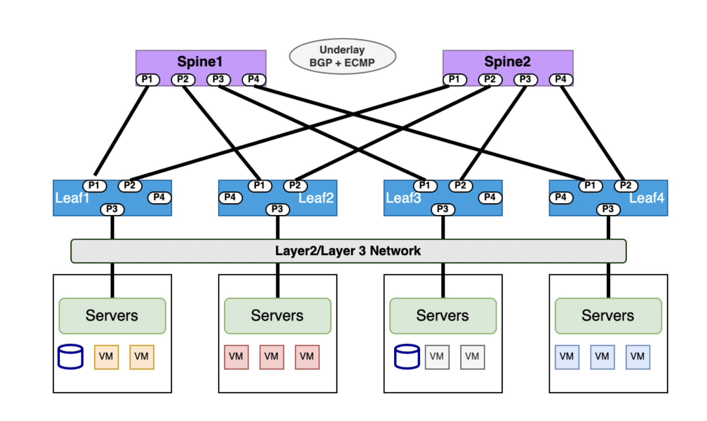
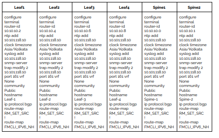
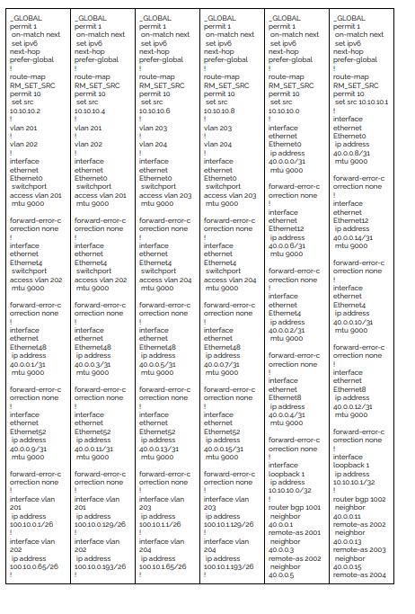
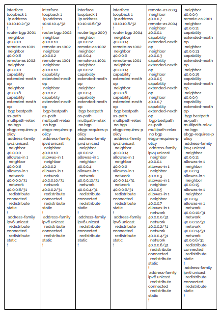

# BGP IP CLOS 

**Overview**
BGP IP-CLOS is a network design and routing architecture commonly used in large-scale data center and cloud environments. IP-CLOS provides a scalable and flexible solution for interconnecting multiple routers in a hierarchical manner, allowing efficient utilization of network resources and simplified routing. 

**Spine-Leaf Architecture:**
The BGP IP CLOS topology is based on a spine-leaf architecture. In this design, there are two layers of switches: the spine switches and the leaf switches. The spine switches provide connectivity between the leaf switches, forming the "spine" of the topology. The leaf switches connect directly to servers, forming the "leaves" of the topology.

**BGP as the Underlay Routing Protocol:**
In the BGP IP CLOS topology, BGP is used as the underlay routing protocol. The spine switches and leaf switches run BGP to establish IP reachability and advertise loopback addresses. This allows for dynamic and efficient IP routing throughout the fabric.

**Unnumbered BGP interfaces**
Unnumbered BGP interfaces sare particularly useful in deployments where IPv4 prefixes are advertised through BGP over a section without any IPv4/IPv6 address configuration on links. As a result, the routing entries are also IPv4 for destination lookup and have IPv6 next hops for forwarding purposes. This saves Ip addresses pool utilized for underlay routing . 

**Non-Blocking Connectivity:**
The CLOS design ensures that every leaf switch is connected to every spine switch, providing non-blocking connectivity between any server in the data center fabric. This architecture allows for optimal east-west traffic flow within the data center, supporting the communication needs of modern distributed applications and workloads.

**Equal-Cost Multi-Path (ECMP) Routing:**
Within the spine layer, BGP utilizes Equal-Cost Multi-Path (ECMP) routing to distribute traffic evenly across multiple paths. ECMP enables load balancing of traffic, maximizing the utilization of available links and increasing overall network capacity.In SONiC, the BGP multipath option works by default. It is set to 64 paths so the switch can install multiple equal-cost BGP paths to the forwarding table and load balance traffic across multiple links. 

## Configuration
- IPv4/IPv6/BGP-Unnumbered Underlay Fabric.
- Host facing port with IPv4/IPv6/L2-Access/L2-Trunk based on requirement.
- ECMP Load Balancing for Leaf & Spine
- SVI Configuration for the Gateway


The template includes the inventory, connectivity, BGP, and other configurations needed for the topology. You can modify the template to fit your specific needs




## YAML Template

```
Inventory:
  SSpines: 0
  Spines: 2
  Leafs: 4
  Tors: 0
Connectivity:
  SSpine: []
  Spine:
    - switchId: 1
      switchName: "Spine-1"
      ipAddress: "10.101.118.11"
      ASN: 1001
      Credentials:
        user: "admin"
        password: "Edge-core"
      mclag:
      Links:
        - link: "S1_Ethernet0 | L1_Ethernet48"
          staticLink: true
          properties:
        - link: "S1_Ethernet4 | L2_Ethernet48"
          staticLink: true
          properties:
        - link: "S1_Ethernet8 | L3_Ethernet48"
          staticLink: true
          properties:
        - link: "S1_Ethernet12 | L4_Ethernet48"
          staticLink: true
          properties:
    - switchId: 2
      switchName: "Spine-2"
      ipAddress: "10.101.118.12"
      ASN: 1002
      Credentials:
        user: "admin"
        password: "Edge-core"
      mclag:
      Links:
        - link: "S2_Ethernet0 | L1_Ethernet52"
          staticLink: true
          properties:
        - link: "S2_Ethernet4 | L2_Ethernet52"
          staticLink: true
          properties:
        - link: "S2_Ethernet8 | L3_Ethernet52"
          staticLink: true
          properties:
        - link: "S2_Ethernet12 | L4_Ethernet52"
          staticLink: true
          properties:
  Leaf:
    - switchId: 1
      switchName: "Leaf-1"
      ipAddress: "10.101.118.13"
      ASN: 2001
      Credentials:
        user: "admin"
        password: "Edge-core"
      mclag:
      Links:
        - link: "L1_Ethernet48 | S1_Ethernet0"
          staticLink: true
          properties:
        - link: "L1_Ethernet52 | S2_Ethernet0"
          staticLink: true
          properties:
        - link: "L1_Ethernet56 |  L2_Ethernet56"
          staticLink: true
          properties:
        - link: "L1_Ethernet0 |  H1_Ethernet0"
          staticLink: true
          properties:
            mode: "L2-Access"
            vlan: 201
        - link: "L1_Ethernet4 |  H2_Ethernet0"
          staticLink: true
          properties:
            mode: "L2-Access"
            vlan: 202
    - switchId: 2
      switchName: "Leaf-2"
      ipAddress: "10.101.118.14"
      ASN: 2002
      Credentials:
        user: "admin"
        password: "Edge-core"
      mclag:
      Links:
        - link: "L2_Ethernet48 | S1_Ethernet4"
          staticLink: true
          properties:
        - link: "L2_Ethernet52 | S2_Ethernet4"
          staticLink: true
          properties:
        - link: "L2_Ethernet56 | L1_Ethernet56"
          staticLink: true
          properties:
        - link: "L2_Ethernet0 |  H1_Ethernet1"
          staticLink: true
          properties:
            mode: "L2-Access"
            vlan: 201
        - link: "L2_Ethernet4 |  H2_Ethernet1"
          staticLink: true
          properties:
            mode: "L2-Access"
            vlan: 202
    - switchId: 3
      switchName: "Leaf-3"
      ipAddress: "10.101.118.15"
      ASN: 2003
      Credentials:
        user: "admin"
        password: "YourPaSsWoRd"
      mclag:
      Links:
        - link: "L3_Ethernet48 | S1_Ethernet8"
          staticLink: true
          properties:
        - link: "L3_Ethernet52 | S2_Ethernet8"
          staticLink: true
          properties:
        - link: "L3_Ethernet56 | L4_Ethernet56"
          staticLink: true
          properties:
        - link: "L3_Ethernet0 |  H3_Ethernet0"
          staticLink: true
          properties:
            mode: "L2-Access"
            vlan: 203
        - link: "L3_Ethernet4 |  H4_Ethernet0"
          staticLink: true
          properties:
            mode: "L2-Access"
            vlan: 204
    - switchId: 4
      switchName: "Leaf-4"
      ipAddress: "10.101.118.16"
      ASN: 2004
      Credentials:
        user: "admin"
        password: "YourPaSsWoRd"
      mclag:
      Links:
        - link: "L4_Ethernet48 | S1_Ethernet12"
          staticLink: true
          properties:
        - link: "L4_Ethernet52 | S2_Ethernet12"
          staticLink: true
          properties:
        - link: "L4_Ethernet56 | L3_Ethernet56"
          staticLink: true
          properties:
        - link: "L4_Ethernet0 |  H3_Ethernet1"
          staticLink: true
          properties:
            mode: "L2-Access"
            vlan: 203
        - link: "L4_Ethernet4 |  H4_Ethernet1"
          staticLink: true
          properties:
            mode: "L2-Access"
            vlan: 204
  Tor: []
BGP:
  BGP_U: false
  ND_RA: 30
PhysicalIfCfg:
  FEC: "Off"
  MTU: 9000
  AdminStatus: "Up"
ASN:
  SSpine: "10000-20000"
  Spine: "21000-50000"
  Leaf: "51000-60000"
  Tor: "61000-70000"
IPv4Pool:
  Loopback: "10.10.10.0/24"
  LeafSpine: "40.0.0.0/24"
  LeafTor: "39.0.0.0/24"
  Host: "49.0.0.0/24"
IPv6Pool:
  LeafSpine:
  LeafTor:
  Host:
NTP:
  server: "10.101.118.10"
  timezone: "Asia/Kolkata"
SYSLOG:
  server: "10.101.118.10"
SNMP:
  trapserver: "10.101.118.10"
Parameters:
  vlan: "200-205"
  vni:
  anycast_gateway: "100.10.0.0/23"
  anycast_mac: "00:11:22:33:44:55"
  hosts_per_vlan: 10
  routing_symmetric: false
  sag: false

```
**Configure Validate & Verify**


**IP Configuration**


**Applied Configuration Switches**




