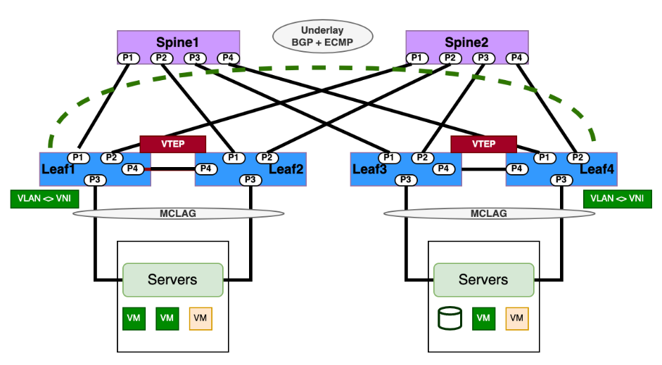
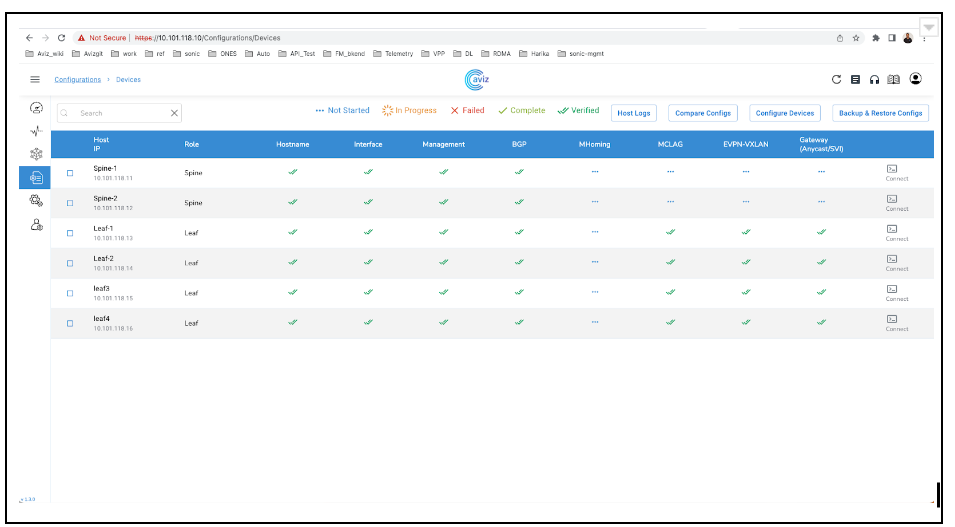
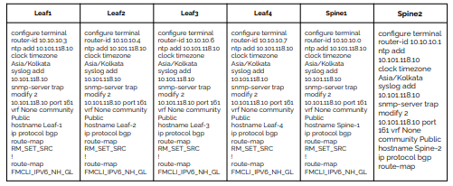
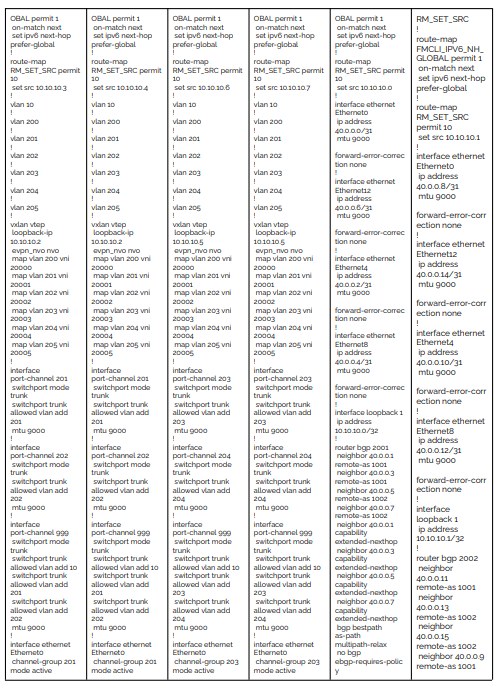
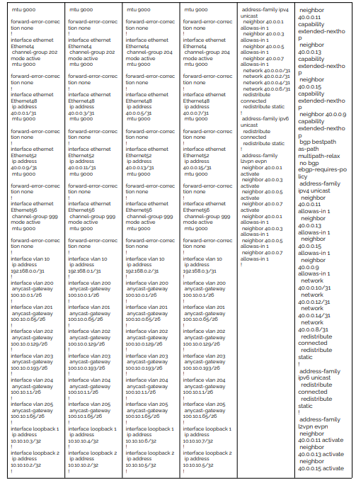
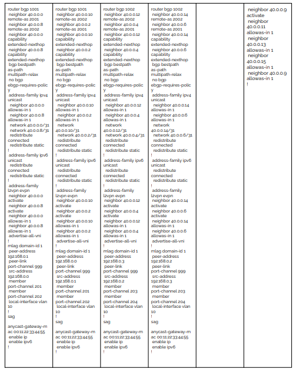

With the asymmetric model, leaf devices serving as VXLAN tunnel endpoints (VTEPs) both route and bridge to initiate the VXLAN tunnel (tunnel ingress). However, when exiting the VXLAN tunnel (tunnel egress), the VTEPs can only bridge the traffic to the destination VLAN.
With this model, VXLAN traffic must use the destination VNI in each direction. The source VTEP always routes the traffic to the destination VLAN and sends it using the destination L2 VNI. When the traffic arrives at the destination VTEP, that device forwards the traffic on the destination VLAN.
Operators have to configure all source and destination VLANs and their corresponding VNIs on each leaf switch, even if a leaf doesn’t host traffic for some of those VLANs. As a result, this model has scaling issues when the network has a large number of VLANs. However, when DC operations have fewer VLANs, this model will have lower latency over the symmetric model. 



## Configuration

In a "L2 VXLAN EVPN with MC LAG  Data Center fabric topology, the configuration sequence involves setting up the necessary components to enable Layer 2 VXLAN with BGP EVPN over MC-LAG interfaces . Following are  summarized configuration sequence:

* IP Addressing and EBGP Underlay Configuration:
* Assign IP addresses to all switches participating in the fabric. 
* Configure the underlay routing protocol (usually BGP) between the spine switches and leaf switches to establish IP reachability.
* Establish eBGP  routing protocols  to exchange routing information between data center sites.
Overlay VXLAN Tunnel Interface Configuration:
* Create a VXLAN tunnel interface on each leaf switch to serve as the endpoint for VXLAN traffic. Assign an IP address to each tunnel interface.

**MC-LAG Configuration:**

* Enable MCLAG on the leaf switches. Configure the MC-LAG system ID and dual peering links between the MC-LAG peer switches.

**VLAN-to-VNI Mapping:**

* Create a VLAN-to-VNI (VXLAN Network Identifier) mapping on each leaf switch. This maps VLANs to VXLAN segments (VNIs) that will be used for VXLAN encapsulation. Configure VLAN-to-VNI (VXLAN Network Identifier) mapping to associate each VLAN in the data center with a specific VNI for Layer 2 extension.
* Configure each leaf switch as a VXLAN VTEP (VXLAN Tunnel Endpoint). This involves associating the VXLAN tunnel interface with the VLAN-to-VNI mapping.

**BGP EVPN Configuration:**

* Enable BGP EVPN on each leaf switch and establish a BGP peering relationship with the other leaf switches.
* Configure the BGP EVPN address family and activate BGP EVPN signaling
 Enable  BGP with EVPN address family to exchange MAC and IP reachability information across the VXLAN fabric between data center sites.

**MC LAG Peer Link Configuration:**

* Set up a dedicated link between the MC LAG peer switches for control plane communication.
* Configure MC LAG interfaces on each leaf switch to bundle the physical links connected to servers.
* VLAN Configuration on MC LAG Interfaces: Apply the VLANs that need to be extended over the VXLAN fabric to the MC LAG interfaces.

**Scenarios for using Asymmetric IRB:**
1. Preferred model for centralized gateway deployment model
2. Networks that involve legacy ASICs that do not support L3 VXLAN and must use centralized gateways
3. Small and medium scale data center deployments

## YAML template

```
Inventory:
  SSpines: 0
  Spines: 2
  Leafs: 4
  Tors: 0
Connectivity:
  SSpine: []
  Spine:
    - switchId: 1
      switchName: "Spine-1"
      ipAddress: "10.101.118.11"
      ASN: 2001
      Credentials:
        user: "admin"
        password: "Edge-core"
      mclag:
      Links:
        - link: "S1_Ethernet0 | L1_Ethernet48"
          staticLink: true
          properties:
        - link: "S1_Ethernet4 | L2_Ethernet48"
          staticLink: true
          properties:
        - link: "S1_Ethernet8 | L3_Ethernet48"
          staticLink: true
          properties:
        - link: "S1_Ethernet12 | L4_Ethernet48"
          staticLink: true
          properties:
    - switchId: 2
      switchName: "Spine-2"
      ipAddress: "10.101.118.12"
      ASN: 2002
      Credentials:
        user: "admin"
        password: "Edge-core"
      mclag:
      Links:
        - link: "S2_Ethernet0 | L1_Ethernet52"
          staticLink: true
          properties:
        - link: "S2_Ethernet4 | L2_Ethernet52"
          staticLink: true
          properties:
        - link: "S2_Ethernet8 | L3_Ethernet52"
          staticLink: true
          properties:
        - link: "S2_Ethernet12 | L4_Ethernet52"
          staticLink: true
          properties:
  Leaf:
    - switchId: 1
      switchName: "Leaf-1"
      ipAddress: "10.101.118.13"
      ASN: 1001
      Credentials:
        user: "admin"
        password: "Edge-core"
      mclag:
        enabled: true
        peer: "L2"
        keepalive_vlan: 10
      Links:
        - link: "L1_Ethernet48 | S1_Ethernet0"
          staticLink: true
          properties:
        - link: "L1_Ethernet52 | S2_Ethernet0"
          staticLink: true
          properties:
        - link: "L1_Ethernet56 |  L2_Ethernet56"
          staticLink: true
          properties:
        - link: "L1_Ethernet0 |  H1_Ethernet0"
          staticLink: true
          properties:
            mode: "L2-Trunk"
            vlan: 201
            mc_po_group: 201
        - link: "L1_Ethernet4 |  H2_Ethernet0"
          staticLink: true
          properties:
            mode: "L2-Trunk"
            vlan: 202
            mc_po_group: 202
    - switchId: 2
      switchName: "Leaf-2"
      ipAddress: "10.101.118.14"
      ASN: 1001
      Credentials:
        user: "admin"
        password: "Edge-core"
      mclag:
        enabled: true
        peer: "L1"
        keepalive_vlan: 10
      Links:
        - link: "L2_Ethernet48 | S1_Ethernet4"
          staticLink: true
          properties:
        - link: "L2_Ethernet52 | S2_Ethernet4"
          staticLink: true
          properties:
        - link: "L2_Ethernet56 | L1_Ethernet56"
          staticLink: true
          properties:
        - link: "L2_Ethernet0 |  H1_Ethernet1"
          staticLink: true
          properties:
            mode: "L2-Trunk"
            vlan: 201
            mc_po_group: 201
        - link: "L2_Ethernet4 |  H2_Ethernet1"
          staticLink: true
          properties:
            mode: "L2-Trunk"
            vlan: 202
            mc_po_group: 202
    - switchId: 3
      switchName: "Leaf-3"
      ipAddress: "10.101.118.15"
      ASN: 1002
      Credentials:
        user: "admin"
        password: "YourPaSsWoRd"
      mclag:
        enabled: true
        peer: "L4"
        keepalive_vlan: 10
      Links:
        - link: "L3_Ethernet48 | S1_Ethernet8"
          staticLink: true
          properties:
        - link: "L3_Ethernet52 | S2_Ethernet8"
          staticLink: true
          properties:
        - link: "L3_Ethernet56 | L4_Ethernet56"
          staticLink: true
          properties:
        - link: "L3_Ethernet0 |  H3_Ethernet0"
          staticLink: true
          properties:
            mode: "L2-Trunk"
            vlan: 203
            mc_po_group: 203
        - link: "L3_Ethernet4 |  H4_Ethernet0"
          staticLink: true
          properties:
            mode: "L2-Trunk"
            vlan: 204
            mc_po_group: 204
- switchId: 4
      switchName: "Leaf-4"
      ipAddress: "10.101.118.16"
      ASN: 1002
      Credentials:
        user: "admin"
        password: "YourPaSsWoRd"
      mclag:
        enabled: true
        peer: "L3"
        keepalive_vlan: 10
      Links:
        - link: "L4_Ethernet48 | S1_Ethernet12"
          staticLink: true
          properties:
        - link: "L4_Ethernet52 | S2_Ethernet12"
          staticLink: true
          properties:
        - link: "L4_Ethernet56 | L3_Ethernet56"
          staticLink: true
          properties:
        - link: "L4_Ethernet0 |  H3_Ethernet1"
          staticLink: true
          properties:
            mode: "L2-Trunk"
            vlan: 203
            mc_po_group: 203
        - link: "L4_Ethernet4 |  H4_Ethernet1"
          staticLink: true
          properties:
            mode: "L2-Trunk"
            vlan: 204
            mc_po_group: 204
  Tor: []
BGP:
  BGP_U: false
  ND_RA: 30
PhysicalIfCfg:
  FEC: "Off"
  MTU: 9000
  AdminStatus: "Up"
ASN:
  SSpine: "10000-20000"
  Spine: "21000-50000"
  Leaf: "51000-60000"
  Tor: "61000-70000"
IPv4Pool:
  Loopback: "10.10.10.0/24"
  LeafSpine: "40.0.0.0/24"
  LeafTor: "39.0.0.0/24"
  Host: "49.0.0.0/24"
IPv6Pool:
  LeafSpine:
  LeafTor:
  Host:
NTP:
  server: "10.101.118.10"
  timezone: "Asia/Kolkata"
SYSLOG:
  server: "10.101.118.10"
SNMP:
  trapserver: "10.101.118.10"
Parameters:
  vlan: "200-205"
  vni: "20000-20005"
  anycast_gateway: "100.10.0.0/23"
  anycast_mac: "00:11:22:33:44:55"
 hosts_per_vlan: 10
  routing_symmetric: false
  sag: true

```
**Config Applied and Verified**



**Applied Configuration on Switches**






