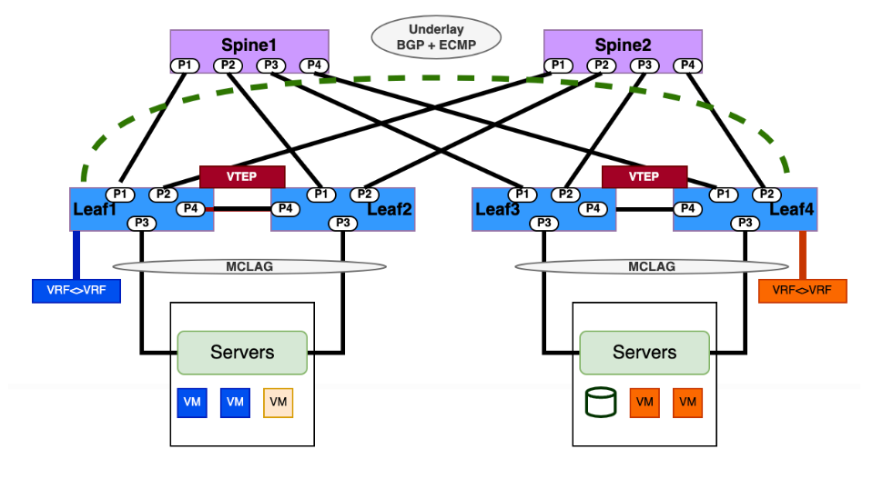
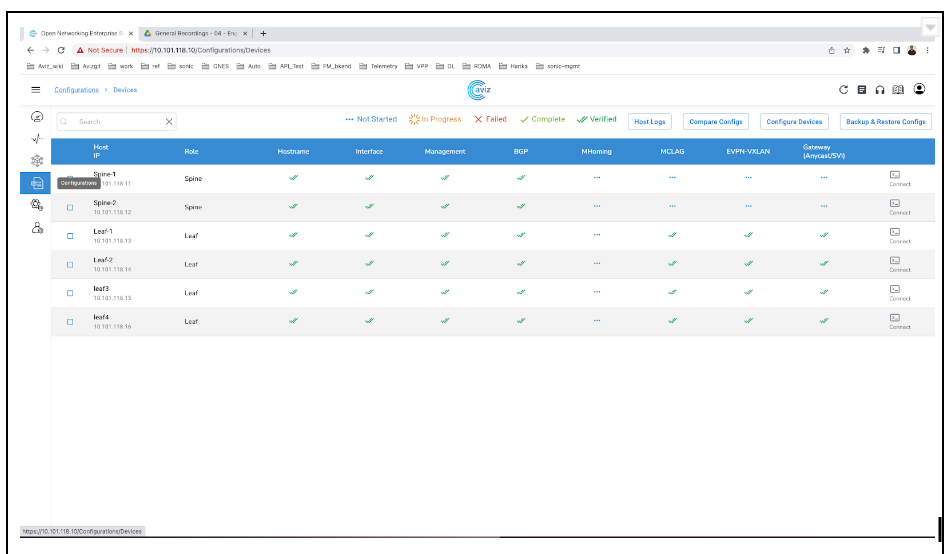
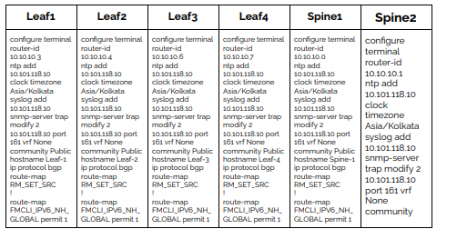
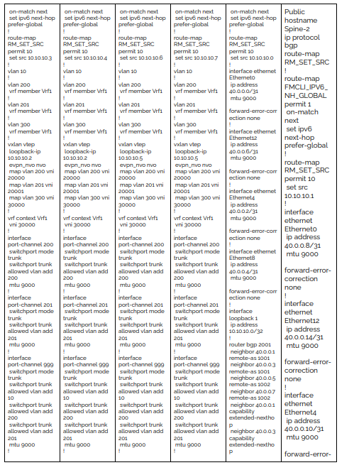
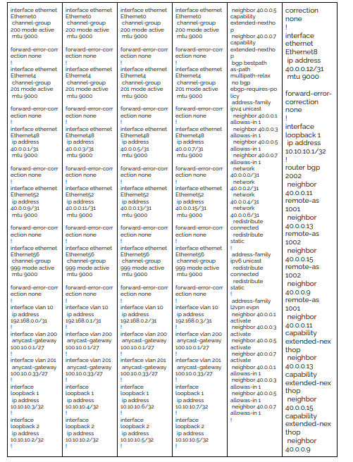
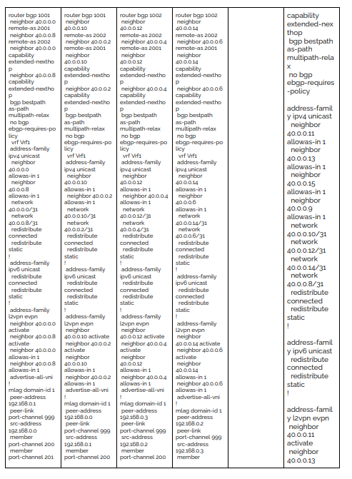
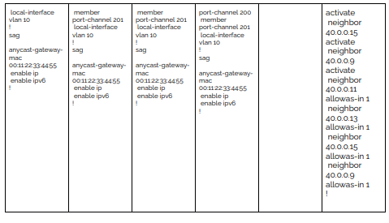

With the symmetric IRB routing model, the VTEPs do routing and bridging on both the ingress and egress sides of the VXLAN tunnel. As a result, VTEPs can do inter-subnet routing for the same virtual routing and forwarding (VRF) instance with the same VNI in both directions. We implement this model for EVPN Type 2 routes the same way as for EVPN Type 5 routes (which we support using only the symmetric model). The VTEPs use a dedicated Layer 3 traffic VNI in both directions for each tenant VRF instance



## Configuration
**Configure VXLAN and EVPN**

  * Set up VXLAN tunnel interfaces on the participating switches/routers to facilitate the creation of VXLAN overlays.
  * Enable EVPN on these devices to handle the MAC and IP reachability information distribution.

**VXLAN VRF Mapping**

  * Configure VRF-to-VNI (VXLAN Network Identifier) mapping. Each VRF in the data center will be mapped to a specific VNI to extend Layer 3 connectivity.

**BGP EVPN Configuration**

  * Configure BGP to run EVPN for the exchange of MAC and IP reachability information between data center sites.
  * Establish BGP peering between the participating switches/routers for the control plane.

**Symmetric IRB Configuration**

  * Set up the Layer 3 gateway IP address on the switches/routers for each VNI. Ensure that this gateway IP address is consistent across all interconnected data center sites.

**Routing Configuration:**

* Set up eBGP routing protocols to ensure the routing information is exchanged between the interconnected data center sites.
* This routing information will be used to direct traffic between the sites through the symmetric IRB gateway.

**Use Cases**

1. All use cases of EVPN fabric within data center except where there is need for a centralized gateway
2. Non-EVPN routes such as default routes/static routes/dynamic routes are involved in the fabric
3. Large-scale EVPN deployments

## YAML Template
```
Inventory:
  SSpines: 0
  Spines: 2
  Leafs: 4
  Tors: 0
Connectivity:
  SSpine: []
  Spine:
    - switchId: 1
      switchName: "Spine-1"
      ipAddress: "10.101.118.11"
      ASN: 2001
      Credentials:
        user: "admin"
        password: "Edge-core"
      mclag:
      Links:
        - link: "S1_Ethernet0 | L1_Ethernet48"
          staticLink: true
          properties:
        - link: "S1_Ethernet4 | L2_Ethernet48"
          staticLink: true
          properties:
        - link: "S1_Ethernet8 | L3_Ethernet48"
          staticLink: true
          properties:
        - link: "S1_Ethernet12 | L4_Ethernet48"
          staticLink: true
          properties:
    - switchId: 2
      switchName: "Spine-2"
      ipAddress: "10.101.118.12"
      ASN: 2002
      Credentials:
        user: "admin"
        password: "Edge-core"
      mclag:
      Links:
        - link: "S2_Ethernet0 | L1_Ethernet52"
          staticLink: true
          properties:
        - link: "S2_Ethernet4 | L2_Ethernet52"
          staticLink: true
          properties:
        - link: "S2_Ethernet8 | L3_Ethernet52"
          staticLink: true
          properties:
        - link: "S2_Ethernet12 | L4_Ethernet52"
          staticLink: true
          properties:
  Leaf:
    - switchId: 1
      switchName: "Leaf-1"
      ipAddress: "10.101.118.13"
      ASN: 1001
      Credentials:
        user: "admin"
        password: "Edge-core"
      mclag:
        enabled: true
        peer: "L2"
        keepalive_vlan: 10
      Links:
        - link: "L1_Ethernet48 | S1_Ethernet0"
          staticLink: true
          properties:
        - link: "L1_Ethernet52 | S2_Ethernet0"
          staticLink: true
          properties:
        - link: "L1_Ethernet56 |  L2_Ethernet56"
          staticLink: true
          properties:
        - link: "L1_Ethernet0 |  H1_Ethernet0"
          staticLink: true
          properties:
            mode: "L2-Trunk"
            vlan: 200
            mc_po_group: 200
            vrf: 1
        - link: "L1_Ethernet4 |  H2_Ethernet0"
          staticLink: true
          properties:
            mode: "L2-Trunk"
            vlan: 201
            mc_po_group: 201
            vrf: 1
    - switchId: 2
      switchName: "Leaf-2"
      ipAddress: "10.101.118.14"
      ASN: 1001
      Credentials:
        user: "admin"
        password: "Edge-core"
      mclag:
        enabled: true
        peer: "L1"
        keepalive_vlan: 10
      Links:
        - link: "L2_Ethernet48 | S1_Ethernet4"
          staticLink: true
          properties:
        - link: "L2_Ethernet52 | S2_Ethernet4"
          staticLink: true
          properties:
        - link: "L2_Ethernet56 | L1_Ethernet56"
          staticLink: true
          properties:
        - link: "L2_Ethernet0 |  H1_Ethernet1"
          staticLink: true
          properties:
            mode: "L2-Trunk"
            vlan: 200
            mc_po_group: 200
            vrf: 1
        - link: "L2_Ethernet4 |  H2_Ethernet1"
          staticLink: true
          properties:
            mode: "L2-Trunk"
            vlan: 201
            mc_po_group: 201
            vrf: 1
    - switchId: 3
      switchName: "Leaf-3"
      ipAddress: "10.101.118.15"
      ASN: 1002
      Credentials:
        user: "admin"
        password: "YourPaSsWoRd"
      mclag:
        enabled: true
        peer: "L4"
        keepalive_vlan: 10
      Links:
        - link: "L3_Ethernet48 | S1_Ethernet8"
          staticLink: true
          properties:
        - link: "L3_Ethernet52 | S2_Ethernet8"
          staticLink: true
          properties:
        - link: "L3_Ethernet56 | L4_Ethernet56"
          staticLink: true
          properties:
        - link: "L3_Ethernet0 |  H3_Ethernet0"
          staticLink: true
          properties:
            mode: "L2-Trunk"
            vlan: 200
            mc_po_group: 200
            vrf: 1
        - link: "L3_Ethernet4 |  H4_Ethernet0"
          staticLink: true
          properties:
            mode: "L2-Trunk"
            vlan: 201
            mc_po_group: 201
            vrf: 1
    - switchId: 4
      switchName: "Leaf-4"
      ipAddress: "10.101.118.16"
      ASN: 1002
      Credentials:
        user: "admin"
        password: "YourPaSsWoRd"
      mclag:
        enabled: true
        peer: "L3"
        keepalive_vlan: 10
      Links:
        - link: "L4_Ethernet48 | S1_Ethernet12"
          staticLink: true
          properties:
        - link: "L4_Ethernet52 | S2_Ethernet12"
          staticLink: true
          properties:
        - link: "L4_Ethernet56 | L3_Ethernet56"
          staticLink: true
          properties:
        - link: "L4_Ethernet0 |  H3_Ethernet1"
          staticLink: true
          properties:
            mode: "L2-Trunk"
            vlan: 200
 mc_po_group: 200
            vrf: 1
        - link: "L4_Ethernet4 |  H4_Ethernet1"
          staticLink: true
          properties:
            mode: "L2-Trunk"
            vlan: 201
            mc_po_group: 201
            vrf: 1
  Tor: []
BGP:
  BGP_U: false
  ND_RA: 30
PhysicalIfCfg:
  FEC: "Off"
  MTU: 9000
  AdminStatus: "Up"
ASN:
  SSpine: "10000-20000"
  Spine: "21000-50000"
  Leaf: "51000-60000"
  Tor: "61000-70000"
IPv4Pool:
  Loopback: "10.10.10.0/24"
  LeafSpine: "40.0.0.0/24"
  LeafTor: "39.0.0.0/24"
  Host: "49.0.0.0/24"
IPv6Pool:
  LeafSpine:
  LeafTor:
  Host:
NTP:
  server: "10.101.118.10"
  timezone: "Asia/Kolkata"
SYSLOG:
  server: "10.101.118.10"
SNMP:
  trapserver: "10.101.118.10"
Parameters:
  vlan: "200-205"
  vni: "20000-20005"
  anycast_gateway: "100.10.0.0/23"
  anycast_mac: "00:11:22:33:44:55"
  hosts_per_vlan: 10
  routing_symmetric: true
  irb_vlan: "300-305"
  irb_vni: "30000-30005"
  sag: true

```
**Config Applied and Validated**



**Applied Configuration on Switches**





