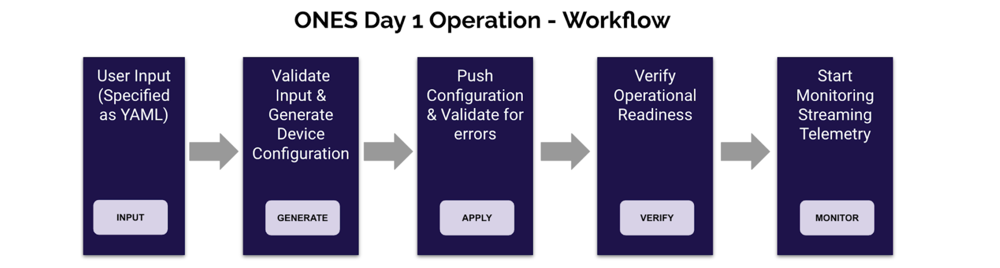

# SONiC Validated Designs - ONES

Aviz ONES has pre-validated templates for various data center fabric deployments using SONiC. The template defines the simplified config intent, which is then consumed by ONES fabric manager to orchestrate the network running SONiC on multi-vendor platforms. Following fabric deployments are validated using ONES

- BGP-IP-CLOS
- DCL-L2-VXLAN-EVPN-MC LAG
- DCL-L3-VXLAN-EVPN-Sym-IRB
- DCL-L3-VXLAN-EVPN-Asym-IRB
- Simple L2-LS (MC LAG)

Sonic validated design fully integrates with Aviz ONES orchestration and Supportability applications which add configuration management life cycle , configuration change control workflow , continuous validation check of applied configurations to enrolled devices in sonic fabric . 

