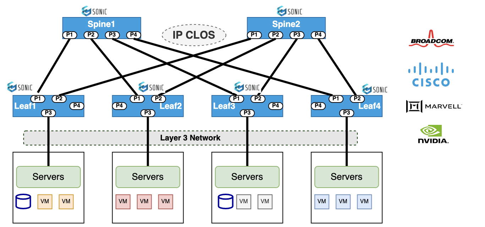

# <b> Day 1 Operations for SONiC with ONES</b>  

Traditionally network operators were used to provision  Day 1 operations like interface creation , VLAN creation , BGP neighborship configuration etc using manual CLI for configuring DC Leaf and Spine switches  in 2 or 3 CLOS architecture. Configuration application to various Data Center switches through CLIs is a tedious and time consuming process for the operation teams .

The validation process of applied configuration  is also manual resulting in probability of errors during commissioning . Operators will then have to troubleshoot the complete control path and data path to isolate issues due to misconfiguration in Day 1 network entity provisioning.

The most prominently  leveraged data center fabric topology is the highly scalable Layer3  IP-CLOS network design and routing architecture commonly used in large-scale data center and cloud environments. The IP-CLOS provides a scalable and flexible solution for interconnecting multiple switches  in a hierarchical manner in leaf and spine architecture allowing efficient utilization of network resources and simplified routing.

Using Aviz network’s  ONES Validated Designs (OVD) , commissioning of network services in Day 1 operations is automated ,  greatly simplified and reduces considerable  time to deploy services . 

OVD ensures consistency , accuracy and availability of all configurations committed in Day 1 operations through a unified fabric automation approach .

Using an overlay architecture in the Data Center allows end users (network administrators) to place the endpoints (servers or virtual machines) anywhere in the network and remain connected to the same logical Layer 2 network enabling the virtual topology to be decoupled from the physical topology. 

This decoupling allows the data center network to be programmatically provisioned at a per-tenant level. Overlay networking generally supports both Layer 2 and Layer 3 transport between servers or VMs which  supports a much larger scale. SONiC overlay networks use a control-plane protocol (BGP-EVPN) to facilitate learning and sharing of endpoint information and uses VXLAN tunneling protocol to create the data plane for the overlay layer.

Aviz ONES simplifies the Day 1 orchestration with an unified approach of configuring data center fabric running SONiC. ONES collects the necessary fabric intent in a simplified YAML format, generates the unified configuration for each device enrolled and managed by ONES . The generated configuration is applied, validated and verified for operational readiness. ONES provides the following advantages to network operation teams-

- **Unified Fabric manager** platform for Network Administrators  across multi-vendor system running SONiC enabled fabric
- **Single Click Interface** to Generate, Validate, Apply and Verify the Day 1 readiness of the Data Center Fabric
- Supports various **Fabric architectures** including BGP-IP-CLOS,  BGP-IP-CLOS-MC LAG , L2-VXLAN Asymmetric IRB over MC LAG,  L3-VXLAN Symmetric IRB over MC LAG 
- Simplified **Language agnostic REST APIs** for integration to existing NetOps tools for Day 1.
- **Open Data Models** used are YAML templates for configuration and OpenConfig , GNMI for Monitoring.
- **Multi-vendor Sonic Orchestration** supporting both Hardware (ASIC/Switches) and Software (SONiC NOS - Community or Vendor).

