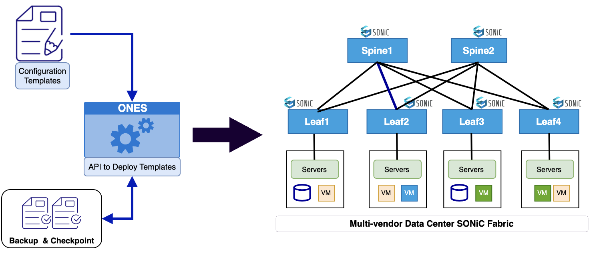

# <b> ONES for Day 2 operations</b>

ONES provides in-depth visibility of the network state in a multi-vendor data center environment  running SONiC. This includes a comprehensive  dashboard view for  both the point-in-time and time-series data for inventory, health, topology and traffic management . ONES include an in-built rule engine to notify alerts on anomalies and failures. 

For Data Center Operations maintenance, ONES provides clear abstraction to network operators through REST APIs and UIs for Day 2 operations like switch RMAs and image upgrades. 

