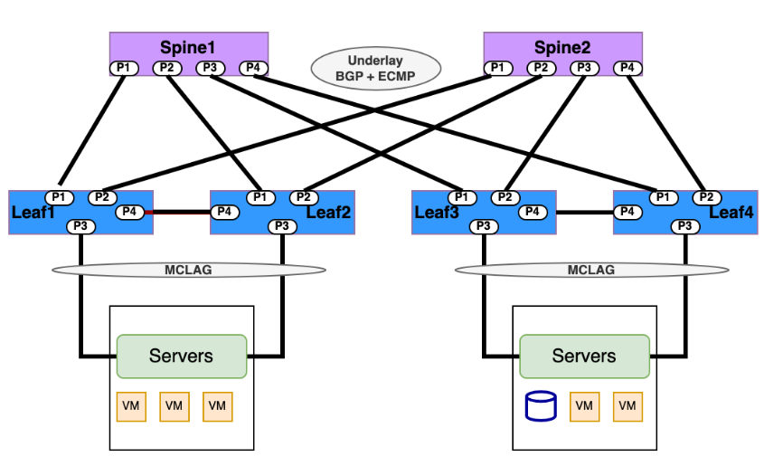

# BGP-IP-CLOS-MCLAG 



## Configuration

* IPv4/IPv6/BGP-Unnumbered Underlay Fabric.
* Host facing port with IPv4/IPv6/L2-Access/L2-Trunk based on requirement.
* ECMP Load Balancing for Leaf & Spine
* SVI Configuration for the Gateway
* MCLAG Configuration on the Leaf Switches
The template includes the inventory, connectivity, BGP, and other configurations needed for the topology. You can modify the template to fit your specific needs

### YAML Template

```yaml
Inventory:
  SSpines: 0
  Spines: 2
  Leafs: 4
  Tors: 0
Connectivity:
  SSpine: []
  Spine:
    - switchId: 1
      switchName: "Spine-1"
      ipAddress: "10.101.118.11"
      ASN: 1001
      Credentials:
        user: "admin"
        password: "Edge-core"
      mclag: null
      Links:
        - link: "S1_Ethernet0 | L1_Ethernet48"
          staticLink: true
          properties: null
        - link: "S1_Ethernet4 | L2_Ethernet48"
          staticLink: true
          properties: null
        - link: "S1_Ethernet8 | L3_Ethernet48"
          staticLink: true
          properties: null
        - link: "S1_Ethernet12 | L4_Ethernet48"
          staticLink: true
          properties: null
    - switchId: 2
      switchName: "Spine-2"
      ipAddress: "10.101.118.12"
      ASN: 1002
      Credentials:
        user: "admin"
        password: "Edge-core"
      mclag: null
      Links:
        - link: "S2_Ethernet0 | L1_Ethernet52"
          staticLink: true
          properties: null
        - link: "S2_Ethernet4 | L2_Ethernet52"
          staticLink: true
          properties: null
        - link: "S2_Ethernet8 | L3_Ethernet52"
          staticLink: true
          properties: null
        - link: "S2_Ethernet12 | L4_Ethernet52"
          staticLink: true
          properties: null
  Leaf:
    - switchId: 1
      switchName: "Leaf-1"
      ipAddress: "10.101.118.13"
      ASN: 2001
      Credentials:
        user: "admin"
        password: "Edge-core"
      mclag:
        enabled: true
        peer: "L2"
        keepalive_vlan: 10
      Links:
        - link: "L1_Ethernet48 | S1_Ethernet0"
          staticLink: true
          properties: null
        - link: "L1_Ethernet52 | S2_Ethernet0"
          staticLink: true
          properties: null
        - link: "L1_Ethernet56 |  L2_Ethernet56"
          staticLink: true
          properties: null
        - link: "L1_Ethernet0 |  H1_Ethernet0"
          staticLink: true
          properties:
            mode: "L2-Access"
            vlan: 200
            mc_po_group: 200
        - link: "L1_Ethernet4 |  H2_Ethernet0"
          staticLink: true
          properties:
            mode: "L2-Access"
            vlan: 201
            mc_po_group: 201
    - switchId: 2
      switchName: "Leaf-2"
      ipAddress: "10.101.118.14"
      ASN: 2001
      Credentials:
        user: "admin"
        password: "Edge-core"
      mclag:
        enabled: true
        peer: "L1"
        keepalive_vlan: 10
      Links:
        - link: "L2_Ethernet48 | S1_Ethernet4"
          staticLink: true
          properties: null
        - link: "L2_Ethernet52 | S2_Ethernet4"
          staticLink: true
          properties: null
        - link: "L2_Ethernet56 | L1_Ethernet56"
          staticLink: true
          properties: null
        - link: "L2_Ethernet0 |  H1_Ethernet1"
          staticLink: true
          properties:
            mode: "L2-Access"
            vlan: 200
            mc_po_group: 200
        - link: "L2_Ethernet4 |  H2_Ethernet1"
          staticLink: true
          properties:
            mode: "L2-Access"
            vlan: 201
            mc_po_group: 201
    - switchId: 3
      switchName: "Leaf-3"
      ipAddress: "10.101.118.15"
      ASN: 2002
      Credentials:
        user: "admin"
        password: "YourPaSsWoRd"
      mclag:
        enabled: true
        peer: "L4"
        keepalive_vlan: 10
      Links:
        - link: "L3_Ethernet48 | S1_Ethernet8"
          staticLink: true
          properties: null
        - link: "L3_Ethernet52 | S2_Ethernet8"
          staticLink: true
          properties: null
        - link: "L3_Ethernet56 | L4_Ethernet56"
          staticLink: true
          properties: null
        - link: "L3_Ethernet0 |  H3_Ethernet0"
          staticLink: true
          properties:
            mode: "L2-Access"
            vlan: 200
            mc_po_group: 200
        - link: "L3_Ethernet4 |  H4_Ethernet0"
          staticLink: true
          properties:
            mode: "L2-Access"
            vlan: 201
            mc_po_group: 201
    - switchId: 4
      switchName: "Leaf-4"
      ipAddress: "10.101.118.16"
      ASN: 2002
      Credentials:
        user: "admin"
        password: "YourPaSsWoRd"
      mclag:
        enabled: true
        peer: "L3"
        keepalive_vlan: 10
      Links:
        - link: "L4_Ethernet48 | S1_Ethernet12"
          staticLink: true
          properties: null
        - link: "L4_Ethernet52 | S2_Ethernet12"
          staticLink: true
          properties: null
        - link: "L4_Ethernet56 | L3_Ethernet56"
          staticLink: true
          properties: null
        - link: "L4_Ethernet0 |  H3_Ethernet1"
          staticLink: true
          properties:
            mode: "L2-Access"
            vlan: 200
            mc_po_group: 200
        - link: "L4_Ethernet4 |  H4_Ethernet1"
          staticLink: true
          properties:
            mode: "L2-Access"
            vlan: 201
            mc_po_group: 201
  Tor: []
BGP:
  BGP_U: false
  ND_RA: 30
PhysicalIfCfg:
  FEC: "Off"
  MTU: 9000
  AdminStatus: "Up"
ASN:
  SSpine: "10000-20000"
  Spine: "21000-50000"
  Leaf: "51000-60000"
  Tor: "61000-70000"
IPv4Pool:
  Loopback: "10.10.10.0/24"
  LeafSpine: "40.0.0.0/24"
  LeafTor: "39.0.0.0/24"
  Host: "49.0.0.0/24"
IPv6Pool:
  LeafSpine: null
  LeafTor: null
  Host: null
NTP:
  server: "10.101.118.10"
  timezone: "Asia/Kolkata"
SYSLOG:
  server: "10.101.118.10"
SNMP:
  trapserver: "10.101.118.10"
Parameters:
  vlan: "200-205"
anycast_gateway: "100.10.0.0/23"
  hosts_per_vlan: 10

```

### Config Applied and Verified


### Applied Configuration on Switches

=== "Leaf1"

    ``` sh
    configure terminal
    router-id 10.10.10.3
    ntp add 10.101.118.10
    clock timezone Asia/Kolkata
    syslog add 10.101.118.10
    snmp-server trap modify 2 10.101.118.10 port 161 vrf None community Public
    hostname Leaf-1
    ip protocol bgp route-map RM_SET_SRC
    !
    route-map FMCLI_IPV6_NH_GLOBAL permit 1
    on-match next
    set ipv6 next-hop prefer-global
    !
    route-map RM_SET_SRC permit 10
    set src 10.10.10.3
    !
    vlan 10
    !
    vlan 200
    !
    vlan 201
    !
    interface port-channel 200
    switchport access vlan 200
    mtu 9000
    !
    interface port-channel 201
    switchport access vlan 201
    mtu 9000
    !
    interface port-channel 999
    switchport mode trunk
    switchport trunk allowed vlan add 10
    switchport trunk allowed vlan add 200
    switchport trunk allowed vlan add 201
    mtu 9000
    !
    interface ethernet Ethernet0
    channel-group 200 mode active
    mtu 9000
    forward-error-correction none
    !
    interface ethernet Ethernet4
    channel-group 201 mode active
    mtu 9000
    forward-error-correction none
    !
    interface ethernet Ethernet48
    ip address 40.0.0.1/31
    mtu 9000
    forward-error-correction none
    !
    interface ethernet Ethernet52
    ip address 40.0.0.9/31
    mtu 9000
    forward-error-correction none
    !
    interface ethernet Ethernet56
    channel-group 999 mode active
    mtu 9000
    forward-error-correction none
    !
    interface vlan 10
    ip address 192.168.0.0/31
    !
    interface vlan 200
    ip address 100.10.0.1/25
    !
    interface vlan 201
    ip address 100.10.0.129/25
    !
    interface loopback 1
    ip address 10.10.10.3/32
    !
    router bgp 2001
    neighbor 40.0.0.0 remote-as 1001
    neighbor 40.0.0.8 remote-as 1002
    neighbor 40.0.0.0 capability extended-nexthop
    neighbor 40.0.0.8 capability extended-nexthop
    bgp bestpath as-path multipath-relax
    no bgp ebgp-requires-policy
    address-family ipv4 unicast
      neighbor 40.0.0.0 allowas-in 1
      neighbor 40.0.0.8 allowas-in 1
      network 40.0.0.0/31
      network 40.0.0.8/31
      redistribute connected
      redistribute static
    !
    address-family ipv6 unicast
      redistribute connected
      redistribute static
    !
    mlag domain-id 1
    peer-address 192.168.0.1
    peer-link port-channel 999
    src-address 192.168.0.0
    member port-channel 200
    member port-channel 201
    local-interface vlan 10
    !

    ```

=== "Leaf2"

    ``` sh
    configure terminal
    router-id 10.10.10.4
    ntp add 10.101.118.10
    clock timezone Asia/Kolkata
    syslog add 10.101.118.10
    snmp-server trap modify 2 10.101.118.10 port 161 vrf None community Public
    hostname Leaf-2
    ip protocol bgp route-map RM_SET_SRC
    !
    route-map FMCLI_IPV6_NH_GLOBAL permit 1
    on-match next
    set ipv6 next-hop prefer-global
    !
    route-map RM_SET_SRC permit 10
    set src 10.10.10.4
    !
    vlan 10
    !
    vlan 200
    !
    vlan 201
    !
    interface port-channel 200
    switchport access vlan 200
    mtu 9000
    !
    interface port-channel 201
    switchport access vlan 201
    mtu 9000
    !
    interface port-channel 999
    switchport mode trunk
    switchport trunk allowed vlan add 10
    switchport trunk allowed vlan add 200
    switchport trunk allowed vlan add 201
    mtu 9000
    !
    interface ethernet Ethernet0
    channel-group 200 mode active
    mtu 9000
    forward-error-correction none
    !
    interface ethernet Ethernet4
    channel-group 201 mode active
    mtu 9000
    forward-error-correction none
    !
    interface ethernet Ethernet48
    ip address 40.0.0.3/31
    mtu 9000
    forward-error-correction none
    !
    interface ethernet Ethernet52
    ip address 40.0.0.11/31
    mtu 9000
    forward-error-correction none
    !
    interface ethernet Ethernet56
    channel-group 999 mode active
    mtu 9000
    forward-error-correction none
    !
    interface vlan 10
    ip address 192.168.0.1/31
    !
    interface vlan 200
    ip address 100.10.0.1/25
    !
    interface vlan 201
    ip address 100.10.0.129/25
    !
    interface loopback 1
    ip address 10.10.10.4/32
    !
    router bgp 2001
    neighbor 40.0.0.10 remote-as 1002
    neighbor 40.0.0.2 remote-as 1001
    neighbor 40.0.0.10 capability extended-nexthop
    neighbor 40.0.0.2 capability extended-nexthop
    bgp bestpath as-path multipath-relax
    no bgp ebgp-requires-policy
    address-family ipv4 unicast
      neighbor 40.0.0.10 allowas-in 1
      neighbor 40.0.0.2 allowas-in 1
      network 40.0.0.10/31
      network 40.0.0.2/31
      redistribute connected
      redistribute static
    !
    address-family ipv6 unicast
      redistribute connected
      redistribute static
    !
    mlag domain-id 1
    peer-address 192.168.0.0
    peer-link port-channel 999
    src-address 192.168.0.1
    member port-channel 200
    member port-channel 201
    local-interface vlan 10
    !

    ```

=== "Leaf3"

    ``` sh
    configure terminal
    router-id 10.10.10.6
    ntp add 10.101.118.10
    clock timezone Asia/Kolkata
    syslog add 10.101.118.10
    snmp-server trap modify 2 10.101.118.10 port 161 vrf None community Public
    hostname Leaf-3
    ip protocol bgp route-map RM_SET_SRC
    !
    route-map FMCLI_IPV6_NH_GLOBAL permit 1
    on-match next
    set ipv6 next-hop prefer-global
    !
    route-map RM_SET_SRC permit 10
    set src 10.10.10.6
    !
    vlan 10
    !
    vlan 200
    !
    vlan 201
    !
    interface port-channel 200
    switchport access vlan 200
    mtu 9000
    !
    interface port-channel 201
    switchport access vlan 201
    mtu 9000
    !
    interface port-channel 999
    switchport mode trunk
    switchport trunk allowed vlan add 10
    switchport trunk allowed vlan add 200
    switchport trunk allowed vlan add 201
    mtu 9000
    !
    interface ethernet Ethernet0
    channel-group 200 mode active
    mtu 9000
    forward-error-correction none
    !
    interface ethernet Ethernet4
    channel-group 201 mode active
    mtu 9000
    forward-error-correction none
    !
    interface ethernet Ethernet48
    ip address 40.0.0.5/31
    mtu 9000
    forward-error-correction none
    !
    interface ethernet Ethernet52
    ip address 40.0.0.13/31
    mtu 9000
    forward-error-correction none
    !
    interface ethernet Ethernet56
    channel-group 999 mode active
    mtu 9000
    forward-error-correction none
    !
    interface vlan 10
    ip address 192.168.0.2/31
    !
    interface vlan 200
    ip address 100.10.1.1/25
    !
    interface vlan 201
    ip address 100.10.1.129/25
    !
    interface loopback 1
    ip address 10.10.10.6/32
    !
    router bgp 2002
    neighbor 40.0.0.12 remote-as 1002
    neighbor 40.0.0.4 remote-as 1001
    neighbor 40.0.0.12 capability extended-nexthop
    neighbor 40.0.0.4 capability extended-nexthop
    bgp bestpath as-path multipath-relax
    no bgp ebgp-requires-policy
    address-family ipv4 unicast
      neighbor 40.0.0.12 allowas-in 1
      neighbor 40.0.0.4 allowas-in 1
      network 40.0.0.12/31
      network 40.0.0.4/31
      redistribute connected
      redistribute static
    !
    address-family ipv6 unicast
      redistribute connected
      redistribute static
    !
    mlag domain-id 1
    peer-address 192.168.0.3
    peer-link port-channel 999
    src-address 192.168.0.2
    member port-channel 200
    member port-channel 201
    local-interface vlan 10
    !

    ```

=== "Leaf4"

    ``` sh
    configure terminal
    router-id 10.10.10.7
    ntp add 10.101.118.10
    clock timezone Asia/Kolkata
    syslog add 10.101.118.10
    snmp-server trap modify 2 10.101.118.10 port 161 vrf None community Public
    hostname Leaf-4
    ip protocol bgp route-map RM_SET_SRC
    !
    route-map FMCLI_IPV6_NH_GLOBAL permit 1
    on-match next
    set ipv6 next-hop prefer-global
    !
    route-map RM_SET_SRC permit 10
    set src 10.10.10.7
    !
    vlan 10
    !
    vlan 200
    !
    vlan 201
    !
    interface port-channel 200
    switchport access vlan 200
    mtu 9000
    !
    interface port-channel 201
    switchport access vlan 201
    mtu 9000
    !
    interface port-channel 999
    switchport mode trunk
    switchport trunk allowed vlan add 10
    switchport trunk allowed vlan add 200
    switchport trunk allowed vlan add 201
    mtu 9000
    !
    interface ethernet Ethernet0
    channel-group 200 mode active
    mtu 9000
    forward-error-correction none
    !
    interface ethernet Ethernet4
    channel-group 201 mode active
    mtu 9000
    forward-error-correction none
    !
    interface ethernet Ethernet48
    ip address 40.0.0.7/31
    mtu 9000
    forward-error-correction none
    !
    interface ethernet Ethernet52
    ip address 40.0.0.15/31
    mtu 9000
    forward-error-correction none
    !
    interface ethernet Ethernet56
    channel-group 999 mode active
    mtu 9000
    forward-error-correction none
    !
    interface vlan 10
    ip address 192.168.0.3/31
    !
    interface vlan 200
    ip address 100.10.1.1/25
    !
    interface vlan 201
    ip address 100.10.1.129/25
    !
    interface loopback 1
    ip address 10.10.10.7/32
    !
    router bgp 2002
    neighbor 40.0.0.14 remote-as 1002
    neighbor 40.0.0.6 remote-as 1001
    neighbor 40.0.0.14 capability extended-nexthop
    neighbor 40.0.0.6 capability extended-nexthop
    bgp bestpath as-path multipath-relax
    no bgp ebgp-requires-policy
    address-family ipv4 unicast
      neighbor 40.0.0.14 allowas-in 1
      neighbor 40.0.0.6 allowas-in 1
      network 40.0.0.14/31
      network 40.0.0.6/31
      redistribute connected
      redistribute static
    !
    address-family ipv6 unicast
      redistribute connected
      redistribute static
    !
    mlag domain-id 1
    peer-address 192.168.0.2
    peer-link port-channel 999
    src-address 192.168.0.3
    member port-channel 200
    member port-channel 201
    local-interface vlan 10
    !
    ```

=== "Spine1"

    ``` sh
    configure terminal
    router-id 10.10.10.0
    ntp add 10.101.118.10
    clock timezone Asia/Kolkata
    syslog add 10.101.118.10
    snmp-server trap modify 2 10.101.118.10 port 161 vrf None community Public
    hostname Spine-1
    ip protocol bgp route-map RM_SET_SRC
    !
    route-map FMCLI_IPV6_NH_GLOBAL permit 1
    on-match next
    set ipv6 next-hop prefer-global
    !
    route-map RM_SET_SRC permit 10
    set src 10.10.10.0
    !
    interface ethernet Ethernet0
    ip address 40.0.0.0/31
    mtu 9000
    forward-error-correction none
    !
    interface ethernet Ethernet12
    ip address 40.0.0.6/31
    mtu 9000
    forward-error-correction none
    !
    interface ethernet Ethernet4
    ip address 40.0.0.2/31
    mtu 9000
    forward-error-correction none
    !
    interface ethernet Ethernet8
    ip address 40.0.0.4/31
    mtu 9000
    forward-error-correction none
    !
    interface loopback 1
    ip address 10.10.10.0/32
    !
    router bgp 1001
    neighbor 40.0.0.1 remote-as 2001
    neighbor 40.0.0.3 remote-as 2001
    neighbor 40.0.0.5 remote-as 2002
    neighbor 40.0.0.7 remote-as 2002
    neighbor 40.0.0.1 capability extended-nexthop
    neighbor 40.0.0.3 capability extended-nexthop
    neighbor 40.0.0.5 capability extended-nexthop
    neighbor 40.0.0.7 capability extended-nexthop
    bgp bestpath as-path multipath-relax
    no bgp ebgp-requires-policy
    address-family ipv4 unicast
      neighbor 40.0.0.1 allowas-in 1
      neighbor 40.0.0.3 allowas-in 1
      neighbor 40.0.0.5 allowas-in 1
      neighbor 40.0.0.7 allowas-in 1
      network 40.0.0.0/31
      network 40.0.0.2/31
      network 40.0.0.4/31
      network 40.0.0.6/31
      redistribute connected
      redistribute static
    !
    address-family ipv6 unicast
      redistribute connected
      redistribute static
    !

    ```

=== "Spine2"

    ``` sh
    configure terminal
    router-id 10.10.10.1
    ntp add 10.101.118.10
    clock timezone Asia/Kolkata
    syslog add 10.101.118.10
    snmp-server trap modify 2 10.101.118.10 port 161 vrf None community Public
    hostname Spine-2
    ip protocol bgp route-map RM_SET_SRC
    !
    route-map FMCLI_IPV6_NH_GLOBAL permit 1
    on-match next
    set ipv6 next-hop prefer-global
    !
    route-map RM_SET_SRC permit 10
    set src 10.10.10.1
    !
    interface ethernet Ethernet0
    ip address 40.0.0.8/31
    mtu 9000
    forward-error-correction none
    !
    interface ethernet Ethernet12
    ip address 40.0.0.14/31
    mtu 9000
    forward-error-correction none
    !
    interface ethernet Ethernet4
    ip address 40.0.0.10/31
    mtu 9000
    forward-error-correction none
    !
    interface ethernet Ethernet8
    ip address 40.0.0.12/31
    mtu 9000
    forward-error-correction none
    !
    interface loopback 1
    ip address 10.10.10.1/32
    !
    router bgp 1002
    neighbor 40.0.0.11 remote-as 2001
    neighbor 40.0.0.13 remote-as 2002
    neighbor 40.0.0.15 remote-as 2002
    neighbor 40.0.0.9 remote-as 2001
    neighbor 40.0.0.11 capability extended-nexthop
    neighbor 40.0.0.13 capability extended-nexthop
    neighbor 40.0.0.15 capability extended-nexthop
    neighbor 40.0.0.9 capability extended-nexthop
    bgp bestpath as-path multipath-relax
    no bgp ebgp-requires-policy
    address-family ipv4 unicast
      neighbor 40.0.0.11 allowas-in 1
      neighbor 40.0.0.13 allowas-in 1
      neighbor 40.0.0.15 allowas-in 1
      neighbor 40.0.0.9 allowas-in 1
      network 40.0.0.10/31
      network 40.0.0.12/31
      network 40.0.0.14/31
      network 40.0.0.8/31
      redistribute connected
      redistribute static
    !
    address-family ipv6 unicast
      redistribute connected
      redistribute static
    !

    ```


