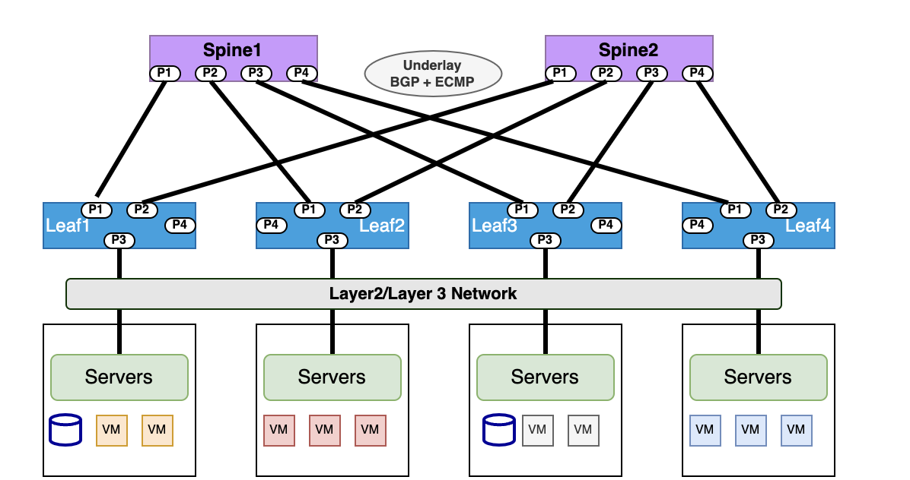
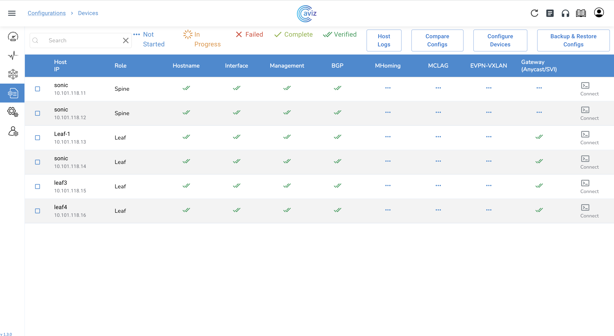

# BGP IP CLOS

**Overview**
BGP IP-CLOS is a network design and routing architecture commonly used in large-scale data center and cloud environments. IP-CLOS provides a scalable and flexible solution for interconnecting multiple routers in a hierarchical manner allowing efficient utilization of network resources and simplified routing. 

**Spine-Leaf Architecture:**
The BGP IP CLOS topology is based on a spine-leaf architecture. In this design, there are two layers of switches -  spine switches and leaf switches. The spine switches provide connectivity between the leaf switches, forming the "spine" of the topology. The leaf switches connect directly to servers, forming the "leafs" of the topology.

**BGP as the Underlay Routing Protocol:**
In the BGP IP CLOS topology, BGP is used as the underlay routing protocol. The spine switches and leaf switches run BGP to establish IP reachability and advertise loopback addresses. This allows for dynamic and efficient IP routing throughout the fabric.

**Unnumbered BGP interfaces**
Unnumbered BGP interfaces are particularly useful in deployments where IPv4 prefixes are advertised through BGP over a section without any IPv4/IPv6 address configuration on links. As a result, the routing entries are also IPv4 for destination lookup and have IPv6 next hops for forwarding purposes. This saves IP addresses pool utilized for underlay routing . 

**Non-Blocking Connectivity:**
The CLOS design ensures that every leaf switch is connected to every spine switch, providing non-blocking connectivity between any server in the data center fabric. This architecture allows for optimal east-west traffic flow within the data center  supporting the communication needs of modern distributed applications and workloads.

**Equal-Cost Multi-Path (ECMP) Routing:**
Within the spine layer, BGP utilizes Equal-Cost Multi-Path (ECMP) routing to distribute traffic evenly across multiple paths. ECMP enables load balancing of traffic, maximizing the utilization of available links and increasing overall DC fabric ‘s network capacity. In SONiC, the BGP multipath option works by default. It is set to 64 paths so the switch can install multiple equal-cost BGP paths to the forwarding table and load balance the  traffic across multiple links. 

## Configuration

- IPv4/IPv6/BGP-Unnumbered Underlay Fabric.
- Host facing port with IPv4/IPv6/L2-Access/L2-Trunk based on requirement.
- ECMP Load Balancing for Leaf & Spine
- SVI Configuration for the Gateway


The template includes the inventory, connectivity, BGP and other configurations needed for the fabric topology formation .  You can modify the template to fit your specific needs




## YAML Template

```yaml
Inventory:
  SSpines: 0
  Spines: 2
  Leafs: 4
  Tors: 0
Connectivity:
  SSpine: []
  Spine:
    - switchId: 1
      switchName: "Spine-1"
      ipAddress: "10.101.118.11"
      ASN: 1001
      Credentials:
        user: "admin"
        password: "Edge-core"
      mclag:
      Links:
        - link: "S1_Ethernet0 | L1_Ethernet48"
          staticLink: true
          properties:
        - link: "S1_Ethernet4 | L2_Ethernet48"
          staticLink: true
          properties:
        - link: "S1_Ethernet8 | L3_Ethernet48"
          staticLink: true
          properties:
        - link: "S1_Ethernet12 | L4_Ethernet48"
          staticLink: true
          properties:
    - switchId: 2
      switchName: "Spine-2"
      ipAddress: "10.101.118.12"
      ASN: 1002
      Credentials:
        user: "admin"
        password: "Edge-core"
      mclag:
      Links:
        - link: "S2_Ethernet0 | L1_Ethernet52"
          staticLink: true
          properties:
        - link: "S2_Ethernet4 | L2_Ethernet52"
          staticLink: true
          properties:
        - link: "S2_Ethernet8 | L3_Ethernet52"
          staticLink: true
          properties:
        - link: "S2_Ethernet12 | L4_Ethernet52"
          staticLink: true
          properties:
  Leaf:
    - switchId: 1
      switchName: "Leaf-1"
      ipAddress: "10.101.118.13"
      ASN: 2001
      Credentials:
        user: "admin"
        password: "Edge-core"
      mclag:
      Links:
        - link: "L1_Ethernet48 | S1_Ethernet0"
          staticLink: true
          properties:
        - link: "L1_Ethernet52 | S2_Ethernet0"
          staticLink: true
          properties:
        - link: "L1_Ethernet56 |  L2_Ethernet56"
          staticLink: true
          properties:
        - link: "L1_Ethernet0 |  H1_Ethernet0"
          staticLink: true
          properties:
            mode: "L2-Access"
            vlan: 201
        - link: "L1_Ethernet4 |  H2_Ethernet0"
          staticLink: true
          properties:
            mode: "L2-Access"
            vlan: 202
    - switchId: 2
      switchName: "Leaf-2"
      ipAddress: "10.101.118.14"
      ASN: 2002
      Credentials:
        user: "admin"
        password: "Edge-core"
      mclag:
      Links:
        - link: "L2_Ethernet48 | S1_Ethernet4"
          staticLink: true
          properties:
        - link: "L2_Ethernet52 | S2_Ethernet4"
          staticLink: true
          properties:
        - link: "L2_Ethernet56 | L1_Ethernet56"
          staticLink: true
          properties:
        - link: "L2_Ethernet0 |  H1_Ethernet1"
          staticLink: true
          properties:
            mode: "L2-Access"
            vlan: 201
        - link: "L2_Ethernet4 |  H2_Ethernet1"
          staticLink: true
          properties:
            mode: "L2-Access"
            vlan: 202
    - switchId: 3
      switchName: "Leaf-3"
      ipAddress: "10.101.118.15"
      ASN: 2003
      Credentials:
        user: "admin"
        password: "YourPaSsWoRd"
      mclag:
      Links:
        - link: "L3_Ethernet48 | S1_Ethernet8"
          staticLink: true
          properties:
        - link: "L3_Ethernet52 | S2_Ethernet8"
          staticLink: true
          properties:
        - link: "L3_Ethernet56 | L4_Ethernet56"
          staticLink: true
          properties:
        - link: "L3_Ethernet0 |  H3_Ethernet0"
          staticLink: true
          properties:
            mode: "L2-Access"
            vlan: 203
        - link: "L3_Ethernet4 |  H4_Ethernet0"
          staticLink: true
          properties:
            mode: "L2-Access"
            vlan: 204
    - switchId: 4
      switchName: "Leaf-4"
      ipAddress: "10.101.118.16"
      ASN: 2004
      Credentials:
        user: "admin"
        password: "YourPaSsWoRd"
      mclag:
      Links:
        - link: "L4_Ethernet48 | S1_Ethernet12"
          staticLink: true
          properties:
        - link: "L4_Ethernet52 | S2_Ethernet12"
          staticLink: true
          properties:
        - link: "L4_Ethernet56 | L3_Ethernet56"
          staticLink: true
          properties:
        - link: "L4_Ethernet0 |  H3_Ethernet1"
          staticLink: true
          properties:
            mode: "L2-Access"
            vlan: 203
        - link: "L4_Ethernet4 |  H4_Ethernet1"
          staticLink: true
          properties:
            mode: "L2-Access"
            vlan: 204
  Tor: []
BGP:
  BGP_U: false
  ND_RA: 30
PhysicalIfCfg:
  FEC: "Off"
  MTU: 9000
  AdminStatus: "Up"
ASN:
  SSpine: "10000-20000"
  Spine: "21000-50000"
  Leaf: "51000-60000"
  Tor: "61000-70000"
IPv4Pool:
  Loopback: "10.10.10.0/24"
  LeafSpine: "40.0.0.0/24"
  LeafTor: "39.0.0.0/24"
  Host: "49.0.0.0/24"
IPv6Pool:
  LeafSpine:
  LeafTor:
  Host:
NTP:
  server: "10.101.118.10"
  timezone: "Asia/Kolkata"
SYSLOG:
  server: "10.101.118.10"
SNMP:
  trapserver: "10.101.118.10"
Parameters:
  vlan: "200-205"
  vni:
  anycast_gateway: "100.10.0.0/23"
  anycast_mac: "00:11:22:33:44:55"
  hosts_per_vlan: 10
  routing_symmetric: false
  sag: false
```

## Configure, Validate & Verify through UI



## IP Configuration

<!-- markdownlint-disable MD033 -->
<style>
  table {
    border-collapse: collapse;
    table-layout: fixed;
    width: 400px; border: 1px solid black;
  }
  th {
    border: 1px solid black;
  }

  td {
    border: 1px solid black;
    padding: 8px;
    text-align: center;
    vertical-align: middle;
    word-wrap: break-word;
  }
</style>

<table>
  <tr>
    <th><b>Leaf1 [10.101.101.13]</b></th>
    <td>
      <pre>
      <b>
        L1_Ethernet48 [40.0.0.1/31] | S1_Ethernet0 [40.0.0.0/31]
        L1_Ethernet52 [40.0.0.9/31] | S2_Ethernet0 [40.0.0.8/31]
        L1_Ethernet56 [192.168.0.0/31] | L2_Ethernet56 [192.168.0.1/31]
        L1_Ethernet0 | H1_Ethernet0
        L1_Ethernet4 | H2_Ethernet0</b>
      </pre>
    </td>
  </tr>
  <tr>
    <th><b>Leaf2 [10.101.101.14]</b></th>
    <td>
      <pre>
        <b>
        L2_Ethernet48 [40.0.0.3/31] | S1_Ethernet4 [40.0.0.2/31]
        L2_Ethernet52 [40.0.0.11/31] | S2_Ethernet4 [40.0.0.10/31]
        L2_Ethernet56 [192.168.0.1/31] | L1_Ethernet56 [192.168.0.0/31]
        L2_Ethernet0 | H1_Ethernet1
        L2_Ethernet4 | H2_Ethernet1
        </b>
      </pre>
    </td>
  </tr>
  <tr>
    <th><b>Leaf3 [10.101.101.15]</b></th>
    <td>
      <pre>
        <b>
        L3_Ethernet48 [40.0.0.5/31] | S1_Ethernet8 [40.0.0.4/31]
        L3_Ethernet52 [40.0.0.13/31] | S2_Ethernet8 [40.0.0.12/31]
        L3_Ethernet56 [192.168.0.2/31] | L4_Ethernet56 [192.168.0.3/31]
        L3_Ethernet0 | H3_Ethernet0
        L3_Ethernet4 | H4_Ethernet0</b>
      </pre>
    </td>
  </tr>
  <tr>
    <th><b>Leaf4 [10.101.101.16]</b></th>
    <td>
      <pre><b>
        L4_Ethernet48 [40.0.0.7/31] | S1_Ethernet12 [40.0.0.6/31]
        L4_Ethernet52 [40.0.0.15/31] | S2_Ethernet12 [40.0.0.14/31]
        L4_Ethernet56 [192.168.0.3/31] | L3_Ethernet56 [192.168.0.2/31]
        L4_Ethernet0 | H3_Ethernet1
        L4_Ethernet4 | H4_Ethernet1</b>
      </pre>
    </td>
  </tr>
  <tr>
    <th><b>Spine1 [10.101.101.11]</b></th>
    <td>
      <pre><b>
       S1_Ethernet0 [40.0.0.0/31] | L1_Ethernet48 [40.0.0.1/31]
        S1_Ethernet4 [40.0.0.2/31] | L2_Ethernet48 [40.0.0.3/31]
        S1_Ethernet8 [40.0.0.4/31] | L3_Ethernet48 [40.0.0.5/31]
        S1_Ethernet12 [40.0.0.6/31] | L4_Ethernet48 [40.0.0.7/31]</b>
      </pre>
    </td>
  </tr>
  <tr>
    <th><b>Spine2 [10.101.101.12]</b></th>
    <td>
      <pre><b>
        S2_Ethernet0 [40.0.0.8/31] | L1_Ethernet52 [40.0.0.9/31]
        S2_Ethernet4 [40.0.0.10/31] | L2_Ethernet52 [40.0.0.11/31]
        S2_Ethernet8 [40.0.0.12/31] | L3_Ethernet52 [40.0.0.13/31]
        S2_Ethernet12 [40.0.0.14/31] | L4_Ethernet52 [40.0.0.15/31]</b>
      </pre>
    </td>
  </tr>
  
</table>


## Applied Configuration on Switches

=== "Leaf1"

    ``` sh
    configure terminal
    router-id 10.10.10.2
    ntp add 10.101.118.10
    clock timezone Asia/Kolkata
    syslog add 10.101.118.10
    snmp-server trap modify 2 10.101.118.10 port 161 vrf None community Public
    hostname Leaf-1
    ip protocol bgp route-map RM_SET_SRC
    !
    route-map FMCLI_IPV6_NH_GLOBAL permit 1
    on-match next
    set ipv6 next-hop prefer-global
    !
    route-map RM_SET_SRC permit 10
    set src 10.10.10.2
    !
    vlan 201
    !
    vlan 202
    !
    interface ethernet Ethernet0
    switchport access vlan 201
    mtu 9000
    forward-error-correction none
    !
    interface ethernet Ethernet4
    switchport access vlan 202
    mtu 9000
    forward-error-correction none
    !
    interface ethernet Ethernet48
    ip address 40.0.0.1/31
    mtu 9000
    forward-error-correction none
    !
    interface ethernet Ethernet52
    ip address 40.0.0.9/31
    mtu 9000
    forward-error-correction none
    !
    interface vlan 201
    ip address 100.10.0.1/26
    !
    interface vlan 202
    ip address 100.10.0.65/26
    !
    interface loopback 1
    ip address 10.10.10.2/32
    !
    router bgp 2001
    neighbor 40.0.0.0 remote-as 1001
    neighbor 40.0.0.8 remote-as 1002
    neighbor 40.0.0.0 capability extended-nexthop
    neighbor 40.0.0.8 capability extended-nexthop
    bgp bestpath as-path multipath-relax
    no bgp ebgp-requires-policy
    address-family ipv4 unicast
      neighbor 40.0.0.0 allowas-in 1
      neighbor 40.0.0.8 allowas-in 1
      network 40.0.0.0/31
      network 40.0.0.8/31
      redistribute connected
      redistribute static
    !
    address-family ipv6 unicast
      redistribute connected
      redistribute static
    ! 
    ```

=== "Leaf2"

    ``` sh
    configure terminal
    router-id 10.10.10.4
    ntp add 10.101.118.10
    clock timezone Asia/Kolkata
    syslog add 10.101.118.10
    snmp-server trap modify 2 10.101.118.10 port 161 vrf None community Public
    hostname Leaf-2
    ip protocol bgp route-map RM_SET_SRC
    !
    route-map FMCLI_IPV6_NH_GLOBAL permit 1
    on-match next
    set ipv6 next-hop prefer-global
    !
    route-map RM_SET_SRC permit 10
    set src 10.10.10.4
    !
    vlan 201
    !
    vlan 202
    !
    interface ethernet Ethernet0
    switchport access vlan 201
    mtu 9000
    forward-error-correction none
    !
    interface ethernet Ethernet4
    switchport access vlan 202
    mtu 9000
    forward-error-correction none
    !
    interface ethernet Ethernet48
    ip address 40.0.0.3/31
    mtu 9000
    forward-error-correction none
    !
    interface ethernet Ethernet52
    ip address 40.0.0.11/31
    mtu 9000
    forward-error-correction none
    !
    interface vlan 201
    ip address 100.10.0.129/26
    !
    interface vlan 202
    ip address 100.10.0.193/26
    !
    interface loopback 1
    ip address 10.10.10.4/32
    !
    router bgp 2002
    neighbor 40.0.0.10 remote-as 1002
    neighbor 40.0.0.2 remote-as 1001
    neighbor 40.0.0.10 capability extended-nexthop
    neighbor 40.0.0.2 capability extended-nexthop
    bgp bestpath as-path multipath-relax
    no bgp ebgp-requires-policy
    address-family ipv4 unicast
      neighbor 40.0.0.10 allowas-in 1
      neighbor 40.0.0.2 allowas-in 1
      network 40.0.0.10/31
      network 40.0.0.2/31
      redistribute connected
      redistribute static
    !
    address-family ipv6 unicast
      redistribute connected
      redistribute static
    !
    ```

=== "Leaf3"

    ``` sh
    configure terminal
    router-id 10.10.10.6
    ntp add 10.101.118.10
    clock timezone Asia/Kolkata
    syslog add 10.101.118.10
    snmp-server trap modify 2 10.101.118.10 port 161 vrf None community Public
    hostname Leaf-3
    ip protocol bgp route-map RM_SET_SRC
    !
    route-map FMCLI_IPV6_NH_GLOBAL permit 1
    on-match next
    set ipv6 next-hop prefer-global
    !
    route-map RM_SET_SRC permit 10
    set src 10.10.10.6
    !
    vlan 203
    !
    vlan 204
    !
    interface ethernet Ethernet0
    switchport access vlan 203
    mtu 9000
    forward-error-correction none
    !
    interface ethernet Ethernet4
    switchport access vlan 204
    mtu 9000
    forward-error-correction none
    !
    interface ethernet Ethernet48
    ip address 40.0.0.5/31
    mtu 9000
    forward-error-correction none
    !
    interface ethernet Ethernet52
    ip address 40.0.0.13/31
    mtu 9000
    forward-error-correction none
    !
    interface vlan 203
    ip address 100.10.1.1/26
    !
    interface vlan 204
    ip address 100.10.1.65/26
    !
    interface loopback 1
    ip address 10.10.10.6/32
    !
    router bgp 2003
    neighbor 40.0.0.12 remote-as 1002
    neighbor 40.0.0.4 remote-as 1001
    neighbor 40.0.0.12 capability extended-nexthop
    neighbor 40.0.0.4 capability extended-nexthop
    bgp bestpath as-path multipath-relax
    no bgp ebgp-requires-policy
    address-family ipv4 unicast
      neighbor 40.0.0.12 allowas-in 1
      neighbor 40.0.0.4 allowas-in 1
      network 40.0.0.12/31
      network 40.0.0.4/31
      redistribute connected
      redistribute static
    !
    address-family ipv6 unicast
      redistribute connected
      redistribute static
    !
    ```

=== "Leaf4"

    ``` sh
    configure terminal
    router-id 10.10.10.8
    ntp add 10.101.118.10
    clock timezone Asia/Kolkata
    syslog add 10.101.118.10
    snmp-server trap modify 2 10.101.118.10 port 161 vrf None community Public
    hostname Leaf-4
    ip protocol bgp route-map RM_SET_SRC
    !
    route-map FMCLI_IPV6_NH_GLOBAL permit 1
    on-match next
    set ipv6 next-hop prefer-global
    !
    route-map RM_SET_SRC permit 10
    set src 10.10.10.8
    !
    vlan 203
    !
    vlan 204
    !
    interface ethernet Ethernet0
    switchport access vlan 203
    mtu 9000
    forward-error-correction none
    !
    interface ethernet Ethernet4
    switchport access vlan 204
    mtu 9000
    forward-error-correction none
    !
    interface ethernet Ethernet48
    ip address 40.0.0.7/31
    mtu 9000
    forward-error-correction none
    !
    interface ethernet Ethernet52
    ip address 40.0.0.15/31
    mtu 9000
    forward-error-correction none
    !
    interface vlan 203
    ip address 100.10.1.129/26
    !
    interface vlan 204
    ip address 100.10.1.193/26
    !
    interface loopback 1
    ip address 10.10.10.8/32
    !
    router bgp 2004
    neighbor 40.0.0.14 remote-as 1002
    neighbor 40.0.0.6 remote-as 1001
    neighbor 40.0.0.14 capability extended-nexthop
    neighbor 40.0.0.6 capability extended-nexthop
    bgp bestpath as-path multipath-relax
    no bgp ebgp-requires-policy
    address-family ipv4 unicast
      neighbor 40.0.0.14 allowas-in 1
      neighbor 40.0.0.6 allowas-in 1
      network 40.0.0.14/31
      network 40.0.0.6/31
      redistribute connected
      redistribute static
    !
    address-family ipv6 unicast
      redistribute connected
      redistribute static
    !
    ```

=== "Spine1"

    ``` sh
    configure terminal
    router-id 10.10.10.0
    ntp add 10.101.118.10
    clock timezone Asia/Kolkata
    syslog add 10.101.118.10
    snmp-server trap modify 2 10.101.118.10 port 161 vrf None community Public
    hostname Spine-1
    ip protocol bgp route-map RM_SET_SRC
    !
    route-map FMCLI_IPV6_NH_GLOBAL permit 1
    on-match next
    set ipv6 next-hop prefer-global
    !
    route-map RM_SET_SRC permit 10
    set src 10.10.10.0
    !
    interface ethernet Ethernet0
    ip address 40.0.0.0/31
    mtu 9000
    forward-error-correction none
    !
    interface ethernet Ethernet12
    ip address 40.0.0.6/31
    mtu 9000
    forward-error-correction none
    !
    interface ethernet Ethernet4
    ip address 40.0.0.2/31
    mtu 9000
    forward-error-correction none
    !
    interface ethernet Ethernet8
    ip address 40.0.0.4/31
    mtu 9000
    forward-error-correction none
    !
    interface loopback 1
    ip address 10.10.10.0/32
    !
    router bgp 1001
    neighbor 40.0.0.1 remote-as 2001
    neighbor 40.0.0.3 remote-as 2002
    neighbor 40.0.0.5 remote-as 2003
    neighbor 40.0.0.7 remote-as 2004
    neighbor 40.0.0.1 capability extended-nexthop
    neighbor 40.0.0.3 capability extended-nexthop
    neighbor 40.0.0.5 capability extended-nexthop
    neighbor 40.0.0.7 capability extended-nexthop
    bgp bestpath as-path multipath-relax
    no bgp ebgp-requires-policy
    address-family ipv4 unicast
      neighbor 40.0.0.1 allowas-in 1
      neighbor 40.0.0.3 allowas-in 1
      neighbor 40.0.0.5 allowas-in 1
      neighbor 40.0.0.7 allowas-in 1
      network 40.0.0.0/31
      network 40.0.0.2/31
      network 40.0.0.4/31
      network 40.0.0.6/31
      redistribute connected
      redistribute static
    !
    address-family ipv6 unicast
      redistribute connected
      redistribute static
    !
    ```

=== "Spine2"

    ``` sh
    configure terminal
    router-id 10.10.10.1
    ntp add 10.101.118.10
    clock timezone Asia/Kolkata
    syslog add 10.101.118.10
    snmp-server trap modify 2 10.101.118.10 port 161 vrf None community Public
    hostname Spine-2
    ip protocol bgp route-map RM_SET_SRC
    !
    route-map FMCLI_IPV6_NH_GLOBAL permit 1
    on-match next
    set ipv6 next-hop prefer-global
    !
    route-map RM_SET_SRC permit 10
    set src 10.10.10.1
    !
    interface ethernet Ethernet0
    ip address 40.0.0.8/31
    mtu 9000
    forward-error-correction none
    !
    interface ethernet Ethernet12
    ip address 40.0.0.14/31
    mtu 9000
    forward-error-correction none
    !
    interface ethernet Ethernet4
    ip address 40.0.0.10/31
    mtu 9000
    forward-error-correction none
    !
    interface ethernet Ethernet8
    ip address 40.0.0.12/31
    mtu 9000
    forward-error-correction none
    !
    interface loopback 1
    ip address 10.10.10.1/32
    !
    router bgp 1002
    neighbor 40.0.0.11 remote-as 2002
    neighbor 40.0.0.13 remote-as 2003
    neighbor 40.0.0.15 remote-as 2004
    neighbor 40.0.0.9 remote-as 2001
    neighbor 40.0.0.11 capability extended-nexthop
    neighbor 40.0.0.13 capability extended-nexthop
    neighbor 40.0.0.15 capability extended-nexthop
    neighbor 40.0.0.9 capability extended-nexthop
    bgp bestpath as-path multipath-relax
    no bgp ebgp-requires-policy
    address-family ipv4 unicast
      neighbor 40.0.0.11 allowas-in 1
      neighbor 40.0.0.13 allowas-in 1
      neighbor 40.0.0.15 allowas-in 1
      neighbor 40.0.0.9 allowas-in 1
      network 40.0.0.10/31
      network 40.0.0.12/31
      network 40.0.0.14/31
      network 40.0.0.8/31
      redistribute connected
      redistribute static
    !
    address-family ipv6 unicast
      redistribute connected
      redistribute static
    !
    ```
